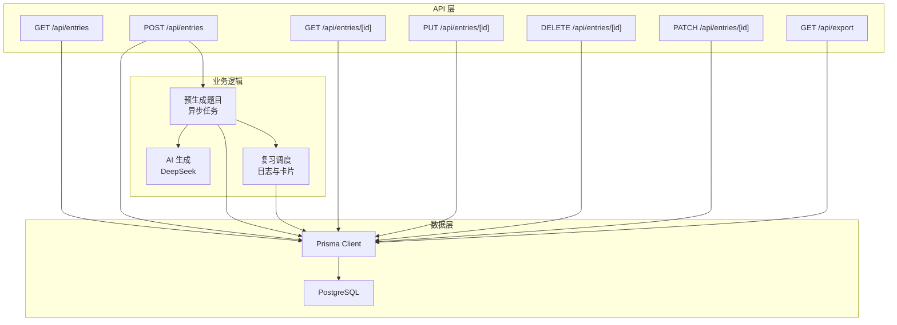
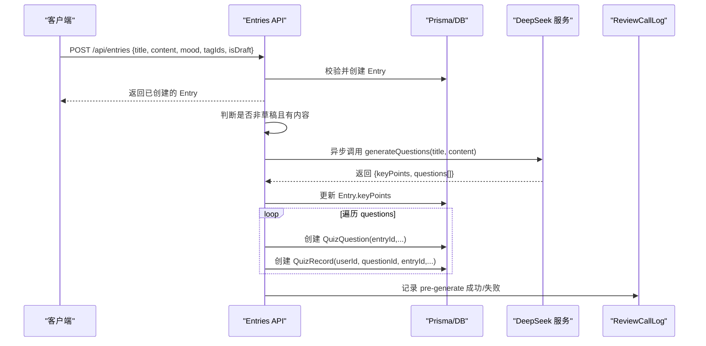
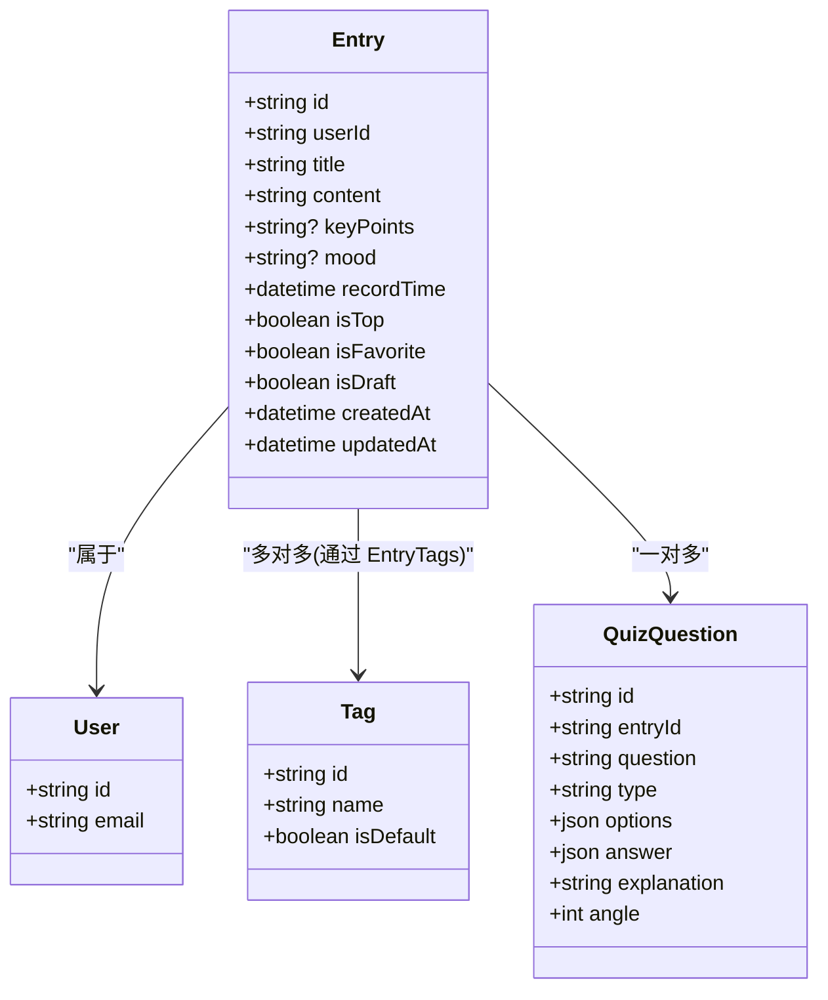
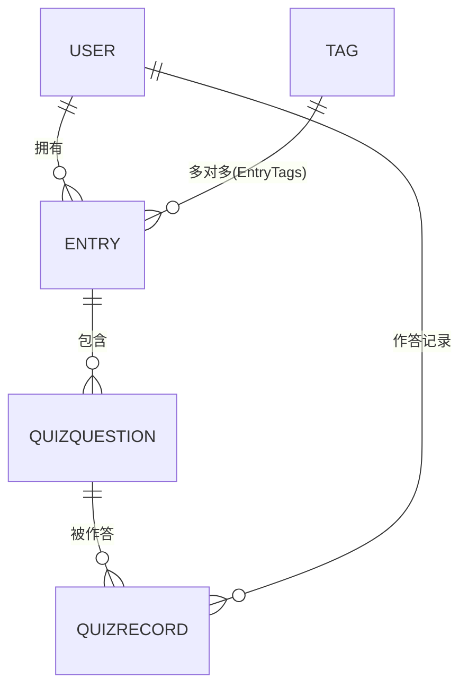
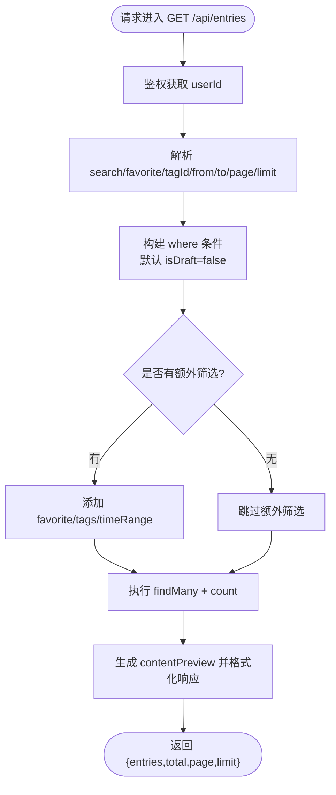
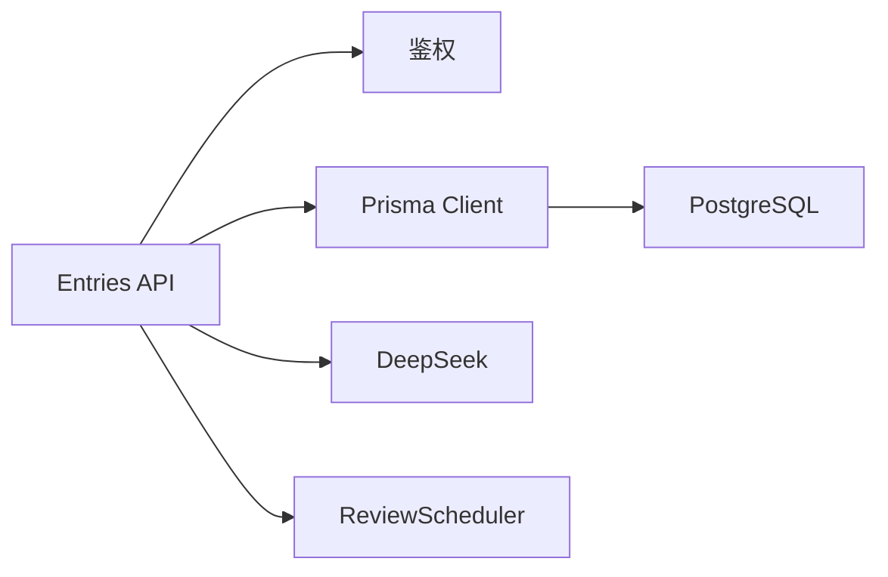

# 心得模型 (Entry)

<cite>
**本文引用的文件**
- [schema.prisma](file://prisma/schema.prisma)
- [entries/route.ts](file://app/api/entries/route.ts)
- [entries/[id]/route.ts](file://app/api/entries/[id]/route.ts)
- [deepseek.ts](file://lib/deepseek.ts)
- [review-scheduler.ts](file://lib/review-scheduler.ts)
- [export/route.ts](file://app/api/export/route.ts)
- [migration.sql](file://prisma/migrations/20260621_init/migration.sql)
</cite>

## 目录
1. [简介](#简介)
2. [项目结构](#项目结构)
3. [核心组件](#核心组件)
4. [架构总览](#架构总览)
5. [详细组件分析](#详细组件分析)
6. [依赖关系分析](#依赖关系分析)
7. [性能与索引策略](#性能与索引策略)
8. [CRUD 最佳实践与数据完整性](#crud-最佳实践与数据完整性)
9. [故障排查指南](#故障排查指南)
10. [结论](#结论)

## 简介
本文件围绕“心芽”项目的“心得模型（Entry）”进行系统化文档化，覆盖实体设计、字段语义、关联关系、查询与索引优化、以及 CRUD 操作的最佳实践。Entry 是用户记录学习心得的核心实体，承载内容管理、元数据存储与状态控制等关键职责，并与标签、复习题目形成一对多和多对多关系，支撑后续复习与回顾功能。

## 项目结构
与 Entry 相关的代码主要分布在以下位置：
- 数据库模型定义：prisma/schema.prisma
- API 路由：app/api/entries/route.ts、app/api/entries/[id]/route.ts
- AI 生成与复习调度：lib/deepseek.ts、lib/review-scheduler.ts
- 导出接口：app/api/export/route.ts
- 迁移脚本：prisma/migrations/20260621_init/migration.sql



图表来源
- [entries/route.ts:1-163](file://app/api/entries/route.ts#L1-L163)
- [entries/[id]/route.ts:1-95](file://app/api/entries/[id]/route.ts#L1-L95)
- [deepseek.ts:1-115](file://lib/deepseek.ts#L1-L115)
- [review-scheduler.ts:1-225](file://lib/review-scheduler.ts#L1-L225)
- [export/route.ts:1-28](file://app/api/export/route.ts#L1-L28)

章节来源
- [schema.prisma:33-55](file://prisma/schema.prisma#L33-L55)
- [entries/route.ts:1-163](file://app/api/entries/route.ts#L1-L163)
- [entries/[id]/route.ts:1-95](file://app/api/entries/[id]/route.ts#L1-L95)

## 核心组件
- Entry 实体：包含基础信息（标题、正文）、关键要点（由 AI 生成或手动维护）、心情标记、时间记录、状态控制（置顶、收藏、草稿），并关联用户、标签与复习题目。
- Tag 实体：用户维度下的标签，支持默认标签与唯一性约束。
- QuizQuestion 实体：与 Entry 一对多关联，用于复习题目的存储。
- QuizRecord 实体：记录用户对题目的作答情况与复习计划。
- ReviewCallLog 实体：记录复习相关调用日志，便于追踪与排障。

章节来源
- [schema.prisma:33-55](file://prisma/schema.prisma#L33-L55)
- [schema.prisma:57-69](file://prisma/schema.prisma#L57-L69)
- [schema.prisma:150-165](file://prisma/schema.prisma#L150-L165)
- [schema.prisma:167-184](file://prisma/schema.prisma#L167-L184)
- [schema.prisma:196-209](file://prisma/schema.prisma#L196-L209)

## 架构总览
Entry 的创建流程不仅涉及基础的持久化，还触发异步的“预生成题目”流程，包括 AI 生成要点与题目、写入题目与答题记录、记录调用日志。



图表来源
- [entries/route.ts:66-163](file://app/api/entries/route.ts#L66-L163)
- [deepseek.ts:17-115](file://lib/deepseek.ts#L17-L115)
- [review-scheduler.ts:5-29](file://lib/review-scheduler.ts#L5-L29)

## 详细组件分析

### Entry 实体设计与字段语义
- 标识与归属
  - id：主键，使用 cuid() 生成。
  - userId：外键，指向 User，删除级联。
- 内容与元数据
  - title：必填字符串，作为心得标题。
  - content：富文本内容，存储 HTML 片段；在列表与详情中会剥离标签生成预览。
  - keyPoints：可选字符串，由 AI 生成或手动维护，用于复习提示。
  - mood：可选字符串，表示心情标记（如开心、平静、兴奋、低落、忧虑）。
  - recordTime：记录时间，默认当前时间，用于排序与筛选。
- 状态控制
  - isTop：布尔值，默认 false，用于置顶展示。
  - isFavorite：布尔值，默认 false，用于收藏筛选。
  - isDraft：布尔值，默认 false，用于草稿过滤（列表默认不显示草稿）。
- 审计字段
  - createdAt：创建时间。
  - updatedAt：更新时间。



图表来源
- [schema.prisma:33-55](file://prisma/schema.prisma#L33-L55)
- [schema.prisma:57-69](file://prisma/schema.prisma#L57-L69)
- [schema.prisma:150-165](file://prisma/schema.prisma#L150-L165)

章节来源
- [schema.prisma:33-55](file://prisma/schema.prisma#L33-L55)
- [migration.sql:14-27](file://prisma/migrations/20260621_init/migration.sql#L14-L27)

### 关联关系与数据库设计
- 用户与心得：User 与 Entry 为一对多关系，Entry.userId 为外键，删除级联。
- 心得与标签：Entry 与 Tag 为多对多关系，通过 Prisma 的关系名“EntryTags”建立中间表（由 Prisma 自动生成）。
- 心得与复习题目：Entry 与 QuizQuestion 为一对多关系，QuizQuestion.entryId 为外键，删除级联。
- 复习记录：QuizRecord 记录用户对题目的作答与复习计划，关联 Question 与 User。



图表来源
- [schema.prisma:33-55](file://prisma/schema.prisma#L33-L55)
- [schema.prisma:57-69](file://prisma/schema.prisma#L57-L69)
- [schema.prisma:150-165](file://prisma/schema.prisma#L150-L165)
- [schema.prisma:167-184](file://prisma/schema.prisma#L167-L184)

章节来源
- [schema.prisma:33-55](file://prisma/schema.prisma#L33-L55)
- [schema.prisma:57-69](file://prisma/schema.prisma#L57-L69)
- [schema.prisma:150-165](file://prisma/schema.prisma#L150-L165)
- [schema.prisma:167-184](file://prisma/schema.prisma#L167-L184)

### 查询与筛选实现
- 列表查询（GET /api/entries）
  - 默认过滤草稿：isDraft=false。
  - 支持搜索：按标题与内容模糊匹配（大小写不敏感）。
  - 支持收藏筛选：favorite=true 时仅返回收藏项。
  - 支持标签筛选：tagId 存在时按 tags.some(id=tagId) 过滤。
  - 支持时间范围：from/to 转换为 recordTime.gte 与 lt。
  - 排序：先按 isTop 降序，再按 recordTime 降序。
  - 分页：page 与 limit，limit 限制在 1-1000。
  - 返回字段：id、title、contentPreview（去标签与空白处理后的前 80 字符）、tags、mood、recordTime、isTop、isFavorite、isDraft。
- 详情查询（GET /api/entries/[id]）
  - 按 id 与 userId 精确查找，返回完整内容与预览、标签、状态与时间。
- 导出（GET /api/export）
  - 仅导出非草稿条目，按 recordTime 倒序，返回标题、内容、标签名称、心情、时间与状态。



图表来源
- [entries/route.ts:8-63](file://app/api/entries/route.ts#L8-L63)
- [export/route.ts:5-28](file://app/api/export/route.ts#L5-L28)

章节来源
- [entries/route.ts:8-63](file://app/api/entries/route.ts#L8-L63)
- [entries/[id]/route.ts:6-32](file://app/api/entries/[id]/route.ts#L6-L32)
- [export/route.ts:5-28](file://app/api/export/route.ts#L5-L28)

### 预生成题目与要点总结流程
- 触发时机：创建心得且非草稿且有内容时，异步触发。
- 步骤：
  - 调用 DeepSeek 生成 keyPoints 与 questions。
  - 若返回 keyPoints，则更新 Entry.keyPoints。
  - 若返回 questions，则批量创建 QuizQuestion 与 QuizRecord。
  - 记录调用日志（成功/失败与题目数量）。

```mermaid
sequenceDiagram
participant API as "Entries API"
participant AI as "DeepSeek"
participant DB as "Prisma/DB"
participant Log as "ReviewCallLog"
API->>AI : generateQuestions(title, content)
AI-->>API : {keyPoints, questions[]}
alt 有关键要点
API->>DB : update Entry.keyPoints
end
opt 有题目
loop 遍历 questions
API->>DB : create QuizQuestion
API->>DB : create QuizRecord
end
API->>Log : log pre-generate success
else 无题目
API->>Log : log pre-generate failure
end
```

图表来源
- [entries/route.ts:96-163](file://app/api/entries/route.ts#L96-L163)
- [deepseek.ts:17-115](file://lib/deepseek.ts#L17-L115)
- [review-scheduler.ts:5-29](file://lib/review-scheduler.ts#L5-L29)

章节来源
- [entries/route.ts:96-163](file://app/api/entries/route.ts#L96-L163)
- [deepseek.ts:17-115](file://lib/deepseek.ts#L17-L115)
- [review-scheduler.ts:5-29](file://lib/review-scheduler.ts#L5-L29)

## 依赖关系分析
- API 层依赖鉴权与 Prisma 客户端，负责参数校验、事务边界与响应封装。
- 业务逻辑层依赖 AI 服务与复习调度模块，完成异步任务与日志记录。
- 数据层通过 Prisma 映射到 PostgreSQL，利用索引优化查询。



图表来源
- [entries/route.ts:1-163](file://app/api/entries/route.ts#L1-L163)
- [entries/[id]/route.ts:1-95](file://app/api/entries/[id]/route.ts#L1-L95)
- [deepseek.ts:1-115](file://lib/deepseek.ts#L1-115)
- [review-scheduler.ts:1-225](file://lib/review-scheduler.ts#L1-225)

章节来源
- [entries/route.ts:1-163](file://app/api/entries/route.ts#L1-L163)
- [entries/[id]/route.ts:1-95](file://app/api/entries/[id]/route.ts#L1-L95)

## 性能与索引策略
- 现有索引
  - [userId, recordTime(sort: Desc)]：优化按用户与时间倒序的列表查询。
  - [userId, isTop]：优化置顶筛选。
  - [userId, isFavorite]：优化收藏筛选。
  - [userId, isDraft]：优化草稿筛选。
- 建议优化
  - 复合索引：[userId, isTop, recordTime] 可进一步减少排序开销。
  - 全文检索：当 content 规模增长后，考虑引入全文索引或搜索引擎以优化模糊搜索。
  - 分页游标：对于大数据量场景，可使用基于 recordTime 的游标分页替代 skip/take。
  - 软删除：如需保留历史，可将 isDraft 扩展为更细粒度的状态机，并配合索引优化。

章节来源
- [schema.prisma:51-54](file://prisma/schema.prisma#L51-L54)

## CRUD 最佳实践与数据完整性

### 创建（POST /api/entries）
- 输入校验
  - 标题不能为空（trim 后检查）。
  - 内容可为空，但非草稿时需有内容才触发预生成。
- 标签处理
  - 未提供 tagIds 时，自动回退到用户的默认标签（isDefault=true）。
- 草稿模式
  - isDraft 控制是否参与列表默认查询与预生成流程。
- 异步预生成
  - 非草稿且 content 存在时，异步生成 keyPoints 与题目，避免阻塞响应。

章节来源
- [entries/route.ts:66-106](file://app/api/entries/route.ts#L66-L106)

### 读取（GET /api/entries、GET /api/entries/[id]）
- 列表
  - 默认过滤草稿，支持搜索、收藏、标签、时间范围、分页与排序。
  - 返回列表不包含完整 content，而是 contentPreview，降低带宽。
- 详情
  - 返回完整 content 与预览、标签、状态与时间。

章节来源
- [entries/route.ts:8-63](file://app/api/entries/route.ts#L8-L63)
- [entries/[id]/route.ts:6-32](file://app/api/entries/[id]/route.ts#L6-L32)

### 更新（PUT /api/entries/[id]）
- 输入校验
  - 标题不能为空（trim 后检查）。
- 标签处理
  - 未提供 tagIds 时，自动回退到用户的默认标签。
- 状态更新
  - isDraft 可通过更新设置，影响后续列表与预生成行为。

章节来源
- [entries/[id]/route.ts:35-64](file://app/api/entries/[id]/route.ts#L35-L64)

### 部分更新（PATCH /api/entries/[id]）
- 白名单字段
  - 仅允许 isTop 与 isFavorite 的部分更新，防止越权修改其他字段。

章节来源
- [entries/[id]/route.ts:77-94](file://app/api/entries/[id]/route.ts#L77-L94)

### 删除（DELETE /api/entries/[id]）
- 权限校验
  - 必须同时匹配 id 与 userId，确保资源隔离。
- 级联删除
  - 删除 Entry 将级联删除其 QuizQuestion 与相关记录。

章节来源
- [entries/[id]/route.ts:67-74](file://app/api/entries/[id]/route.ts#L67-L74)
- [schema.prisma:47-49](file://prisma/schema.prisma#L47-L49)

### 数据完整性验证规则
- 必填字段
  - title 非空（服务端 trim 校验）。
  - content 可为空，但非草稿时建议有内容以启用预生成。
- 状态一致性
  - isDraft 控制列表可见性与预生成触发。
  - isTop/isFavorite 仅通过 PATCH 白名单更新。
- 标签唯一性
  - Tag.name 在用户维度下唯一，避免重复标签。
- 外键约束
  - Entry.userId 与 User.id 关联，删除级联。
  - QuizQuestion.entryId 与 Entry.id 关联，删除级联。

章节来源
- [entries/route.ts:73-94](file://app/api/entries/route.ts#L73-L94)
- [entries/[id]/route.ts:42-61](file://app/api/entries/[id]/route.ts#L42-L61)
- [schema.prisma:67-68](file://prisma/schema.prisma#L67-L68)
- [schema.prisma:47-49](file://prisma/schema.prisma#L47-L49)

## 故障排查指南
- 预生成失败
  - 现象：日志记录 pre-generate 失败，questions 为空。
  - 可能原因：DeepSeek 返回非 JSON、超时、网络错误。
  - 排查步骤：查看 reviewCallLog 的 errorMsg 与 questionCount，确认 API 返回格式与重试次数。
- 草稿未出现在列表
  - 现象：新建草稿后列表不可见。
  - 原因：列表默认过滤 isDraft=false。
  - 解决：前端显式传入 isDraft=true 或后端增加草稿视图。
- 标签未生效
  - 现象：创建心得未关联标签。
  - 原因：未传 tagIds 且用户无默认标签。
  - 解决：确保用户存在默认标签或前端传递有效 tagIds。

章节来源
- [review-scheduler.ts:5-29](file://lib/review-scheduler.ts#L5-L29)
- [entries/route.ts:96-163](file://app/api/entries/route.ts#L96-L163)
- [entries/route.ts:76-80](file://app/api/entries/route.ts#L76-L80)

## 结论
Entry 模型在设计上兼顾了内容管理与复习生态的衔接：通过清晰的字段语义、完善的索引策略与严格的 CRUD 校验，保障了用户体验与系统稳定性。结合异步预生成与复习调度，Entry 成为连接学习与回顾的关键枢纽。建议在后续迭代中持续优化索引与搜索能力，并完善草稿视图与软删除机制，以提升系统的可扩展性与可维护性。