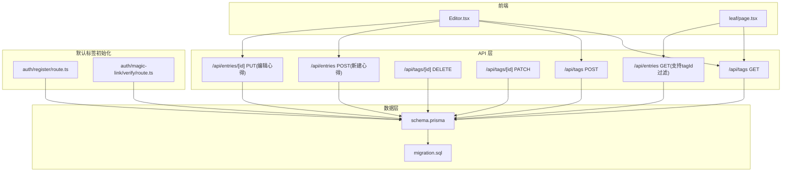
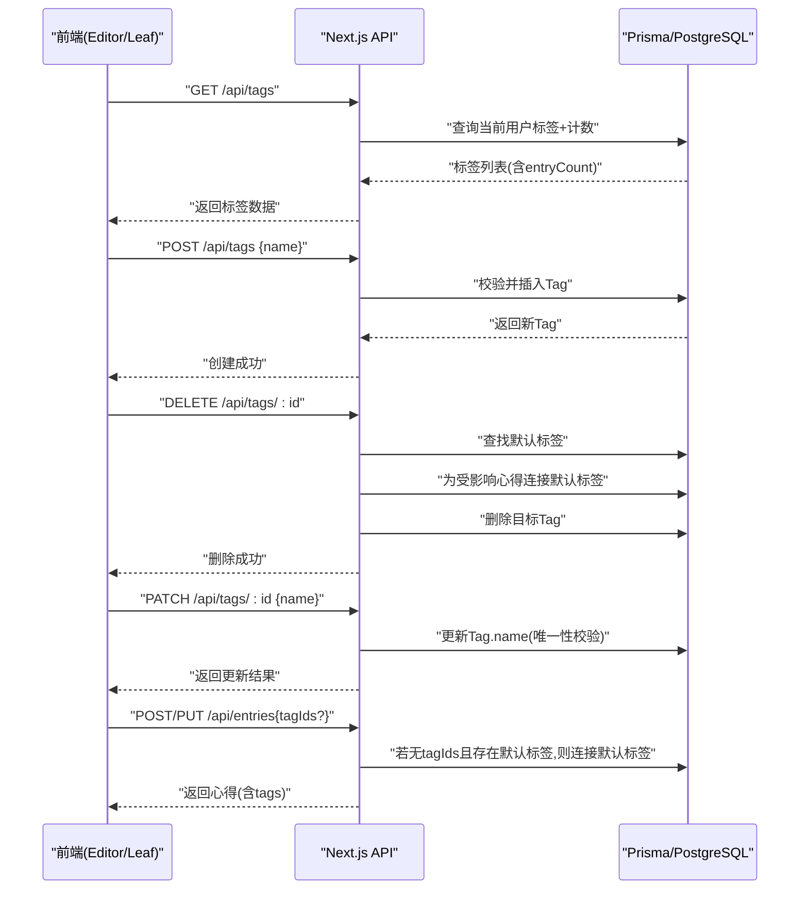
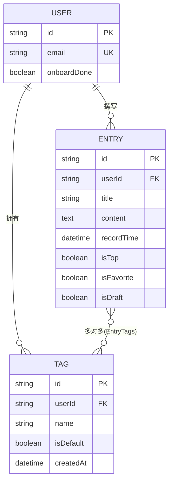
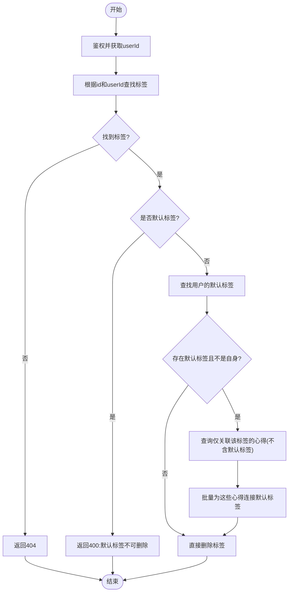
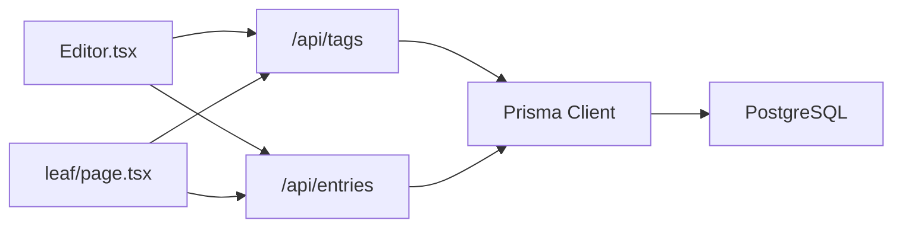

# 标签模型 (Tag)

<cite>
**本文引用的文件**   
- [prisma/schema.prisma](file://prisma/schema.prisma)
- [app/api/tags/route.ts](file://app/api/tags/route.ts)
- [app/api/tags/[id]/route.ts](file://app/api/tags/[id]/route.ts)
- [app/api/entries/route.ts](file://app/api/entries/route.ts)
- [app/api/entries/[id]/route.ts](file://app/api/entries/[id]/route.ts)
- [components/Editor.tsx](file://components/Editor.tsx)
- [app/(main)/leaf/page.tsx](file://app/(main)/leaf/page.tsx)
- [app/api/auth/register/route.ts](file://app/api/auth/register/route.ts)
- [app/api/auth/magic-link/verify/route.ts](file://app/api/auth/magic-link/verify/route.ts)
- [prisma/migrations/20260621_init/migration.sql](file://prisma/migrations/20260621_init/migration.sql)
</cite>

## 目录
1. [简介](#简介)
2. [项目结构](#项目结构)
3. [核心组件](#核心组件)
4. [架构总览](#架构总览)
5. [详细组件分析](#详细组件分析)
6. [依赖关系分析](#依赖关系分析)
7. [性能与查询优化](#性能与查询优化)
8. [故障排查指南](#故障排查指南)
9. [结论](#结论)
10. [附录](#附录)

## 简介
本文件围绕心芽项目的“标签模型（Tag）”进行系统化文档化，覆盖以下关键点：
- Tag 实体的设计理念与字段定义
- 标签分类系统与默认标签机制
- 用户自定义标签的创建、删除、重命名流程
- 标签与用户、心得的多对多关联实现（EntryTags 中间表）
- 唯一性约束与查询优化策略
- 数据一致性保障的最佳实践
- 默认标签系统的业务场景与触发时机

## 项目结构
与标签相关的代码主要分布在以下位置：
- 数据模型与迁移：prisma/schema.prisma、prisma/migrations/...
- 后端 API：app/api/tags/*、app/api/entries/*
- 前端交互：components/Editor.tsx、app/(main)/leaf/page.tsx
- 默认标签初始化：注册与魔法链接验证流程

图表来源
- [prisma/schema.prisma:57-69](file://prisma/schema.prisma#L57-L69)
- [app/api/tags/route.ts:6-46](file://app/api/tags/route.ts#L6-L46)
- [app/api/tags/[id]/route.ts:6-61](file://app/api/tags/[id]/route.ts#L6-L61)
- [app/api/entries/route.ts:8-106](file://app/api/entries/route.ts#L8-L106)
- [app/api/entries/[id]/route.ts:6-64](file://app/api/entries/[id]/route.ts#L6-L64)
- [components/Editor.tsx:37-135](file://components/Editor.tsx#L37-L135)
- [app/(main)/leaf/page.tsx:82-125](file://app/(main)/leaf/page.tsx#L82-L125)
- [app/api/auth/register/route.ts:32-37](file://app/api/auth/register/route.ts#L32-L37)
- [app/api/auth/magic-link/verify/route.ts:44-48](file://app/api/auth/magic-link/verify/route.ts#L44-L48)

章节来源
- [prisma/schema.prisma:57-69](file://prisma/schema.prisma#L57-L69)
- [app/api/tags/route.ts:6-46](file://app/api/tags/route.ts#L6-L46)
- [app/api/tags/[id]/route.ts:6-61](file://app/api/tags/[id]/route.ts#L6-L61)
- [app/api/entries/route.ts:8-106](file://app/api/entries/route.ts#L8-L106)
- [app/api/entries/[id]/route.ts:6-64](file://app/api/entries/[id]/route.ts#L6-L64)
- [components/Editor.tsx:37-135](file://components/Editor.tsx#L37-L135)
- [app/(main)/leaf/page.tsx:82-125](file://app/(main)/leaf/page.tsx#L82-L125)
- [app/api/auth/register/route.ts:32-37](file://app/api/auth/register/route.ts#L32-L37)
- [app/api/auth/magic-link/verify/route.ts:44-48](file://app/api/auth/magic-link/verify/route.ts#L44-L48)

## 核心组件
- 数据模型
  - Tag 实体包含 id、userId、name、isDefault、createdAt 等字段；与 User 一对多，与 Entry 通过“EntryTags”关系形成多对多。
  - 唯一性约束：同一用户下 name 唯一（联合唯一索引）。
  - 索引：按 userId 建立索引，提升用户维度查询效率。
- 标签管理 API
  - GET /api/tags：返回当前用户的标签列表，附带每个标签关联的心得数量，并按 isDefault 降序、name 升序排序。
  - POST /api/tags：校验并创建新标签，限制名称长度与空值。
  - DELETE /api/tags/[id]：删除非默认标签；若存在默认标签，则将被删标签关联的心得自动补上默认标签。
  - PATCH /api/tags/[id]：重命名标签，处理唯一性冲突错误码。
- 心得与标签的联动
  - 新建/更新心得时，若未选择任何标签，则自动关联该用户的默认标签（如果存在）。
  - 获取心得列表支持 tagId 过滤，返回标签信息用于展示。
- 前端交互
  - Editor 组件提供标签选择与即时创建能力。
  - leaf 页面加载标签列表，支持按标签筛选心得。
- 默认标签初始化
  - 注册成功或首次通过魔法链接登录时，自动为用户创建名为“随笔”的默认标签。

章节来源
- [prisma/schema.prisma:57-69](file://prisma/schema.prisma#L57-L69)
- [app/api/tags/route.ts:6-46](file://app/api/tags/route.ts#L6-L46)
- [app/api/tags/[id]/route.ts:6-61](file://app/api/tags/[id]/route.ts#L6-L61)
- [app/api/entries/route.ts:65-106](file://app/api/entries/route.ts#L65-L106)
- [app/api/entries/[id]/route.ts:34-64](file://app/api/entries/[id]/route.ts#L34-L64)
- [components/Editor.tsx:37-135](file://components/Editor.tsx#L37-L135)
- [app/(main)/leaf/page.tsx:82-125](file://app/(main)/leaf/page.tsx#L82-L125)
- [app/api/auth/register/route.ts:32-37](file://app/api/auth/register/route.ts#L32-L37)
- [app/api/auth/magic-link/verify/route.ts:44-48](file://app/api/auth/magic-link/verify/route.ts#L44-L48)

## 架构总览
下图展示了从前端到数据库的完整调用链路，以及默认标签在关键路径中的参与方式。

图表来源
- [app/api/tags/route.ts:6-46](file://app/api/tags/route.ts#L6-L46)
- [app/api/tags/[id]/route.ts:6-61](file://app/api/tags/[id]/route.ts#L6-L61)
- [app/api/entries/route.ts:65-106](file://app/api/entries/route.ts#L65-L106)
- [app/api/entries/[id]/route.ts:34-64](file://app/api/entries/[id]/route.ts#L34-L64)

## 详细组件分析

### 数据模型与关系设计
- Tag 字段说明
  - id：主键，cuid 生成
  - userId：归属用户，级联删除
  - name：标签名，字符串
  - isDefault：是否默认标签，布尔，默认 false
  - createdAt：创建时间
- 关系
  - User -> Tag：一对多（一个用户拥有多个标签）
  - Entry <-> Tag：多对多，使用 Prisma 自动生成的中间表 EntryTags（_EntryTags），包含 A(Entry.id)、B(Tag.id)，并建立唯一索引与反向索引以优化查询。
- 约束与索引
  - 唯一性：@@unique([userId, name]) 保证同一用户下标签名唯一
  - 索引：@@index([userId]) 加速按用户维度的查询

图表来源
- [prisma/schema.prisma:10-31](file://prisma/schema.prisma#L10-L31)
- [prisma/schema.prisma:33-55](file://prisma/schema.prisma#L33-L55)
- [prisma/schema.prisma:57-69](file://prisma/schema.prisma#L57-L69)
- [prisma/migrations/20260621_init/migration.sql:86-113](file://prisma/migrations/20260621_init/migration.sql#L86-L113)

章节来源
- [prisma/schema.prisma:57-69](file://prisma/schema.prisma#L57-L69)
- [prisma/migrations/20260621_init/migration.sql:86-113](file://prisma/migrations/20260621_init/migration.sql#L86-L113)

### 标签管理 API 行为与一致性

#### 获取标签列表
- 功能：返回当前用户所有标签，附带每个标签关联的心得数量，并按 isDefault 降序、name 升序排序。
- 用途：供前端渲染标签面板与统计。

章节来源
- [app/api/tags/route.ts:6-25](file://app/api/tags/route.ts#L6-L25)

#### 创建标签
- 输入校验：名称不能为空，长度不超过 20。
- 重复检查：基于 userId + name 的唯一性约束，避免重复。
- 返回：创建成功的标签对象。

章节来源
- [app/api/tags/route.ts:27-46](file://app/api/tags/route.ts#L27-L46)

#### 删除标签
- 权限校验：仅允许删除当前用户的标签。
- 保护规则：默认标签不可删除。
- 一致性补偿：若存在默认标签，则将所有仅被该待删标签关联的心得，自动补上默认标签，确保心得始终有标签归属。
- 执行删除：最后删除 Tag 记录。

图表来源
- [app/api/tags/[id]/route.ts:6-34](file://app/api/tags/[id]/route.ts#L6-L34)

章节来源
- [app/api/tags/[id]/route.ts:6-34](file://app/api/tags/[id]/route.ts#L6-L34)

#### 重命名标签
- 输入校验：名称不能为空。
- 权限校验：仅允许修改当前用户的标签。
- 唯一性冲突：捕获 P2002 错误码，返回“标签名已存在”。
- 返回：更新后的标签对象。

章节来源
- [app/api/tags/[id]/route.ts:35-61](file://app/api/tags/[id]/route.ts#L35-L61)

### 心得与标签的联动逻辑

#### 新建心得
- 若未传入 tagIds，则尝试查找用户的默认标签并自动连接。
- 保存成功后返回心得及其标签信息。

章节来源
- [app/api/entries/route.ts:65-106](file://app/api/entries/route.ts#L65-L106)

#### 编辑心得
- 若未传入 tagIds，同样回退到默认标签。
- 使用 set 操作替换现有标签集合，确保与前端所选一致。

章节来源
- [app/api/entries/[id]/route.ts:34-64](file://app/api/entries/[id]/route.ts#L34-L64)

#### 按标签筛选心得
- 支持 tagId 过滤，返回对应心得及标签信息。
- 前端 leaf 页面根据 URL 参数恢复选中标签并拉取对应心得。

章节来源
- [app/api/entries/route.ts:8-63](file://app/api/entries/route.ts#L8-L63)
- [app/(main)/leaf/page.tsx:82-125](file://app/(main)/leaf/page.tsx#L82-L125)

### 前端标签交互
- 编辑器内可直接创建标签并立即加入当前心得的标签集合。
- 标签面板展示全部标签，支持多选切换。
- 保存时提交 tagIds 数组，由后端统一处理默认标签回退逻辑。

章节来源
- [components/Editor.tsx:37-135](file://components/Editor.tsx#L37-L135)

### 默认标签系统
- 初始化时机
  - 注册成功：自动创建名为“随笔”的默认标签。
  - 魔法链接首次登录：为新用户自动创建默认标签。
- 业务意义
  - 保证新用户首次写心得时，即使不选择标签也能获得合理的默认归类。
  - 删除非默认标签时，将受影响心得归入默认标签，避免“无标签”状态。

章节来源
- [app/api/auth/register/route.ts:32-37](file://app/api/auth/register/route.ts#L32-L37)
- [app/api/auth/magic-link/verify/route.ts:44-48](file://app/api/auth/magic-link/verify/route.ts#L44-L48)
- [app/api/entries/route.ts:76-80](file://app/api/entries/route.ts#L76-L80)
- [app/api/entries/[id]/route.ts:45-49](file://app/api/entries/[id]/route.ts#L45-L49)
- [app/api/tags/[id]/route.ts:15-30](file://app/api/tags/[id]/route.ts#L15-L30)

## 依赖关系分析
- 模块耦合
  - 标签 API 强依赖 prisma 客户端与鉴权工具。
  - 心得 API 依赖标签 API 的默认标签语义（当 tagIds 为空时的回退逻辑）。
  - 前端 Editor 与 Leaf 页面分别消费标签与心得接口。
- 外部依赖
  - PostgreSQL 作为数据存储。
  - Prisma 负责 ORM 与迁移。

图表来源
- [components/Editor.tsx:37-135](file://components/Editor.tsx#L37-L135)
- [app/(main)/leaf/page.tsx:82-125](file://app/(main)/leaf/page.tsx#L82-L125)
- [app/api/tags/route.ts:6-46](file://app/api/tags/route.ts#L6-L46)
- [app/api/entries/route.ts:8-106](file://app/api/entries/route.ts#L8-L106)

章节来源
- [components/Editor.tsx:37-135](file://components/Editor.tsx#L37-L135)
- [app/(main)/leaf/page.tsx:82-125](file://app/(main)/leaf/page.tsx#L82-L125)
- [app/api/tags/route.ts:6-46](file://app/api/tags/route.ts#L6-L46)
- [app/api/entries/route.ts:8-106](file://app/api/entries/route.ts#L8-L106)

## 性能与查询优化
- 索引与排序
  - Tag 表按 userId 建索引，利于用户维度查询。
  - 标签列表按 isDefault 降序、name 升序排序，便于默认标签置顶显示。
- 多对多查询
  - _EntryTags 表具备 AB 唯一索引与 B 列索引，有利于按标签筛选心得与统计标签关联数。
- 建议
  - 高频按标签筛选心得的场景可考虑在应用层缓存热门标签的心得 ID 集合，减少频繁 JOIN。
  - 对于大量心得的标签统计，可在写入心得时异步维护标签计数缓存，降低实时聚合开销。

章节来源
- [prisma/schema.prisma:57-69](file://prisma/schema.prisma#L57-L69)
- [prisma/migrations/20260621_init/migration.sql:103-104](file://prisma/migrations/20260621_init/migration.sql#L103-L104)
- [app/api/tags/route.ts:10-14](file://app/api/tags/route.ts#L10-L14)

## 故障排查指南
- 常见错误与定位
  - 标签名重复：创建或重命名时返回“标签名已存在”，需检查同名标签是否存在。
  - 默认标签不可删除：删除默认标签会返回 400，请先删除其他标签或调整业务逻辑。
  - 未找到标签：删除或重命名时若标签不存在，返回 404。
  - 心得保存失败：确认标题不为空，且 tagIds 指向有效标签。
- 一致性异常
  - 删除标签后心得缺失标签：检查删除流程是否正确为受影响心得补上默认标签。
  - 新建/编辑心得未自动连接默认标签：确认用户是否存在默认标签，以及 tagIds 是否为空。

章节来源
- [app/api/tags/route.ts:27-46](file://app/api/tags/route.ts#L27-L46)
- [app/api/tags/[id]/route.ts:6-61](file://app/api/tags/[id]/route.ts#L6-L61)
- [app/api/entries/route.ts:65-106](file://app/api/entries/route.ts#L65-L106)
- [app/api/entries/[id]/route.ts:34-64](file://app/api/entries/[id]/route.ts#L34-L64)

## 结论
心芽的标签模型以简洁的数据结构与明确的业务规则为核心，通过默认标签机制与严格的一致性补偿，确保了用户在各种操作路径下的良好体验。结合合理的索引设计与 API 行为，系统在易用性与性能之间取得了平衡。建议在后续迭代中关注大规模数据下的标签统计与筛选性能，必要时引入缓存与异步任务以提升整体吞吐。

## 附录

### 最佳实践清单
- 创建标签
  - 先做名称去空白与长度校验，再执行唯一性检查。
  - 返回新标签后立即在前端刷新标签列表。
- 删除标签
  - 禁止删除默认标签。
  - 删除前为受影响心得补上默认标签，确保心得始终有归属。
- 重命名标签
  - 捕获唯一性冲突错误码，友好提示用户。
- 心得保存
  - 若未选择标签，自动连接默认标签。
  - 使用 set 操作替换标签集合，保持前后端一致。
- 查询优化
  - 利用现有索引进行用户维度与标签维度查询。
  - 对热点标签的心得集合进行缓存，降低实时计算压力。

[本节为通用指导，不直接分析具体文件]