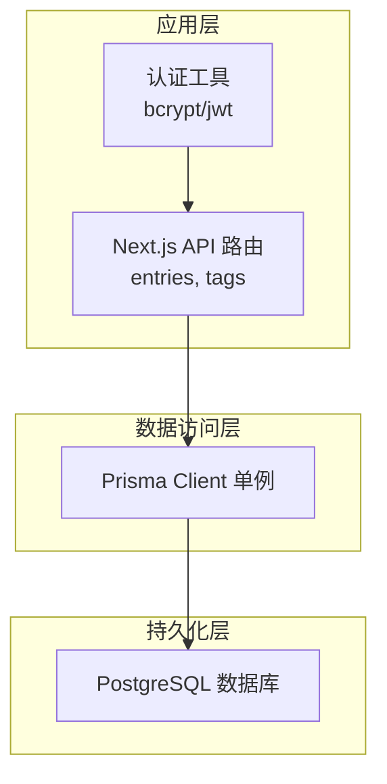
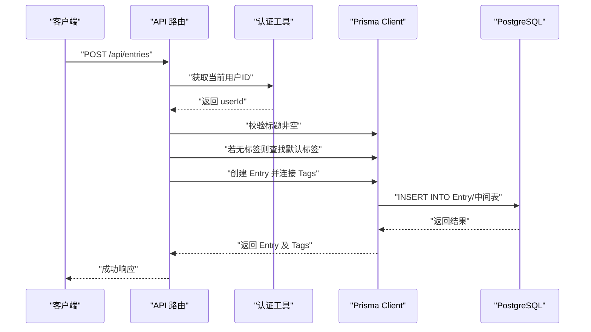
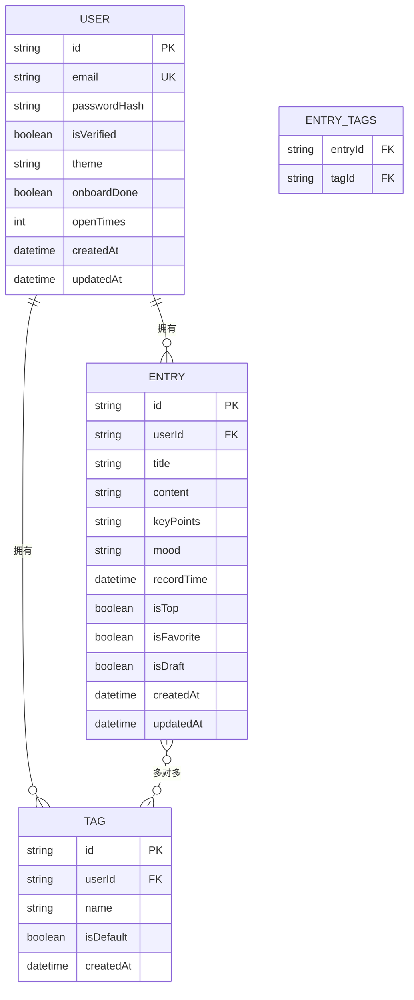

# 核心数据模型

<cite>
**本文引用的文件**
- [prisma/schema.prisma](file://prisma/schema.prisma)
- [lib/prisma.ts](file://lib/prisma.ts)
- [app/api/entries/route.ts](file://app/api/entries/route.ts)
- [app/api/entries/[id]/route.ts](file://app/api/entries/[id]/route.ts)
- [app/api/tags/route.ts](file://app/api/tags/route.ts)
- [lib/auth.ts](file://lib/auth.ts)
- [app/api/auth/set-password/route.ts](file://app/api/auth/set-password/route.ts)
- [prisma/migrations/20260621_init/migration.sql](file://prisma/migrations/20260621_init/migration.sql)
</cite>

## 目录
1. [简介](#简介)
2. [项目结构](#项目结构)
3. [核心组件](#核心组件)
4. [架构总览](#架构总览)
5. [详细组件分析](#详细组件分析)
6. [依赖关系分析](#依赖关系分析)
7. [性能考虑](#性能考虑)
8. [故障排查指南](#故障排查指南)
9. [结论](#结论)
10. [附录](#附录)

## 简介
本文件围绕心芽项目的三个核心实体 User、Entry、Tag，系统性阐述其设计理念、字段定义、约束与默认值、关联关系（一对多与多对多）、索引策略与查询优化方案，并结合 API 层实现说明数据完整性验证与业务规则。文档同时提供数据操作示例与最佳实践建议，帮助开发者快速理解并正确使用这些核心数据模型。

## 项目结构
本项目采用 Next.js + Prisma + PostgreSQL 的架构。核心数据模型在 Prisma Schema 中统一定义，API 路由通过 Prisma Client 访问数据库，认证逻辑使用 bcrypt 进行密码哈希并通过 JWT 维护会话。

图表来源
- [lib/prisma.ts:1-14](file://lib/prisma.ts#L1-L14)
- [lib/auth.ts:1-56](file://lib/auth.ts#L1-L56)
- [app/api/entries/route.ts:1-163](file://app/api/entries/route.ts#L1-L163)
- [app/api/tags/route.ts:1-46](file://app/api/tags/route.ts#L1-L46)

章节来源
- [lib/prisma.ts:1-14](file://lib/prisma.ts#L1-L14)
- [lib/auth.ts:1-56](file://lib/auth.ts#L1-L56)
- [app/api/entries/route.ts:1-163](file://app/api/entries/route.ts#L1-L163)
- [app/api/tags/route.ts:1-46](file://app/api/tags/route.ts#L1-L46)

## 核心组件
本节聚焦 User、Entry、Tag 三个实体的设计要点：字段类型、约束、默认值、关联关系与索引策略。

### User（用户）
- 标识与唯一性
  - id：主键，自动生成
  - email：唯一索引，用于登录识别
- 认证信息
  - passwordHash：存储 bcrypt 哈希值，不直接保存明文密码
- 用户偏好与状态
  - isVerified：邮箱是否已验证
  - theme：主题偏好
  - onboardDone：引导流程完成标记
  - openTimes：打开次数统计
- 时间戳
  - createdAt、updatedAt：创建与更新时间
- 关联关系
  - 与 Entry 为一对多（一个用户拥有多条心得）
  - 与 Tag 为一对多（一个用户拥有多个标签）
  - 与其他扩展表（分享、洞察、成长日志、邮件令牌、复习设置等）存在一对多或一对一关系

章节来源
- [prisma/schema.prisma:10-31](file://prisma/schema.prisma#L10-L31)
- [lib/auth.ts:8-16](file://lib/auth.ts#L8-L16)
- [app/api/auth/set-password/route.ts:1-26](file://app/api/auth/set-password/route.ts#L1-L26)

### Entry（心得）
- 标识与归属
  - id：主键，自动生成
  - userId：外键指向 User，级联删除
- 内容字段
  - title：标题（必填）
  - content：正文（富文本）
  - keyPoints：可选，AI 生成的要点摘要
  - mood：可选，情绪标签
- 记录与状态
  - recordTime：记录时间，默认当前时间
  - isTop：置顶标记
  - isFavorite：收藏标记
  - isDraft：草稿标记
- 时间戳
  - createdAt、updatedAt
- 关联关系
  - 与 User 一对多（属于某个用户）
  - 与 Tag 多对多（通过中间表建立关系）
  - 与 QuizQuestion 一对多（复习题目）
- 索引策略
  - 复合索引 (userId, recordTime DESC)：支持按用户分页倒序浏览
  - 复合索引 (userId, isTop)、(userId, isFavorite)、(userId, isDraft)：支持按状态筛选排序

章节来源
- [prisma/schema.prisma:33-55](file://prisma/schema.prisma#L33-L55)
- [prisma/migrations/20260621_init/migration.sql:14-27](file://prisma/migrations/20260621_init/migration.sql#L14-L27)
- [prisma/migrations/20260621_init/migration.sql:91-94](file://prisma/migrations/20260621_init/migration.sql#L91-L94)

### Tag（标签）
- 标识与归属
  - id：主键，自动生成
  - userId：外键指向 User，级联删除
- 名称与属性
  - name：标签名（需去重）
  - isDefault：是否为默认标签
- 时间戳
  - createdAt
- 关联关系
  - 与 User 一对多（属于某个用户）
  - 与 Entry 多对多（通过中间表建立关系）
- 约束与索引
  - 唯一约束 (userId, name)：同一用户下标签名唯一
  - 索引 (userId)：提升按用户查询标签的性能

章节来源
- [prisma/schema.prisma:57-69](file://prisma/schema.prisma#L57-L69)
- [prisma/migrations/20260621_init/migration.sql:28-35](file://prisma/migrations/20260621_init/migration.sql#L28-L35)
- [prisma/migrations/20260621_init/migration.sql:95-96](file://prisma/migrations/20260621_init/migration.sql#L95-L96)

## 架构总览
下图展示从 API 到数据库的数据流与关键处理逻辑，包括认证校验、数据写入、标签关联与索引利用。

图表来源
- [app/api/entries/route.ts:66-106](file://app/api/entries/route.ts#L66-L106)
- [lib/auth.ts:32-43](file://lib/auth.ts#L32-L43)
- [lib/prisma.ts:7-11](file://lib/prisma.ts#L7-L11)

## 详细组件分析

### 用户认证信息与密码存储
- 密码哈希
  - 使用 bcrypt 进行哈希，强度参数为 12，确保安全性
  - 所有涉及密码设置的接口均调用哈希函数后再写入数据库
- 会话管理
  - 使用 JWT 签发与验证，Cookie 中携带 token，服务端解析出 userId
- 安全边界
  - 所有写操作均需先校验当前用户身份，避免越权

章节来源
- [lib/auth.ts:8-16](file://lib/auth.ts#L8-L16)
- [lib/auth.ts:18-43](file://lib/auth.ts#L18-L43)
- [app/api/auth/set-password/route.ts:12-21](file://app/api/auth/set-password/route.ts#L12-L21)

### 心得内容管理与标签分类
- 新建心得
  - 校验标题非空
  - 若未指定标签，自动回退到用户的默认标签
  - 将 Entry 与 Tag 通过多对多中间表连接
- 更新心得
  - 支持更新标题、内容、情绪、草稿状态
  - 支持替换标签集合（set 语义）
- 部分更新
  - 仅允许更新置顶与收藏状态，白名单控制可更新字段
- 标签管理
  - 列表返回时附带每个标签关联的心得数量
  - 创建标签时进行长度与重复性校验

章节来源
- [app/api/entries/route.ts:66-106](file://app/api/entries/route.ts#L66-L106)
- [app/api/entries/[id]/route.ts:36-94](file://app/api/entries/[id]/route.ts#L36-L94)
- [app/api/tags/route.ts:6-46](file://app/api/tags/route.ts#L6-L46)

### 实体间关联关系与实现方式
- 一对多关系
  - User -> Entry：通过 Entry.userId 外键关联，删除用户时级联删除其心得
  - User -> Tag：通过 Tag.userId 外键关联，删除用户时级联删除其标签
- 多对多关系
  - Entry <-> Tag：通过中间表 _EntryTags 建立关系，保证唯一性与反向索引
- 级联删除
  - 删除用户会级联删除其 Entry、Tag 及相关中间表记录，保持数据一致性

章节来源
- [prisma/schema.prisma:47-69](file://prisma/schema.prisma#L47-L69)
- [prisma/migrations/20260621_init/migration.sql:105-113](file://prisma/migrations/20260621_init/migration.sql#L105-L113)

### 数据完整性验证与业务规则
- 前端/接口层校验
  - 标题不能为空；标签名不能为空且最多 20 字；标签名在同一用户下唯一
- 数据库层约束
  - 唯一约束：User.email、Tag.(userId,name)
  - 外键约束与级联删除：保证引用完整性
- 业务规则
  - 默认标签回退：当未选择标签时，自动使用用户的默认标签
  - 草稿与发布：isDraft 字段控制是否参与公开列表查询

章节来源
- [app/api/entries/route.ts:73-80](file://app/api/entries/route.ts#L73-L80)
- [app/api/tags/route.ts:32-45](file://app/api/tags/route.ts#L32-L45)
- [prisma/schema.prisma:12-12](file://prisma/schema.prisma#L12-L12)
- [prisma/schema.prisma:66-68](file://prisma/schema.prisma#L66-L68)

### 索引策略与查询优化
- 常用查询场景
  - 按用户分页倒序浏览心得：使用复合索引 (userId, recordTime DESC)
  - 按状态筛选（置顶/收藏/草稿）：分别使用对应复合索引
  - 按标签过滤心得：借助中间表索引与 where.tags.some 条件
- 标签列表优化
  - 使用 _count 聚合返回标签关联的心得数量，减少额外查询
- 注意事项
  - 模糊搜索使用 contains 模式，注意全表扫描风险，建议在必要时引入全文检索或搜索引擎

章节来源
- [prisma/schema.prisma:50-54](file://prisma/schema.prisma#L50-L54)
- [prisma/migrations/20260621_init/migration.sql:91-96](file://prisma/migrations/20260621_init/migration.sql#L91-L96)
- [app/api/entries/route.ts:21-47](file://app/api/entries/route.ts#L21-L47)
- [app/api/tags/route.ts:10-14](file://app/api/tags/route.ts#L10-L14)

### 实际数据操作示例与最佳实践
- 创建心得
  - 请求体包含 title、content、mood、tagIds、isDraft
  - 若 tagIds 为空，后端自动回退到默认标签
  - 成功后返回 Entry 及其 Tags 列表
- 更新心得
  - 支持完整更新与部分更新（置顶/收藏）
  - 更新标签时使用 set 语义替换现有标签集合
- 创建标签
  - 校验名称非空与长度限制
  - 检查同用户下是否已存在同名标签
- 最佳实践
  - 始终在服务端校验输入，避免只依赖前端校验
  - 使用 include/select 精确返回所需字段，减少网络传输
  - 批量操作时尽量合并请求，减少往返次数
  - 对高频查询路径确保有合适索引覆盖

章节来源
- [app/api/entries/route.ts:66-106](file://app/api/entries/route.ts#L66-L106)
- [app/api/entries/[id]/route.ts:36-94](file://app/api/entries/[id]/route.ts#L36-L94)
- [app/api/tags/route.ts:27-46](file://app/api/tags/route.ts#L27-L46)

## 依赖关系分析
下图展示核心实体之间的依赖与关系映射，以及中间表在多对多中的作用。

图表来源
- [prisma/schema.prisma:10-69](file://prisma/schema.prisma#L10-L69)
- [prisma/migrations/20260621_init/migration.sql:86-113](file://prisma/migrations/20260621_init/migration.sql#L86-L113)

## 性能考虑
- 索引命中
  - 列表页优先使用 (userId, recordTime DESC) 索引，避免全表扫描
  - 状态筛选使用相应复合索引，提高过滤效率
- 查询裁剪
  - 使用 select 仅返回必要字段，如 tags.id/name，降低负载
- 聚合计数
  - 使用 _count 聚合标签关联条目数，避免 N+1 查询
- 异步预生成
  - 非阻塞地触发 AI 生成题目与要点，不影响主响应时间

章节来源
- [app/api/entries/route.ts:38-47](file://app/api/entries/route.ts#L38-L47)
- [app/api/tags/route.ts:10-14](file://app/api/tags/route.ts#L10-L14)
- [app/api/entries/route.ts:96-106](file://app/api/entries/route.ts#L96-L106)

## 故障排查指南
- 常见错误
  - 标题为空：返回 400 错误，提示“标题不能为空”
  - 标签名重复或超长：返回 400 错误，提示“该标签已存在”或“标签名最多20个字”
  - 未登录访问：返回 401 错误
- 定位方法
  - 检查 API 路由中的输入校验逻辑
  - 查看数据库唯一约束冲突（email、(userId,name)）
  - 确认中间表关联是否正确插入（_EntryTags）
- 恢复建议
  - 修正输入后重试
  - 清理无效或重复标签
  - 检查用户权限与会话状态

章节来源
- [app/api/entries/route.ts:73-74](file://app/api/entries/route.ts#L73-L74)
- [app/api/tags/route.ts:33-42](file://app/api/tags/route.ts#L33-L42)
- [app/api/entries/route.ts:9-10](file://app/api/entries/route.ts#L9-L10)

## 结论
User、Entry、Tag 三实体构成了心芽项目的核心数据骨架。通过合理的字段设计、严格的约束与默认值、清晰的关联关系与索引策略，系统在功能完备性与性能之间取得良好平衡。结合 API 层的输入校验与业务规则，确保了数据完整性与用户体验。建议在生产环境持续监控慢查询与索引命中率，并根据实际使用场景进一步优化搜索与聚合能力。

## 附录
- 字段类型与默认值参考
  - String、Boolean、Int、DateTime、Json 等类型由 Prisma 映射至 PostgreSQL
  - 默认值包括 now()、false、0、空数组等，具体见 Schema 定义
- 迁移与初始化
  - 首次部署需执行 Prisma 迁移以创建表结构与索引
  - 中间表 _EntryTags 会自动生成并维护多对多关系

章节来源
- [prisma/schema.prisma:1-8](file://prisma/schema.prisma#L1-L8)
- [prisma/migrations/20260621_init/migration.sql:1-113](file://prisma/migrations/20260621_init/migration.sql#L1-L113)