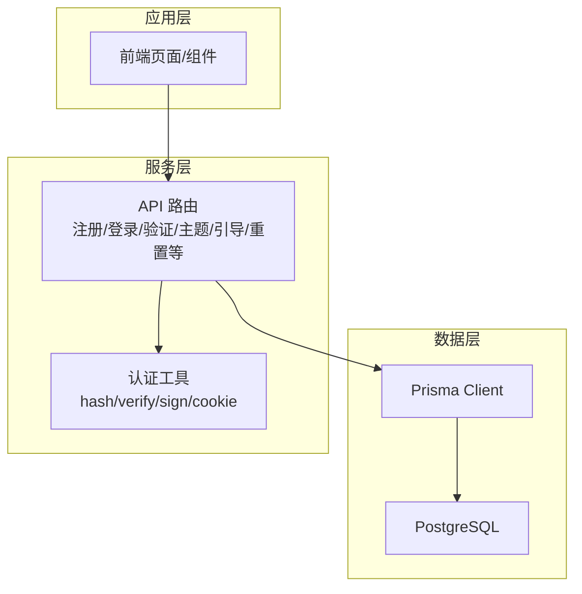
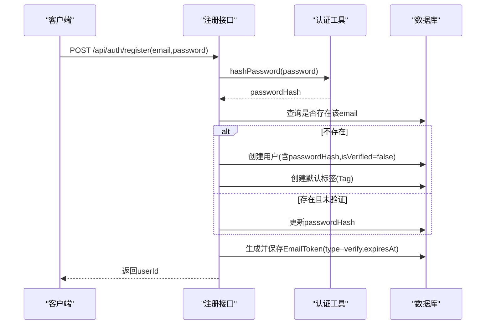
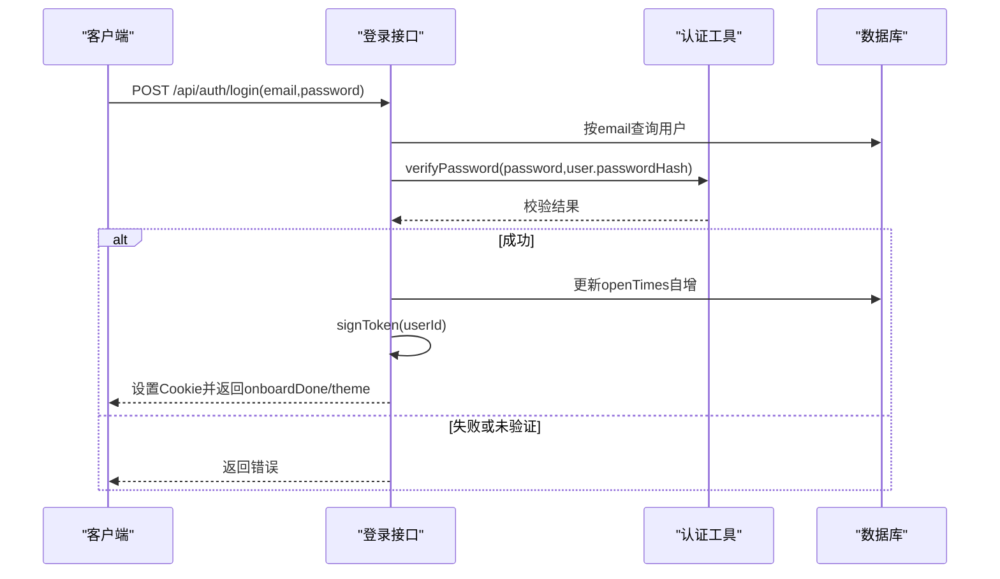
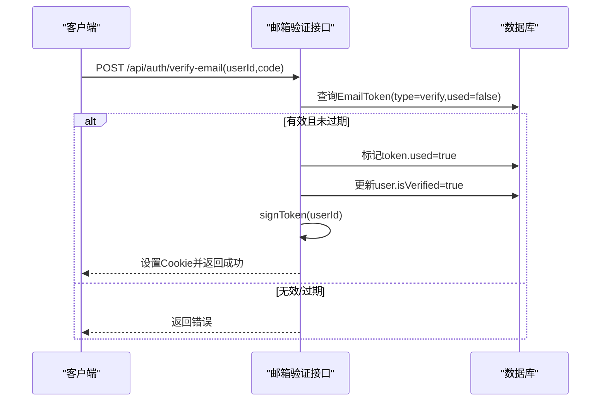
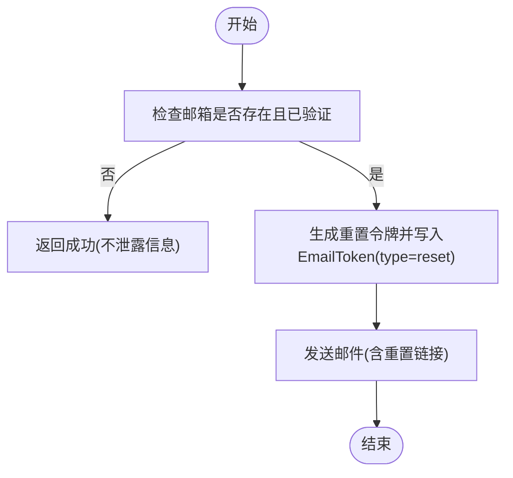
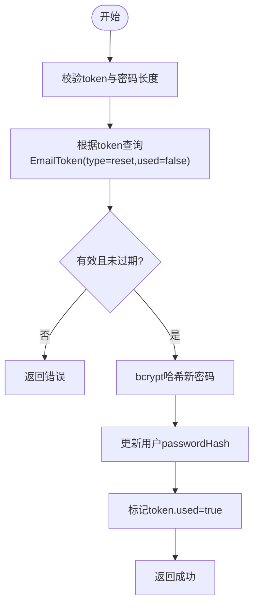
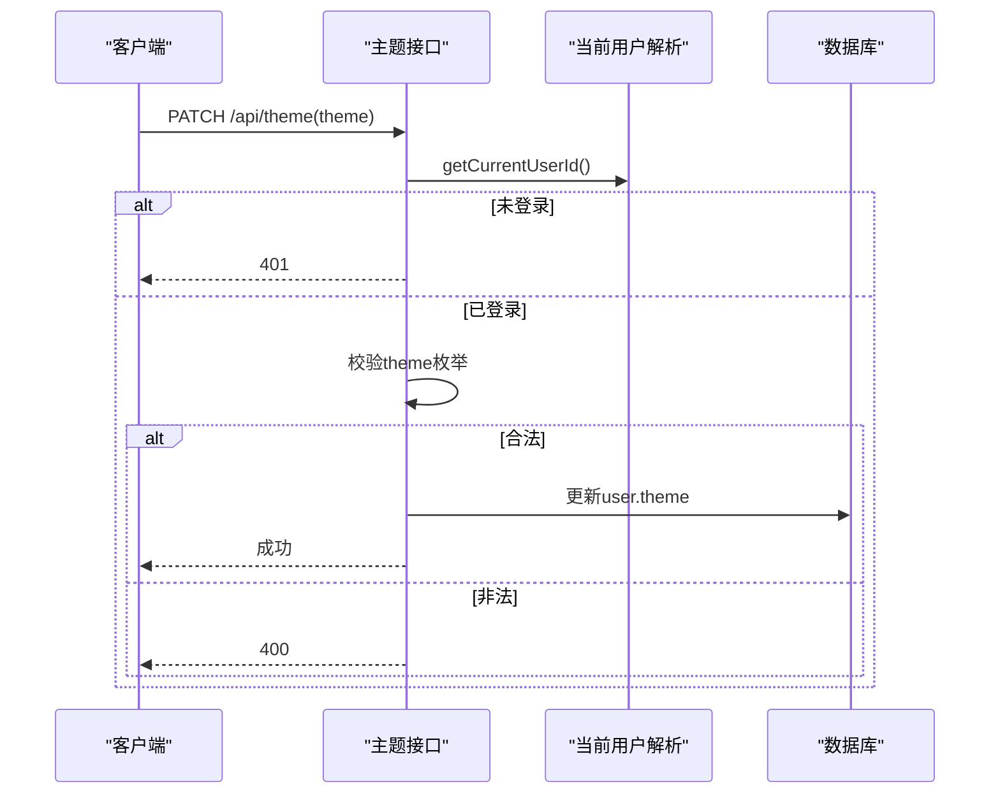
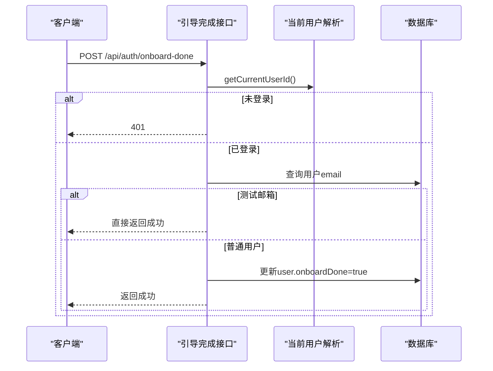
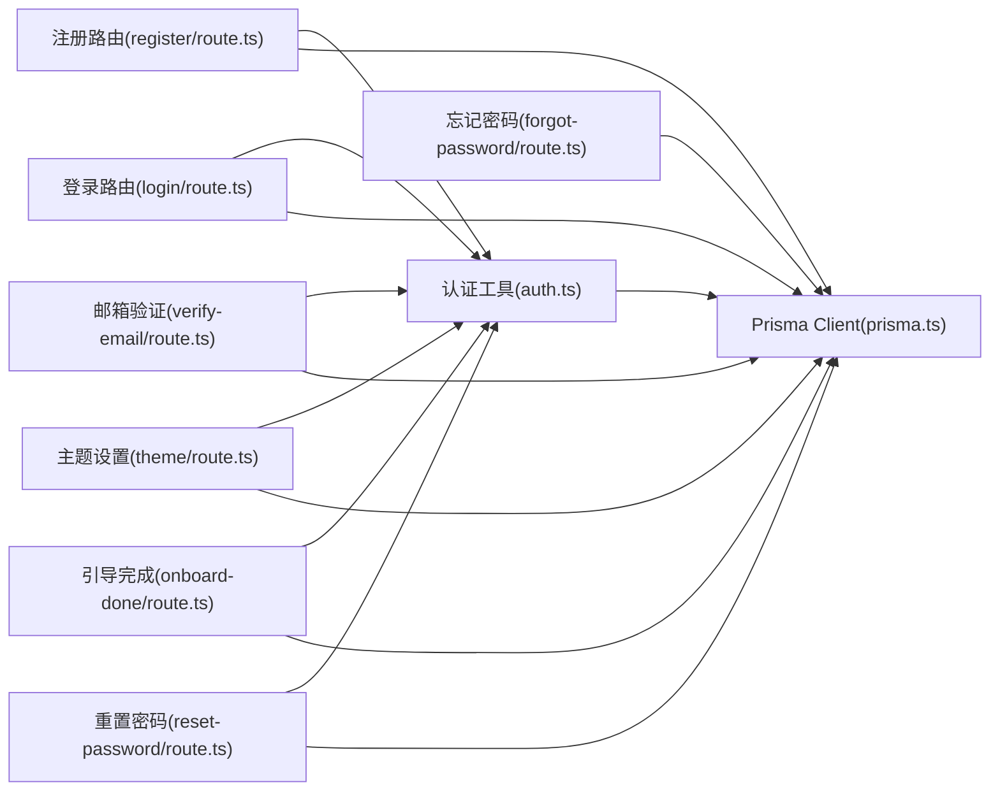

# 用户模型 (User)

<cite>
**本文引用的文件**
- [schema.prisma](file://prisma/schema.prisma)
- [migration.sql](file://prisma/migrations/20260621_init/migration.sql)
- [auth.ts](file://lib/auth.ts)
- [route.ts（注册）](file://app/api/auth/register/route.ts)
- [route.ts（登录）](file://app/api/auth/login/route.ts)
- [route.ts（邮箱验证）](file://app/api/auth/verify-email/route.ts)
- [route.ts（忘记密码）](file://app/api/auth/forgot-password/route.ts)
- [route.ts（重置密码）](file://app/api/auth/reset-password/route.ts)
- [route.ts（主题设置）](file://app/api/theme/route.ts)
- [route.ts（引导完成）](file://app/api/auth/onboard-done/route.ts)
- [route.ts（当前用户信息）](file://app/api/auth/me/route.ts)
- [prisma.ts](file://lib/prisma.ts)
</cite>

## 目录
1. [简介](#简介)
2. [项目结构](#项目结构)
3. [核心组件](#核心组件)
4. [架构总览](#架构总览)
5. [详细组件分析](#详细组件分析)
6. [依赖关系分析](#依赖关系分析)
7. [性能与索引优化](#性能与索引优化)
8. [故障排查指南](#故障排查指南)
9. [结论](#结论)

## 简介
本文件围绕心芽项目的用户模型 User 进行系统化文档化，覆盖字段设计、约束与默认值、认证流程、个性化设置、引导状态、业务统计以及与其它实体的关联。同时给出数据完整性校验规则、安全最佳实践建议以及查询优化策略与索引说明，帮助开发者快速理解并正确扩展用户域能力。

## 项目结构
用户模型定义位于 Prisma Schema 中，并通过迁移脚本生成数据库表；认证与用户相关 API 分布在 app/api 下，鉴权工具在 lib/auth.ts 中实现；Prisma 客户端初始化在 lib/prisma.ts。



图表来源
- [schema.prisma:10-31](file://prisma/schema.prisma#L10-L31)
- [auth.ts:1-56](file://lib/auth.ts#L1-L56)
- [prisma.ts:1-14](file://lib/prisma.ts#L1-L14)

章节来源
- [schema.prisma:1-209](file://prisma/schema.prisma#L1-L209)
- [migration.sql:1-38](file://prisma/migrations/20260621_init/migration.sql#L1-L38)
- [prisma.ts:1-14](file://lib/prisma.ts#L1-L14)

## 核心组件
- 用户实体 User：包含身份标识、认证凭据、邮箱验证状态、主题偏好、引导完成标记、打开次数统计及审计时间戳。
- 认证工具 auth.ts：提供密码哈希/校验、JWT 签发/校验、Cookie 配置与当前用户解析。
- 用户相关 API：注册、登录、邮箱验证、主题更新、引导完成、获取当前用户信息、忘记密码与重置密码。
- 关联实体：Entry、Tag、Share、AiInsight、InsightReport、GrowthLog、EmailToken、UserSetting、QuizRecord、ReviewCallLog。

章节来源
- [schema.prisma:10-31](file://prisma/schema.prisma#L10-L31)
- [auth.ts:1-56](file://lib/auth.ts#L1-L56)
- [route.ts（注册）:1-56](file://app/api/auth/register/route.ts#L1-L56)
- [route.ts（登录）:1-38](file://app/api/auth/login/route.ts#L1-L38)
- [route.ts（邮箱验证）:1-38](file://app/api/auth/verify-email/route.ts#L1-L38)
- [route.ts（主题设置）:1-15](file://app/api/theme/route.ts#L1-L15)
- [route.ts（引导完成）:1-18](file://app/api/auth/onboard-done/route.ts#L1-L18)
- [route.ts（当前用户信息）:1-17](file://app/api/auth/me/route.ts#L1-L17)
- [route.ts（忘记密码）:1-34](file://app/api/auth/forgot-password/route.ts#L1-L34)
- [route.ts（重置密码）:1-31](file://app/api/auth/reset-password/route.ts#L1-L31)

## 架构总览
下图展示用户模型及其主要关联关系，体现一对一、一对多与多对多（通过中间表）的建模方式。

```mermaid
erDiagram
USER {
string id PK
string email UK
string passwordHash
boolean isVerified
string theme
boolean onboardDone
int openTimes
datetime createdAt
datetime updatedAt
}
ENTRY {
string id PK
string userId FK
string title
text content
string mood
datetime recordTime
boolean isTop
boolean isFavorite
boolean isDraft
datetime createdAt
datetime updatedAt
}
TAG {
string id PK
string userId FK
string name
boolean isDefault
datetime createdAt
}
SHARE {
string id PK
string userId FK
string token UK
datetime expiresAt
string scope
string[] tagIds
boolean isActive
datetime createdAt
}
AIINSIGHT {
string id PK
string userId FK
string content
int triggerCount
boolean isRead
datetime createdAt
}
INSIGHTREPORT {
string id PK
string userId FK
string type
datetime periodStart
datetime periodEnd
json content
datetime createdAt
}
GROWTHLOG {
string id PK
string userId FK
string version
string title
string content
datetime logDate
datetime createdAt
}
EMAILTOKEN {
string id PK
string userId FK
string token UK
string type
datetime expiresAt
boolean used
datetime createdAt
}
USERSETTING {
string id PK
string userId UK FK
boolean reviewEnabled
string lastCardDate
string lastQuestionId
}
QUIZRECORD {
string id PK
string userId FK
string questionId FK
string entryId FK
boolean correct
json userAnswer
int answerCount
datetime answeredAt
datetime nextReviewAt
int streak
}
REVIEWCALLLOG {
string id PK
string userId FK
string entryId FK
string step
boolean success
int questionCount
string errorMsg
datetime createdAt
}
USER ||--o{ ENTRY : "拥有"
USER ||--o{ TAG : "管理"
USER ||--o{ SHARE : "创建分享"
USER ||--o{ AIINSIGHT : "生成洞察"
USER ||--o{ INSIGHTREPORT : "生成报告"
USER ||--o{ GROWTHLOG : "记录成长日志"
USER ||--o{ EMAILTOKEN : "持有令牌"
USER ||--|| USERSETTING : "对应设置"
USER ||--o{ QUIZRECORD : "答题记录"
USER ||--o{ REVIEWCALLLOG : "调用日志"
```

图表来源
- [schema.prisma:10-209](file://prisma/schema.prisma#L10-L209)

## 详细组件分析

### 用户实体 User 字段设计与约束
- 标识与基础信息
  - id：主键，cuid 生成，唯一标识用户。
  - email：唯一，用于登录与找回流程。
  - passwordHash：存储 bcrypt 哈希值，禁止明文存储。
- 认证与引导
  - isVerified：布尔，默认 false，控制是否允许登录。
  - onboardDone：布尔，默认 false，表示新用户引导是否完成。
- 个性化与统计
  - theme：字符串，默认 spring，支持多种主题枚举值。
  - openTimes：整数，默认 0，记录登录或访问次数。
- 审计时间
  - createdAt：创建时间，默认当前时间。
  - updatedAt：更新时间，自动维护。

章节来源
- [schema.prisma:10-31](file://prisma/schema.prisma#L10-L31)
- [migration.sql:1-13](file://prisma/migrations/20260621_init/migration.sql#L1-L13)

### 用户认证流程与安全要点
- 注册
  - 输入校验：邮箱格式、密码长度。
  - 重复处理：若存在未验证账号则复用，否则新建用户。
  - 密码处理：使用 bcrypt 哈希后写入。
  - 验证码：生成一次性验证码并写入 EmailToken，发送验证邮件。
  - 默认标签：为新用户创建“随笔”默认标签。
- 登录
  - 查找用户并检查 isVerified。
  - 校验密码哈希。
  - 签发 JWT 并写入 Cookie。
  - 递增 openTimes。
- 邮箱验证
  - 校验 EmailToken 有效性（类型、过期、未使用）。
  - 标记用户为已验证，并自动登录。
- 忘记密码与重置
  - 仅对已验证用户发放重置令牌。
  - 重置时校验令牌类型、有效期与使用状态，成功后更新密码哈希并标记令牌已用。



图表来源
- [route.ts（注册）:1-56](file://app/api/auth/register/route.ts#L1-L56)
- [auth.ts:9-16](file://lib/auth.ts#L9-L16)
- [schema.prisma:57-69](file://prisma/schema.prisma#L57-L69)
- [schema.prisma:124-136](file://prisma/schema.prisma#L124-L136)



图表来源
- [route.ts（登录）:1-38](file://app/api/auth/login/route.ts#L1-L38)
- [auth.ts:14-30](file://lib/auth.ts#L14-L30)
- [auth.ts:46-55](file://lib/auth.ts#L46-L55)



图表来源
- [route.ts（邮箱验证）:1-38](file://app/api/auth/verify-email/route.ts#L1-L38)
- [schema.prisma:124-136](file://prisma/schema.prisma#L124-L136)



图表来源
- [route.ts（忘记密码）:1-34](file://app/api/auth/forgot-password/route.ts#L1-L34)
- [schema.prisma:124-136](file://prisma/schema.prisma#L124-L136)



图表来源
- [route.ts（重置密码）:1-31](file://app/api/auth/reset-password/route.ts#L1-L31)
- [schema.prisma:124-136](file://prisma/schema.prisma#L124-L136)

### 个性化设置与引导流程
- 主题设置
  - 仅接受预定义主题值，非法值将被拒绝。
  - 通过 PATCH 接口更新用户主题。
- 引导完成
  - 非测试邮箱可标记 onboardDone=true。
  - 特定测试邮箱始终跳过引导完成标记。



图表来源
- [route.ts（主题设置）:1-15](file://app/api/theme/route.ts#L1-L15)
- [auth.ts:33-43](file://lib/auth.ts#L33-L43)



图表来源
- [route.ts（引导完成）:1-18](file://app/api/auth/onboard-done/route.ts#L1-L18)
- [auth.ts:33-43](file://lib/auth.ts#L33-L43)

### 用户与其他实体的关联关系
- Entry（心得记录）：一对多，用户拥有多条记录，删除用户级联删除记录。
- Tag（标签）：一对多，用户拥有多个标签，标签名在用户维度唯一。
- Share（分享）：一对多，用户可创建多个分享，包含 token、过期时间、范围与标签集合。
- AiInsight（AI洞察）：一对多，用户生成的洞察记录。
- InsightReport（洞察报告）：一对多，用户周期报告，联合唯一约束避免重复。
- GrowthLog（成长日志）：一对多，可选关联用户。
- EmailToken（邮件令牌）：一对多，用于邮箱验证与密码重置。
- UserSetting（用户设置）：一对一，用户专属设置。
- QuizRecord（问答记录）：一对多，用户答题记录。
- ReviewCallLog（审核调用日志）：一对多，用户调用日志。

章节来源
- [schema.prisma:33-209](file://prisma/schema.prisma#L33-L209)

### 数据完整性与校验规则
- 邮箱唯一性：防止重复注册。
- 密码强度：最小长度限制，服务端二次校验。
- 验证码时效：type、used、expiresAt 三重校验。
- 主题枚举：仅允许预设值。
- 报告去重：基于 userId、type、periodStart 的唯一约束。
- 标签唯一性：同一用户内标签名唯一。

章节来源
- [schema.prisma:10-31](file://prisma/schema.prisma#L10-L31)
- [schema.prisma:57-69](file://prisma/schema.prisma#L57-L69)
- [schema.prisma:97-110](file://prisma/schema.prisma#L97-L110)
- [route.ts（主题设置）:1-15](file://app/api/theme/route.ts#L1-L15)
- [route.ts（注册）:1-56](file://app/api/auth/register/route.ts#L1-L56)
- [route.ts（邮箱验证）:1-38](file://app/api/auth/verify-email/route.ts#L1-L38)
- [route.ts（重置密码）:1-31](file://app/api/auth/reset-password/route.ts#L1-L31)

### 安全最佳实践建议
- 密码存储：始终使用强哈希算法（bcrypt），并在生产环境配置合理轮次。
- 令牌安全：验证码与重置令牌具备类型、有效期与一次性使用约束。
- 会话安全：JWT 签名密钥应来自环境变量，生产环境启用 secure Cookie。
- 最小暴露：错误响应不泄露用户是否存在等敏感信息。
- 权限控制：所有写操作需先解析当前用户 ID，未登录即拒绝。

章节来源
- [auth.ts:1-56](file://lib/auth.ts#L1-L56)
- [route.ts（注册）:1-56](file://app/api/auth/register/route.ts#L1-L56)
- [route.ts（忘记密码）:1-34](file://app/api/auth/forgot-password/route.ts#L1-L34)
- [route.ts（重置密码）:1-31](file://app/api/auth/reset-password/route.ts#L1-L31)

## 依赖关系分析
- 模块耦合
  - API 路由依赖 prisma 客户端与认证工具。
  - 认证工具依赖 bcryptjs 与 jsonwebtoken。
  - 用户模型作为中心节点，被多个业务实体引用。
- 外部依赖
  - PostgreSQL 作为持久化存储。
  - Prisma 作为 ORM 与迁移工具。



图表来源
- [auth.ts:1-56](file://lib/auth.ts#L1-L56)
- [prisma.ts:1-14](file://lib/prisma.ts#L1-L14)
- [route.ts（注册）:1-56](file://app/api/auth/register/route.ts#L1-L56)
- [route.ts（登录）:1-38](file://app/api/auth/login/route.ts#L1-L38)
- [route.ts（邮箱验证）:1-38](file://app/api/auth/verify-email/route.ts#L1-L38)
- [route.ts（主题设置）:1-15](file://app/api/theme/route.ts#L1-L15)
- [route.ts（引导完成）:1-18](file://app/api/auth/onboard-done/route.ts#L1-L18)
- [route.ts（忘记密码）:1-34](file://app/api/auth/forgot-password/route.ts#L1-L34)
- [route.ts（重置密码）:1-31](file://app/api/auth/reset-password/route.ts#L1-L31)

## 性能与索引优化
- 用户查询
  - 按 email 查询频繁，已在 schema 中声明 unique 约束，数据库会自动建立唯一索引。
- 条目列表与筛选
  - Entry 针对 userId+recordTime、userId+isTop、userId+isFavorite、userId+isDraft 建立复合索引，提升分页与筛选性能。
- AI 洞察列表
  - AiInsight 针对 userId+createdAt 降序索引，优化最近洞察加载。
- 报告去重与查询
  - InsightReport 基于 userId+type+periodStart 唯一约束，避免重复插入并加速定位。
- 标签查询
  - Tag 针对 userId 建立索引，提升用户标签列表查询效率。
- 令牌检索
  - EmailToken 针对 token 建立索引，加速验证码与重置令牌查找。
- 复习调度
  - QuizRecord 针对 userId+nextReviewAt、userId+questionId 建立索引，优化复习任务调度。
- 审核日志
  - ReviewCallLog 针对 userId+createdAt 建立索引，便于按用户查看调用历史。

章节来源
- [schema.prisma:51-55](file://prisma/schema.prisma#L51-L55)
- [schema.prisma:67-69](file://prisma/schema.prisma#L67-L69)
- [schema.prisma:94-95](file://prisma/schema.prisma#L94-L95)
- [schema.prisma:108-110](file://prisma/schema.prisma#L108-L110)
- [schema.prisma:135](file://prisma/schema.prisma#L135)
- [schema.prisma:182-184](file://prisma/schema.prisma#L182-L184)
- [schema.prisma:208](file://prisma/schema.prisma#L208)

## 故障排查指南
- 登录失败
  - 检查 isVerified 是否为 true。
  - 确认密码哈希是否正确。
  - 核对 Cookie 配置与域名/路径。
- 邮箱验证失败
  - 检查 EmailToken 是否存在、类型是否为 verify、是否已使用、是否过期。
- 主题设置无效
  - 确认传入 theme 是否在允许集合内。
- 重置密码失败
  - 检查 reset 类型令牌是否有效、未使用且未过期。
- 当前用户信息为空
  - 确认请求是否携带有效 Cookie，解析出的 userId 是否存在。

章节来源
- [route.ts（登录）:1-38](file://app/api/auth/login/route.ts#L1-L38)
- [route.ts（邮箱验证）:1-38](file://app/api/auth/verify-email/route.ts#L1-L38)
- [route.ts（主题设置）:1-15](file://app/api/theme/route.ts#L1-L15)
- [route.ts（重置密码）:1-31](file://app/api/auth/reset-password/route.ts#L1-L31)
- [route.ts（当前用户信息）:1-17](file://app/api/auth/me/route.ts#L1-L17)

## 结论
User 模型以简洁而完备的字段设计支撑了心芽的核心业务：认证、个性化与引导流程。通过严格的校验与安全的实现细节，结合合理的索引策略，系统在功能性与性能之间取得良好平衡。建议在后续迭代中持续完善错误码体系、引入更细粒度的权限控制，并对敏感配置进行集中管理与审计。