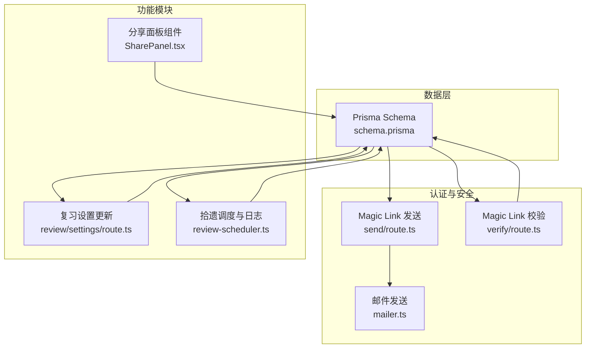
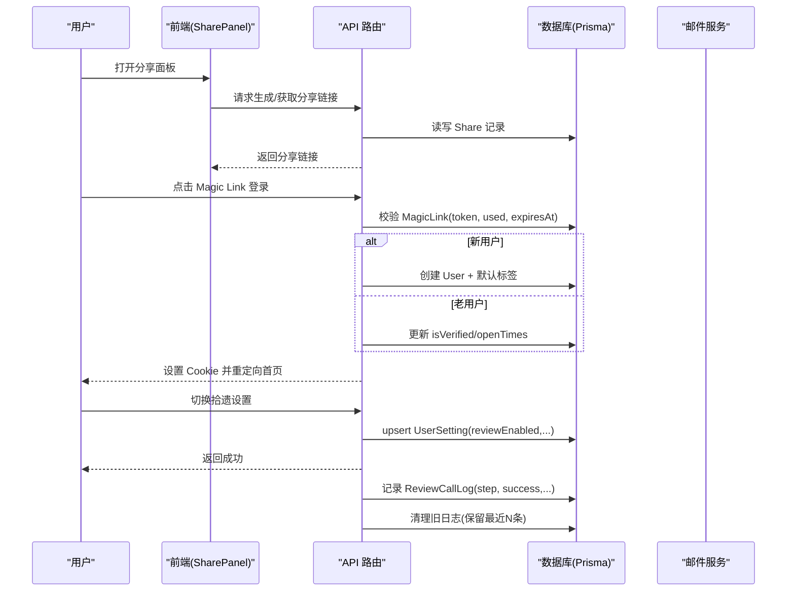
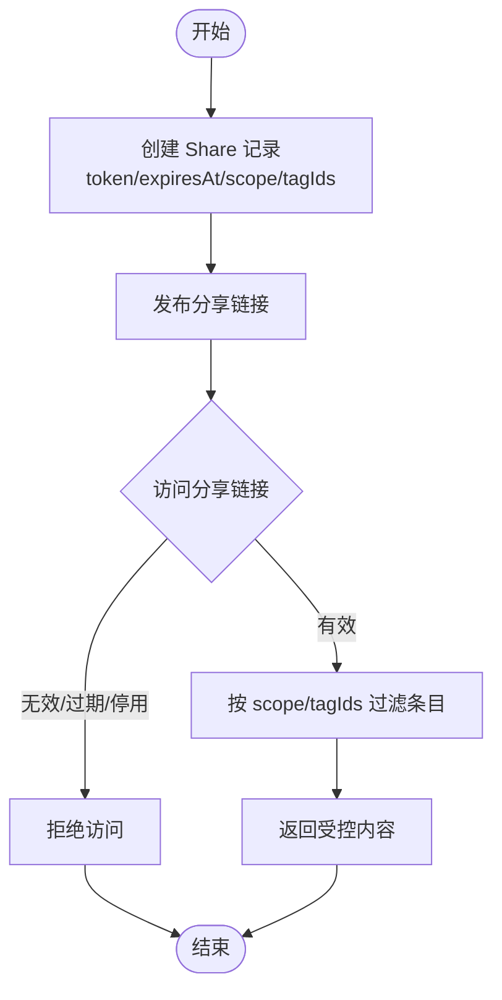
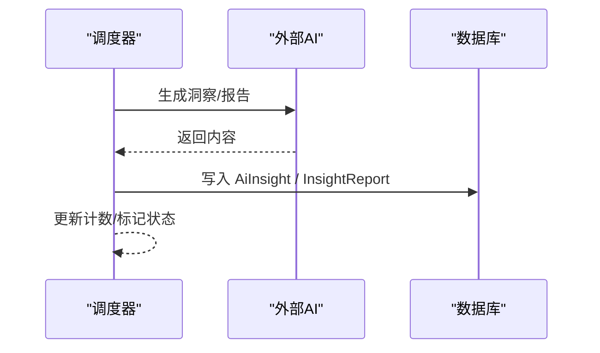
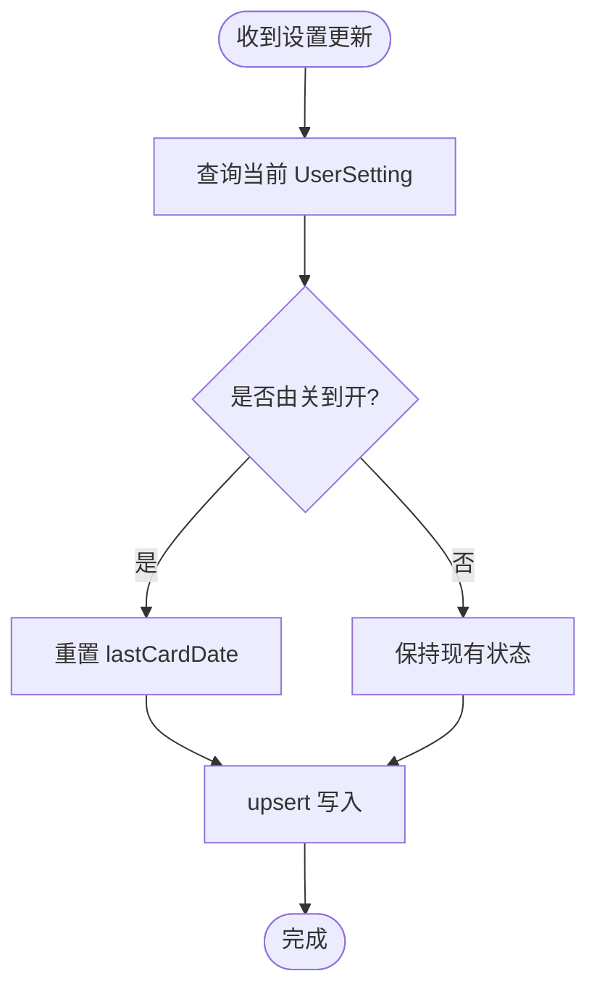
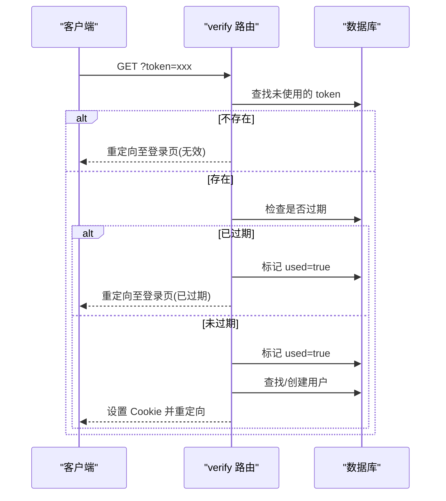
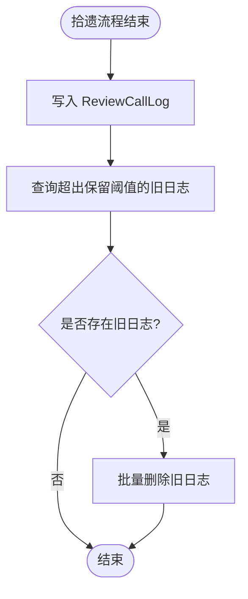
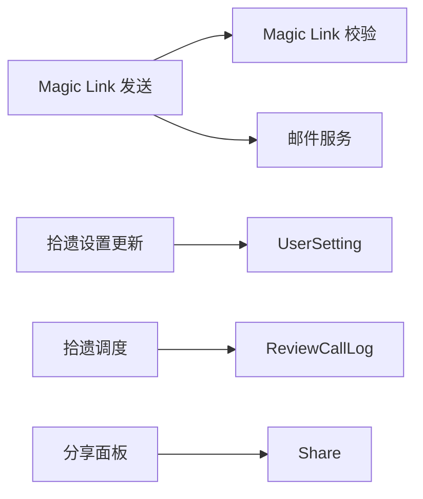

# 辅助数据模型

<cite>
**本文引用的文件**   
- [prisma/schema.prisma](file://prisma/schema.prisma)
- [app/api/auth/magic-link/send/route.ts](file://app/api/auth/magic-link/send/route.ts)
- [app/api/auth/magic-link/verify/route.ts](file://app/api/auth/magic-link/verify/route.ts)
- [lib/mailer.ts](file://lib/mailer.ts)
- [lib/review-scheduler.ts](file://lib/review-scheduler.ts)
- [app/api/review/settings/route.ts](file://app/api/review/settings/route.ts)
- [components/SharePanel.tsx](file://components/SharePanel.tsx)
</cite>

## 目录
1. [引言](#引言)
2. [项目结构](#项目结构)
3. [核心组件](#核心组件)
4. [架构总览](#架构总览)
5. [详细组件分析](#详细组件分析)
6. [依赖关系分析](#依赖关系分析)
7. [性能与扩展性](#性能与扩展性)
8. [故障排查指南](#故障排查指南)
9. [结论](#结论)
10. [附录：字段与索引速查](#附录字段与索引速查)

## 引言
本文件聚焦心芽项目的“辅助数据模型”，围绕以下实体展开：Share、AiInsight、InsightReport、GrowthLog、EmailToken、MagicLink、UserSetting、ReviewCallLog。文档从设计理念、字段定义、业务用途、关联关系入手，解释分享链接的权限控制与过期机制、AI洞察报告的数据结构、用户设置配置管理、邮件令牌的安全验证流程，以及系统日志追踪能力，并给出使用场景与最佳实践建议。

## 项目结构
这些辅助模型统一在 Prisma Schema 中声明，并通过 API 路由与库函数进行读写与编排。关键位置如下：
- 数据模型定义：prisma/schema.prisma
- Magic Link 发送与校验：app/api/auth/magic-link/send/route.ts、app/api/auth/magic-link/verify/route.ts
- 邮件模板与发送：lib/mailer.ts
- 拾遗（复习）调度与日志：lib/review-scheduler.ts
- 用户设置更新入口：app/api/review/settings/route.ts
- 前端分享面板组件：components/SharePanel.tsx

图表来源
- [prisma/schema.prisma](file://prisma/schema.prisma)
- [app/api/auth/magic-link/send/route.ts](file://app/api/auth/magic-link/send/route.ts)
- [app/api/auth/magic-link/verify/route.ts](file://app/api/auth/magic-link/verify/route.ts)
- [lib/mailer.ts](file://lib/mailer.ts)
- [app/api/review/settings/route.ts](file://app/api/review/settings/route.ts)
- [lib/review-scheduler.ts](file://lib/review-scheduler.ts)
- [components/SharePanel.tsx](file://components/SharePanel.tsx)

章节来源
- [prisma/schema.prisma](file://prisma/schema.prisma)

## 核心组件
本节对每个辅助模型进行结构化说明，包括字段含义、业务用途、关联关系与典型使用路径。

### Share（分享链接）
- 设计目标
  - 为条目生成可分享的访问凭证，支持按范围与标签粒度控制可见性，并提供过期与启停开关。
- 关键字段
  - id: 主键
  - userId: 所属用户
  - token: 唯一分享令牌
  - expiresAt: 过期时间
  - scope: 分享范围（如全部或受限）
  - tagIds: 允许查看的标签集合
  - isActive: 是否启用
  - createdAt: 创建时间
- 关联关系
  - 与 User 一对多（一个用户可拥有多个分享链接）
- 典型用法
  - 生成分享链接时写入 Share；读取共享页面时依据 token 校验有效期与状态，再根据 scope/tagIds 过滤条目。
- 安全与权限要点
  - 通过唯一 token 作为访问凭据；结合 expiresAt 实现短期有效；isActive 提供快速禁用能力；tagIds 用于细粒度授权。
- 相关代码片段路径
  - 模型定义：[prisma/schema.prisma](file://prisma/schema.prisma)
  - 前端分享面板组件：[components/SharePanel.tsx](file://components/SharePanel.tsx)

章节来源
- [prisma/schema.prisma](file://prisma/schema.prisma)
- [components/SharePanel.tsx](file://components/SharePanel.tsx)

### AiInsight（AI 洞察记录）
- 设计目标
  - 持久化 AI 生成的洞察内容，便于后续展示与统计。
- 关键字段
  - id: 主键
  - userId: 所属用户
  - content: 洞察文本
  - triggerCount: 触发次数
  - isRead: 是否已读
  - createdAt: 创建时间
- 关联关系
  - 与 User 一对多
- 典型用法
  - 后台任务或接口调用 AI 后落盘，供用户侧列表展示与标记已读。
- 相关代码片段路径
  - 模型定义：[prisma/schema.prisma](file://prisma/schema.prisma)

章节来源
- [prisma/schema.prisma](file://prisma/schema.prisma)

### InsightReport（洞察报告）
- 设计目标
  - 以 JSON 形式存储周期性或类型化的洞察报告，支持按用户+类型+周期去重。
- 关键字段
  - id: 主键
  - userId: 所属用户
  - type: 报告类型标识
  - periodStart/periodEnd: 报告覆盖的时间区间
  - content: JSON 内容
  - createdAt: 创建时间
- 关联关系
  - 与 User 一对多
- 典型用法
  - 定时任务或按需生成报告，按 (userId, type, periodStart) 唯一约束避免重复写入。
- 相关代码片段路径
  - 模型定义：[prisma/schema.prisma](file://prisma/schema.prisma)

章节来源
- [prisma/schema.prisma](file://prisma/schema.prisma)

### GrowthLog（成长日志）
- 设计目标
  - 记录版本化成长事件，支持可选的用户关联，便于审计与回溯。
- 关键字段
  - id: 主键
  - userId: 可选用户关联
  - version: 版本号
  - title/content: 标题与正文
  - logDate: 日志日期
  - createdAt: 创建时间
- 关联关系
  - 与 User 可选一对多
- 典型用法
  - 系统升级、策略变更或里程碑事件的记录。
- 相关代码片段路径
  - 模型定义：[prisma/schema.prisma](file://prisma/schema.prisma)

章节来源
- [prisma/schema.prisma](file://prisma/schema.prisma)

### EmailToken（邮箱令牌）
- 设计目标
  - 面向需要绑定用户的邮箱类一次性令牌（如验证码、重置密码等）。
- 关键字段
  - id: 主键
  - userId: 所属用户
  - token: 唯一令牌
  - type: 令牌类型
  - expiresAt: 过期时间
  - used: 是否已使用
  - createdAt: 创建时间
- 关联关系
  - 与 User 一对多
- 典型用法
  - 生成一次性令牌并发送至邮箱，校验时检查未使用且未过期。
- 相关代码片段路径
  - 模型定义：[prisma/schema.prisma](file://prisma/schema.prisma)

章节来源
- [prisma/schema.prisma](file://prisma/schema.prisma)

### MagicLink（魔法链接）
- 设计目标
  - 无密码登录/注册的一次性链接凭证，支持自动注册与老用户验证。
- 关键字段
  - id: 主键
  - email: 目标邮箱
  - token: 唯一令牌
  - expiresAt: 过期时间
  - used: 是否已使用
  - createdAt: 创建时间
- 关联关系
  - 独立于用户表，仅通过邮箱关联
- 典型用法
  - 发送端生成随机 token 并写入数据库，校验端验证有效性后完成登录或注册。
- 相关代码片段路径
  - 模型定义：[prisma/schema.prisma](file://prisma/schema.prisma)
  - 发送流程：[app/api/auth/magic-link/send/route.ts](file://app/api/auth/magic-link/send/route.ts)
  - 校验流程：[app/api/auth/magic-link/verify/route.ts](file://app/api/auth/magic-link/verify/route.ts)
  - 邮件模板：[lib/mailer.ts](file://lib/mailer.ts)

章节来源
- [prisma/schema.prisma](file://prisma/schema.prisma)
- [app/api/auth/magic-link/send/route.ts](file://app/api/auth/magic-link/send/route.ts)
- [app/api/auth/magic-link/verify/route.ts](file://app/api/auth/magic-link/verify/route.ts)
- [lib/mailer.ts](file://lib/mailer.ts)

### UserSetting（用户设置）
- 设计目标
  - 保存用户级功能开关与状态，例如是否开启拾遗（复习）、最近卡片日期与题目 ID。
- 关键字段
  - id: 主键
  - userId: 唯一用户映射
  - reviewEnabled: 是否开启拾遗
  - lastCardDate: 上次弹出卡片日期
  - lastQuestionId: 上次题目 ID
- 关联关系
  - 与 User 一对一
- 典型用法
  - 更新设置时 upsert；开启拾遗时重置 lastCardDate 以触发当日卡片。
- 相关代码片段路径
  - 模型定义：[prisma/schema.prisma](file://prisma/schema.prisma)
  - 设置更新接口：[app/api/review/settings/route.ts](file://app/api/review/settings/route.ts)

章节来源
- [prisma/schema.prisma](file://prisma/schema.prisma)
- [app/api/review/settings/route.ts](file://app/api/review/settings/route.ts)

### ReviewCallLog（拾遗调用日志）
- 设计目标
  - 记录拾遗流程各阶段的调用结果，便于问题定位与效果评估。
- 关键字段
  - id: 主键
  - userId: 所属用户
  - entryId: 关联条目（可选）
  - step: 阶段标识（如预生成、缓存命中、在线重试、模板回退）
  - success: 是否成功
  - questionCount: 生成题目数量
  - errorMsg: 错误信息（可选）
  - createdAt: 创建时间
- 关联关系
  - 与 User 一对多
- 典型用法
  - 每次拾遗流程执行后记录日志，并清理旧日志保留最近若干条。
- 相关代码片段路径
  - 模型定义：[prisma/schema.prisma](file://prisma/schema.prisma)
  - 日志写入与清理：[lib/review-scheduler.ts](file://lib/review-scheduler.ts)

章节来源
- [prisma/schema.prisma](file://prisma/schema.prisma)
- [lib/review-scheduler.ts](file://lib/review-scheduler.ts)

## 架构总览
下图展示了与辅助模型相关的核心交互：Magic Link 的发送与校验、用户设置更新、拾遗日志记录，以及分享面板的前端入口。

图表来源
- [components/SharePanel.tsx](file://components/SharePanel.tsx)
- [app/api/auth/magic-link/send/route.ts](file://app/api/auth/magic-link/send/route.ts)
- [app/api/auth/magic-link/verify/route.ts](file://app/api/auth/magic-link/verify/route.ts)
- [lib/mailer.ts](file://lib/mailer.ts)
- [app/api/review/settings/route.ts](file://app/api/review/settings/route.ts)
- [lib/review-scheduler.ts](file://lib/review-scheduler.ts)
- [prisma/schema.prisma](file://prisma/schema.prisma)

## 详细组件分析

### 分享链接系统（Share）
- 权限控制
  - 基于 token 的唯一访问凭据；isActive 提供即时开关；scope 与 tagIds 决定可见范围。
- 过期机制
  - expiresAt 控制有效期；服务端在解析分享链接时需校验当前时间与 expiresAt。
- 使用建议
  - 生成短时效链接；定期清理过期记录；对外暴露只读接口，避免越权访问他人条目。
- 流程图（概念）

章节来源
- [prisma/schema.prisma](file://prisma/schema.prisma)
- [components/SharePanel.tsx](file://components/SharePanel.tsx)

### AI 洞察报告（AiInsight、InsightReport）
- 数据结构
  - AiInsight：轻量文本型洞察，适合逐条展示与计数。
  - InsightReport：JSON 结构，适合复杂报告与周期聚合。
- 使用建议
  - 对 InsightReport 使用 (userId, type, periodStart) 唯一约束避免重复生成；对 AiInsight 维护 isRead 与 triggerCount 提升体验与统计。
- 序列图（概念）

章节来源
- [prisma/schema.prisma](file://prisma/schema.prisma)

### 用户设置（UserSetting）
- 配置管理
  - 通过 upsert 保证幂等更新；当从关闭变为开启时重置 lastCardDate，确保当天能再次弹出卡片。
- 使用建议
  - 将易变开关与状态集中管理；新增字段时注意向后兼容与默认值。
- 流程图（概念）

章节来源
- [app/api/review/settings/route.ts](file://app/api/review/settings/route.ts)
- [prisma/schema.prisma](file://prisma/schema.prisma)

### 邮件令牌（EmailToken、MagicLink）
- 安全验证机制
  - 一次性 token、唯一约束、过期时间、used 标志位共同保障安全性。
  - Magic Link 校验流程包含：查找未使用 token → 校验过期 → 标记已使用 → 自动注册/验证 → 签发会话。
- 流程图（Magic Link 校验）

章节来源
- [app/api/auth/magic-link/verify/route.ts](file://app/api/auth/magic-link/verify/route.ts)
- [app/api/auth/magic-link/send/route.ts](file://app/api/auth/magic-link/send/route.ts)
- [lib/mailer.ts](file://lib/mailer.ts)
- [prisma/schema.prisma](file://prisma/schema.prisma)

### 系统日志（ReviewCallLog）
- 追踪功能
  - 记录步骤、成功与否、题目数量与错误信息，便于排障与优化。
  - 内置清理逻辑，仅保留最近若干条，控制存储增长。
- 流程图（日志写入与清理）

章节来源
- [lib/review-scheduler.ts](file://lib/review-scheduler.ts)
- [prisma/schema.prisma](file://prisma/schema.prisma)

## 依赖关系分析
- 耦合与内聚
  - 所有辅助模型均通过 Prisma Client 访问，耦合点集中在 schema 与路由/库函数中，内聚良好。
- 直接依赖
  - Magic Link 依赖 mailer 与 auth 工具；ReviewCallLog 依赖 review-scheduler；UserSetting 被设置接口与拾遗调度使用。
- 潜在循环
  - 当前未见循环依赖；各模块职责清晰。
- 外部依赖
  - 邮件服务（SMTP）；外部 AI（DeepSeek）用于洞察生成（非本模型范畴，但影响 Insight/AiInsight 的使用）。

图表来源
- [app/api/auth/magic-link/send/route.ts](file://app/api/auth/magic-link/send/route.ts)
- [app/api/auth/magic-link/verify/route.ts](file://app/api/auth/magic-link/verify/route.ts)
- [lib/mailer.ts](file://lib/mailer.ts)
- [app/api/review/settings/route.ts](file://app/api/review/settings/route.ts)
- [lib/review-scheduler.ts](file://lib/review-scheduler.ts)
- [components/SharePanel.tsx](file://components/SharePanel.tsx)
- [prisma/schema.prisma](file://prisma/schema.prisma)

章节来源
- [prisma/schema.prisma](file://prisma/schema.prisma)

## 性能与扩展性
- 索引与查询
  - 针对高频查询字段建立索引（如 token、userId+createdAt、userId+type），提升检索性能。
- 存储控制
  - 日志与临时令牌采用过期与上限策略，避免无限增长。
- 扩展建议
  - 为 Share 增加访问统计字段；为 InsightReport 增加摘要字段以便快速预览；为 UserSetting 引入更丰富的偏好项。

## 故障排查指南
- Magic Link 无法登录
  - 检查 token 是否已被使用或过期；确认邮件是否送达；核对应用 URL 环境变量。
- 拾遗设置不生效
  - 确认接口返回成功；检查 UserSetting 是否被正确 upsert；关注 lastCardDate 重置逻辑。
- 分享链接不可用
  - 检查 Share.isActive 与 expiresAt；确认 scope/tagIds 是否正确限制。
- 日志缺失
  - 检查 ReviewCallLog 写入是否执行；确认清理逻辑未误删必要记录。

章节来源
- [app/api/auth/magic-link/send/route.ts](file://app/api/auth/magic-link/send/route.ts)
- [app/api/auth/magic-link/verify/route.ts](file://app/api/auth/magic-link/verify/route.ts)
- [app/api/review/settings/route.ts](file://app/api/review/settings/route.ts)
- [lib/review-scheduler.ts](file://lib/review-scheduler.ts)
- [prisma/schema.prisma](file://prisma/schema.prisma)

## 结论
上述辅助模型构成了心芽在分享、洞察、设置、认证与日志方面的基础支撑。通过合理的字段设计与索引策略，配合严格的过期与一次性机制，系统在安全性、可用性与可维护性之间取得平衡。建议在后续迭代中持续完善监控指标与数据治理策略，进一步提升用户体验与运维效率。

## 附录：字段与索引速查
- Share
  - 关键字段：token、expiresAt、scope、tagIds、isActive
  - 索引：token 唯一
- AiInsight
  - 关键字段：content、triggerCount、isRead
  - 索引：userId+createdAt 降序
- InsightReport
  - 关键字段：type、periodStart、periodEnd、content(JSON)
  - 索引：(userId,type,periodStart) 唯一；userId+type
- GrowthLog
  - 关键字段：version、title、content、logDate
- EmailToken
  - 关键字段：token、type、expiresAt、used
  - 索引：token 唯一与索引
- MagicLink
  - 关键字段：email、token、expiresAt、used
  - 索引：token 唯一；email
- UserSetting
  - 关键字段：reviewEnabled、lastCardDate、lastQuestionId
- ReviewCallLog
  - 关键字段：step、success、questionCount、errorMsg
  - 索引：userId+createdAt

章节来源
- [prisma/schema.prisma](file://prisma/schema.prisma)