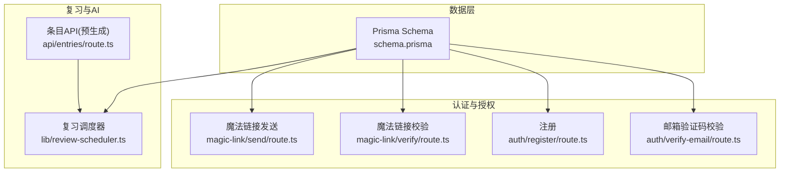
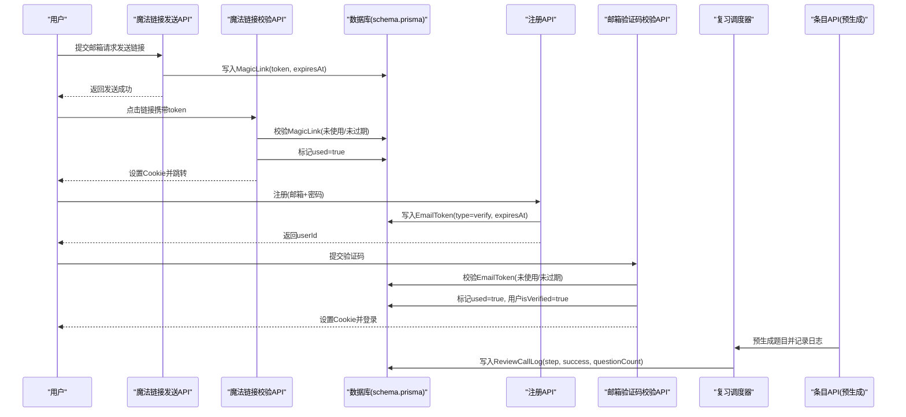
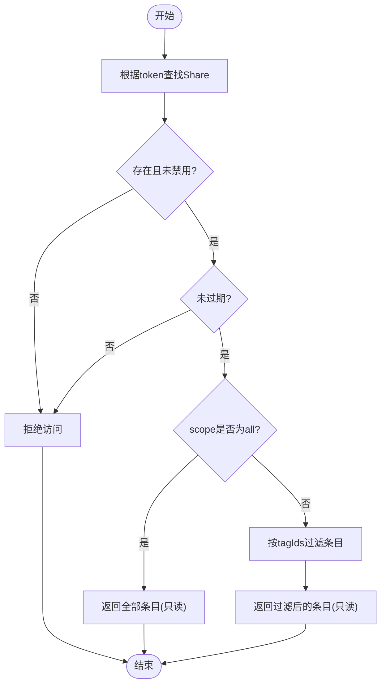
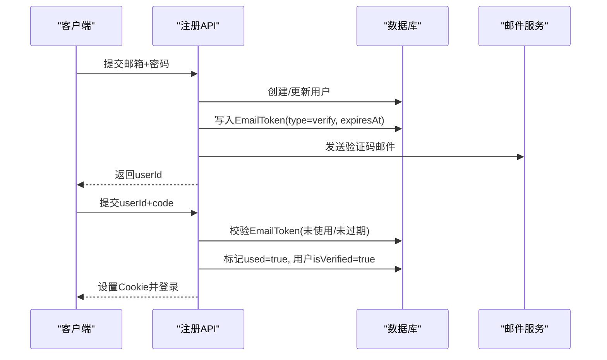
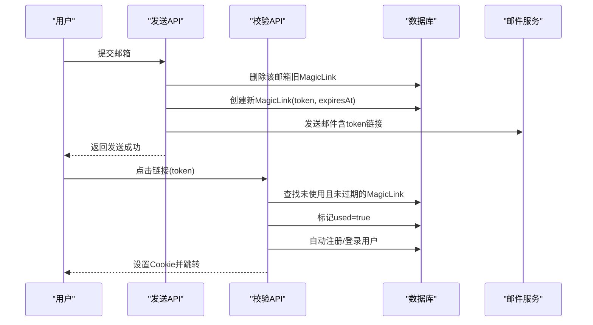
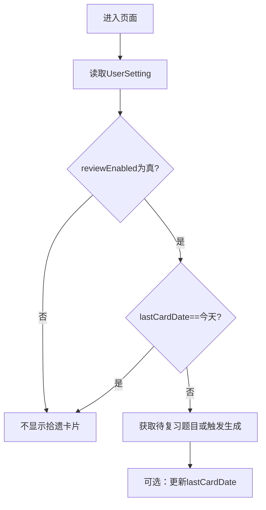
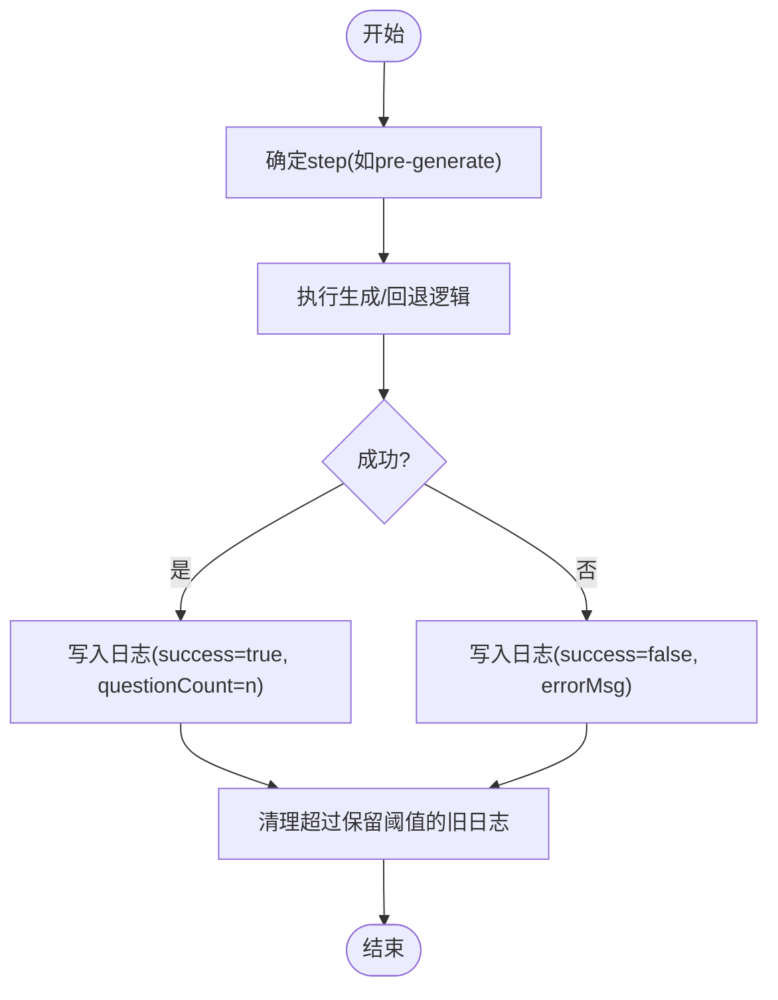
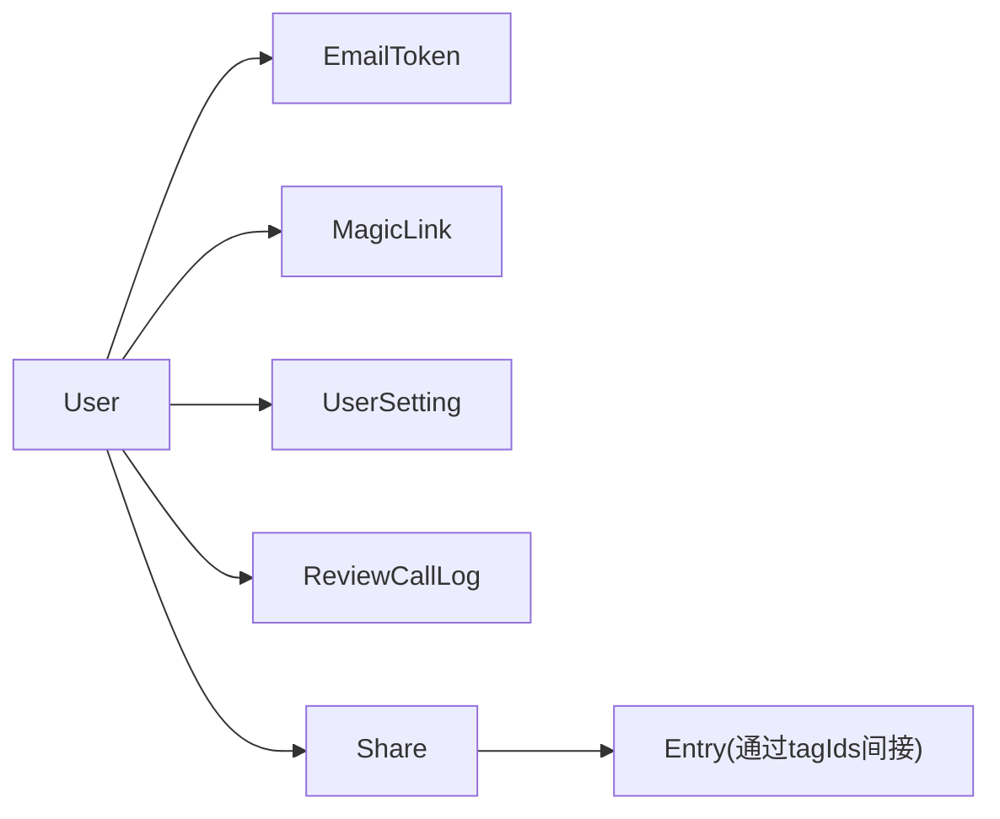

# 辅助数据模型

<cite>
**本文引用的文件**
- [schema.prisma](file://prisma/schema.prisma)
- [send/route.ts](file://app/api/auth/magic-link/send/route.ts)
- [verify/route.ts](file://app/api/auth/magic-link/verify/route.ts)
- [register/route.ts](file://app/api/auth/register/route.ts)
- [verify-email/route.ts](file://app/api/auth/verify-email/route.ts)
- [review-scheduler.ts](file://lib/review-scheduler.ts)
- [entries/route.ts](file://app/api/entries/route.ts)
</cite>

## 目录
1. [引言](#引言)
2. [项目结构](#项目结构)
3. [核心组件](#核心组件)
4. [架构总览](#架构总览)
5. [详细组件分析](#详细组件分析)
6. [依赖分析](#依赖分析)
7. [性能考虑](#性能考虑)
8. [故障排查指南](#故障排查指南)
9. [结论](#结论)
10. [附录](#附录)

## 引言
本文件聚焦心芽项目的“辅助功能”数据模型，围绕以下五类辅助表进行系统化说明：分享链接（Share）、邮箱令牌（EmailToken）、魔法链接（MagicLink）、用户设置（UserSetting）、复习调用日志（ReviewCallLog）。文档将解释分享权限控制的数据结构设计、邮件验证与安全令牌管理机制、用户偏好设置的存储方案、AI 调用日志的记录格式与分析用途，并给出各辅助表的使用场景与集成方式，同时补充安全考虑与数据清理策略。

## 项目结构
辅助数据模型定义于 Prisma Schema 中，相关 API 路由与调度逻辑分布在 app/api 与 lib 目录下。整体关系如下：
- 数据模型：统一在 schema.prisma 中声明
- 认证与授权：magic-link、email-token 等流程通过 API 路由读写数据库
- 复习与 AI 调用：review-scheduler.ts 负责拾遗卡片生成与调用日志记录
- 业务入口：entries 创建时触发预生成题目并记录调用日志

图表来源
- [schema.prisma](file://prisma/schema.prisma)
- [send/route.ts](file://app/api/auth/magic-link/send/route.ts)
- [verify/route.ts](file://app/api/auth/magic-link/verify/route.ts)
- [register/route.ts](file://app/api/auth/register/route.ts)
- [verify-email/route.ts](file://app/api/auth/verify-email/route.ts)
- [review-scheduler.ts](file://lib/review-scheduler.ts)
- [entries/route.ts](file://app/api/entries/route.ts)

章节来源
- [schema.prisma](file://prisma/schema.prisma)

## 核心组件
本节概述五个辅助模型的核心字段、索引与约束，以及它们在系统中的职责边界。

- Share（分享链接）
  - 作用：为某用户的条目提供可分享的只读访问能力，支持有效期与范围控制
  - 关键字段：token（唯一）、expiresAt（过期时间）、scope（范围，如 all 或标签集合）、tagIds（可见标签列表）、isActive（是否启用）
  - 索引与约束：token 唯一；userId 外键级联删除
  - 使用场景：根系页分享管理、访客只读模式

- EmailToken（邮箱令牌）
  - 作用：用于注册后的邮箱验证码校验
  - 关键字段：token（唯一）、type（如 verify）、expiresAt、used（一次性标记）
  - 索引与约束：token 唯一且建立索引；userId 外键级联删除
  - 使用场景：注册后发送验证码、校验成功后自动登录

- MagicLink（魔法链接）
  - 作用：无密码登录/注册的一次性链接凭证
  - 关键字段：token（唯一）、email、expiresAt、used（一次性标记）
  - 索引与约束：token 唯一并建索引；email 建索引
  - 使用场景：输入邮箱即发链接，点击完成登录或自动注册

- UserSetting（用户设置）
  - 作用：存储用户个性化与拾遗开关等偏好
  - 关键字段：reviewEnabled（是否开启拾遗）、lastCardDate（今日是否已弹出卡片）、lastQuestionId（最近一次题目ID）
  - 索引与约束：userId 唯一，一对一扩展用户信息
  - 使用场景：拾遗开关、每日提示去重、最近题目追踪

- ReviewCallLog（复习调用日志）
  - 作用：记录复习/出题链路中的关键步骤与结果，便于分析与排障
  - 关键字段：step（阶段标识，如 pre-generate/cache-hit/online-retry/template-fallback）、success、questionCount、errorMsg
  - 索引与约束：按 userId+createdAt 排序查询优化
  - 使用场景：统计成功率、定位失败原因、评估模板与在线生成效果

章节来源
- [schema.prisma](file://prisma/schema.prisma)

## 架构总览
下图展示辅助模型与关键 API 的交互关系，体现“认证授权”和“复习/AI 调用”两条主线。

图表来源
- [send/route.ts](file://app/api/auth/magic-link/send/route.ts)
- [verify/route.ts](file://app/api/auth/magic-link/verify/route.ts)
- [register/route.ts](file://app/api/auth/register/route.ts)
- [verify-email/route.ts](file://app/api/auth/verify-email/route.ts)
- [review-scheduler.ts](file://lib/review-scheduler.ts)
- [entries/route.ts](file://app/api/entries/route.ts)

## 详细组件分析

### 分享权限控制（Share）
- 数据结构要点
  - token：分享链接的唯一凭据，建议对外暴露为短链参数
  - scope/tagIds：控制可见范围，all 表示全部，否则仅 tagIds 指定标签下的条目可见
  - expiresAt：过期时间，过期后应拒绝访问
  - isActive：软删除式撤销，停用后不再可用
- 访问控制流程
  - 根据 token 查找 Share，校验 isActive 与 expiresAt
  - 若 scope 非 all，则基于 tagIds 过滤条目集合
  - 返回只读视图数据，不暴露写操作
- 典型使用场景
  - 根系页“分享管理”：创建/复制/撤销分享链接
  - 访客只读模式：无需登录即可浏览受控内容

章节来源
- [schema.prisma](file://prisma/schema.prisma)

### 邮箱令牌（EmailToken）与验证码流程
- 设计要点
  - type 区分用途（如 verify），配合 used 实现一次性使用
  - expiresAt 限制有效期（注册流程中通常为较短时间窗口）
  - token 唯一且建索引，保障快速查找
- 流程说明
  - 注册：生成验证码并写入 EmailToken，发送邮件
  - 校验：匹配 token、检查未使用与未过期，通过后标记 used 并更新用户 isVerified，随后签发登录态

图表来源
- [register/route.ts](file://app/api/auth/register/route.ts)
- [verify-email/route.ts](file://app/api/auth/verify-email/route.ts)
- [schema.prisma](file://prisma/schema.prisma)

章节来源
- [register/route.ts](file://app/api/auth/register/route.ts)
- [verify-email/route.ts](file://app/api/auth/verify-email/route.ts)
- [schema.prisma](file://prisma/schema.prisma)

### 魔法链接（MagicLink）与无密码登录
- 设计要点
  - token 随机高熵值，唯一且建索引
  - email 建索引以支持按邮箱清理旧令牌
  - used 与 expiresAt 共同保证一次性与时效性
- 流程说明
  - 发送：生成 token 与过期时间，清理该邮箱旧令牌，写入新令牌，发送邮件
  - 校验：校验 token 有效性，标记 used，自动注册/登录新用户或老用户，设置 Cookie

图表来源
- [send/route.ts](file://app/api/auth/magic-link/send/route.ts)
- [verify/route.ts](file://app/api/auth/magic-link/verify/route.ts)
- [schema.prisma](file://prisma/schema.prisma)

章节来源
- [send/route.ts](file://app/api/auth/magic-link/send/route.ts)
- [verify/route.ts](file://app/api/auth/magic-link/verify/route.ts)
- [schema.prisma](file://prisma/schema.prisma)

### 用户设置（UserSetting）与偏好存储
- 设计要点
  - reviewEnabled：控制是否开启拾遗（每日复习卡片）
  - lastCardDate：防止同一天重复弹出卡片
  - lastQuestionId：记录最近一次题目，便于连续体验
- 使用场景
  - 首页加载时读取设置，决定是否拉取今日卡片
  - 跳过今日卡片时更新 lastCardDate
  - 结合主题等用户偏好（主题主表也有 theme 字段，此处侧重复习相关）

章节来源
- [schema.prisma](file://prisma/schema.prisma)
- [review-scheduler.ts](file://lib/review-scheduler.ts)

### 复习调用日志（ReviewCallLog）与分析用途
- 记录时机
  - 预生成阶段：尝试在线生成题目，成功/失败均记录
  - 缓存命中/重试/模板回退等路径均可记录 step
- 字段含义
  - step：阶段标识，便于聚合分析不同路径的成功率
  - success：是否成功
  - questionCount：生成的题目数量
  - errorMsg：失败原因摘要
- 分析用途
  - 统计成功率、失败原因分布
  - 对比在线生成与模板回退的效果差异
  - 监控异常波动与回归问题

图表来源
- [review-scheduler.ts](file://lib/review-scheduler.ts)
- [entries/route.ts](file://app/api/entries/route.ts)
- [schema.prisma](file://prisma/schema.prisma)

章节来源
- [review-scheduler.ts](file://lib/review-scheduler.ts)
- [entries/route.ts](file://app/api/entries/route.ts)
- [schema.prisma](file://prisma/schema.prisma)

## 依赖分析
- 直接依赖
  - 所有辅助模型均由 Prisma Client 访问，依赖 PostgreSQL 提供者
  - 认证与校验流程强依赖 EmailToken/MagicLink 的 token 唯一性与索引
  - 复习调度器依赖 UserSetting 控制行为，依赖 ReviewCallLog 记录过程
- 耦合与内聚
  - 认证相关（EmailToken、MagicLink）与用户生命周期紧密耦合
  - 分享（Share）与条目（Entry）通过 tagIds 间接关联，保持低耦合
  - 复习日志（ReviewCallLog）独立于业务实体，便于横向分析
- 外部依赖
  - 邮件服务（SMTP）用于发送验证码与魔法链接
  - 外部 AI 服务（DeepSeek）用于生成题目与画像分析（不在本模型范围，但影响 ReviewCallLog）

图表来源
- [schema.prisma](file://prisma/schema.prisma)

章节来源
- [schema.prisma](file://prisma/schema.prisma)

## 性能考虑
- 索引优化
  - EmailToken.token、MagicLink.token 唯一索引提升查找效率
  - MagicLink.email 索引支持按邮箱批量清理旧令牌
  - ReviewCallLog.userId+createdAt 复合索引优化按用户时间序列查询
- 数据量控制
  - ReviewCallLog 采用“保留最近 N 条”的策略，避免无限增长
  - 分享链接可通过 isActive 软停用，减少硬删除带来的级联开销
- 查询策略
  - 分享访问先查 Share，再按 scope/tagIds 过滤，避免全表扫描
  - 验证码校验需严格命中 token+type+used=false 条件，减少误判

[本节为通用指导，不直接分析具体文件]

## 故障排查指南
- 魔法链接无效/已使用
  - 检查 MagicLink 是否存在且未使用、未过期
  - 确认发送端是否正确清理旧令牌
- 验证码不正确/已过期
  - 检查 EmailToken 是否存在、type 是否匹配、used 状态与过期时间
- 复习日志缺失
  - 确认调用点是否执行了 logReviewCall
  - 检查 ReviewCallLog 写入是否被后续清理逻辑覆盖（注意保留阈值）
- 分享链接无法访问
  - 检查 Share.isActive 与 expiresAt
  - 若 scope 非 all，核对 tagIds 与条目标签一致性

章节来源
- [send/route.ts](file://app/api/auth/magic-link/send/route.ts)
- [verify/route.ts](file://app/api/auth/magic-link/verify/route.ts)
- [verify-email/route.ts](file://app/api/auth/verify-email/route.ts)
- [review-scheduler.ts](file://lib/review-scheduler.ts)
- [schema.prisma](file://prisma/schema.prisma)

## 结论
上述五个辅助模型构成了心芽项目在“认证授权、分享控制、用户偏好、复习与AI调用观测”方面的基础支撑。通过合理的字段设计与索引策略，既保证了安全性与可用性，也为后续的分析与优化提供了数据基础。建议在后续迭代中完善分享管理的后端接口，并持续完善 ReviewCallLog 的 step 枚举与错误码规范，以提升可观测性与可维护性。

[本节为总结性内容，不直接分析具体文件]

## 附录

### 安全考虑
- 令牌安全
  - MagicLink 与 EmailToken 均采用一次性使用与短期有效策略，降低泄露风险
  - token 使用高熵随机源生成，避免可预测性
- 访问控制
  - 分享链接仅支持只读，结合 scope/tagIds 精确控制可见范围
  - 过期与停用双重保护，确保失效即刻不可用
- 会话与会话持久化
  - 校验成功后设置 Cookie，遵循最小权限原则
- 敏感信息
  - .env 包含密钥与数据库连接串，严禁入库或上传至版本库

章节来源
- [schema.prisma](file://prisma/schema.prisma)
- [send/route.ts](file://app/api/auth/magic-link/send/route.ts)
- [verify/route.ts](file://app/api/auth/magic-link/verify/route.ts)
- [verify-email/route.ts](file://app/api/auth/verify-email/route.ts)

### 数据清理策略
- ReviewCallLog
  - 每次写入后清理超出保留数量的旧日志，默认保留最近若干条，避免膨胀
- MagicLink
  - 发送前清理同一邮箱的旧令牌，避免并发导致的多令牌并存
- EmailToken
  - 注册流程中清理同类型旧令牌，确保仅存在最新验证码
- Share
  - 建议使用 isActive 软停用，必要时结合定时任务清理长期未使用的过期记录

章节来源
- [review-scheduler.ts](file://lib/review-scheduler.ts)
- [send/route.ts](file://app/api/auth/magic-link/send/route.ts)
- [register/route.ts](file://app/api/auth/register/route.ts)
- [schema.prisma](file://prisma/schema.prisma)