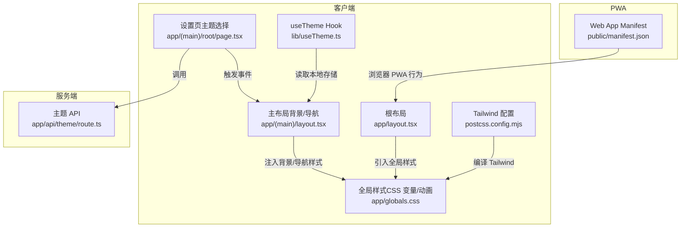
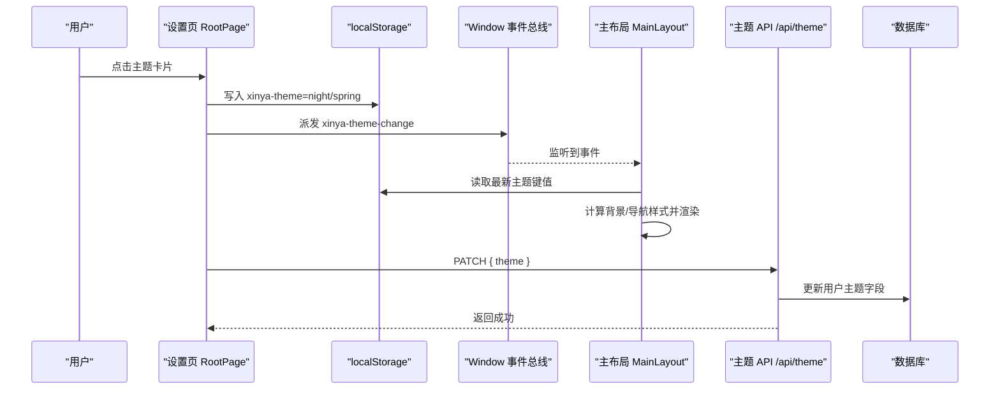
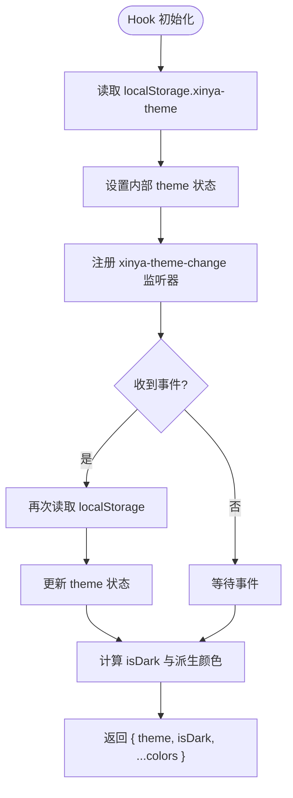
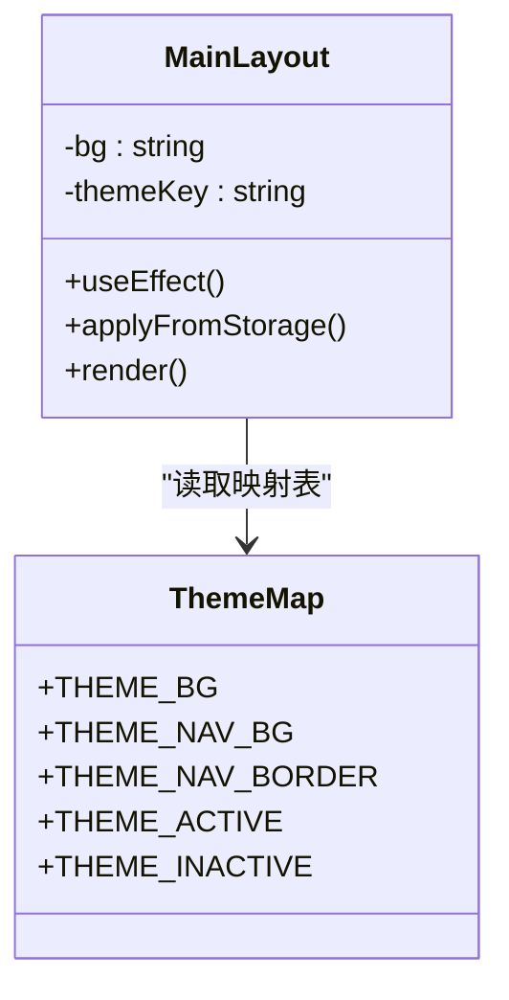
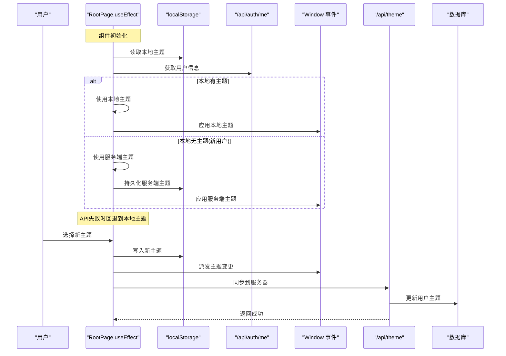
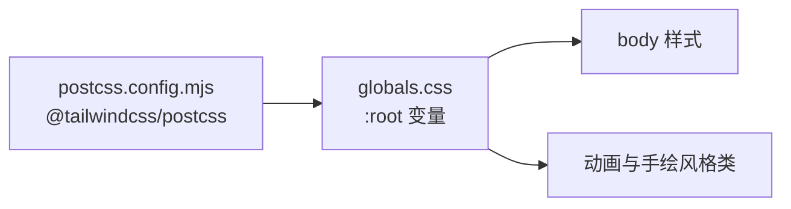
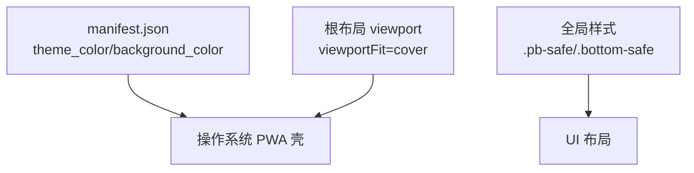
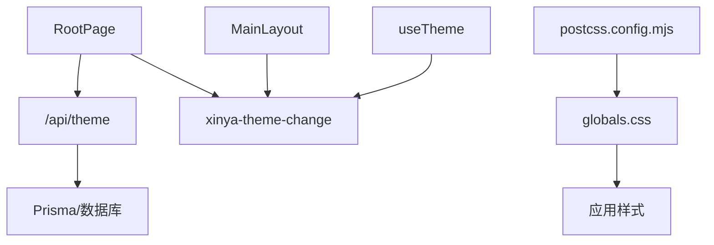

# 主题系统架构

<cite>
**本文引用的文件**   
- [useTheme.ts](file://lib/useTheme.ts)
- [globals.css](file://app/globals.css)
- [layout.tsx（根布局）](file://app/layout.tsx)
- [layout.tsx（主布局）](file://app/(main)/layout.tsx)
- [root/page.tsx（设置页）](file://app/(main)/root/page.tsx)
- [theme/route.ts（主题 API）](file://app/api/theme/route.ts)
- [manifest.json（PWA 清单）](file://public/manifest.json)
- [postcss.config.mjs（Tailwind 配置）](file://postcss.config.mjs)
- [暗色系修改经验总结.md](file://doc/暗色系修改经验总结.md)
</cite>

## 更新摘要
**变更内容**   
- 修复了根页面useEffect中无条件覆盖localStorage的问题
- 实现了本地偏好优先的服务端主题回退机制
- 增强了错误处理，API调用失败时回退到本地已有主题
- 优化了新用户首次访问的主题初始化流程

## 目录
1. [引言](#引言)
2. [项目结构](#项目结构)
3. [核心组件](#核心组件)
4. [架构总览](#架构总览)
5. [详细组件分析](#详细组件分析)
6. [依赖关系分析](#依赖关系分析)
7. [性能与加载策略](#性能与加载策略)
8. [故障排查指南](#故障排查指南)
9. [结论](#结论)
10. [附录：主题开发指南与最佳实践](#附录主题开发指南与最佳实践)

## 引言
本文件为心芽项目的主题系统架构设计文档，聚焦于基于 CSS 变量与 Tailwind CSS 的主题切换机制。文档将系统性阐述 useTheme Hook 的实现原理、主题状态管理、持久化存储与实时更新；说明亮色/暗色模式切换逻辑与自定义主题扩展方式；描述主题与组件的集成模式（样式隔离与动态样式应用）、PWA 主题适配与移动端显示优化；并提供主题开发指南、最佳实践以及性能优化建议。

## 项目结构
主题相关代码分布在客户端 Hook、全局样式、布局层、设置页与后端 API 中，形成"前端状态 + 全局样式 + 布局驱动 + 服务端持久化"的闭环。

图表来源
- [useTheme.ts:1-30](file://lib/useTheme.ts#L1-L30)
- [layout.tsx（根布局）:1-43](file://app/layout.tsx#L1-L43)
- [layout.tsx（主布局）:1-173](file://app/(main)/layout.tsx#L1-L173)
- [root/page.tsx:1-730](file://app/(main)/root/page.tsx#L1-L730)
- [globals.css:1-79](file://app/globals.css#L1-L79)
- [postcss.config.mjs:1-8](file://postcss.config.mjs#L1-L8)
- [theme/route.ts:1-15](file://app/api/theme/route.ts#L1-L15)
- [manifest.json:1-25](file://public/manifest.json#L1-L25)

章节来源
- [useTheme.ts:1-30](file://lib/useTheme.ts#L1-L30)
- [layout.tsx（根布局）:1-43](file://app/layout.tsx#L1-L43)
- [layout.tsx（主布局）:1-173](file://app/(main)/layout.tsx#L1-L173)
- [root/page.tsx:1-730](file://app/(main)/root/page.tsx#L1-L730)
- [globals.css:1-79](file://app/globals.css#L1-L79)
- [postcss.config.mjs:1-8](file://postcss.config.mjs#L1-L8)
- [theme/route.ts:1-15](file://app/api/theme/route.ts#L1-L15)
- [manifest.json:1-25](file://public/manifest.json#L1-L25)

## 核心组件
- useTheme Hook：提供当前主题键值、是否暗色及常用颜色派生值，监听跨组件主题变更事件并同步状态。
- 全局样式 globals.css：定义 CSS 变量与基础样式，作为主题变量的承载层。
- 主布局 MainLayout：负责页面背景、底部导航等全局视觉元素的主题渲染，响应主题变更事件。
- 设置页 RootPage：用户选择主题，写入本地存储，派发事件，并调用后端 API 持久化到数据库。
- 主题 API：校验主题键值，更新用户主题偏好至数据库。
- PWA manifest：定义应用名称、图标、启动 URL、主题色与背景色，适配移动端全屏体验。

章节来源
- [useTheme.ts:1-30](file://lib/useTheme.ts#L1-L30)
- [globals.css:1-79](file://app/globals.css#L1-L79)
- [layout.tsx（主布局）:1-173](file://app/(main)/layout.tsx#L1-L173)
- [root/page.tsx:1-730](file://app/(main)/root/page.tsx#L1-L730)
- [theme/route.ts:1-15](file://app/api/theme/route.ts#L1-L15)
- [manifest.json:1-25](file://public/manifest.json#L1-L25)

## 架构总览
主题系统采用"事件驱动 + 局部状态 + 全局样式"的模式：
- 状态源：localStorage 中的 xinya-theme 键值。
- 事件总线：window 自定义事件 xinya-theme-change。
- 全局样式：CSS 变量在 :root 下定义，由 Tailwind 编译后使用。
- 布局层：MainLayout 根据主题键值计算背景与导航样式。
- 服务端持久化：RootPage 通过 PATCH /api/theme 保存用户主题偏好。

图表来源
- [root/page.tsx:166-183](file://app/(main)/root/page.tsx#L166-L183)
- [layout.tsx（主布局）:36-59](file://app/(main)/layout.tsx#L36-L59)
- [theme/route.ts:5-14](file://app/api/theme/route.ts#L5-L14)

## 详细组件分析

### useTheme Hook 实现原理
- 初始化：从 localStorage 读取 xinya-theme，默认 spring。
- 事件同步：监听 window 的 xinya-theme-change 事件，重新读取并更新内部状态。
- 派生值：根据 isDark（night 时为暗色）计算常用颜色（卡片背景、边框、标题、辅助文字、输入框背景与边框）。
- 返回值：包含 theme、isDark 与各颜色变量，供组件直接使用。

图表来源
- [useTheme.ts:4-29](file://lib/useTheme.ts#L4-L29)

章节来源
- [useTheme.ts:1-30](file://lib/useTheme.ts#L1-L30)

### 主布局 MainLayout 主题驱动
- 初始化：仅在客户端 useEffect 中读取 URL 参数 theme（若存在则写入 localStorage 并清理 URL），再读取 localStorage 得到主题键值。
- 事件监听：订阅 xinya-theme-change，统一刷新背景与导航样式。
- 样式映射：通过 THEME_BG、THEME_NAV_BG、THEME_NAV_BORDER、THEME_ACTIVE、THEME_INACTIVE 等映射表，按主题键值计算样式。
- 渲染：在根容器 style 中注入背景色，并在底部导航中注入背景与边框色，配合 transition 实现平滑过渡。

图表来源
- [layout.tsx（主布局）:5-28](file://app/(main)/layout.tsx#L5-L28)
- [layout.tsx（主布局）:30-81](file://app/(main)/layout.tsx#L30-L81)

章节来源
- [layout.tsx（主布局）:1-173](file://app/(main)/layout.tsx#L1-L173)

### 设置页 RootPage 主题选择与持久化

**更新** 修复了主题初始化逻辑，实现了本地偏好优先的服务端主题回退机制

- 主题列表：内置春日萌芽与墨色幽微两套主题。
- 切换流程：
  - 立即写入 localStorage 并派发 xinya-theme-change，使布局与其他组件即时生效。
  - 调用 PATCH /api/theme 将主题保存到数据库，成功后提示"已切换"。
- 初始化逻辑（已优化）：
  - **本地优先原则**：当用户在其它页面已设置主题时，localStorage 值优先于服务端数据
  - **新用户处理**：仅在新用户首次访问且 localStorage 为空时使用服务端主题并持久化
  - **错误回退**：API 调用失败时回退到本地已有主题，确保用户体验不受影响

图表来源
- [root/page.tsx:105-134](file://app/(main)/root/page.tsx#L105-L134)
- [root/page.tsx:166-183](file://app/(main)/root/page.tsx#L166-L183)
- [theme/route.ts:5-14](file://app/api/theme/route.ts#L5-L14)

章节来源
- [root/page.tsx:105-134](file://app/(main)/root/page.tsx#L105-L134)
- [root/page.tsx:166-183](file://app/(main)/root/page.tsx#L166-L183)
- [theme/route.ts:1-15](file://app/api/theme/route.ts#L1-L15)

### 全局样式与 Tailwind 集成
- CSS 变量：在 :root 下定义主色、背景、文本、边框等变量，供全局样式与组件使用。
- 基础样式：body 背景与字体通过 CSS 变量控制，保证主题一致性。
- Tailwind：通过 @import "tailwindcss" 引入，postcss 插件启用 Tailwind 编译。
- 动画与手绘风格：提供若干关键帧动画与手绘风格类名，增强交互体验。

图表来源
- [globals.css:1-22](file://app/globals.css#L1-L22)
- [postcss.config.mjs:1-8](file://postcss.config.mjs#L1-L8)

章节来源
- [globals.css:1-79](file://app/globals.css#L1-L79)
- [postcss.config.mjs:1-8](file://postcss.config.mjs#L1-L8)

### PWA 主题适配与移动端显示优化
- Web App Manifest：定义 name、short_name、start_url、display、background_color、theme_color、orientation 与 icons，支持独立窗口与全屏体验。
- Viewport：在根布局中设置 viewportFit=cover，适配刘海屏与安全区域。
- 安全区域：在 globals.css 中提供 pb-safe 与 bottom-safe 类，避免内容被系统 UI 遮挡。

图表来源
- [manifest.json:1-25](file://public/manifest.json#L1-L25)
- [layout.tsx（根布局）:21-25](file://app/layout.tsx#L21-L25)
- [globals.css:76-79](file://app/globals.css#L76-L79)

章节来源
- [manifest.json:1-25](file://public/manifest.json#L1-L25)
- [layout.tsx（根布局）:1-43](file://app/layout.tsx#L1-L43)
- [globals.css:76-79](file://app/globals.css#L76-L79)

## 依赖关系分析
- 组件耦合：
  - RootPage 与 MainLayout 通过 window 事件解耦，降低直接依赖。
  - useTheme Hook 仅依赖 localStorage 与 window 事件，便于复用。
- 外部依赖：
  - Tailwind 通过 postcss 插件参与构建。
  - Next.js App Router 提供路由与元数据能力。
  - Prisma 用于持久化用户主题偏好。
- 潜在循环依赖：无直接循环导入；主题变更通过事件传播，避免组件间强耦合。

图表来源
- [root/page.tsx:166-183](file://app/(main)/root/page.tsx#L166-L183)
- [layout.tsx（主布局）:36-59](file://app/(main)/layout.tsx#L36-L59)
- [useTheme.ts:11-17](file://lib/useTheme.ts#L11-L17)
- [theme/route.ts:5-14](file://app/api/theme/route.ts#L5-L14)
- [postcss.config.mjs:1-8](file://postcss.config.mjs#L1-L8)

章节来源
- [root/page.tsx:166-183](file://app/(main)/root/page.tsx#L166-L183)
- [layout.tsx（主布局）:36-59](file://app/(main)/layout.tsx#L36-L59)
- [useTheme.ts:11-17](file://lib/useTheme.ts#L11-L17)
- [theme/route.ts:5-14](file://app/api/theme/route.ts#L5-L14)
- [postcss.config.mjs:1-8](file://postcss.config.mjs#L1-L8)

## 性能与加载策略
- 避免 SSR Hydration 不匹配：
  - 主布局初始状态使用默认亮色，所有主题读取与计算放在 useEffect 中执行，防止 SSR 阶段读取 localStorage 导致 hydration mismatch。
  - 参考经验文档中的正确方案与检查清单，确保首次渲染稳定。
- 减少重排与闪烁：
  - 使用 CSS transition 对背景与边框进行平滑过渡，避免突兀变化。
  - 将主题映射集中管理，避免在渲染路径中进行复杂计算。
- 事件驱动更新：
  - 通过 window 事件广播主题变更，避免层层 props 传递带来的额外渲染。
- Tailwind 按需编译：
  - 使用 @tailwindcss/postcss 插件，减少无用样式体积。
- PWA 缓存与离线：
  - 合理配置 manifest 与 Service Worker（如后续引入），提升首屏加载与离线体验。

章节来源
- [暗色系修改经验总结.md:1-238](file://doc/暗色系修改经验总结.md#L1-L238)
- [layout.tsx（主布局）:36-59](file://app/(main)/layout.tsx#L36-L59)
- [postcss.config.mjs:1-8](file://postcss.config.mjs#L1-L8)

## 故障排查指南
- 现象：切换暗色后刷新页面背景恢复亮色，但子组件保持暗色。
- 根因：SSR hydration 期间，useState 初始值与 localStorage 不一致导致 DOM 不匹配。
- 解决要点：
  - 不要在 useState 初始化时读取 localStorage，改用默认值。
  - 将主题读取与计算放入 useEffect，确保仅在客户端执行。
  - 监听 xinya-theme-change 事件，确保布局与子组件同步。
- 检查清单：
  - localStorage 中主题值是否正确？
  - 是否存在 IIFE 读取 localStorage 的情况？
  - useEffect 依赖数组是否过于频繁导致重复计算？
  - 是否有其他代码在 useEffect 之后覆盖了 bg state？
  - 清除 .next 缓存无效时，应优先检查代码逻辑而非缓存。

**新增问题**：主题初始化冲突
- 现象：用户在其他页面设置主题后，进入设置页主题被重置
- 根因：根页面useEffect无条件覆盖localStorage
- 解决方案：实现本地优先的服务端主题回退机制，确保用户偏好不被意外覆盖

章节来源
- [暗色系修改经验总结.md:1-238](file://doc/暗色系修改经验总结.md#L1-L238)
- [layout.tsx（主布局）:36-59](file://app/(main)/layout.tsx#L36-L59)
- [root/page.tsx:105-134](file://app/(main)/root/page.tsx#L105-L134)

## 结论
心芽主题系统以 useTheme Hook 为核心，结合全局 CSS 变量与 Tailwind 编译体系，在主布局层完成主题驱动的视觉渲染，并通过 window 事件实现跨组件实时同步。设置页负责用户选择与后端持久化，PWA manifest 与 viewport 配置保障移动端体验。整体架构清晰、解耦良好，具备可扩展性与可维护性。

**更新** 最新的持久化逻辑优化确保了用户主题的稳定性，避免了意外的主题重置问题，提升了用户体验的一致性。

## 附录：主题开发指南与最佳实践
- 新增主题步骤：
  - 在 RootPage 的主题列表中增加新主题项（key、label、sub、color、bg）。
  - 在主布局的 THEME_* 映射表中补充对应键值的样式。
  - 如需全局变量，可在 globals.css 的 :root 下添加新的 CSS 变量。
  - 在后端 API 的主题白名单中允许新 key（注意与前端保持一致）。
- 组件集成模式：
  - 使用 useTheme Hook 获取 isDark 与派生颜色，避免硬编码。
  - 对于布局级样式（背景、导航），在主布局中集中处理，保持样式隔离。
  - 通过 window 事件广播主题变更，避免 props 穿透。
- 移动端优化：
  - 使用 pb-safe 与 bottom-safe 类适配安全区域。
  - 在 manifest 中设置合适的 theme_color 与 background_color。
- 性能建议：
  - 避免在渲染路径中做复杂计算，尽量使用映射表与预计算值。
  - 使用 CSS transition 提升切换流畅度。
  - 遵循 SSR hydration 最佳实践，避免状态不一致导致的闪烁。
- **主题持久化最佳实践**：
  - 实现本地优先的服务端主题回退机制
  - 区分新用户首次访问与老用户访问的处理逻辑
  - 增强错误处理，确保API失败时的用户体验
  - 避免无条件覆盖用户本地偏好设置

章节来源
- [root/page.tsx:26-29](file://app/(main)/root/page.tsx#L26-L29)
- [layout.tsx（主布局）:5-28](file://app/(main)/layout.tsx#L5-L28)
- [globals.css:3-13](file://app/globals.css#L3-L13)
- [theme/route.ts:9-11](file://app/api/theme/route.ts#L9-L11)
- [manifest.json:7-8](file://public/manifest.json#L7-L8)
- [globals.css:76-79](file://app/globals.css#L76-L79)
- [root/page.tsx:105-134](file://app/(main)/root/page.tsx#L105-L134)