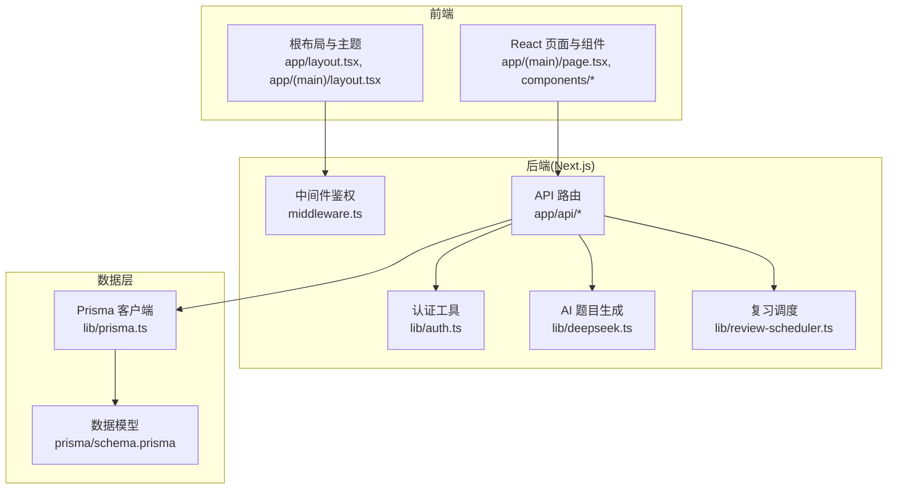
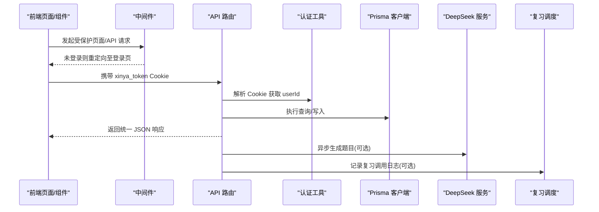
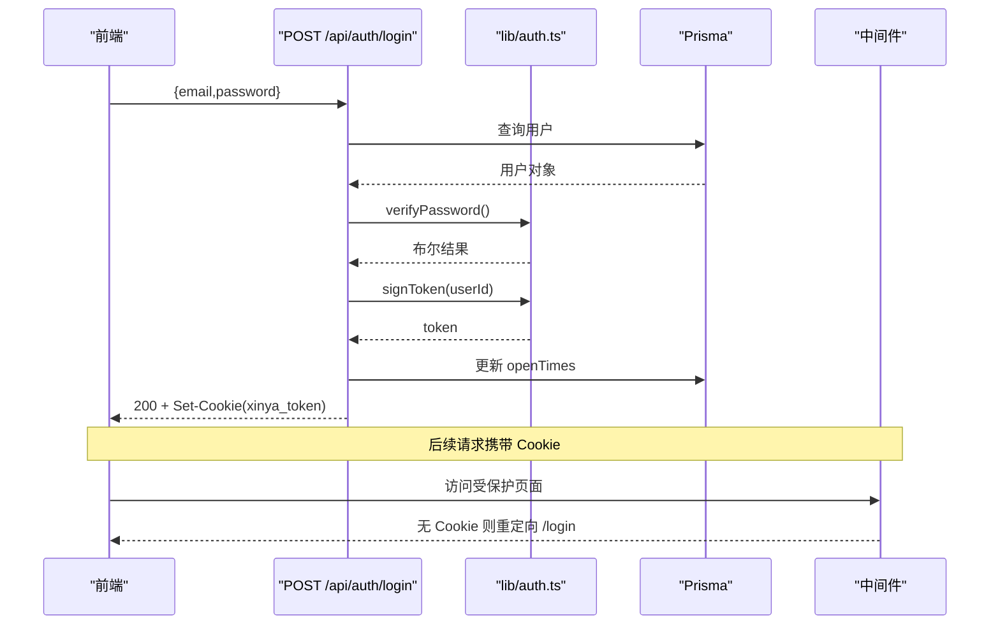
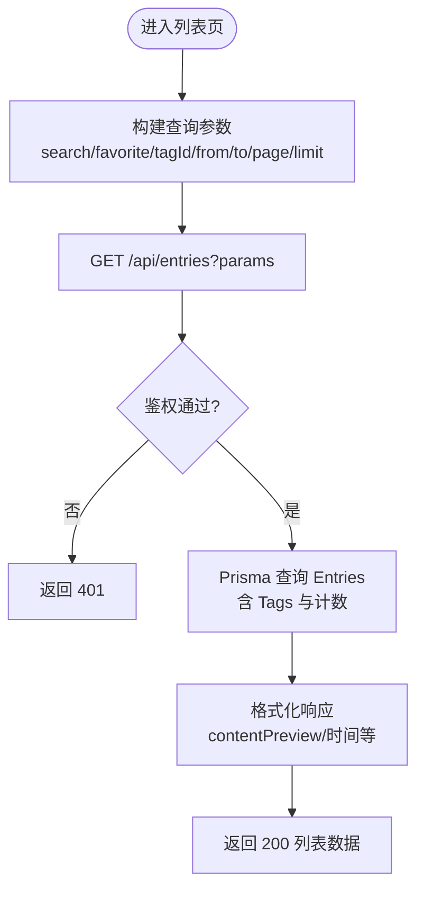
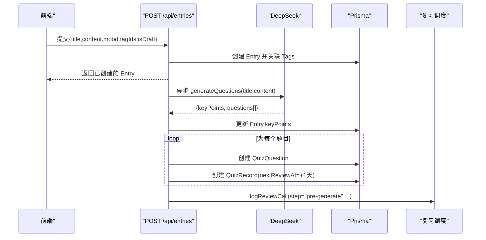
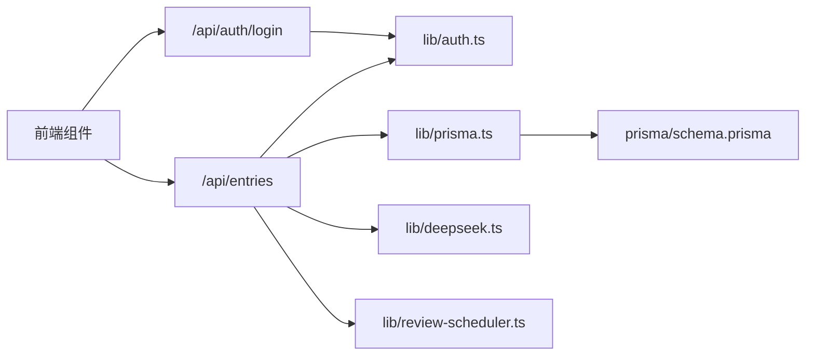

# 数据流架构设计

<cite>
**本文引用的文件**   
- [package.json](file://package.json)
- [prisma/schema.prisma](file://prisma/schema.prisma)
- [lib/prisma.ts](file://lib/prisma.ts)
- [middleware.ts](file://middleware.ts)
- [app/layout.tsx](file://app/layout.tsx)
- [app/(main)/layout.tsx](file://app/(main)/layout.tsx)
- [app/(main)/page.tsx](file://app/(main)/page.tsx)
- [components/EntryCard.tsx](file://components/EntryCard.tsx)
- [app/api/auth/login/route.ts](file://app/api/auth/login/route.ts)
- [lib/auth.ts](file://lib/auth.ts)
- [app/api/entries/route.ts](file://app/api/entries/route.ts)
- [app/api/entries/[id]/route.ts](file://app/api/entries/[id]/route.ts)
- [lib/deepseek.ts](file://lib/deepseek.ts)
- [lib/review-scheduler.ts](file://lib/review-scheduler.ts)
</cite>

## 目录
1. [引言](#引言)
2. [项目结构](#项目结构)
3. [核心组件](#核心组件)
4. [架构总览](#架构总览)
5. [详细组件分析](#详细组件分析)
6. [依赖关系分析](#依赖关系分析)
7. [性能考量](#性能考量)
8. [故障排查指南](#故障排查指南)
9. [结论](#结论)
10. [附录](#附录)

## 引言
本文件面向心芽项目的数据流与架构，系统性描述从前端 React 组件到 Next.js API 路由再到 PostgreSQL 数据库的完整数据流向。重点覆盖：
- 客户端状态管理与服务端同步机制（当前采用原生 fetch + 本地状态）
- API 路由层的数据处理流程（鉴权、校验、业务逻辑、响应格式化）
- 数据库连接管理与查询优化策略
- 缓存机制设计（浏览器缓存、服务端缓存、CDN 缓存协同）
- 数据一致性保证与错误处理策略
- 数据迁移与版本兼容性考虑

## 项目结构
本项目基于 Next.js App Router，前后端同仓：
- 前端页面与布局位于 app 目录下，使用“use client”组件进行交互
- API 路由位于 app/api 下，按功能域划分
- 数据库模型与迁移位于 prisma 目录
- 通用库位于 lib 目录（认证、AI 生成、复习调度等）



图表来源
- [app/(main)/page.tsx:1-405](file://app/(main)/page.tsx#L1-L405)
- [components/EntryCard.tsx:1-138](file://components/EntryCard.tsx#L1-L138)
- [app/layout.tsx:1-43](file://app/layout.tsx#L1-L43)
- [app/(main)/layout.tsx:1-173](file://app/(main)/layout.tsx#L1-L173)
- [middleware.ts:1-29](file://middleware.ts#L1-L29)
- [app/api/entries/route.ts:1-163](file://app/api/entries/route.ts#L1-L163)
- [app/api/entries/[id]/route.ts:1-95](file://app/api/entries/[id]/route.ts#L1-L95)
- [lib/auth.ts:1-56](file://lib/auth.ts#L1-L56)
- [lib/prisma.ts:1-14](file://lib/prisma.ts#L1-L14)
- [prisma/schema.prisma:1-209](file://prisma/schema.prisma#L1-L209)
- [lib/deepseek.ts:1-115](file://lib/deepseek.ts#L1-L115)
- [lib/review-scheduler.ts:1-225](file://lib/review-scheduler.ts#L1-L225)

章节来源
- [package.json:1-40](file://package.json#L1-L40)
- [app/layout.tsx:1-43](file://app/layout.tsx#L1-L43)
- [app/(main)/layout.tsx:1-173](file://app/(main)/layout.tsx#L1-L173)

## 核心组件
- 前端交互层
  - 列表页负责加载心得列表、筛选、分页、删除、收藏/置顶等交互，并通过原生 fetch 调用 API
  - EntryCard 组件封装单条心得展示与快捷操作（收藏、置顶、删除），在用户交互时立即乐观更新本地状态，失败回滚
- 认证与安全
  - 登录接口完成密码校验、签发 JWT，并设置 HttpOnly Cookie
  - 中间件对受保护页面进行重定向校验；API 通过 Cookie 解析当前用户 ID
- 数据访问层
  - Prisma Client 全局单例，开发环境输出 query/error/warn 日志，生产仅 error
  - 数据模型定义用户、心得、标签、分享、AI 洞察、成长日志、邮件令牌、魔法链接、测验题目与记录、用户设置、复习调用日志等
- AI 与复习
  - 创建心得后异步触发 DeepSeek 生成题目与要点，写入 QuizQuestion 与 QuizRecord
  - 今日拾遗卡片根据复习计划与答题记录动态选择待复习题目或提示生成新题

章节来源
- [app/(main)/page.tsx:1-405](file://app/(main)/page.tsx#L1-L405)
- [components/EntryCard.tsx:1-138](file://components/EntryCard.tsx#L1-L138)
- [app/api/auth/login/route.ts:1-39](file://app/api/auth/login/route.ts#L1-L39)
- [lib/auth.ts:1-56](file://lib/auth.ts#L1-L56)
- [lib/prisma.ts:1-14](file://lib/prisma.ts#L1-L14)
- [prisma/schema.prisma:1-209](file://prisma/schema.prisma#L1-L209)
- [lib/deepseek.ts:1-115](file://lib/deepseek.ts#L1-L115)
- [lib/review-scheduler.ts:1-225](file://lib/review-scheduler.ts#L1-L225)

## 架构总览
整体数据流遵循“前端请求 → 中间件鉴权 → API 路由处理 → Prisma 访问数据库 → 返回 JSON 响应”，并在关键路径引入外部服务（DeepSeek）与本地调度（复习）。



图表来源
- [middleware.ts:1-29](file://middleware.ts#L1-L29)
- [app/api/auth/login/route.ts:1-39](file://app/api/auth/login/route.ts#L1-L39)
- [lib/auth.ts:1-56](file://lib/auth.ts#L1-L56)
- [app/api/entries/route.ts:1-163](file://app/api/entries/route.ts#L1-L163)
- [lib/prisma.ts:1-14](file://lib/prisma.ts#L1-L14)
- [lib/deepseek.ts:1-115](file://lib/deepseek.ts#L1-L115)
- [lib/review-scheduler.ts:1-225](file://lib/review-scheduler.ts#L1-L225)

## 详细组件分析

### 认证与鉴权数据流
- 登录流程
  - 前端提交邮箱与密码
  - 后端校验参数、查找用户、验证邮箱是否已验证、比对密码哈希
  - 成功则签发 JWT，设置 HttpOnly Cookie，返回用户初始化信息
  - 失败返回相应错误码与消息
- 鉴权流程
  - 中间件对非静态资源与非 API 路径检查 Cookie，未登录重定向
  - API 路由通过工具函数读取 Cookie 并解析出 userId，作为后续权限判断依据



图表来源
- [app/api/auth/login/route.ts:1-39](file://app/api/auth/login/route.ts#L1-L39)
- [lib/auth.ts:1-56](file://lib/auth.ts#L1-L56)
- [middleware.ts:1-29](file://middleware.ts#L1-L29)

章节来源
- [app/api/auth/login/route.ts:1-39](file://app/api/auth/login/route.ts#L1-L39)
- [lib/auth.ts:1-56](file://lib/auth.ts#L1-L56)
- [middleware.ts:1-29](file://middleware.ts#L1-L29)

### 心得 CRUD 数据流
- 列表查询
  - 支持搜索、收藏过滤、标签过滤、时间范围、分页
  - 使用索引字段排序与过滤，返回精简预览内容
- 新建心得
  - 校验标题必填，自动关联默认标签
  - 成功后异步触发题目预生成（不阻塞响应）
- 详情/编辑/删除/部分更新
  - 严格限定可更新字段，避免越权修改
  - 返回统一数据结构



图表来源
- [app/(main)/page.tsx:1-405](file://app/(main)/page.tsx#L1-L405)
- [app/api/entries/route.ts:1-163](file://app/api/entries/route.ts#L1-L163)
- [app/api/entries/[id]/route.ts:1-95](file://app/api/entries/[id]/route.ts#L1-L95)

章节来源
- [app/(main)/page.tsx:1-405](file://app/(main)/page.tsx#L1-L405)
- [app/api/entries/route.ts:1-163](file://app/api/entries/route.ts#L1-L163)
- [app/api/entries/[id]/route.ts:1-95](file://app/api/entries/[id]/route.ts#L1-L95)

### 复习与 AI 生成数据流
- 预生成题目
  - 创建心得后异步调用 DeepSeek 生成题目与要点
  - 将 keyPoints 写回 Entry，批量创建 QuizQuestion 与 QuizRecord
  - 记录调用日志用于追踪成功率与问题数
- 今日拾遗卡片
  - 优先返回待复习题目（答错优先、久未复习优先）
  - 若无待复习题，返回未答题目记录
  - 若均无，返回尚未出题的心得以提示在线生成
  - 提交答案后按间隔算法更新下次复习时间



图表来源
- [app/api/entries/route.ts:1-163](file://app/api/entries/route.ts#L1-L163)
- [lib/deepseek.ts:1-115](file://lib/deepseek.ts#L1-L115)
- [lib/review-scheduler.ts:1-225](file://lib/review-scheduler.ts#L1-L225)

章节来源
- [app/api/entries/route.ts:1-163](file://app/api/entries/route.ts#L1-L163)
- [lib/deepseek.ts:1-115](file://lib/deepseek.ts#L1-L115)
- [lib/review-scheduler.ts:1-225](file://lib/review-scheduler.ts#L1-L225)

### 前端状态管理与同步模式
- 当前实现采用原生 fetch 配合 React useState 管理本地状态
- 乐观更新策略：
  - 收藏/置顶/删除等操作先更新本地状态，再发起网络请求
  - 失败时回滚本地状态并提示错误
- 建议引入 SWR 或 React Query 以获得：
  - 自动缓存、重试、后台刷新、去重与失效策略
  - 简化分页与增量更新的复杂度
  - 更好的错误边界与加载态管理

章节来源
- [components/EntryCard.tsx:1-138](file://components/EntryCard.tsx#L1-L138)
- [app/(main)/page.tsx:1-405](file://app/(main)/page.tsx#L1-L405)

## 依赖关系分析
- 模块耦合
  - API 路由强依赖 lib/auth 与 lib/prisma，弱依赖 lib/deepseek 与 lib/review-scheduler（异步）
  - 前端页面与组件强依赖 API 契约（统一 ok/data 结构）
- 外部依赖
  - @prisma/client 与 prisma 提供类型安全的数据访问
  - bcryptjs 与 jsonwebtoken 用于密码与令牌
  - nodemailer 用于邮件发送（未在本文展开）
  - react-hot-toast 用于前端提示



图表来源
- [app/api/entries/route.ts:1-163](file://app/api/entries/route.ts#L1-L163)
- [app/api/auth/login/route.ts:1-39](file://app/api/auth/login/route.ts#L1-L39)
- [lib/auth.ts:1-56](file://lib/auth.ts#L1-L56)
- [lib/prisma.ts:1-14](file://lib/prisma.ts#L1-L14)
- [prisma/schema.prisma:1-209](file://prisma/schema.prisma#L1-L209)
- [lib/deepseek.ts:1-115](file://lib/deepseek.ts#L1-L115)
- [lib/review-scheduler.ts:1-225](file://lib/review-scheduler.ts#L1-L225)

章节来源
- [package.json:1-40](file://package.json#L1-L40)

## 性能考量
- 数据库索引与查询优化
  - Entry 针对 userId+recordTime、userId+isTop、userId+isFavorite、userId+isDraft 建立索引，提升常见过滤与排序性能
  - Tag 针对 userId 建立索引，EntryTags 多对多查询更高效
  - QuizRecord 针对 userId+nextReviewAt、userId+questionId 建立索引，加速复习调度
  - InsightReport 唯一约束与索引避免重复报告并提升查询效率
- 连接池与日志
  - Prisma Client 全局单例减少连接开销
  - 开发环境开启 query/error/warn 日志便于定位慢查询
- 前端渲染与网络
  - 列表接口返回精简字段 contentPreview，降低传输体积
  - 分页限制 limit 上限，防止大结果集拖垮前端
- 外部服务
  - DeepSeek 调用设置超时与重试，避免长尾影响主流程
  - 预生成异步执行，不阻塞创建响应

章节来源
- [prisma/schema.prisma:1-209](file://prisma/schema.prisma#L1-L209)
- [lib/prisma.ts:1-14](file://lib/prisma.ts#L1-L14)
- [app/api/entries/route.ts:1-163](file://app/api/entries/route.ts#L1-L163)
- [lib/deepseek.ts:1-115](file://lib/deepseek.ts#L1-L115)

## 故障排查指南
- 常见问题定位
  - 登录失败：检查邮箱是否存在、是否已验证、密码是否正确；确认 Cookie 是否设置成功
  - 列表为空：检查筛选条件、时间范围、标签过滤；确认 isDraft 过滤逻辑
  - 题目未生成：查看 pre-generate 日志与 DeepSeek 返回；关注超时与 JSON 解析异常
  - 拾遗卡片不出现：检查用户设置 reviewEnabled 与 lastCardDate；确认是否有待复习或未答题目
- 错误处理策略
  - API 统一返回 ok 与 data/error 字段，前端据此显示 toast 与回滚状态
  - 中间件对未登录场景直接重定向，避免无效请求
  - 异步任务捕获异常并记录日志，不影响主流程

章节来源
- [app/api/auth/login/route.ts:1-39](file://app/api/auth/login/route.ts#L1-L39)
- [app/api/entries/route.ts:1-163](file://app/api/entries/route.ts#L1-L163)
- [lib/review-scheduler.ts:1-225](file://lib/review-scheduler.ts#L1-L225)
- [middleware.ts:1-29](file://middleware.ts#L1-L29)

## 结论
心芽项目采用 Next.js App Router 与 Prisma 的组合，实现了清晰的前后端数据流与良好的可扩展性。当前前端状态管理以原生 fetch 为主，建议逐步引入 SWR 或 React Query 以提升缓存与同步体验。数据库层面通过合理索引与分页控制保障性能，外部 AI 服务通过异步与超时重试增强稳定性。整体架构具备较好的可维护性与演进空间。

## 附录

### 数据模型概览
```mermaid
erDiagram
USER {
string id PK
string email UK
boolean isVerified
string theme
boolean onboardDone
int openTimes
datetime createdAt
datetime updatedAt
}
ENTRY {
string id PK
string userId FK
string title
text content
string keyPoints
string mood
datetime recordTime
boolean isTop
boolean isFavorite
boolean isDraft
datetime createdAt
datetime updatedAt
}
TAG {
string id PK
string userId FK
string name
boolean isDefault
datetime createdAt
}
SHARE {
string id PK
string userId FK
string token UK
datetime expiresAt
string scope
string[] tagIds
boolean isActive
datetime createdAt
}
AIINSIGHT {
string id PK
string userId FK
string content
int triggerCount
boolean isRead
datetime createdAt
}
INSIGHTREPORT {
string id PK
string userId FK
string type
datetime periodStart
datetime periodEnd
json content
datetime createdAt
}
GROWTHLOG {
string id PK
string userId FK
string version
string title
string content
datetime logDate
datetime createdAt
}
EMAILTOKEN {
string id PK
string userId FK
string token UK
string type
datetime expiresAt
boolean used
datetime createdAt
}
MAGICLINK {
string id PK
string email
string token UK
datetime expiresAt
boolean used
datetime createdAt
}
QUIZQUESTION {
string id PK
string entryId FK
string question
string type
json options
json answer
string explanation
int angle
datetime createdAt
}
QUIZRECORD {
string id PK
string userId FK
string questionId FK
string entryId FK
boolean correct
json userAnswer
int answerCount
datetime answeredAt
datetime nextReviewAt
int streak
}
USERSETTING {
string id PK
string userId FK UK
boolean reviewEnabled
string lastCardDate
string lastQuestionId
}
REVIEWCALLLOG {
string id PK
string userId FK
string entryId FK
string step
boolean success
int questionCount
string errorMsg
datetime createdAt
}
USER ||--o{ ENTRY : "拥有"
USER ||--o{ TAG : "拥有"
USER ||--o{ SHARE : "拥有"
USER ||--o{ AIINSIGHT : "拥有"
USER ||--o{ INSIGHTREPORT : "拥有"
USER ||--o{ GROWTHLOG : "拥有"
USER ||--o{ EMAILTOKEN : "拥有"
USER ||--o| USERSETTING : "配置"
ENTRY ||--o{ QUIZQUESTION : "包含"
USER ||--o{ QUIZRECORD : "答题"
QUIZQUESTION ||--o{ QUIZRECORD : "被回答"
ENTRY ||--o{ QUIZRECORD : "关联"
USER ||--o{ REVIEWCALLLOG : "调用日志"
```

图表来源
- [prisma/schema.prisma:1-209](file://prisma/schema.prisma#L1-L209)

### 缓存机制设计与建议
- 浏览器缓存
  - 当前未启用 SWR/React Query，建议引入以实现：
    - 列表数据的短期缓存与后台刷新
    - 表单提交后的缓存失效与重新拉取
    - 错误重试与离线降级
- 服务端缓存
  - 可在 API 层增加 Redis 缓存热点数据（如今日速览、热门条目）
  - 对 AI 生成的题目与要点做短时缓存，避免重复计算
- CDN 缓存
  - 静态资源（manifest、图标、样式）可通过 CDN 缓存
  - API 响应一般不建议 CDN 缓存，除非明确幂等且允许陈旧数据

[本节为概念性说明，无需源码引用]

### 数据一致性与事务
- 心得创建与标签关联使用 Prisma 的 connect/set 语义，确保原子性
- 预生成题目与要点更新分步执行，必要时可使用事务包裹以保证一致性
- 复习记录更新采用幂等字段（answerCount 自增）避免重复提交导致不一致

章节来源
- [app/api/entries/route.ts:1-163](file://app/api/entries/route.ts#L1-L163)
- [lib/review-scheduler.ts:1-225](file://lib/review-scheduler.ts#L1-L225)

### 数据迁移与版本兼容
- 使用 Prisma Migrate 管理数据库变更
- package.json 脚本提供 db:deploy 与 postinstall 生成客户端
- schema 中通过 unique/index 约束与默认值保障向后兼容

章节来源
- [package.json:1-40](file://package.json#L1-L40)
- [prisma/schema.prisma:1-209](file://prisma/schema.prisma#L1-L209)