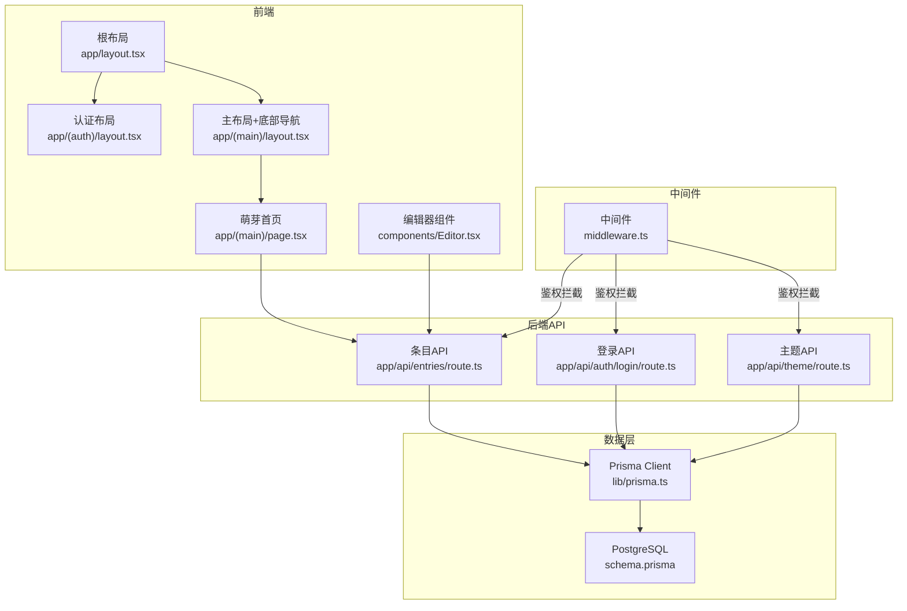
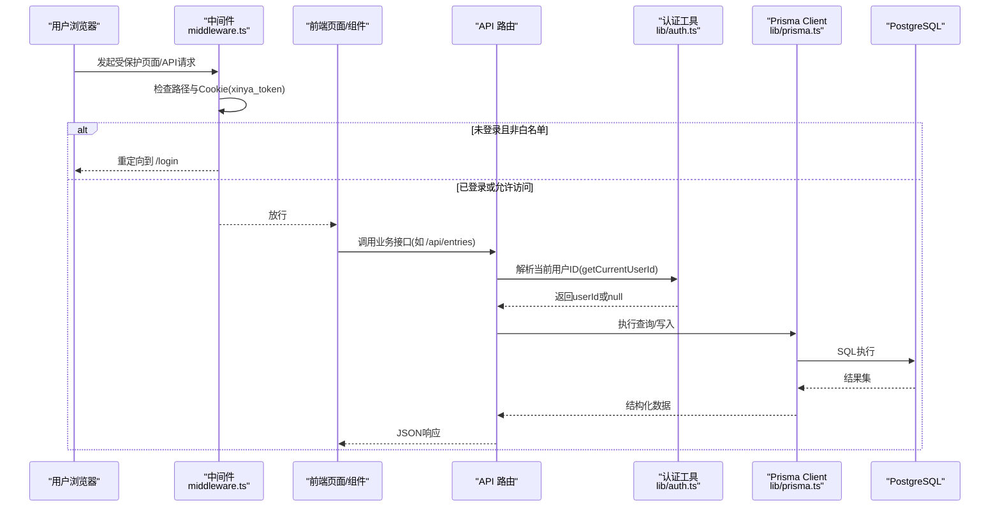
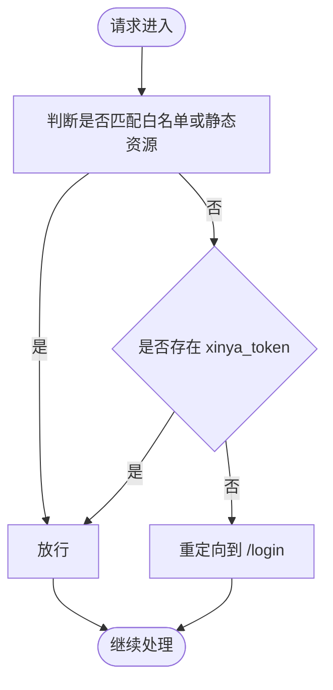
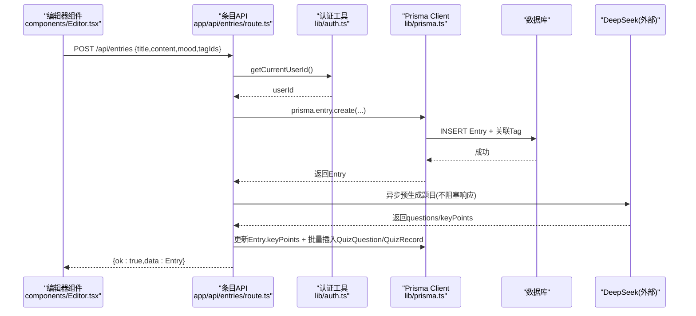
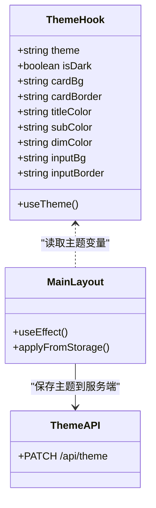
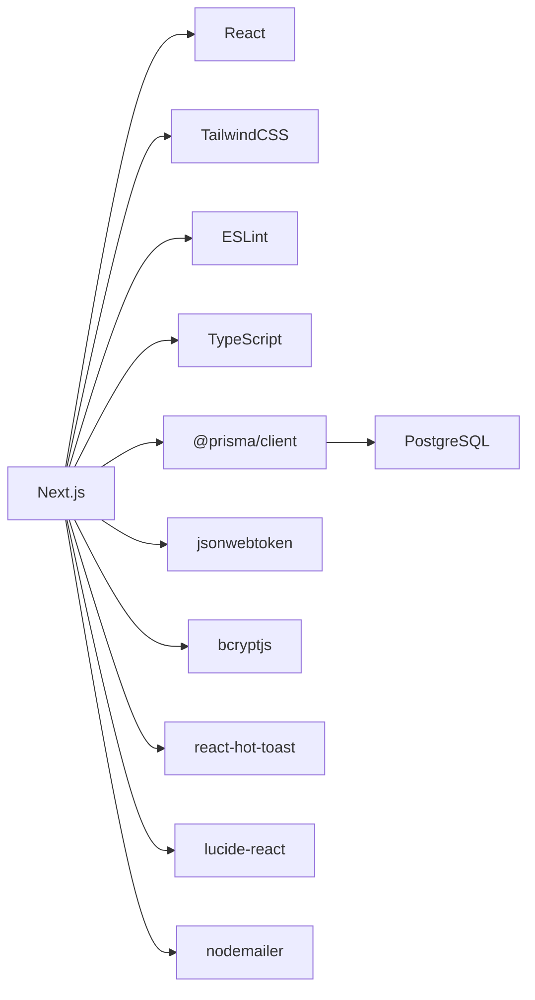

# 架构设计

<cite>
**本文引用的文件**   
- [app/layout.tsx](file://app/layout.tsx)
- [middleware.ts](file://middleware.ts)
- [lib/auth.ts](file://lib/auth.ts)
- [lib/useTheme.ts](file://lib/useTheme.ts)
- [prisma/schema.prisma](file://prisma/schema.prisma)
- [app/(auth)/layout.tsx](file://app/(auth)/layout.tsx)
- [app/(main)/layout.tsx](file://app/(main)/layout.tsx)
- [app/api/auth/login/route.ts](file://app/api/auth/login/route.ts)
- [app/api/theme/route.ts](file://app/api/theme/route.ts)
- [components/Editor.tsx](file://components/Editor.tsx)
- [app/api/entries/route.ts](file://app/api/entries/route.ts)
- [lib/prisma.ts](file://lib/prisma.ts)
- [package.json](file://package.json)
- [next.config.ts](file://next.config.ts)
- [app/(main)/page.tsx](file://app/(main)/page.tsx)
</cite>

## 目录
1. [简介](#简介)
2. [项目结构](#项目结构)
3. [核心组件](#核心组件)
4. [架构总览](#架构总览)
5. [详细组件分析](#详细组件分析)
6. [依赖分析](#依赖分析)
7. [性能考虑](#性能考虑)
8. [故障排查指南](#故障排查指南)
9. [结论](#结论)
10. [附录](#附录)

## 简介
本文件为心芽项目的全面架构设计文档，围绕 Next.js App Router 的整体架构模式展开，涵盖路由组织、布局嵌套与页面分组策略；中间件系统的实现原理（认证保护、请求拦截与全局逻辑）；前后端数据流（React 组件状态 → API 路由 → Prisma → PostgreSQL）；组件化架构与状态管理；主题系统的全局状态机制；系统边界与外部服务集成；以及性能优化与缓存策略。

## 项目结构
- 应用根布局：定义站点元信息、PWA manifest、图标与全局通知容器。
- 路由分组：
  - (auth)：登录、注册、邮箱验证、找回密码等认证相关页面，使用统一居中布局。
  - (main)：主应用入口与底部导航，包含萌芽、枝叶、年轮、根系等模块。
  - entry：条目编辑与查看。
  - api：服务端 API 路由，按功能域划分（auth、entries、tags、review、theme 等）。
- 共享库：
  - lib/auth.ts：密码加解密、JWT 签发与校验、当前用户解析、Cookie 配置。
  - lib/prisma.ts：Prisma Client 单例与日志级别控制。
  - lib/useTheme.ts：客户端主题 Hook，基于 localStorage 持久化与事件同步。
- 数据库：Prisma Schema 定义 User、Entry、Tag、Share、AIInsight、InsightReport、GrowthLog、EmailToken、MagicLink、QuizQuestion、QuizRecord、UserSetting、ReviewCallLog 等模型。

图示来源
- [app/layout.tsx:1-43](file://app/layout.tsx#L1-L43)
- [app/(auth)/layout.tsx:1-18](file://app/(auth)/layout.tsx#L1-L18)
- [app/(main)/layout.tsx:1-173](file://app/(main)/layout.tsx#L1-L173)
- [app/(main)/page.tsx:1-405](file://app/(main)/page.tsx#L1-L405)
- [components/Editor.tsx:1-192](file://components/Editor.tsx#L1-L192)
- [middleware.ts:1-29](file://middleware.ts#L1-L29)
- [app/api/entries/route.ts:1-163](file://app/api/entries/route.ts#L1-L163)
- [app/api/auth/login/route.ts:1-39](file://app/api/auth/login/route.ts#L1-L39)
- [app/api/theme/route.ts:1-15](file://app/api/theme/route.ts#L1-L15)
- [lib/prisma.ts:1-14](file://lib/prisma.ts#L1-L14)
- [prisma/schema.prisma:1-209](file://prisma/schema.prisma#L1-L209)

章节来源
- [app/layout.tsx:1-43](file://app/layout.tsx#L1-L43)
- [app/(auth)/layout.tsx:1-18](file://app/(auth)/layout.tsx#L1-L18)
- [app/(main)/layout.tsx:1-173](file://app/(main)/layout.tsx#L1-L173)
- [middleware.ts:1-29](file://middleware.ts#L1-L29)
- [app/api/entries/route.ts:1-163](file://app/api/entries/route.ts#L1-L163)
- [app/api/auth/login/route.ts:1-39](file://app/api/auth/login/route.ts#L1-L39)
- [app/api/theme/route.ts:1-15](file://app/api/theme/route.ts#L1-L15)
- [lib/prisma.ts:1-14](file://lib/prisma.ts#L1-L14)
- [prisma/schema.prisma:1-209](file://prisma/schema.prisma#L1-L209)

## 核心组件
- 根布局 app/layout.tsx
  - 职责：站点元信息、PWA 配置、全局 Toast 容器挂载。
  - 影响范围：所有页面共享的 HTML 结构与基础样式注入。
- 认证布局 app/(auth)/layout.tsx
  - 职责：统一的认证页视觉框架（居中、渐变背景、Logo 区域）。
  - 影响范围：(auth) 分组下的所有子页面。
- 主布局 app/(main)/layout.tsx
  - 职责：主应用壳、主题初始化与切换、底部导航栏、活跃路由高亮。
  - 影响范围：(main) 分组下的所有子页面。
- 编辑器组件 components/Editor.tsx
  - 职责：富文本编辑、心情选择、标签管理与创建、保存/更新条目、调用 /api/entries。
  - 影响范围：entry/new 与 entry/[id] 页面。
- 萌芽首页 app/(main)/page.tsx
  - 职责：今日速览、拾遗卡片、搜索与筛选、分页加载、收藏/置顶/删除操作。
  - 影响范围：主入口列表展示与交互。

章节来源
- [app/layout.tsx:1-43](file://app/layout.tsx#L1-L43)
- [app/(auth)/layout.tsx:1-18](file://app/(auth)/layout.tsx#L1-L18)
- [app/(main)/layout.tsx:1-173](file://app/(main)/layout.tsx#L1-L173)
- [components/Editor.tsx:1-192](file://components/Editor.tsx#L1-L192)
- [app/(main)/page.tsx:1-405](file://app/(main)/page.tsx#L1-L405)

## 架构总览
整体采用 Next.js App Router 的分层架构：
- 表现层：React 组件与页面，负责 UI 渲染与用户交互。
- 路由与布局层：App Router 的路由组与嵌套布局，提供页面级复用与权限拦截前置点。
- 中间件层：统一鉴权与请求过滤，保障受保护资源访问安全。
- API 层：Next.js Route Handlers，承载业务逻辑与数据聚合。
- 数据层：Prisma Client 作为 ORM，连接 PostgreSQL。
- 外部服务：邮件发送、AI 生成题目（DeepSeek）等通过异步任务或独立函数调用。

图示来源
- [middleware.ts:1-29](file://middleware.ts#L1-L29)
- [lib/auth.ts:1-56](file://lib/auth.ts#L1-L56)
- [app/api/entries/route.ts:1-163](file://app/api/entries/route.ts#L1-L163)
- [lib/prisma.ts:1-14](file://lib/prisma.ts#L1-L14)
- [prisma/schema.prisma:1-209](file://prisma/schema.prisma#L1-L209)

## 详细组件分析

### 路由组织与布局嵌套
- 路由分组
  - (auth)：集中处理认证流程页面，配合中间件白名单放行。
  - (main)：主应用壳，内置底部导航与主题初始化。
  - entry：条目编辑与查看，复用主布局。
- 布局嵌套
  - 根布局 app/layout.tsx 提供全局元信息与 Toaster。
  - (auth)/layout.tsx 与 (main)/layout.tsx 分别提供不同场景的布局包裹。
- 页面分组策略
  - 以“功能域”为维度进行路由分组，便于权限控制与视觉风格隔离。

章节来源
- [app/layout.tsx:1-43](file://app/layout.tsx#L1-L43)
- [app/(auth)/layout.tsx:1-18](file://app/(auth)/layout.tsx#L1-L18)
- [app/(main)/layout.tsx:1-173](file://app/(main)/layout.tsx#L1-L173)

### 中间件系统与认证保护
- 认证策略
  - Cookie 名称：xinya_token，由登录接口设置。
  - 白名单路径：/login、/register、/verify-email、/forgot-password、/reset-password、/onboard、/showcase。
  - 未携带有效 token 的非白名单请求将被重定向至 /login。
- 匹配规则
  - 排除静态资源与 favicon，仅对业务路径生效。
- 与 API 层的协同
  - API 路由内部再次校验当前用户身份，确保服务端侧的安全兜底。

图示来源
- [middleware.ts:1-29](file://middleware.ts#L1-L29)
- [lib/auth.ts:1-56](file://lib/auth.ts#L1-L56)

章节来源
- [middleware.ts:1-29](file://middleware.ts#L1-L29)
- [lib/auth.ts:1-56](file://lib/auth.ts#L1-L56)

### 前后端数据流架构
- 典型流程（以“新建条目”为例）
  - 前端 Editor 组件收集标题、内容、心情、标签等状态。
  - 调用 POST /api/entries，服务端校验用户身份并写入 Entry 与 Tag 关联。
  - 成功后触发异步预生成题目（DeepSeek），将要点与问题落库，并记录 Review 调用日志。
- 列表加载流程
  - 前端根据搜索、收藏、时间范围等条件构造查询参数。
  - GET /api/entries 返回分页数据与总数，前端维护本地列表与加载更多状态。

图示来源
- [components/Editor.tsx:1-192](file://components/Editor.tsx#L1-L192)
- [app/api/entries/route.ts:1-163](file://app/api/entries/route.ts#L1-L163)
- [lib/auth.ts:1-56](file://lib/auth.ts#L1-L56)
- [lib/prisma.ts:1-14](file://lib/prisma.ts#L1-L14)
- [prisma/schema.prisma:1-209](file://prisma/schema.prisma#L1-L209)

章节来源
- [components/Editor.tsx:1-192](file://components/Editor.tsx#L1-L192)
- [app/api/entries/route.ts:1-163](file://app/api/entries/route.ts#L1-L163)
- [lib/auth.ts:1-56](file://lib/auth.ts#L1-L56)
- [lib/prisma.ts:1-14](file://lib/prisma.ts#L1-L14)
- [prisma/schema.prisma:1-209](file://prisma/schema.prisma#L1-L209)

### 组件化架构与状态管理
- 组件组织
  - 页面级组件位于 app 目录下，按路由分组。
  - 可复用 UI 组件集中于 components 目录（如 Editor、EntryCard、DeleteDialog、SharePanel、review-card）。
- 状态管理模式
  - 页面内状态：useState/useEffect 管理列表、分页、筛选、弹窗等。
  - 跨组件状态：通过 props 回调与局部状态提升（如收藏/置顶在父组件集中处理）。
  - 全局状态：主题通过 useTheme Hook 与 localStorage 持久化，并通过自定义事件同步多组件。

章节来源
- [components/Editor.tsx:1-192](file://components/Editor.tsx#L1-L192)
- [app/(main)/page.tsx:1-405](file://app/(main)/page.tsx#L1-L405)
- [lib/useTheme.ts:1-30](file://lib/useTheme.ts#L1-L30)

### 主题系统的全局状态管理
- 存储与同步
  - 使用 localStorage 持久化主题键值（spring/night 等）。
  - 监听 window 自定义事件 xinya-theme-change 实现多组件同步。
- 主题色计算
  - 根据 isDark 派生卡片背景、边框、标题与输入框颜色等变量。
- 服务端主题持久化
  - 主题变更通过 PATCH /api/theme 保存到 User.theme，供后续会话恢复。

图示来源
- [lib/useTheme.ts:1-30](file://lib/useTheme.ts#L1-L30)
- [app/(main)/layout.tsx:1-173](file://app/(main)/layout.tsx#L1-L173)
- [app/api/theme/route.ts:1-15](file://app/api/theme/route.ts#L1-L15)

章节来源
- [lib/useTheme.ts:1-30](file://lib/useTheme.ts#L1-L30)
- [app/(main)/layout.tsx:1-173](file://app/(main)/layout.tsx#L1-L173)
- [app/api/theme/route.ts:1-15](file://app/api/theme/route.ts#L1-L15)

### 系统边界与外部服务集成
- 外部服务
  - DeepSeek：用于条目内容的智能提问与要点提取，采用异步预生成，避免阻塞主响应。
  - 邮件服务：通过 nodemailer 实现验证码、重置密码等邮件发送（具体实现不在本次分析范围内）。
- 边界定义
  - 认证边界：中间件与服务端双重校验，确保未授权访问被拦截。
  - 数据边界：Prisma Schema 明确实体关系与索引，保证数据一致性与查询性能。

章节来源
- [app/api/entries/route.ts:1-163](file://app/api/entries/route.ts#L1-L163)
- [prisma/schema.prisma:1-209](file://prisma/schema.prisma#L1-L209)

## 依赖分析
- 运行时依赖
  - next、react、react-dom：前端框架与运行时。
  - @prisma/client、prisma：ORM 与迁移工具。
  - bcryptjs、jsonwebtoken：密码哈希与 JWT。
  - react-hot-toast：全局提示。
  - lucide-react：图标库。
  - nodemailer：邮件发送。
- 开发依赖
  - tailwindcss、@tailwindcss/postcss：样式方案。
  - eslint、eslint-config-next：代码规范。
  - typescript：类型系统。

图示来源
- [package.json:1-40](file://package.json#L1-L40)
- [lib/prisma.ts:1-14](file://lib/prisma.ts#L1-L14)
- [lib/auth.ts:1-56](file://lib/auth.ts#L1-L56)
- [app/layout.tsx:1-43](file://app/layout.tsx#L1-L43)

章节来源
- [package.json:1-40](file://package.json#L1-L40)
- [lib/prisma.ts:1-14](file://lib/prisma.ts#L1-L14)
- [lib/auth.ts:1-56](file://lib/auth.ts#L1-L56)
- [app/layout.tsx:1-43](file://app/layout.tsx#L1-L43)

## 性能考虑
- 列表分页与增量加载
  - 通过 page/limit 参数控制分页，前端按需加载更多，减少首屏负载。
- 查询优化
  - 服务端使用 Prisma 的 include/select 精确字段，避免冗余数据传输。
  - 针对常用查询建立索引（如 Entry.userId+recordTime、isFavorite、isDraft 等）。
- 异步任务
  - AI 预生成题目采用异步执行，不阻塞主响应，降低端到端延迟。
- 主题切换
  - 主题变量在客户端计算，避免频繁网络请求；服务端仅持久化主题键值。
- 构建与运行
  - 生产环境关闭 Prisma 调试日志，减少 I/O 开销。

[本节为通用性能建议，无需特定文件引用]

## 故障排查指南
- 登录失败
  - 检查邮箱与密码是否正确，确认用户是否完成邮箱验证。
  - 查看登录接口返回的错误码与消息，定位是账号不存在、密码错误或未验证。
- 鉴权异常
  - 确认 Cookie xinya_token 是否存在且未过期。
  - 检查中间件 matcher 是否误拦截了静态资源或 API。
- 主题不同步
  - 检查 localStorage 中 xinya-theme 的值。
  - 确认 window 事件 xinya-theme-change 是否正常触发与监听。
- 条目保存失败
  - 检查标题是否为空、网络是否异常。
  - 查看服务端日志与 Prisma 错误输出，确认数据库连接与约束。

章节来源
- [app/api/auth/login/route.ts:1-39](file://app/api/auth/login/route.ts#L1-L39)
- [middleware.ts:1-29](file://middleware.ts#L1-L29)
- [lib/useTheme.ts:1-30](file://lib/useTheme.ts#L1-L30)
- [components/Editor.tsx:1-192](file://components/Editor.tsx#L1-L192)

## 结论
心芽项目基于 Next.js App Router 构建了清晰的前后端分层架构，通过路由分组与布局嵌套实现了良好的可维护性与扩展性。中间件与 API 层的双重鉴权保障了安全性；Prisma 与 PostgreSQL 提供了稳定的数据层支撑；主题系统与组件化设计提升了用户体验与开发效率。结合分页、异步任务与索引优化，系统在性能与可用性方面具备良好基础。

[本节为总结性内容，无需特定文件引用]

## 附录
- 关键环境变量
  - DATABASE_URL：数据库连接字符串。
  - JWT_SECRET：JWT 签名密钥（生产环境务必替换）。
- 部署脚本与进程管理
  - deploy.sh、ecosystem.config.js 用于部署与 PM2 进程管理。
- 配置文件
  - next.config.ts：Next.js 配置占位，可按需扩展。

章节来源
- [package.json:1-40](file://package.json#L1-L40)
- [next.config.ts:1-8](file://next.config.ts#L1-L8)