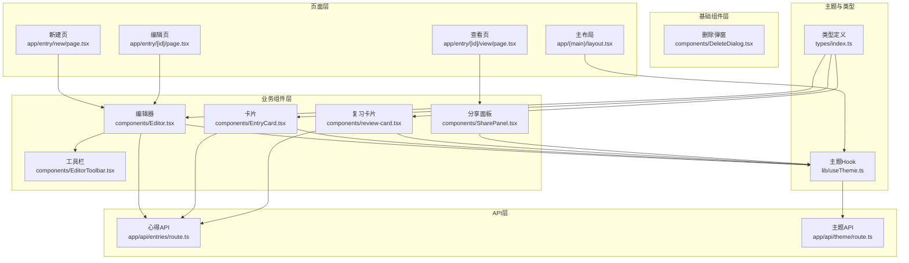
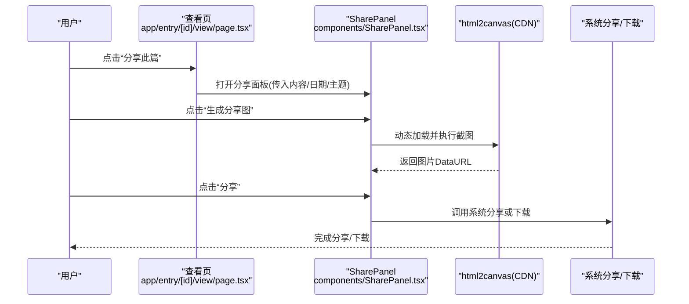
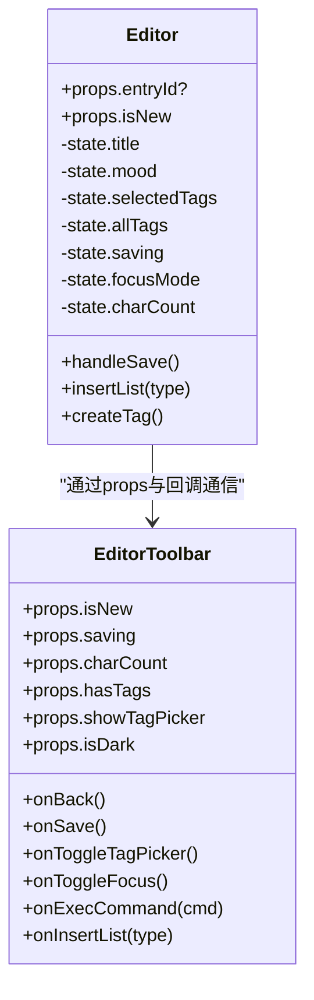
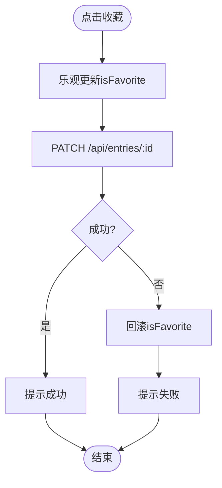
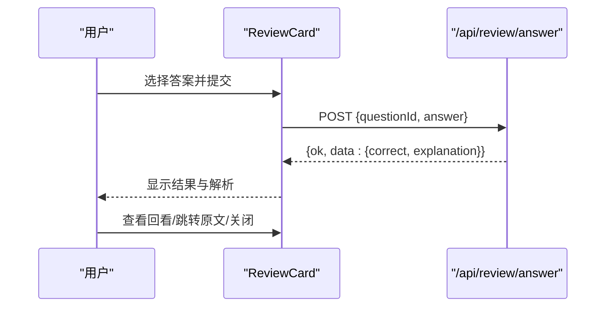
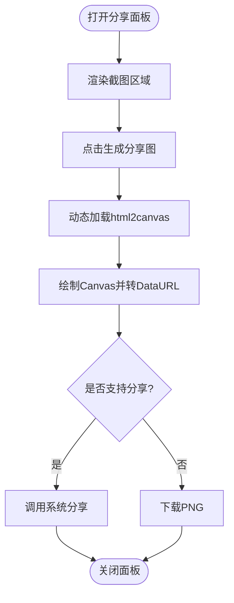
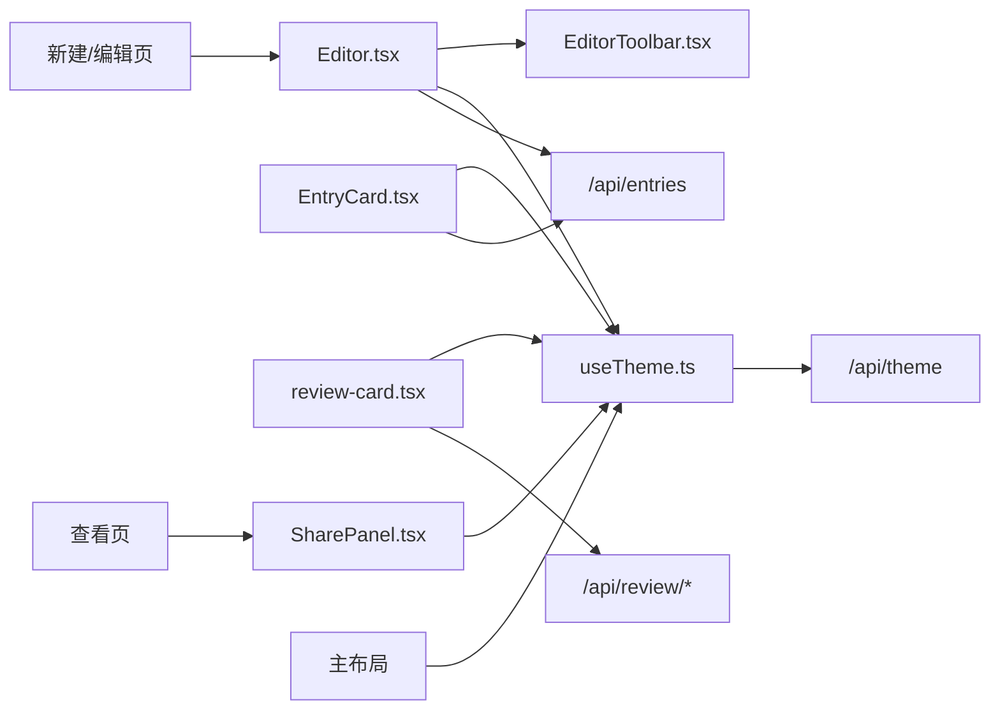

# 组件架构设计

<cite>
**本文引用的文件**   
- [Editor.tsx](file://components/Editor.tsx)
- [EditorToolbar.tsx](file://components/EditorToolbar.tsx)
- [EntryCard.tsx](file://components/EntryCard.tsx)
- [DeleteDialog.tsx](file://components/DeleteDialog.tsx)
- [SharePanel.tsx](file://components/SharePanel.tsx)
- [review-card.tsx](file://components/review-card.tsx)
- [useTheme.ts](file://lib/useTheme.ts)
- [index.ts](file://types/index.ts)
- [page.tsx（编辑）](file://app/entry/[id]/page.tsx)
- [page.tsx（新建）](file://app/entry/new/page.tsx)
- [page.tsx（查看）](file://app/entry/[id]/view/page.tsx)
- [layout.tsx（主布局）](file://app/(main)/layout.tsx)
- [route.ts（心得列表/创建）](file://app/api/entries/route.ts)
- [route.ts（主题）](file://app/api/theme/route.ts)
</cite>

## 目录
1. [简介](#简介)
2. [项目结构](#项目结构)
3. [核心组件](#核心组件)
4. [架构总览](#架构总览)
5. [详细组件分析](#详细组件分析)
6. [依赖关系分析](#依赖关系分析)
7. [性能考量](#性能考量)
8. [故障排查指南](#故障排查指南)
9. [结论](#结论)
10. [附录](#附录)

## 简介
本文件面向心芽项目的 React 组件体系，系统化阐述分层架构、职责划分、通信模式、可复用性原则、状态管理策略、主题集成方式、测试与性能优化建议，以及文档化与版本管理的最佳实践。目标是帮助开发者快速理解并高质量地扩展与维护现有组件。

## 项目结构
- 组件位于 components 目录，按“基础/业务/页面”三层组织：
  - 基础组件：无业务语义的 UI 单元，如 DeleteDialog。
  - 业务组件：封装具体领域能力，如 Editor、EntryCard、SharePanel、ReviewCard。
  - 页面组件：路由级容器，负责数据获取、组合业务组件与导航。
- 主题与类型定义：
  - lib/useTheme.ts 提供主题 Hook，供各组件消费。
  - types/index.ts 统一数据类型与接口契约。
- 页面与路由：
  - app/entry/new/page.tsx 与 app/entry/[id]/page.tsx 作为编辑器入口。
  - app/entry/[id]/view/page.tsx 为详情查看页。
  - app/(main)/layout.tsx 为主布局与底部导航。
- API 层：
  - app/api/entries/route.ts 提供心得列表与创建等接口。
  - app/api/theme/route.ts 提供主题持久化接口。

图表来源
- [page.tsx（新建）:1-5](file://app/entry/new/page.tsx#L1-L5)
- [page.tsx（编辑）:1-9](file://app/entry/[id]/page.tsx#L1-L9)
- [page.tsx（查看）:1-245](file://app/entry/[id]/view/page.tsx#L1-L245)
- [layout.tsx（主布局）](file://app/(main)/layout.tsx#L1-L173)
- [Editor.tsx:1-192](file://components/Editor.tsx#L1-L192)
- [EditorToolbar.tsx:1-78](file://components/EditorToolbar.tsx#L1-L78)
- [EntryCard.tsx:1-138](file://components/EntryCard.tsx#L1-L138)
- [review-card.tsx:1-321](file://components/review-card.tsx#L1-L321)
- [SharePanel.tsx:1-295](file://components/SharePanel.tsx#L1-L295)
- [useTheme.ts:1-30](file://lib/useTheme.ts#L1-L30)
- [index.ts:1-48](file://types/index.ts#L1-L48)
- [route.ts（心得列表/创建）:1-163](file://app/api/entries/route.ts#L1-L163)
- [route.ts（主题）:1-15](file://app/api/theme/route.ts#L1-L15)

章节来源
- [page.tsx（新建）:1-5](file://app/entry/new/page.tsx#L1-L5)
- [page.tsx（编辑）:1-9](file://app/entry/[id]/page.tsx#L1-L9)
- [page.tsx（查看）:1-245](file://app/entry/[id]/view/page.tsx#L1-L245)
- [layout.tsx（主布局）](file://app/(main)/layout.tsx#L1-L173)
- [Editor.tsx:1-192](file://components/Editor.tsx#L1-L192)
- [EditorToolbar.tsx:1-78](file://components/EditorToolbar.tsx#L1-L78)
- [EntryCard.tsx:1-138](file://components/EntryCard.tsx#L1-L138)
- [review-card.tsx:1-321](file://components/review-card.tsx#L1-L321)
- [SharePanel.tsx:1-295](file://components/SharePanel.tsx#L1-L295)
- [useTheme.ts:1-30](file://lib/useTheme.ts#L1-L30)
- [index.ts:1-48](file://types/index.ts#L1-L48)
- [route.ts（心得列表/创建）:1-163](file://app/api/entries/route.ts#L1-L163)
- [route.ts（主题）:1-15](file://app/api/theme/route.ts#L1-L15)

## 核心组件
- Editor（富文本编辑器）
  - 职责：标题输入、富文本编辑、心情选择、标签选择/新增、字数统计、保存/草稿、专注模式。
  - 通信：通过 props 向 EditorToolbar 下发操作回调；使用 useTheme 获取主题样式；直接调用 /api/entries 与 /api/tags。
  - 状态：本地状态管理标题、内容、心情、标签、保存中、焦点模式等。
- EditorToolbar（编辑器工具栏）
  - 职责：格式化命令触发、插入列表、颜色选择器、标签面板开关、专注模式切换、保存按钮。
  - 通信：以回调形式将操作回传给父组件 Editor。
- EntryCard（心得卡片）
  - 职责：展示标题、预览、标签、心情、时间；收藏/置顶/删除交互。
  - 通信：通过 props 暴露 onToggleFavorite/onTogglePin/onDelete；内部发起 PATCH 更新收藏状态。
- SharePanel（截图分享面板）
  - 职责：渲染可截图区域、生成图片、调用系统分享或下载。
  - 通信：由查看页传入内容数据与关闭回调；内部动态加载 html2canvas。
- ReviewCard（复习卡片）
  - 职责：概念翻转、答题、提交答案、结果反馈、回看解析、跳转原文。
  - 通信：通过 props 接收题目数据与关闭/跳过回调；调用 /api/review/answer。
- DeleteDialog（删除确认弹窗）
  - 职责：通用二次确认弹窗，支持 loading 态。
  - 通信：onConfirm/onCancel 回调。

章节来源
- [Editor.tsx:1-192](file://components/Editor.tsx#L1-L192)
- [EditorToolbar.tsx:1-78](file://components/EditorToolbar.tsx#L1-L78)
- [EntryCard.tsx:1-138](file://components/EntryCard.tsx#L1-L138)
- [SharePanel.tsx:1-295](file://components/SharePanel.tsx#L1-L295)
- [review-card.tsx:1-321](file://components/review-card.tsx#L1-L321)
- [DeleteDialog.tsx:1-45](file://components/DeleteDialog.tsx#L1-L45)

## 架构总览
- 分层模型
  - 页面层：路由容器，负责数据获取、错误处理、组合业务组件。
  - 业务组件层：封装领域逻辑与交互，尽量纯函数式 + 受控状态。
  - 基础组件层：无业务语义的 UI 单元，高内聚低耦合。
- 通信模式
  - Props 传递：父子间通过 props 传递数据与回调。
  - 状态提升：将共享状态提升到最近公共父组件（如页面），再下传。
  - 上下文：当前未使用 React Context，主题通过 Hook 返回对象在各组件内消费。
- 主题系统
  - 主布局与 useTheme 共同维护主题色板，组件通过 isDark 及色值变量进行渲染。
- 数据流
  - 客户端发起 fetch 请求至 Next.js API Routes，服务端鉴权后读写数据库，返回统一 ApiResponse。

图表来源
- [page.tsx（查看）:1-245](file://app/entry/[id]/view/page.tsx#L1-L245)
- [SharePanel.tsx:1-295](file://components/SharePanel.tsx#L1-L295)

章节来源
- [page.tsx（查看）:1-245](file://app/entry/[id]/view/page.tsx#L1-L245)
- [SharePanel.tsx:1-295](file://components/SharePanel.tsx#L1-L295)

## 详细组件分析

### 编辑器组件族（Editor + EditorToolbar）
- 职责边界
  - Editor：聚合表单与富文本编辑、标签管理、保存流程、专注模式。
  - EditorToolbar：仅负责工具条交互，不持有业务状态。
- 关键流程
  - 初始化：根据 entryId 拉取已有内容，填充标题、HTML 内容、心情与标签。
  - 保存：校验标题非空，POST/PUT 到 /api/entries，成功后导航回首页。
  - 标签：支持从 /api/tags 拉取、新增标签并立即加入选中集合。
  - 富文本：基于 contentEditable + document.execCommand 实现基础格式。
- 通信与状态
  - 父子通信：Editor 通过 props 向 EditorToolbar 传递状态与回调。
  - 主题：useTheme 提供 isDark 与色值变量，Editor 与 Toolbar 均消费。
  - 本地状态：title、mood、selectedTags、saving、focusMode、charCount 等。

图表来源
- [Editor.tsx:1-192](file://components/Editor.tsx#L1-L192)
- [EditorToolbar.tsx:1-78](file://components/EditorToolbar.tsx#L1-L78)

章节来源
- [Editor.tsx:1-192](file://components/Editor.tsx#L1-L192)
- [EditorToolbar.tsx:1-78](file://components/EditorToolbar.tsx#L1-L78)

### 心得卡片（EntryCard）
- 职责边界：展示与轻量交互（收藏、置顶、删除）。
- 交互细节：收藏采用乐观更新，失败时回滚本地状态并提示。
- 主题适配：根据 isDark 切换背景、边框与文字色。

图表来源
- [EntryCard.tsx:1-138](file://components/EntryCard.tsx#L1-L138)

章节来源
- [EntryCard.tsx:1-138](file://components/EntryCard.tsx#L1-L138)

### 复习卡片（ReviewCard）
- 职责边界：概念翻转、答题、提交、结果反馈、回看解析、跳转原文。
- 交互流程：单选/多选/判断三种题型；提交后显示正确性与解析；支持回看选项状态。
- 主题适配：根据 isDark 计算背景与边框。

图表来源
- [review-card.tsx:1-321](file://components/review-card.tsx#L1-L321)

章节来源
- [review-card.tsx:1-321](file://components/review-card.tsx#L1-L321)

### 分享面板（SharePanel）
- 职责边界：渲染固定尺寸内容区、截图、分享/下载。
- 技术要点：动态加载 html2canvas CDN；优先使用 navigator.share，降级为下载。
- 主题适配：根据 isDark 设置背景与文字色。

图表来源
- [SharePanel.tsx:1-295](file://components/SharePanel.tsx#L1-L295)

章节来源
- [SharePanel.tsx:1-295](file://components/SharePanel.tsx#L1-L295)

### 删除弹窗（DeleteDialog）
- 职责边界：通用二次确认弹窗，支持 loading 态。
- 使用场景：EntryCard 的更多菜单触发删除。

章节来源
- [DeleteDialog.tsx:1-45](file://components/DeleteDialog.tsx#L1-L45)

### 页面与布局
- 新建/编辑页：作为薄壳容器，将参数透传给 Editor。
- 查看页：负责数据获取、错误与加载态、打开 SharePanel。
- 主布局：底部导航与主题初始化，监听 xinya-theme-change 事件同步主题。

章节来源
- [page.tsx（新建）:1-5](file://app/entry/new/page.tsx#L1-L5)
- [page.tsx（编辑）:1-9](file://app/entry/[id]/page.tsx#L1-L9)
- [page.tsx（查看）:1-245](file://app/entry/[id]/view/page.tsx#L1-L245)
- [layout.tsx（主布局）](file://app/(main)/layout.tsx#L1-L173)

## 依赖关系分析
- 组件耦合
  - Editor 强依赖 EditorToolbar 与 useTheme，弱依赖 API 层。
  - EntryCard 与 ReviewCard 各自独立，仅通过 props 与父组件通信。
  - SharePanel 与外部库 html2canvas 解耦，通过动态加载避免首屏阻塞。
- 外部依赖
  - lucide-react 图标库、react-hot-toast 提示、Next Navigation。
- 潜在循环依赖
  - 当前未见循环引用；页面→组件→API 单向依赖清晰。

图表来源
- [Editor.tsx:1-192](file://components/Editor.tsx#L1-L192)
- [EditorToolbar.tsx:1-78](file://components/EditorToolbar.tsx#L1-L78)
- [EntryCard.tsx:1-138](file://components/EntryCard.tsx#L1-L138)
- [review-card.tsx:1-321](file://components/review-card.tsx#L1-L321)
- [SharePanel.tsx:1-295](file://components/SharePanel.tsx#L1-L295)
- [useTheme.ts:1-30](file://lib/useTheme.ts#L1-L30)
- [page.tsx（查看）:1-245](file://app/entry/[id]/view/page.tsx#L1-L245)
- [page.tsx（新建）:1-5](file://app/entry/new/page.tsx#L1-L5)
- [page.tsx（编辑）:1-9](file://app/entry/[id]/page.tsx#L1-L9)
- [layout.tsx（主布局）](file://app/(main)/layout.tsx#L1-L173)
- [route.ts（心得列表/创建）:1-163](file://app/api/entries/route.ts#L1-L163)
- [route.ts（主题）:1-15](file://app/api/theme/route.ts#L1-L15)

章节来源
- [Editor.tsx:1-192](file://components/Editor.tsx#L1-L192)
- [EditorToolbar.tsx:1-78](file://components/EditorToolbar.tsx#L1-L78)
- [EntryCard.tsx:1-138](file://components/EntryCard.tsx#L1-L138)
- [review-card.tsx:1-321](file://components/review-card.tsx#L1-L321)
- [SharePanel.tsx:1-295](file://components/SharePanel.tsx#L1-L295)
- [useTheme.ts:1-30](file://lib/useTheme.ts#L1-L30)
- [page.tsx（查看）:1-245](file://app/entry/[id]/view/page.tsx#L1-L245)
- [page.tsx（新建）:1-5](file://app/entry/new/page.tsx#L1-L5)
- [page.tsx（编辑）:1-9](file://app/entry/[id]/page.tsx#L1-L9)
- [layout.tsx（主布局）](file://app/(main)/layout.tsx#L1-L173)
- [route.ts（心得列表/创建）:1-163](file://app/api/entries/route.ts#L1-L163)
- [route.ts（主题）:1-15](file://app/api/theme/route.ts#L1-L15)

## 性能考量
- 懒加载第三方库
  - SharePanel 动态加载 html2canvas，避免首屏体积与阻塞。
- 减少重排与重绘
  - 富文本编辑使用 contentEditable，注意批量更新与最小化 DOM 操作。
  - 列表渲染应稳定 key，必要时对长列表做分页或虚拟滚动。
- 网络请求优化
  - 合并请求与缓存：对标签列表、今日摘要等高频小数据做短期缓存。
  - 防抖保存：在编辑器中可考虑自动保存前加防抖，降低频繁写入。
- 主题切换
  - 使用 CSS 变量或 Tailwind 类名切换，避免大量内联 style 重复计算。
- 截图性能
  - 控制 scale 与画布尺寸，必要时分块渲染或限制最大高度。

[本节为通用指导，无需代码来源]

## 故障排查指南
- 富文本粘贴异常
  - 现象：粘贴带样式导致排版错乱。
  - 定位：检查 paste 处理逻辑，确保只插入纯文本。
  - 参考路径：[Editor.tsx:64-67](file://components/Editor.tsx#L64-L67)
- 保存失败
  - 现象：保存提示失败或网络异常。
  - 定位：检查 /api/entries 响应结构与鉴权；关注 toast 提示分支。
  - 参考路径：[Editor.tsx:115-124](file://components/Editor.tsx#L115-L124)、[route.ts（心得列表/创建）:65-106](file://app/api/entries/route.ts#L65-L106)
- 收藏回滚
  - 现象：收藏操作失败但前端状态未回滚。
  - 定位：确认 catch 分支是否调用回滚回调。
  - 参考路径：[EntryCard.tsx:48-62](file://components/EntryCard.tsx#L48-L62)
- 截图失败
  - 现象：生成分享图报错。
  - 定位：检查 CDN 加载、跨域与 canvas 尺寸；捕获错误并提示重试。
  - 参考路径：[SharePanel.tsx:44-72](file://components/SharePanel.tsx#L44-L72)
- 主题不同步
  - 现象：切换主题后部分组件未刷新。
  - 定位：确认 xinya-theme-change 事件监听与 localStorage 读取。
  - 参考路径：[useTheme.ts:7-17](file://lib/useTheme.ts#L7-L17)、[layout.tsx（主布局）](file://app/(main)/layout.tsx#L37-L59)

章节来源
- [Editor.tsx:64-67](file://components/Editor.tsx#L64-L67)
- [Editor.tsx:115-124](file://components/Editor.tsx#L115-L124)
- [route.ts（心得列表/创建）:65-106](file://app/api/entries/route.ts#L65-L106)
- [EntryCard.tsx:48-62](file://components/EntryCard.tsx#L48-L62)
- [SharePanel.tsx:44-72](file://components/SharePanel.tsx#L44-L72)
- [useTheme.ts:7-17](file://lib/useTheme.ts#L7-L17)
- [layout.tsx（主布局）](file://app/(main)/layout.tsx#L37-L59)

## 结论
心芽的组件架构遵循清晰的三层划分与单向数据流：页面负责编排与数据获取，业务组件封装领域交互，基础组件提供通用 UI。通过 props 与回调实现松耦合通信，主题通过 Hook 全局分发，API 层统一鉴权与数据访问。整体结构易于扩展与维护，后续可在状态管理与缓存方面进一步增强。

[本节为总结，无需代码来源]

## 附录

### 组件通信模式清单
- 父子通信：props + 回调（Editor ↔ EditorToolbar、页面 → 业务组件）。
- 状态提升：页面集中管理列表/筛选/分页，再下传给子组件。
- 上下文：当前未使用 Context，主题通过 Hook 返回值在各组件内消费。

章节来源
- [Editor.tsx:1-192](file://components/Editor.tsx#L1-L192)
- [EditorToolbar.tsx:1-78](file://components/EditorToolbar.tsx#L1-L78)
- [useTheme.ts:1-30](file://lib/useTheme.ts#L1-L30)

### 可复用组件设计原则
- 单一职责：每个组件只做一件事（如 DeleteDialog 仅负责确认）。
- 受控与无状态分离：UI 组件尽量无业务状态，业务状态上提。
- 主题无关：通过 props 或 Hook 注入主题变量，避免硬编码颜色。
- 可配置性：通过 props 暴露行为开关（如 showTagPicker、isNew）。

章节来源
- [DeleteDialog.tsx:1-45](file://components/DeleteDialog.tsx#L1-L45)
- [Editor.tsx:1-192](file://components/Editor.tsx#L1-L192)
- [EditorToolbar.tsx:1-78](file://components/EditorToolbar.tsx#L1-L78)

### 状态管理模式
- 本地状态：表单字段、交互态（saving、focusMode、menuOpen）。
- 全局状态：主题通过 useTheme 与 localStorage 持久化。
- 服务器状态：通过 fetch 直连 API，页面层负责缓存与错误处理。
- 协调策略：页面层作为唯一数据源，业务组件通过 props 消费与回调上报变更。

章节来源
- [useTheme.ts:1-30](file://lib/useTheme.ts#L1-L30)
- [route.ts（主题）:1-15](file://app/api/theme/route.ts#L1-L15)
- [route.ts（心得列表/创建）:1-163](file://app/api/entries/route.ts#L1-L163)

### 主题系统集成方式
- 主布局初始化主题并监听事件，useTheme 提供 isDark 与色值变量。
- 组件通过 isDark 与变量控制背景、边框与文字色，保证一致体验。

章节来源
- [layout.tsx（主布局）](file://app/(main)/layout.tsx#L1-L173)
- [useTheme.ts:1-30](file://lib/useTheme.ts#L1-L30)

### 组件测试策略
- 单元测试
  - 基础组件：断言渲染输出与交互回调触发（如 DeleteDialog）。
  - 业务组件：模拟 fetch 响应，验证状态变化与副作用（如 EntryCard 收藏回滚）。
- 集成测试
  - 页面级：组合多个组件，验证数据流与导航（如查看页打开分享面板）。
- 工具建议
  - React Testing Library + Jest/Vitest；网络层使用 MSW 或 vi.fn 模拟 fetch。

[本节为通用指导，无需代码来源]

### 性能优化建议
- 列表渲染：分页加载、稳定 key、按需展开详情。
- 富文本：节流/防抖输入、增量更新、避免全量 innerHTML 替换。
- 截图：限制画布尺寸、延迟加载库、失败重试。
- 主题：CSS 变量或 Tailwind 类切换，减少内联 style 计算。

[本节为通用指导，无需代码来源]

### 组件文档化与版本管理最佳实践
- 文档化
  - 每个组件提供 Props 表、使用示例、注意事项与主题适配说明。
  - 在 README 或 Storybook 中维护组件故事与演示。
- 版本管理
  - 组件变更遵循语义化版本；重大变更记录 Breaking Changes。
  - 发布前运行 lint/test/build，确保向后兼容。

[本节为通用指导，无需代码来源]