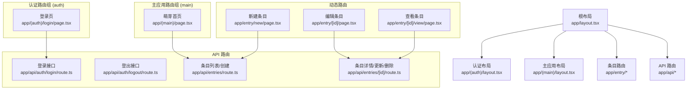
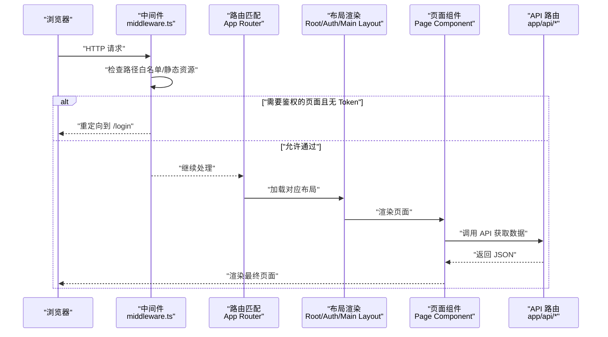
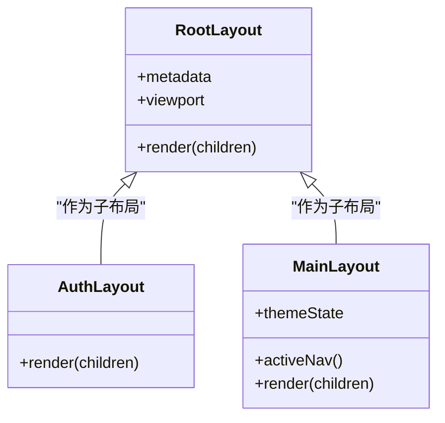
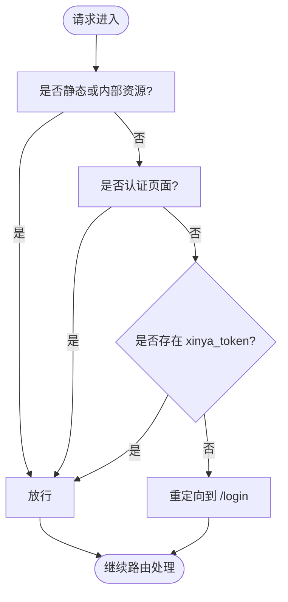
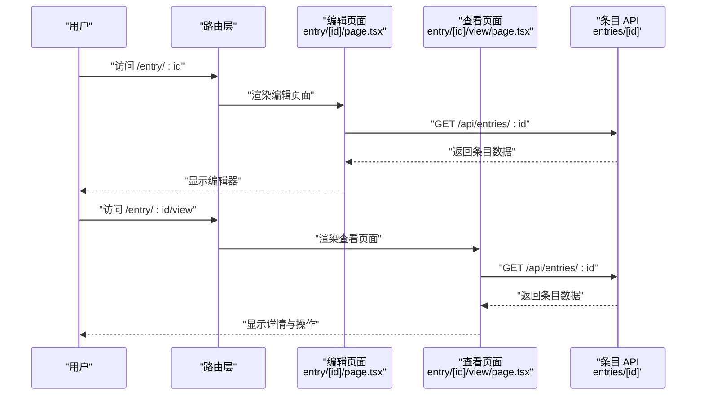
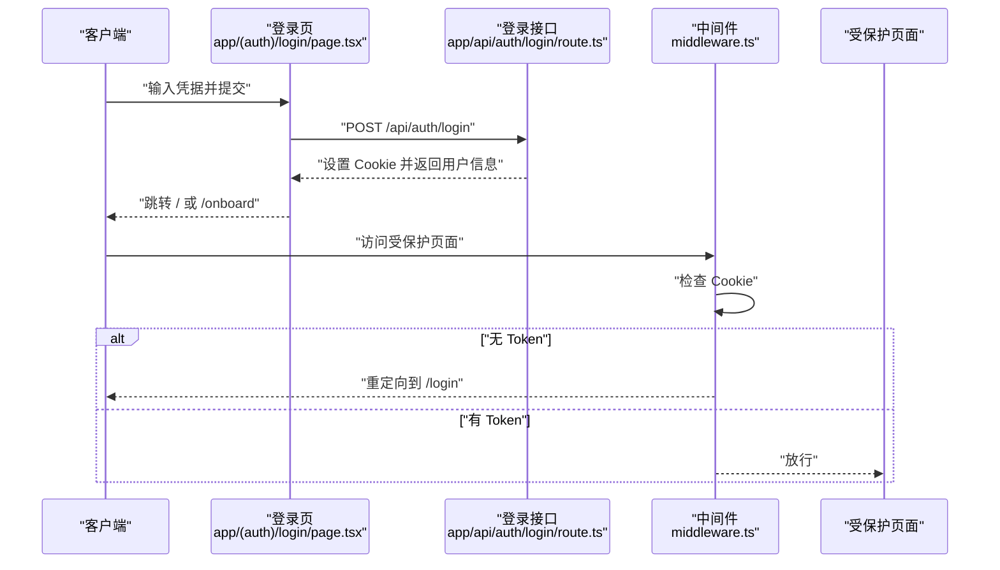
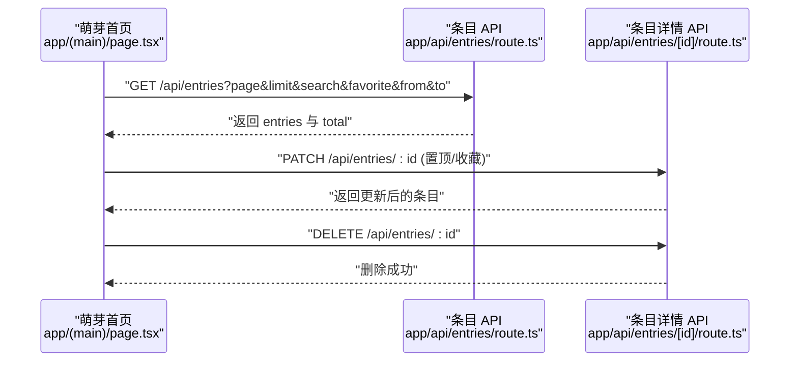
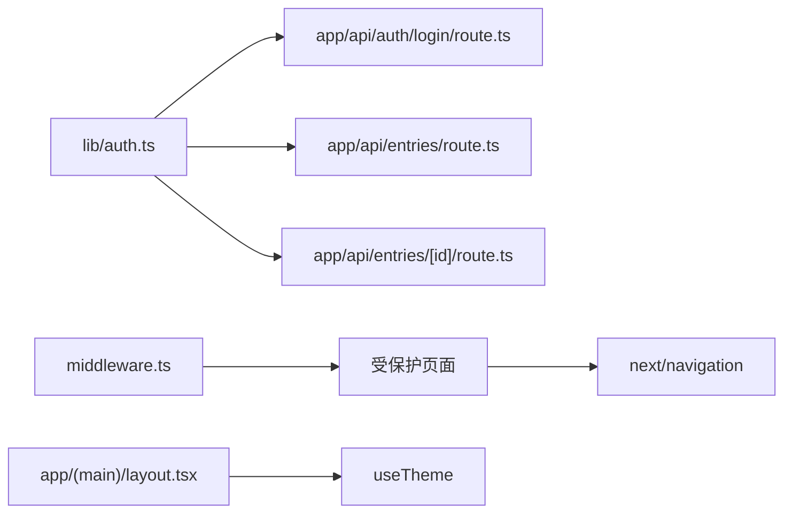

# 路由架构设计

<cite>
**本文引用的文件**   
- [middleware.ts](file://middleware.ts)
- [app/layout.tsx](file://app/layout.tsx)
- [app/(auth)/layout.tsx](file://app/(auth)/layout.tsx)
- [app/(main)/layout.tsx](file://app/(main)/layout.tsx)
- [app/page.tsx](file://app/page.tsx)
- [app/(auth)/login/page.tsx](file://app/(auth)/login/page.tsx)
- [app/(main)/page.tsx](file://app/(main)/page.tsx)
- [app/entry/[id]/page.tsx](file://app/entry/[id]/page.tsx)
- [app/entry/new/page.tsx](file://app/entry/new/page.tsx)
- [app/entry/[id]/view/page.tsx](file://app/entry/[id]/view/page.tsx)
- [lib/auth.ts](file://lib/auth.ts)
- [app/api/auth/login/route.ts](file://app/api/auth/login/route.ts)
- [app/api/auth/logout/route.ts](file://app/api/auth/logout/route.ts)
- [app/api/entries/route.ts](file://app/api/entries/route.ts)
- [app/api/entries/[id]/route.ts](file://app/api/entries/[id]/route.ts)
</cite>

## 目录
1. [简介](#简介)
2. [项目结构](#项目结构)
3. [核心组件](#核心组件)
4. [架构总览](#架构总览)
5. [详细组件分析](#详细组件分析)
6. [依赖关系分析](#依赖关系分析)
7. [性能与代码分割策略](#性能与代码分割策略)
8. [故障排查指南](#故障排查指南)
9. [结论](#结论)

## 简介
本文件面向心芽项目的路由架构，系统性阐述 Next.js App Router 的布局嵌套、路由组语义化组织、中间件在路由层面的拦截与守卫、动态路由使用场景，以及性能优化与代码分割方案。文档同时覆盖认证流程、API 路由与页面路由的协作方式，帮助读者快速理解并扩展系统的路由能力。

## 项目结构
本项目采用 Next.js App Router 的文件系统路由约定：
- 根布局 app/layout.tsx 提供全局 HTML/Viewport 与全局 UI（如 Toast）。
- 认证相关页面位于 app/(auth) 路由组，共享统一登录态外观布局。
- 主应用页面位于 app/(main) 路由组，包含底部导航与主题切换等公共逻辑。
- 动态路由 entry/[id] 用于编辑与查看心得；entry/new 用于新建。
- API 路由集中在 app/api 下，按功能域划分（auth、entries、review 等）。

图表来源
- [app/layout.tsx:1-43](file://app/layout.tsx#L1-L43)
- [app/(auth)/layout.tsx:1-18](file://app/(auth)/layout.tsx#L1-L18)
- [app/(main)/layout.tsx:1-173](file://app/(main)/layout.tsx#L1-L173)
- [app/(auth)/login/page.tsx:1-209](file://app/(auth)/login/page.tsx#L1-L209)
- [app/(main)/page.tsx:1-405](file://app/(main)/page.tsx#L1-L405)
- [app/entry/[id]/page.tsx:1-9](file://app/entry/[id]/page.tsx#L1-L9)
- [app/entry/new/page.tsx:1-5](file://app/entry/new/page.tsx#L1-L5)
- [app/entry/[id]/view/page.tsx:1-245](file://app/entry/[id]/view/page.tsx#L1-L245)
- [app/api/auth/login/route.ts:1-39](file://app/api/auth/login/route.ts#L1-L39)
- [app/api/auth/logout/route.ts:1-9](file://app/api/auth/logout/route.ts#L1-L9)
- [app/api/entries/route.ts:1-163](file://app/api/entries/route.ts#L1-L163)
- [app/api/entries/[id]/route.ts:36-94](file://app/api/entries/[id]/route.ts#L36-L94)

章节来源
- [app/layout.tsx:1-43](file://app/layout.tsx#L1-L43)
- [app/(auth)/layout.tsx:1-18](file://app/(auth)/layout.tsx#L1-L18)
- [app/(main)/layout.tsx:1-173](file://app/(main)/layout.tsx#L1-L173)
- [app/page.tsx:1-5](file://app/page.tsx#L1-L5)

## 核心组件
- 根布局：定义全局元信息、视口、全局通知容器等，所有页面均被包裹。
- 认证布局：为登录/注册等页面提供统一的居中卡片式外观与品牌展示。
- 主应用布局：实现底部导航、主题初始化与切换、活跃项高亮等公共交互。
- 认证中间件：基于 Cookie 进行请求级鉴权，未登录访问受保护页面时重定向到登录。
- 动态路由：entry/[id] 支持编辑与查看；entry/new 用于新建。
- API 路由：认证、条目 CRUD、统计与导出等后端能力。

章节来源
- [app/layout.tsx:1-43](file://app/layout.tsx#L1-L43)
- [app/(auth)/layout.tsx:1-18](file://app/(auth)/layout.tsx#L1-L18)
- [app/(main)/layout.tsx:1-173](file://app/(main)/layout.tsx#L1-L173)
- [middleware.ts:1-29](file://middleware.ts#L1-L29)
- [app/entry/[id]/page.tsx:1-9](file://app/entry/[id]/page.tsx#L1-L9)
- [app/entry/new/page.tsx:1-5](file://app/entry/new/page.tsx#L1-L5)
- [app/entry/[id]/view/page.tsx:1-245](file://app/entry/[id]/view/page.tsx#L1-L245)

## 架构总览
下图展示了从浏览器发起请求到服务端中间件、布局渲染、页面组件与 API 调用的整体链路。

图表来源
- [middleware.ts:1-29](file://middleware.ts#L1-L29)
- [app/layout.tsx:1-43](file://app/layout.tsx#L1-L43)
- [app/(auth)/layout.tsx:1-18](file://app/(auth)/layout.tsx#L1-L18)
- [app/(main)/layout.tsx:1-173](file://app/(main)/layout.tsx#L1-L173)
- [app/api/entries/route.ts:1-163](file://app/api/entries/route.ts#L1-L163)

## 详细组件分析

### 布局嵌套机制（根布局、认证布局、主应用布局）
- 根布局负责全局 HTML/Viewport 与全局 UI（例如 Toast），是所有页面的最外层容器。
- 认证布局为登录/注册等页面提供统一的视觉风格与结构，确保这些页面在视觉上保持一致。
- 主应用布局承载底部导航、主题初始化与切换、活跃项高亮等公共交互，是登录后进入的核心外壳。

图表来源
- [app/layout.tsx:1-43](file://app/layout.tsx#L1-L43)
- [app/(auth)/layout.tsx:1-18](file://app/(auth)/layout.tsx#L1-L18)
- [app/(main)/layout.tsx:1-173](file://app/(main)/layout.tsx#L1-L173)

章节来源
- [app/layout.tsx:1-43](file://app/layout.tsx#L1-L43)
- [app/(auth)/layout.tsx:1-18](file://app/(auth)/layout.tsx#L1-L18)
- [app/(main)/layout.tsx:1-173](file://app/(main)/layout.tsx#L1-L173)

### 路由组设计与页面分组策略
- (auth) 路由组：将登录、注册、忘记密码、重置密码、邮箱验证等页面聚合，便于复用认证布局与后续权限控制。
- (main) 路由组：将“萌芽”“枝叶”“年轮”“根系”等主功能入口聚合，复用底部导航与主题逻辑。
- 语义化路由：(auth)、(main) 仅用于组织代码与共享布局，不会出现在最终 URL 中，保持 URL 简洁清晰。

章节来源
- [app/(auth)/layout.tsx:1-18](file://app/(auth)/layout.tsx#L1-L18)
- [app/(main)/layout.tsx:1-173](file://app/(main)/layout.tsx#L1-L173)
- [app/(auth)/login/page.tsx:1-209](file://app/(auth)/login/page.tsx#L1-L209)
- [app/(main)/page.tsx:1-405](file://app/(main)/page.tsx#L1-L405)

### 中间件在路由层面的作用（请求拦截、认证检查、全局逻辑）
- 静态资源与内部资源放行：/_next/*、favicon.ico、icons 等直接放行。
- 认证页面白名单：/login、/register、/verify-email、/forgot-password、/reset-password、/onboard、/showcase 无需 Token。
- 鉴权规则：若访问非白名单页面且不存在 xinya_token Cookie，则重定向至 /login。
- 匹配器：排除静态资源与图标等，减少不必要的中间件执行开销。

图表来源
- [middleware.ts:1-29](file://middleware.ts#L1-L29)

章节来源
- [middleware.ts:1-29](file://middleware.ts#L1-L29)

### 动态路由实现（entry/[id] 的使用场景）
- 编辑条目：/entry/[id] 通过 useParams 获取 id，传入编辑器组件以加载已有内容。
- 查看条目：/entry/[id]/view 根据 id 拉取详情，支持分享与跳转回来源页。
- 新建条目：/entry/new 直接渲染编辑器并标记为新建模式。

图表来源
- [app/entry/[id]/page.tsx:1-9](file://app/entry/[id]/page.tsx#L1-L9)
- [app/entry/[id]/view/page.tsx:1-245](file://app/entry/[id]/view/page.tsx#L1-L245)
- [app/api/entries/[id]/route.ts:36-94](file://app/api/entries/[id]/route.ts#L36-L94)

章节来源
- [app/entry/[id]/page.tsx:1-9](file://app/entry/[id]/page.tsx#L1-L9)
- [app/entry/new/page.tsx:1-5](file://app/entry/new/page.tsx#L1-L5)
- [app/entry/[id]/view/page.tsx:1-245](file://app/entry/[id]/view/page.tsx#L1-L245)
- [app/api/entries/[id]/route.ts:36-94](file://app/api/entries/[id]/route.ts#L36-L94)

### 认证流程与路由守卫
- 登录接口：校验邮箱与密码，设置 JWT Cookie，返回用户状态与主题信息。
- 登出接口：删除 Cookie，使会话失效。
- 前端登录页：支持邮箱链接登录与密码登录两种模式，成功后根据用户状态跳转到主页或引导页。
- 中间件守卫：未携带有效 Token 的受保护页面将被重定向到登录页。

图表来源
- [app/(auth)/login/page.tsx:1-209](file://app/(auth)/login/page.tsx#L1-L209)
- [app/api/auth/login/route.ts:1-39](file://app/api/auth/login/route.ts#L1-L39)
- [app/api/auth/logout/route.ts:1-9](file://app/api/auth/logout/route.ts#L1-L9)
- [middleware.ts:1-29](file://middleware.ts#L1-L29)

章节来源
- [app/(auth)/login/page.tsx:1-209](file://app/(auth)/login/page.tsx#L1-L209)
- [app/api/auth/login/route.ts:1-39](file://app/api/auth/login/route.ts#L1-L39)
- [app/api/auth/logout/route.ts:1-9](file://app/api/auth/logout/route.ts#L1-L9)
- [middleware.ts:1-29](file://middleware.ts#L1-L29)

### 页面与 API 的数据流
- 萌芽首页：加载今日速览、拾遗卡片与分页条目列表，支持搜索、收藏筛选与时间范围筛选。
- 条目 API：提供分页查询、条件过滤、创建、更新、删除与部分更新（置顶/收藏）等能力。

图表来源
- [app/(main)/page.tsx:1-405](file://app/(main)/page.tsx#L1-L405)
- [app/api/entries/route.ts:1-163](file://app/api/entries/route.ts#L1-L163)
- [app/api/entries/[id]/route.ts:36-94](file://app/api/entries/[id]/route.ts#L36-L94)

章节来源
- [app/(main)/page.tsx:1-405](file://app/(main)/page.tsx#L1-L405)
- [app/api/entries/route.ts:1-163](file://app/api/entries/route.ts#L1-L163)
- [app/api/entries/[id]/route.ts:36-94](file://app/api/entries/[id]/route.ts#L36-L94)

## 依赖关系分析
- 认证工具库 lib/auth.ts 提供密码哈希、JWT 签发与校验、Cookie 配置与当前用户 ID 提取，被 API 路由广泛使用。
- 中间件通过读取 Cookie 完成轻量鉴权，避免在每个页面重复校验。
- 页面组件通过 next/navigation 提供的 router、useParams、useSearchParams 进行导航与参数解析。
- 布局组件通过 usePathname 与本地状态管理主题与导航高亮。

图表来源
- [lib/auth.ts:1-56](file://lib/auth.ts#L1-L56)
- [app/api/auth/login/route.ts:1-39](file://app/api/auth/login/route.ts#L1-L39)
- [app/api/entries/route.ts:1-163](file://app/api/entries/route.ts#L1-L163)
- [app/api/entries/[id]/route.ts:36-94](file://app/api/entries/[id]/route.ts#L36-L94)
- [middleware.ts:1-29](file://middleware.ts#L1-L29)
- [app/(main)/layout.tsx:1-173](file://app/(main)/layout.tsx#L1-L173)

章节来源
- [lib/auth.ts:1-56](file://lib/auth.ts#L1-L56)
- [middleware.ts:1-29](file://middleware.ts#L1-L29)
- [app/(main)/layout.tsx:1-173](file://app/(main)/layout.tsx#L1-L173)

## 性能与代码分割策略
- 路由级代码分割：Next.js App Router 默认按路由进行代码分割，每个页面与布局按需加载，减少首屏体积。
- 客户端组件标注："use client" 明确边界，避免不必要的服务端渲染开销。
- Suspense 与懒加载：对异步数据加载使用 Suspense 包裹，提升感知性能。
- 列表分页与增量加载：萌芽首页采用分页与“加载更多”，降低单次数据量。
- 中间件匹配器优化：排除静态资源与图标，减少中间件执行次数。
- 建议
  - 对大型第三方库使用动态导入（import()）延迟加载。
  - 图片与媒体资源使用 Next/Image 与 CDN 缓存。
  - 对频繁更新的列表考虑虚拟滚动与去抖/节流。
  - 合理拆分布局与页面，避免过大的共享模块。

[本节为通用指导，不直接分析具体文件]

## 故障排查指南
- 无法访问受保护页面
  - 检查中间件匹配器是否误放行了目标路径。
  - 确认 Cookie 名称与有效期是否正确设置。
  - 核对登录接口是否正确写入 Cookie。
- 登录失败或提示需验证邮箱
  - 检查登录接口返回的 needVerify 字段与前端跳转逻辑。
  - 确认数据库用户状态与密码哈希是否正确。
- 条目操作失败
  - 检查 API 路由中的鉴权逻辑与参数校验。
  - 确认数据库连接与 Prisma 迁移是否生效。
- 主题切换异常
  - 检查 localStorage/sessionStorage 读写与事件监听。
  - 确认布局中主题键值映射与样式变量一致。

章节来源
- [middleware.ts:1-29](file://middleware.ts#L1-L29)
- [app/api/auth/login/route.ts:1-39](file://app/api/auth/login/route.ts#L1-L39)
- [app/api/entries/route.ts:1-163](file://app/api/entries/route.ts#L1-L163)
- [app/api/entries/[id]/route.ts:36-94](file://app/api/entries/[id]/route.ts#L36-L94)
- [app/(main)/layout.tsx:1-173](file://app/(main)/layout.tsx#L1-L173)

## 结论
心芽项目通过 App Router 的布局嵌套与路由组实现了清晰的职责分离与可维护性：根布局提供全局能力，认证布局与主应用布局分别承载不同业务域的公共体验；中间件在路由层完成轻量鉴权，配合 API 路由的严格校验形成双重保障；动态路由满足条目编辑与查看的灵活需求。结合分页、Suspense 与路由级代码分割，系统在用户体验与性能之间取得良好平衡。未来可在更细粒度的组件级懒加载、缓存策略与错误边界方面持续优化。