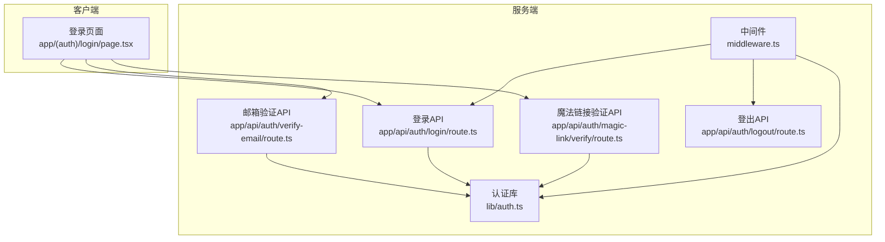
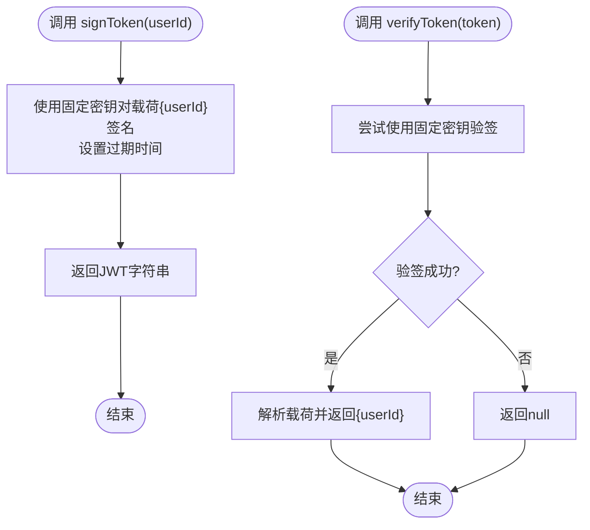
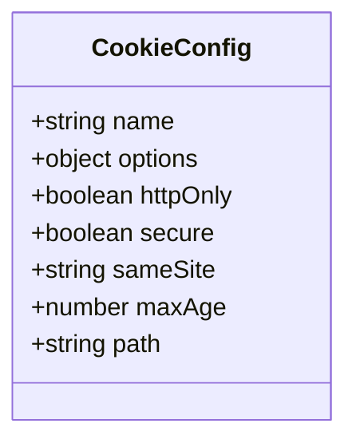
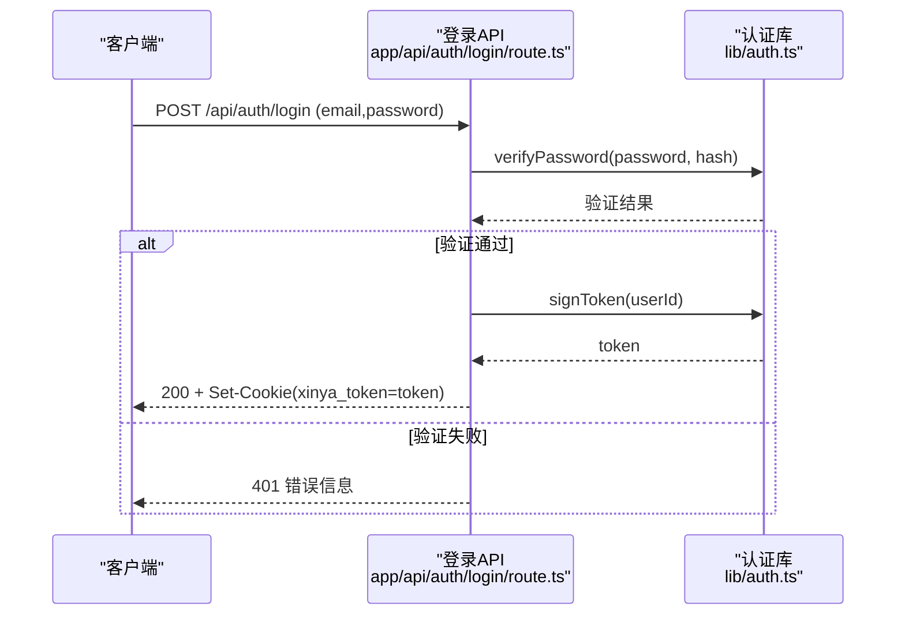
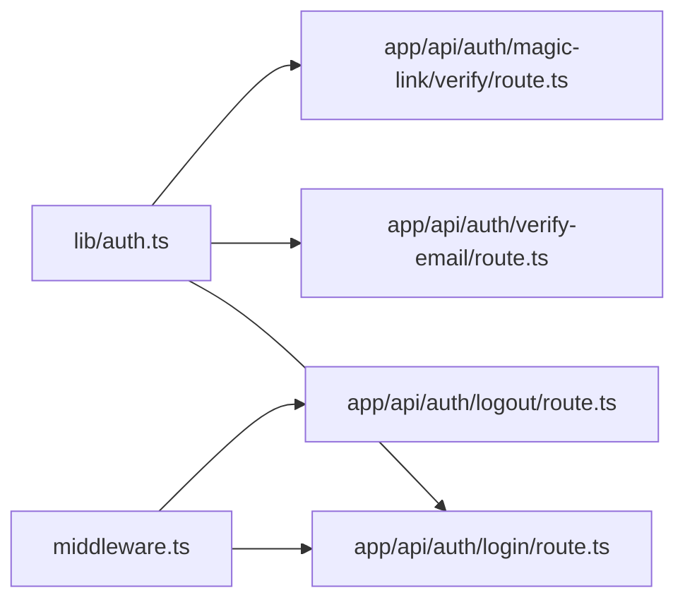

# JWT令牌管理

<cite>
**本文引用的文件**
- [lib/auth.ts](file://lib/auth.ts)
- [middleware.ts](file://middleware.ts)
- [app/api/auth/login/route.ts](file://app/api/auth/login/route.ts)
- [app/api/auth/logout/route.ts](file://app/api/auth/logout/route.ts)
- [app/api/auth/magic-link/verify/route.ts](file://app/api/auth/magic-link/verify/route.ts)
- [app/api/auth/verify-email/route.ts](file://app/api/auth/verify-email/route.ts)
- [app/(auth)/login/page.tsx](file://app/(auth)/login/page.tsx)
</cite>

## 目录
1. [简介](#简介)
2. [项目结构](#项目结构)
3. [核心组件](#核心组件)
4. [架构总览](#架构总览)
5. [详细组件分析](#详细组件分析)
6. [依赖关系分析](#依赖关系分析)
7. [性能与安全性考量](#性能与安全性考量)
8. [故障排查指南](#故障排查指南)
9. [结论](#结论)
10. [附录](#附录)

## 简介
本技术文档围绕心芽的JWT令牌管理系统，系统性阐述令牌的生成、验证、刷新策略、Cookie安全配置、过期时间管理与自动续期机制、存储最佳实践与安全考虑，以及令牌验证失败的错误处理与重试方案。文档以代码级实现为依据，提供可视化图示与可操作建议，帮助开发者快速理解并正确扩展认证体系。

## 项目结构
本项目采用Next.js App Router，认证相关逻辑集中在以下位置：
- 认证工具与常量定义：lib/auth.ts
- 全局路由中间件：middleware.ts
- 登录、登出、邮箱验证码校验、魔法链接验证等API：app/api/auth/*
- 前端登录页面交互：app/(auth)/login/page.tsx



图表来源
- [lib/auth.ts:1-56](file://lib/auth.ts#L1-L56)
- [middleware.ts:1-29](file://middleware.ts#L1-L29)
- [app/api/auth/login/route.ts:1-39](file://app/api/auth/login/route.ts#L1-L39)
- [app/api/auth/logout/route.ts:1-10](file://app/api/auth/logout/route.ts#L1-L10)
- [app/api/auth/verify-email/route.ts:1-38](file://app/api/auth/verify-email/route.ts#L1-L38)
- [app/api/auth/magic-link/verify/route.ts:1-70](file://app/api/auth/magic-link/verify/route.ts#L1-L70)
- [app/(auth)/login/page.tsx:1-209](file://app/(auth)/login/page.tsx#L1-L209)

章节来源
- [lib/auth.ts:1-56](file://lib/auth.ts#L1-L56)
- [middleware.ts:1-29](file://middleware.ts#L1-L29)
- [app/api/auth/login/route.ts:1-39](file://app/api/auth/login/route.ts#L1-L39)
- [app/api/auth/logout/route.ts:1-10](file://app/api/auth/logout/route.ts#L1-L10)
- [app/api/auth/verify-email/route.ts:1-38](file://app/api/auth/verify-email/route.ts#L1-L38)
- [app/api/auth/magic-link/verify/route.ts:1-70](file://app/api/auth/magic-link/verify/route.ts#L1-L70)
- [app/(auth)/login/page.tsx:1-209](file://app/(auth)/login/page.tsx#L1-L209)

## 核心组件
- signToken(userId): 使用固定密钥对包含用户标识的载荷进行签名，设置较短或合理的过期时间（当前为30天）。
- verifyToken(token): 使用相同密钥验签并解析载荷；失败返回空值，便于上层统一处理未认证状态。
- getCurrentUserId(): 从请求Cookie中读取令牌并调用verifyToken解析用户ID，作为后续鉴权的基础。
- COOKIE_CONFIG: 集中定义Cookie名称与安全属性（httpOnly、secure、sameSite、maxAge、path），供各API统一设置响应头。

章节来源
- [lib/auth.ts:18-55](file://lib/auth.ts#L18-L55)

## 架构总览
下图展示了从浏览器发起登录到服务端签发JWT Cookie，再到受保护资源访问的整体流程。

```mermaid
sequenceDiagram
participant B as "浏览器"
participant UI as "登录页面<br/>app/(auth)/login/page.tsx"
participant API as "登录API<br/>app/api/auth/login/route.ts"
participant AUTH as "认证库<br/>lib/auth.ts"
participant MW as "中间件<br/>middleware.ts"
B->>UI : 打开登录页
UI->>API : POST /api/auth/login (credentials : include)
API->>AUTH : verifyPassword(密码, 哈希)
API->>AUTH : signToken(userId)
AUTH-->>API : token
API-->>B : 200 + Set-Cookie(xinya_token=token; httpOnly; sameSite=lax; maxAge=30d)
B->>MW : 访问受保护页面
MW->>MW : 检查Cookie是否存在
MW-->>B : 允许访问或重定向至登录页
```

图表来源
- [app/(auth)/login/page.tsx:37-67](file://app/(auth)/login/page.tsx#L37-L67)
- [app/api/auth/login/route.ts:5-38](file://app/api/auth/login/route.ts#L5-L38)
- [lib/auth.ts:18-55](file://lib/auth.ts#L18-L55)
- [middleware.ts:4-24](file://middleware.ts#L4-L24)

## 详细组件分析

### 令牌生成与验证（signToken与verifyToken）
- 生成策略
  - 载荷仅包含最小必要信息（userId），避免在令牌中携带敏感数据。
  - 使用环境变量中的密钥进行签名；若未配置则回退到开发默认值（生产环境必须覆盖）。
  - 过期时间设置为30天，兼顾用户体验与安全风险控制。
- 验证策略
  - 使用同一密钥验签，捕获异常后返回空值，上层据此判定未认证。
  - 通过getCurrentUserId封装了“从Cookie取令牌并解析”的通用路径，降低重复代码。



图表来源
- [lib/auth.ts:18-30](file://lib/auth.ts#L18-L30)

章节来源
- [lib/auth.ts:18-43](file://lib/auth.ts#L18-L43)

### Cookie配置策略与安全属性
- 名称与路径
  - 名称：xinya_token
  - 路径：/（全站可用）
- 安全属性
  - httpOnly: true（禁止JS读取，缓解XSS窃取风险）
  - secure: false（本地开发默认关闭；生产应开启HTTPS并设为true）
  - sameSite: lax（跨站请求时仅在顶级导航发送，平衡兼容性与CSRF防护）
  - maxAge: 30天（与令牌过期一致）
  - path: /（全站生效）
- 使用方式
  - 登录成功后通过response.cookies.set(name, token, options)写入Cookie
  - 登出时通过cookieStore.delete(name)清除Cookie



图表来源
- [lib/auth.ts:45-55](file://lib/auth.ts#L45-L55)

章节来源
- [lib/auth.ts:45-55](file://lib/auth.ts#L45-L55)
- [app/api/auth/login/route.ts:27-33](file://app/api/auth/login/route.ts#L27-L33)
- [app/api/auth/logout/route.ts:5-9](file://app/api/auth/logout/route.ts#L5-L9)

### 令牌过期时间与自动续期机制
- 当前实现
  - 令牌有效期为30天，与Cookie的maxAge保持一致。
  - 未在现有代码中发现独立的“刷新令牌”接口或基于滑动窗口的自动续期逻辑。
- 建议的自动续期方案（概念性）
  - 双令牌模型：短时效访问令牌+长时效刷新令牌（分别存于不同Cookie，均httpOnly）。
  - 接近过期检测：前端在每次关键请求前检查本地缓存的过期时间，若剩余不足阈值则调用刷新接口换取新访问令牌。
  - 服务端刷新：校验刷新令牌有效且未撤销后，签发新的访问令牌并更新其过期时间。
  - 防重放与撤销：刷新令牌绑定设备指纹或会话ID，支持黑名单或数据库标记撤销。
  - 注意：上述为通用最佳实践建议，非当前仓库已实现功能。

[本节为概念性说明，不直接分析具体文件]

### 令牌存储的最佳实践与安全考虑
- 存储位置
  - 优先使用httpOnly Cookie，避免被JS读取，降低XSS风险。
  - 如需更细粒度控制，可使用内存态存储（如内存变量）配合无状态API，但需处理刷新与多标签同步问题。
- 传输安全
  - 生产环境启用HTTPS并将secure设为true，防止中间人窃听。
- 跨站策略
  - sameSite=lax适用于大多数场景；若存在跨站嵌入需求，可评估sameSite=none并配合secure=true。
- 令牌内容最小化
  - 仅包含userId等必要字段，避免在令牌中存放敏感信息。
- 密钥管理
  - 使用环境变量注入强随机密钥，严禁硬编码；定期轮换密钥时需考虑旧令牌的过渡策略。
- 撤销与失效
  - 结合数据库黑名单或Redis记录，支持强制下线与批量撤销。

[本节为通用指导，不直接分析具体文件]

### 令牌验证失败的错误处理与重试机制
- 服务端侧
  - verifyToken捕获异常返回空值，getCurrentUserId统一返回null，便于上层判断未认证。
  - 中间件在未检测到Cookie时重定向至登录页，阻止访问受保护资源。
- 客户端侧
  - 登录失败时显示友好错误提示；需要邮箱验证时跳转至验证页面。
  - 网络异常时给出重试提示。
- 建议的重试策略（概念性）
  - 指数退避重试：对临时性网络错误进行有限次重试。
  - 令牌过期重试：当收到401且确认为令牌过期时，先尝试刷新令牌，再重试原请求。
  - 幂等性保障：确保重试不会导致副作用重复执行。

章节来源
- [lib/auth.ts:23-43](file://lib/auth.ts#L23-L43)
- [middleware.ts:13-24](file://middleware.ts#L13-L24)
- [app/(auth)/login/page.tsx:37-67](file://app/(auth)/login/page.tsx#L37-L67)

### 登录流程时序图（含Cookie设置）


图表来源
- [app/api/auth/login/route.ts:5-38](file://app/api/auth/login/route.ts#L5-L38)
- [lib/auth.ts:18-30](file://lib/auth.ts#L18-L30)

### 邮箱验证码校验与自动登录
- 流程要点
  - 校验验证码有效性及是否过期，成功后标记用户已验证。
  - 立即签发JWT并通过Cookie完成自动登录。
- 错误处理
  - 参数缺失、验证码不正确或过期均返回明确错误码与信息。

章节来源
- [app/api/auth/verify-email/route.ts:6-36](file://app/api/auth/verify-email/route.ts#L6-L36)
- [lib/auth.ts:18-30](file://lib/auth.ts#L18-L30)

### 魔法链接验证与自动登录
- 流程要点
  - 根据URL参数获取一次性令牌，校验是否有效与未过期。
  - 自动创建或激活用户，签发JWT并通过Cookie完成登录。
- 错误处理
  - 链接无效、已使用或过期时重定向至登录页并附带错误信息。

章节来源
- [app/api/auth/magic-link/verify/route.ts:8-68](file://app/api/auth/magic-link/verify/route.ts#L8-L68)
- [lib/auth.ts:18-30](file://lib/auth.ts#L18-L30)

## 依赖关系分析
- 模块耦合
  - 认证库lib/auth.ts被多个API路由复用，职责单一、内聚度高。
  - 中间件middleware.ts仅做存在性检查，不解析令牌，降低耦合度。
- 外部依赖
  - jsonwebtoken用于签名与验签。
  - bcryptjs用于密码哈希与比对。
- 潜在改进点
  - 将verifyToken与getCurrentUserId合并为统一的鉴权上下文对象，减少重复调用。
  - 引入刷新令牌接口与中间件拦截器，统一处理401与自动续期。



图表来源
- [lib/auth.ts:1-56](file://lib/auth.ts#L1-L56)
- [middleware.ts:1-29](file://middleware.ts#L1-L29)
- [app/api/auth/login/route.ts:1-39](file://app/api/auth/login/route.ts#L1-L39)
- [app/api/auth/logout/route.ts:1-10](file://app/api/auth/logout/route.ts#L1-L10)
- [app/api/auth/verify-email/route.ts:1-38](file://app/api/auth/verify-email/route.ts#L1-L38)
- [app/api/auth/magic-link/verify/route.ts:1-70](file://app/api/auth/magic-link/verify/route.ts#L1-L70)

章节来源
- [lib/auth.ts:1-56](file://lib/auth.ts#L1-L56)
- [middleware.ts:1-29](file://middleware.ts#L1-L29)
- [app/api/auth/login/route.ts:1-39](file://app/api/auth/login/route.ts#L1-L39)
- [app/api/auth/logout/route.ts:1-10](file://app/api/auth/logout/route.ts#L1-L10)
- [app/api/auth/verify-email/route.ts:1-38](file://app/api/auth/verify-email/route.ts#L1-L38)
- [app/api/auth/magic-link/verify/route.ts:1-70](file://app/api/auth/magic-link/verify/route.ts#L1-L70)

## 性能与安全性考量
- 性能
  - 令牌验签计算开销较低，适合高频鉴权；建议在高并发场景下缓存公共配置（如密钥来源）以减少I/O。
  - 避免在令牌中携带大对象，减小Cookie体积。
- 安全性
  - 生产环境务必设置secure=true并启用HTTPS。
  - 使用强随机密钥，避免泄露；定期轮换密钥并制定旧令牌过渡策略。
  - 结合黑名单或数据库标记实现强制下线与批量撤销。
  - 限制登录失败次数与IP频率，防范暴力破解。

[本节为通用指导，不直接分析具体文件]

## 故障排查指南
- 常见问题
  - 登录后仍被重定向至登录页：检查Cookie是否正确设置（名称、路径、域、SameSite、Secure）。
  - 跨站请求无法携带Cookie：确认sameSite策略是否符合预期，必要时调整为strict或none（需配合secure=true）。
  - 令牌过期频繁：调整过期时间或引入刷新令牌机制。
  - 本地调试无法携带Cookie：确保fetch请求包含credentials: include。
- 定位步骤
  - 查看浏览器开发者工具的“应用-Cookies”，确认xinya_token是否存在且属性正确。
  - 检查服务端日志输出（登录、验证、中间件）以定位错误分支。
  - 核对环境变量JWT_SECRET是否与部署环境一致。

章节来源
- [app/(auth)/login/page.tsx:37-67](file://app/(auth)/login/page.tsx#L37-L67)
- [middleware.ts:13-24](file://middleware.ts#L13-L24)
- [lib/auth.ts:45-55](file://lib/auth.ts#L45-L55)

## 结论
当前系统实现了基于JWT的无状态认证，采用httpOnly Cookie承载令牌，具备基础的安全防护能力。建议在后续迭代中引入刷新令牌与自动续期机制，完善401统一处理与重试策略，并在生产环境全面启用HTTPS与secure=true，以提升整体安全性与用户体验。

[本节为总结性内容，不直接分析具体文件]

## 附录
- 术语
  - JWT：JSON Web Token，一种紧凑的自包含令牌格式。
  - httpOnly：禁止JavaScript访问Cookie，降低XSS风险。
  - Secure：仅通过HTTPS传输Cookie。
  - SameSite：控制跨站请求时是否携带Cookie。
- 参考实现路径
  - 令牌生成与验证：[lib/auth.ts:18-30](file://lib/auth.ts#L18-L30)
  - 当前用户解析：[lib/auth.ts:32-43](file://lib/auth.ts#L32-L43)
  - Cookie配置：[lib/auth.ts:45-55](file://lib/auth.ts#L45-L55)
  - 登录流程：[app/api/auth/login/route.ts:5-38](file://app/api/auth/login/route.ts#L5-L38)
  - 登出流程：[app/api/auth/logout/route.ts:5-9](file://app/api/auth/logout/route.ts#L5-L9)
  - 邮箱验证与自动登录：[app/api/auth/verify-email/route.ts:6-36](file://app/api/auth/verify-email/route.ts#L6-L36)
  - 魔法链接验证与自动登录：[app/api/auth/magic-link/verify/route.ts:8-68](file://app/api/auth/magic-link/verify/route.ts#L8-L68)
  - 中间件鉴权：[middleware.ts:4-24](file://middleware.ts#L4-L24)