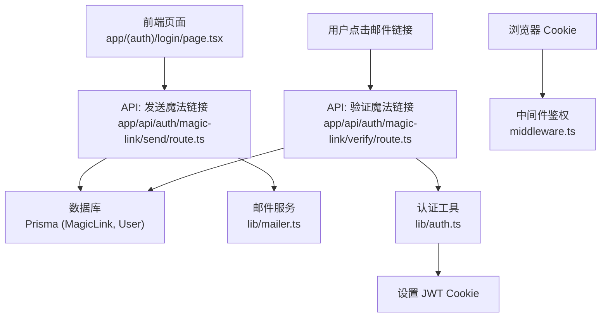
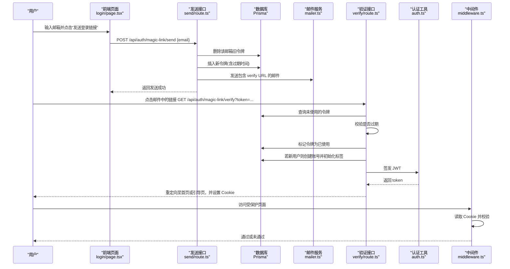
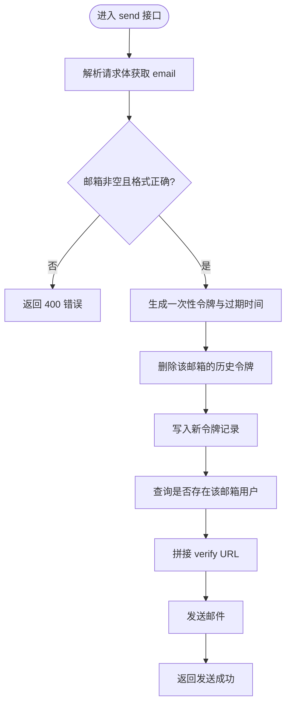
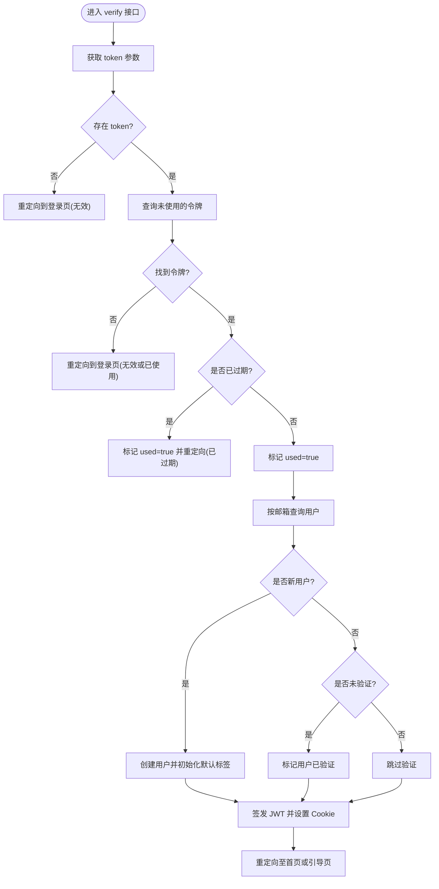
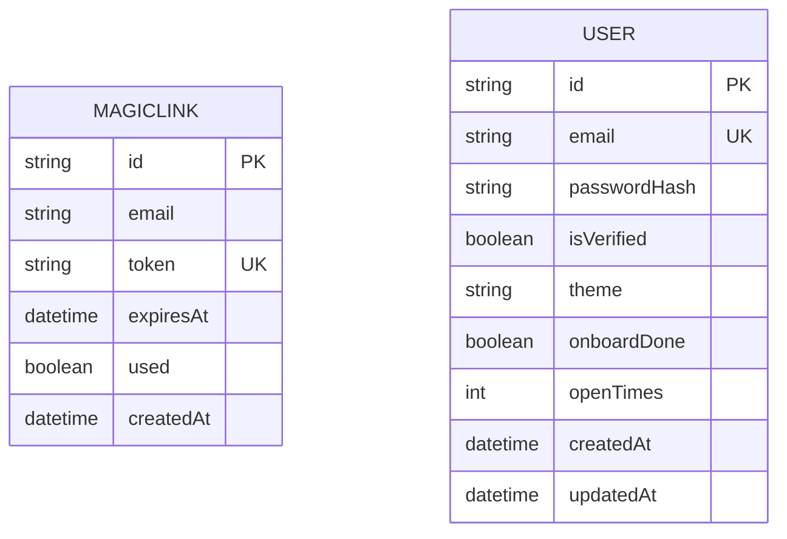
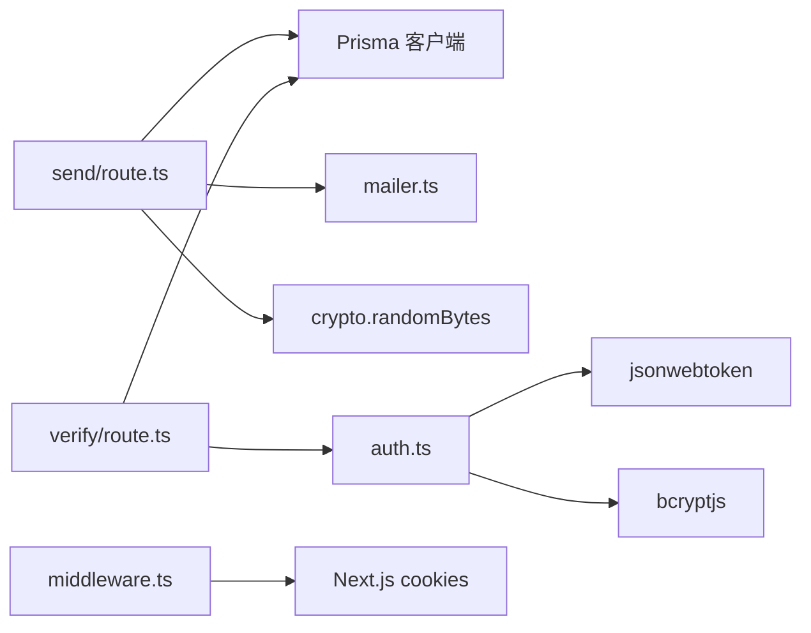

# Magic Link无密码登录

<cite>
**本文引用的文件**
- [app/api/auth/magic-link/send/route.ts](file://app/api/auth/magic-link/send/route.ts)
- [app/api/auth/magic-link/verify/route.ts](file://app/api/auth/magic-link/verify/route.ts)
- [lib/mailer.ts](file://lib/mailer.ts)
- [lib/auth.ts](file://lib/auth.ts)
- [prisma/schema.prisma](file://prisma/schema.prisma)
- [middleware.ts](file://middleware.ts)
- [app/(auth)/login/page.tsx](file://app/(auth)/login/page.tsx)
</cite>

## 目录
1. [简介](#简介)
2. [项目结构](#项目结构)
3. [核心组件](#核心组件)
4. [架构总览](#架构总览)
5. [详细组件分析](#详细组件分析)
6. [依赖关系分析](#依赖关系分析)
7. [性能与可扩展性](#性能与可扩展性)
8. [故障排查指南](#故障排查指南)
9. [结论](#结论)
10. [附录：配置与安全清单](#附录配置与安全清单)

## 简介
本技术文档围绕“心芽”的 Magic Link 无密码登录系统，系统性阐述其生成算法、安全性设计、邮件发送流程、链接验证机制、防重放与 CSRF 防护策略，以及邮件服务集成与错误处理。读者可据此理解从前端触发到后端签发令牌、发送邮件、校验并自动登录的完整链路，并获得生产环境部署与加固建议。

## 项目结构
Magic Link 功能由 Next.js App Router 的 API 路由实现，配合 Prisma 数据模型与 Nodemailer 邮件服务完成端到端流程。关键位置如下：
- 发送入口：POST /api/auth/magic-link/send
- 验证入口：GET /api/auth/magic-link/verify?token=...
- 邮件模板与 SMTP：lib/mailer.ts
- 认证与 Cookie：lib/auth.ts
- 数据模型：prisma/schema.prisma（MagicLink、User 等）
- 全局鉴权中间件：middleware.ts
- 前端交互：app/(auth)/login/page.tsx

图表来源
- [app/api/auth/magic-link/send/route.ts:1-47](file://app/api/auth/magic-link/send/route.ts#L1-L47)
- [app/api/auth/magic-link/verify/route.ts:1-70](file://app/api/auth/magic-link/verify/route.ts#L1-L70)
- [lib/mailer.ts:1-86](file://lib/mailer.ts#L1-L86)
- [lib/auth.ts:1-56](file://lib/auth.ts#L1-L56)
- [prisma/schema.prisma:138-148](file://prisma/schema.prisma#L138-L148)
- [middleware.ts:1-29](file://middleware.ts#L1-L29)

章节来源
- [app/api/auth/magic-link/send/route.ts:1-47](file://app/api/auth/magic-link/send/route.ts#L1-L47)
- [app/api/auth/magic-link/verify/route.ts:1-70](file://app/api/auth/magic-link/verify/route.ts#L1-L70)
- [lib/mailer.ts:1-86](file://lib/mailer.ts#L1-L86)
- [lib/auth.ts:1-56](file://lib/auth.ts#L1-L56)
- [prisma/schema.prisma:138-148](file://prisma/schema.prisma#L138-L148)
- [middleware.ts:1-29](file://middleware.ts#L1-L29)

## 核心组件
- 魔法链接发送接口：负责邮箱校验、一次性令牌生成、过期时间设置、旧令牌清理、构建链接、发送邮件。
- 魔法链接验证接口：负责令牌查找、使用状态与过期检查、标记已使用、新用户自动注册与老用户自动验证、签发 JWT 并设置 Cookie。
- 邮件服务：基于 Nodemailer 的 SMTP 客户端，提供 HTML 模板渲染与发送。
- 认证工具：JWT 签发与校验、Cookie 配置、密码哈希与校验。
- 数据模型：MagicLink（令牌存储）、User（用户信息）。
- 中间件：对受保护路由进行 Cookie 校验与跳转。

章节来源
- [app/api/auth/magic-link/send/route.ts:1-47](file://app/api/auth/magic-link/send/route.ts#L1-L47)
- [app/api/auth/magic-link/verify/route.ts:1-70](file://app/api/auth/magic-link/verify/route.ts#L1-L70)
- [lib/mailer.ts:1-86](file://lib/mailer.ts#L1-L86)
- [lib/auth.ts:1-56](file://lib/auth.ts#L1-L56)
- [prisma/schema.prisma:138-148](file://prisma/schema.prisma#L138-L148)
- [middleware.ts:1-29](file://middleware.ts#L1-L29)

## 架构总览
下图展示了 Magic Link 的核心调用链路与数据流向，包括前端请求、令牌生成与持久化、邮件发送、链接验证、用户创建/验证、JWT 签发与 Cookie 设置、后续鉴权。

图表来源
- [app/(auth)/login/page.tsx:1-43](file://app/(auth)/login/page.tsx#L1-L43)
- [app/api/auth/magic-link/send/route.ts:1-47](file://app/api/auth/magic-link/send/route.ts#L1-L47)
- [app/api/auth/magic-link/verify/route.ts:1-70](file://app/api/auth/magic-link/verify/route.ts#L1-L70)
- [lib/mailer.ts:1-86](file://lib/mailer.ts#L1-L86)
- [lib/auth.ts:1-56](file://lib/auth.ts#L1-L56)
- [middleware.ts:1-29](file://middleware.ts#L1-L29)

## 详细组件分析

### 魔法链接发送流程（send）
- 输入校验：接收 JSON 中的 email，进行非空与格式校验。
- 令牌生成：使用加密安全的随机源生成一次性令牌；设置 15 分钟过期时间。
- 幂等与去重：在创建新令牌前，删除该邮箱的所有历史未使用令牌，避免并发重复发送导致多份有效链接。
- 链接构建：以应用基础地址拼接 verify 路径与 token 参数。
- 邮件发送：根据是否新用户选择不同主题与文案，调用邮件服务发送 HTML 邮件。
- 响应：统一返回 ok 字段与错误消息。

图表来源
- [app/api/auth/magic-link/send/route.ts:1-47](file://app/api/auth/magic-link/send/route.ts#L1-L47)
- [lib/mailer.ts:35-61](file://lib/mailer.ts#L35-L61)

章节来源
- [app/api/auth/magic-link/send/route.ts:1-47](file://app/api/auth/magic-link/send/route.ts#L1-L47)
- [lib/mailer.ts:35-61](file://lib/mailer.ts#L35-L61)

### 魔法链接验证流程（verify）
- 参数提取：从查询参数中获取 token。
- 令牌查找：按 token 且未使用条件查询。
- 过期检查：若当前时间超过 expiresAt，则将 used 置为 true 并重定向提示过期。
- 标记已使用：将 used 置为 true，防止重放。
- 用户处理：
  - 新用户：自动生成临时密码哈希、创建用户并标记已验证，同时创建默认标签。
  - 老用户：若未验证则自动标记为已验证。
- 登录与会话：签发 JWT，更新用户打开次数，设置 Cookie，重定向至主页或引导页。

图表来源
- [app/api/auth/magic-link/verify/route.ts:1-70](file://app/api/auth/magic-link/verify/route.ts#L1-L70)
- [lib/auth.ts:18-30](file://lib/auth.ts#L18-L30)
- [lib/auth.ts:45-55](file://lib/auth.ts#L45-L55)

章节来源
- [app/api/auth/magic-link/verify/route.ts:1-70](file://app/api/auth/magic-link/verify/route.ts#L1-L70)
- [lib/auth.ts:18-30](file://lib/auth.ts#L18-L30)
- [lib/auth.ts:45-55](file://lib/auth.ts#L45-L55)

### 邮件服务与模板
- SMTP 配置：使用环境变量配置发件人与授权码，采用 SSL 端口连接。
- 模板渲染：根据是否新用户动态调整主题与文案，HTML 内联样式确保兼容。
- 发送函数：封装通用发送逻辑，便于复用与扩展。

章节来源
- [lib/mailer.ts:1-86](file://lib/mailer.ts#L1-L86)

### 认证与 Cookie
- JWT 签发：使用固定密钥签发短期会话令牌，有效期 30 天。
- Cookie 配置：httpOnly 开启，sameSite lax，path 根路径，maxAge 30 天。
- 中间件鉴权：对非公开路由检查 Cookie 是否存在，不存在则重定向登录。

章节来源
- [lib/auth.ts:1-56](file://lib/auth.ts#L1-L56)
- [middleware.ts:1-29](file://middleware.ts#L1-L29)

### 数据模型
- MagicLink：存储 email、唯一 token、过期时间、used 标志及创建时间，并对 token 和 email 建立索引以提升查询效率。
- User：包含邮箱、密码哈希、验证状态、主题、引导完成状态、打开次数等。

图表来源
- [prisma/schema.prisma:138-148](file://prisma/schema.prisma#L138-L148)
- [prisma/schema.prisma:10-31](file://prisma/schema.prisma#L10-L31)

## 依赖关系分析
- 发送接口依赖：
  - Prisma 客户端：读写 MagicLink 与 User。
  - 邮件服务：发送 HTML 邮件。
  - 系统 crypto：生成安全随机令牌。
- 验证接口依赖：
  - Prisma 客户端：查询 MagicLink、读写 User。
  - 认证工具：签发 JWT、Cookie 配置。
- 中间件依赖：
  - Next.js cookies：读取 Cookie 进行鉴权。

图表来源
- [app/api/auth/magic-link/send/route.ts:1-47](file://app/api/auth/magic-link/send/route.ts#L1-L47)
- [app/api/auth/magic-link/verify/route.ts:1-70](file://app/api/auth/magic-link/verify/route.ts#L1-L70)
- [lib/mailer.ts:1-86](file://lib/mailer.ts#L1-L86)
- [lib/auth.ts:1-56](file://lib/auth.ts#L1-L56)
- [middleware.ts:1-29](file://middleware.ts#L1-L29)

章节来源
- [app/api/auth/magic-link/send/route.ts:1-47](file://app/api/auth/magic-link/send/route.ts#L1-L47)
- [app/api/auth/magic-link/verify/route.ts:1-70](file://app/api/auth/magic-link/verify/route.ts#L1-L70)
- [lib/mailer.ts:1-86](file://lib/mailer.ts#L1-L86)
- [lib/auth.ts:1-56](file://lib/auth.ts#L1-L56)
- [middleware.ts:1-29](file://middleware.ts#L1-L29)

## 性能与可扩展性
- 令牌生成与校验：
  - randomBytes 为 O(1)，数据库查询与更新为 I/O 主导，建议在高频场景下引入 Redis 缓存令牌以减少数据库压力。
- 邮件发送：
  - 同步发送可能阻塞请求，建议改为异步队列（如 BullMQ）提升吞吐与容错。
- 数据库索引：
  - MagicLink 已在 token 与 email 上建索引，利于快速查找与批量清理。
- 会话管理：
  - JWT 有效期较长，可在敏感操作时结合服务端短效会话或刷新机制增强安全。

[本节为通用指导，不直接分析具体文件]

## 故障排查指南
- 发送失败：
  - 检查 SMTP_USER 与 SMTP_PASS 是否正确，确认网络可达与端口 465 可用。
  - 查看控制台日志输出，定位异常堆栈。
- 链接无效或已使用：
  - 确认 token 未被重复使用；verify 接口会在首次使用时标记 used=true。
  - 检查过期时间，默认 15 分钟，超时后会被视为无效。
- 验证失败：
  - 检查数据库连通性与 MagicLink 表数据完整性。
  - 确认 NEXT_PUBLIC_APP_URL 配置正确，避免重定向目标不可达。
- Cookie 未生效：
  - 检查 sameSite 与 secure 配置是否与部署域名协议匹配。
  - 确认中间件未拦截 verify 重定向路径。

章节来源
- [app/api/auth/magic-link/send/route.ts:42-46](file://app/api/auth/magic-link/send/route.ts#L42-L46)
- [app/api/auth/magic-link/verify/route.ts:65-69](file://app/api/auth/magic-link/verify/route.ts#L65-L69)
- [lib/mailer.ts:1-12](file://lib/mailer.ts#L1-L12)
- [middleware.ts:13-23](file://middleware.ts#L13-L23)

## 结论
Magic Link 方案通过一次性令牌与短过期时间实现了简洁而安全的无密码登录体验。系统在发送与验证两端均具备基本的幂等与防重放能力，并通过 Cookie + 中间件完成会话鉴权。生产环境建议补充速率限制、CSRF 防护、HTTPS 强制与更健壮的邮件发送策略，以获得更高的安全性与稳定性。

[本节为总结，不直接分析具体文件]

## 附录：配置与安全清单
- 环境变量
  - SMTP_USER、SMTP_PASS：用于 SMTP 认证。
  - NEXT_PUBLIC_APP_URL：应用基础地址，用于构建魔法链接与重定向。
  - JWT_SECRET：JWT 签名密钥，生产环境务必替换为强随机值。
- 安全加固建议
  - 速率限制：对 /api/auth/magic-link/send 增加 IP 与邮箱维度的限流，防止滥用。
  - HTTPS 与 Secure Cookie：生产环境启用 HTTPS，并将 Cookie secure 设为 true。
  - SameSite 策略：根据跨域需求调整为 strict 或配合 CSRF Token。
  - 令牌存储：考虑将 MagicLink 迁移至内存/分布式缓存，并定期清理过期记录。
  - 审计日志：记录发送与验证的关键事件，便于追踪与排障。
  - 最小权限原则：仅暴露必要 API，屏蔽内部调试接口。

章节来源
- [lib/mailer.ts:1-12](file://lib/mailer.ts#L1-L12)
- [lib/auth.ts:5-6](file://lib/auth.ts#L5-L6)
- [lib/auth.ts:45-55](file://lib/auth.ts#L45-L55)
- [app/api/auth/magic-link/send/route.ts:34-36](file://app/api/auth/magic-link/send/route.ts#L34-L36)