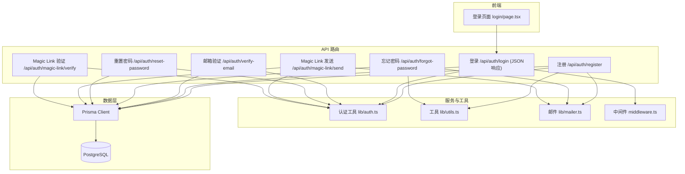
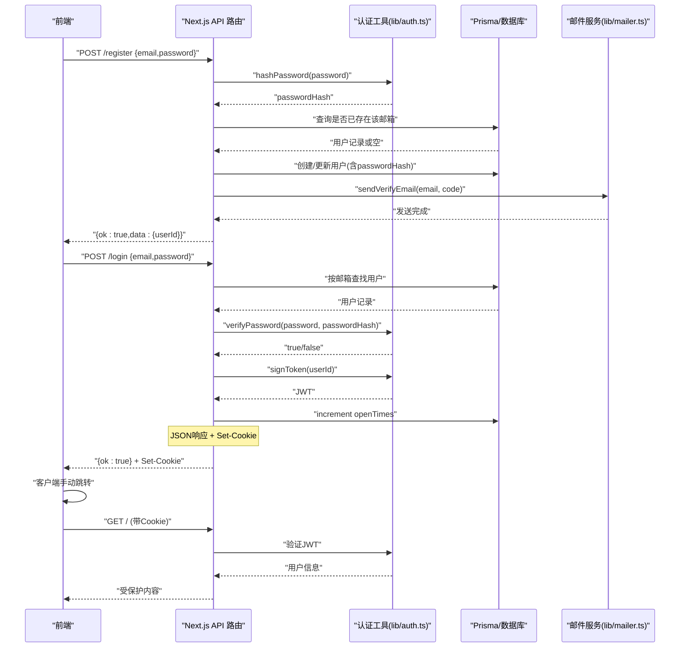
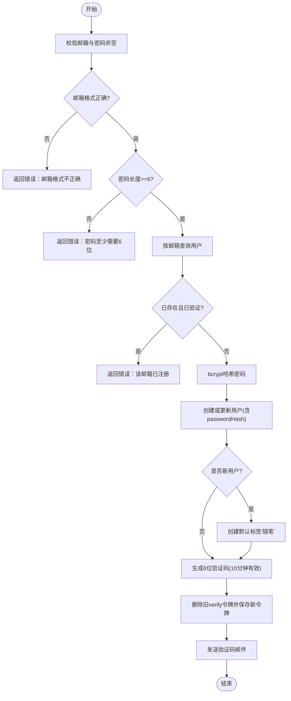
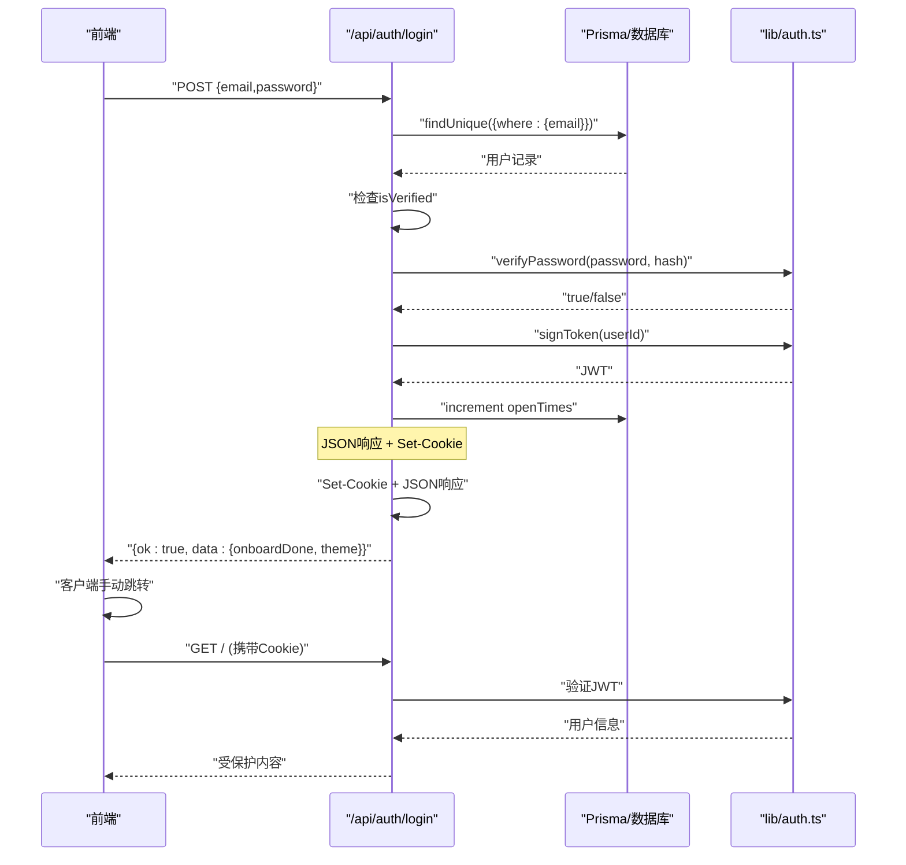
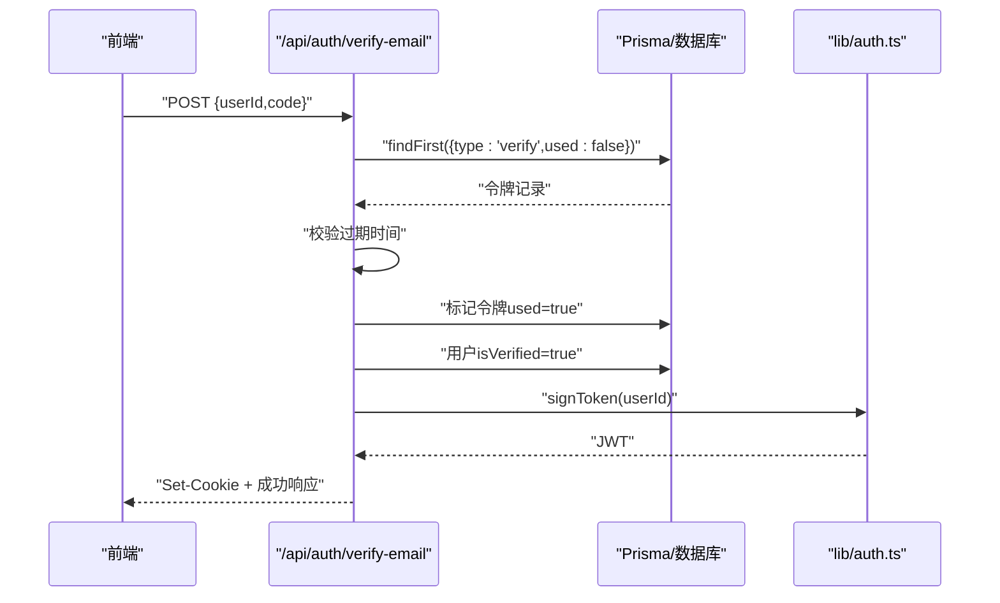
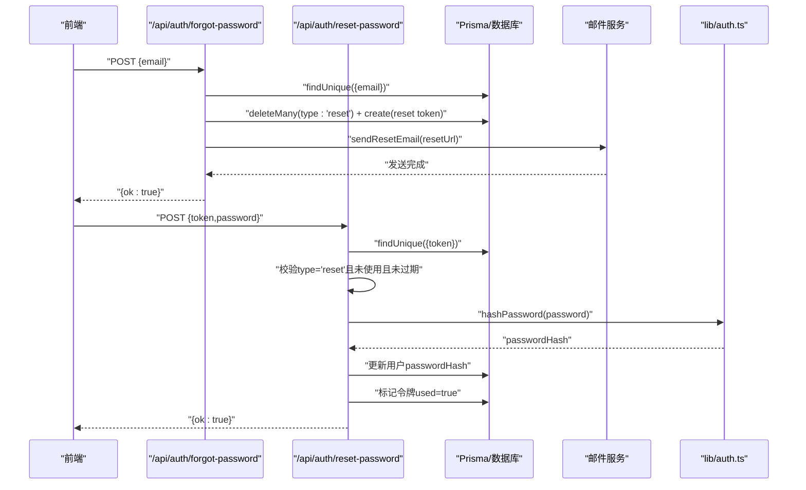
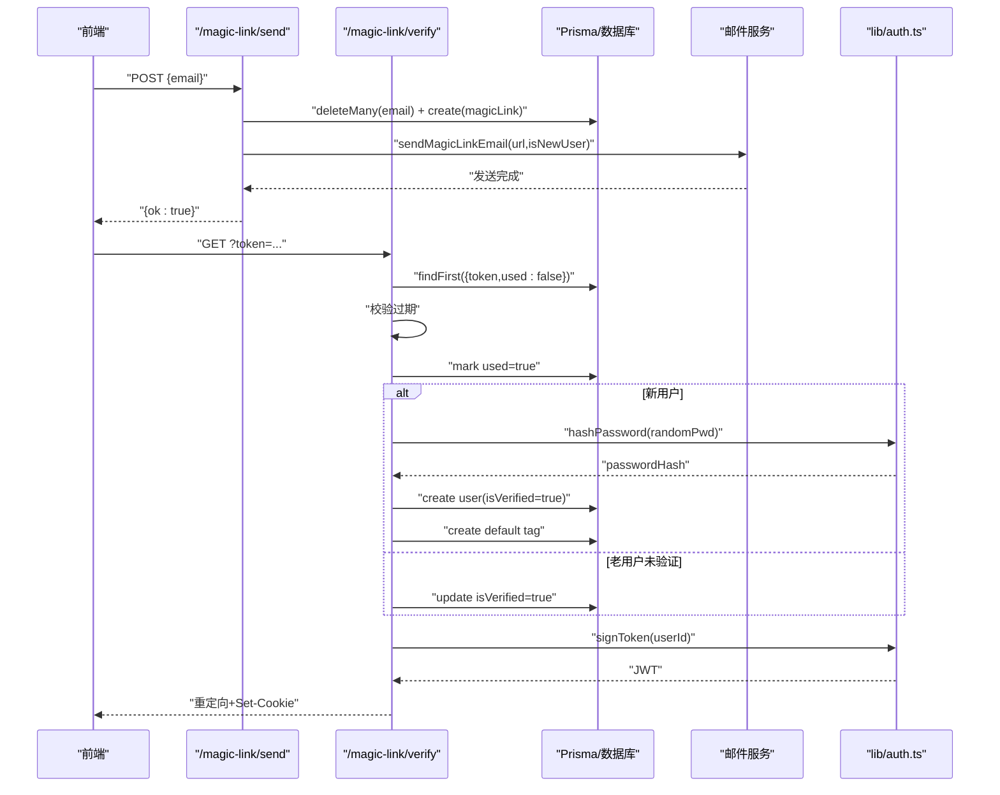
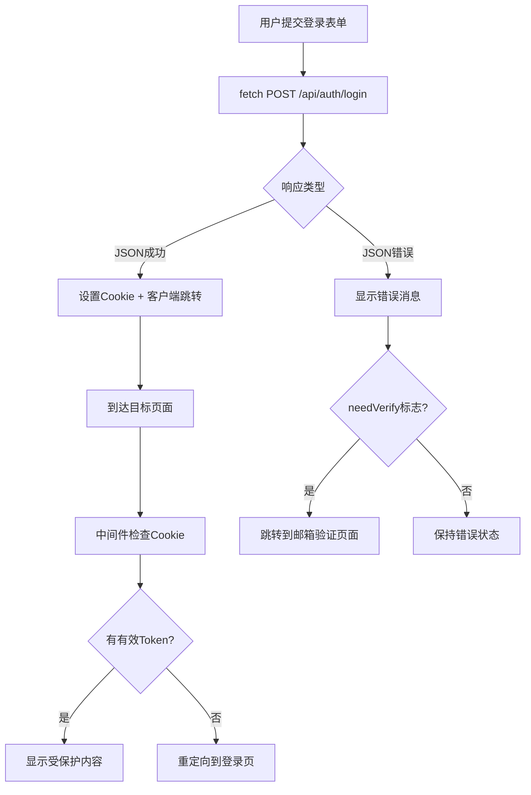
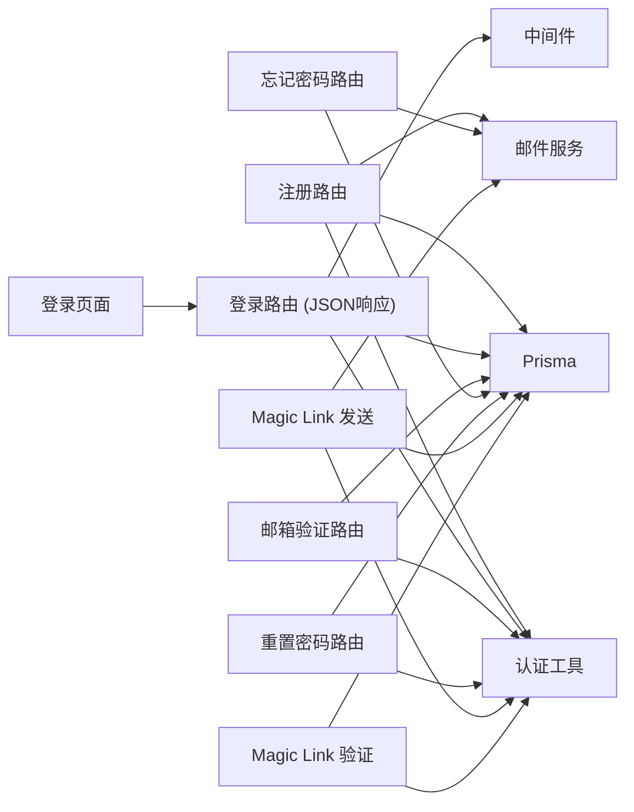
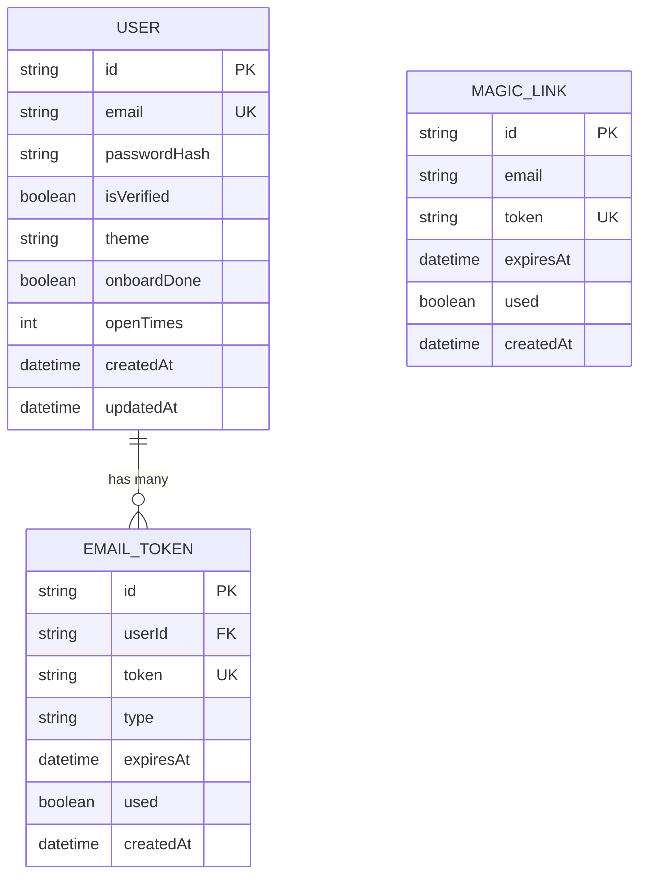

# 密码认证

<cite>
**本文引用的文件列表**
- [app/api/auth/register/route.ts](file://app/api/auth/register/route.ts)
- [app/api/auth/login/route.ts](file://app/api/auth/login/route.ts)
- [app/api/auth/forgot-password/route.ts](file://app/api/auth/forgot-password/route.ts)
- [app/api/auth/reset-password/route.ts](file://app/api/auth/reset-password/route.ts)
- [app/api/auth/verify-email/route.ts](file://app/api/auth/verify-email/route.ts)
- [app/api/auth/magic-link/send/route.ts](file://app/api/auth/magic-link/send/route.ts)
- [app/api/auth/magic-link/verify/route.ts](file://app/api/auth/magic-link/verify/route.ts)
- [lib/auth.ts](file://lib/auth.ts)
- [lib/utils.ts](file://lib/utils.ts)
- [lib/mailer.ts](file://lib/mailer.ts)
- [middleware.ts](file://middleware.ts)
- [app/(auth)/login/page.tsx](file://app/(auth)/login/page.tsx)
- [prisma/schema.prisma](file://prisma/schema.prisma)
</cite>

## 更新摘要
**所做更改**
- 更新了登录流程章节，详细说明从303服务器端重定向回退到客户端重定向模式的架构变更
- 移除了nginx代理环境下cookie传递优化的相关说明
- 更新了登录API返回JSON响应的实现细节
- 增强了前端登录页面处理JSON响应和客户端跳转的逻辑说明
- 完善了Cookie设置在JSON响应中的处理方式

## 目录
1. [简介](#简介)
2. [项目结构](#项目结构)
3. [核心组件](#核心组件)
4. [架构总览](#架构总览)
5. [详细组件分析](#详细组件分析)
6. [依赖关系分析](#依赖关系分析)
7. [性能与安全考量](#性能与安全考量)
8. [故障排查指南](#故障排查指南)
9. [结论](#结论)
10. [附录：数据模型与字段说明](#附录数据模型与字段说明)

## 简介
本技术文档围绕"心芽"的密码认证系统，系统性梳理用户注册、登录、邮箱验证、密码重置以及无密码（Magic Link）流程的实现细节。重点覆盖：
- 注册流程中的邮箱格式校验、密码强度检查与重复检查
- **更新** 登录流程的用户查找、密码比对与会话创建，采用客户端重定向模式，登录API返回JSON响应而非HTTP 303重定向
- 密码重置流程的重置邮件发送、令牌校验与密码更新
- 密码加密存储使用 bcrypt 的实现细节与盐值生成策略
- 安全最佳实践与常见攻击防护方案

## 项目结构
认证相关功能采用 Next.js App Router 的 API Routes 组织，配合 Prisma 数据访问层与通用工具库。关键路径如下：
- 注册：app/api/auth/register/route.ts
- 登录：app/api/auth/login/route.ts（返回JSON响应）
- 邮箱验证：app/api/auth/verify-email/route.ts
- 忘记密码：app/api/auth/forgot-password/route.ts
- 重置密码：app/api/auth/reset-password/route.ts
- Magic Link 发送：app/api/auth/magic-link/send/route.ts
- Magic Link 验证：app/api/auth/magic-link/verify/route.ts
- 认证工具（bcrypt/jwt/cookie）：lib/auth.ts
- 验证码与随机 Token 工具：lib/utils.ts
- 邮件发送封装：lib/mailer.ts
- 路由中间件：middleware.ts
- 登录页面：app/(auth)/login/page.tsx
- 数据库模型定义：prisma/schema.prisma

**图表来源**
- [app/api/auth/register/route.ts:1-56](file://app/api/auth/register/route.ts#L1-L56)
- [app/api/auth/login/route.ts:1-39](file://app/api/auth/login/route.ts#L1-L39)
- [app/api/auth/verify-email/route.ts:1-38](file://app/api/auth/verify-email/route.ts#L1-L38)
- [app/api/auth/forgot-password/route.ts:1-34](file://app/api/auth/forgot-password/route.ts#L1-L34)
- [app/api/auth/reset-password/route.ts:1-31](file://app/api/auth/reset-password/route.ts#L1-L31)
- [app/api/auth/magic-link/send/route.ts:1-47](file://app/api/auth/magic-link/send/route.ts#L1-L47)
- [app/api/auth/magic-link/verify/route.ts:1-70](file://app/api/auth/magic-link/verify/route.ts#L1-L70)
- [lib/auth.ts:1-56](file://lib/auth.ts#L1-L56)
- [lib/utils.ts:1-59](file://lib/utils.ts#L1-L59)
- [lib/mailer.ts:1-86](file://lib/mailer.ts#L1-L86)
- [middleware.ts:1-29](file://middleware.ts#L1-L29)
- [app/(auth)/login/page.tsx:1-209](file://app/(auth)/login/page.tsx#L1-L209)
- [prisma/schema.prisma:1-209](file://prisma/schema.prisma#L1-L209)

## 核心组件
- 认证工具（lib/auth.ts）
  - 提供密码哈希与校验（基于 bcryptjs）、JWT 签发与校验、Cookie 配置与当前用户提取。
  - 密码哈希使用固定成本参数，确保在可接受延迟下具备足够抗暴力破解能力。
  - Cookie配置包含httpOnly、secure、sameSite等安全属性设置。
- 工具库（lib/utils.ts）
  - 提供验证码生成与随机 Token 生成方法，用于邮箱验证码与重置链接令牌。
- 邮件服务（lib/mailer.ts）
  - 封装 SMTP 客户端，提供验证码、Magic Link、重置密码三类邮件发送能力。
- 路由中间件（middleware.ts）
  - 负责请求拦截、认证检查和重定向逻辑，支持调试日志输出。
- 数据模型（prisma/schema.prisma）
  - 用户、邮箱令牌、Magic Link 等实体定义，支撑注册、登录、验证与重置流程。

**章节来源**
- [lib/auth.ts:1-56](file://lib/auth.ts#L1-L56)
- [lib/utils.ts:1-59](file://lib/utils.ts#L1-L59)
- [lib/mailer.ts:1-86](file://lib/mailer.ts#L1-L86)
- [middleware.ts:1-29](file://middleware.ts#L1-L29)
- [prisma/schema.prisma:10-31](file://prisma/schema.prisma#L10-L31)
- [prisma/schema.prisma:124-136](file://prisma/schema.prisma#L124-L136)
- [prisma/schema.prisma:138-148](file://prisma/schema.prisma#L138-L148)

## 架构总览
整体认证架构遵循"前端表单 -> API 路由 -> 业务逻辑 -> 数据持久化 -> 外部服务（邮件）"的分层模式。**更新** 登录流程现已采用客户端重定向模式，登录API返回JSON响应并在响应头中设置Cookie，前端接收响应后手动进行客户端跳转。会话通过 HttpOnly Cookie 承载 JWT，服务端统一从请求中解析当前用户身份。

**图表来源**
- [app/api/auth/register/route.ts:1-56](file://app/api/auth/register/route.ts#L1-L56)
- [app/api/auth/login/route.ts:1-39](file://app/api/auth/login/route.ts#L1-L39)
- [lib/auth.ts:1-56](file://lib/auth.ts#L1-L56)
- [lib/mailer.ts:1-86](file://lib/mailer.ts#L1-L86)
- [prisma/schema.prisma:10-31](file://prisma/schema.prisma#L10-L31)

## 详细组件分析

### 用户注册流程
- 输入校验
  - 必填校验：邮箱与密码不能为空。
  - 邮箱格式：正则匹配基础邮箱格式。
  - 密码强度：最小长度限制。
- 重复检查
  - 根据邮箱查询用户；若已存在且已验证则拒绝注册；未验证账号允许复用并重新发送验证码。
- 密码处理
  - 调用 bcrypt 进行哈希后落库。
- 默认标签初始化
  - 新用户自动创建"随笔"默认标签。
- 验证码与邮件
  - 生成6位数字验证码，有效期10分钟，写入 emailTokens 表并发送邮件。

**图表来源**
- [app/api/auth/register/route.ts:1-56](file://app/api/auth/register/route.ts#L1-L56)
- [lib/auth.ts:9-16](file://lib/auth.ts#L9-L16)
- [lib/utils.ts:2-4](file://lib/utils.ts#L2-L4)
- [lib/mailer.ts:15-33](file://lib/mailer.ts#L15-L33)
- [prisma/schema.prisma:10-31](file://prisma/schema.prisma#L10-L31)
- [prisma/schema.prisma:57-69](file://prisma/schema.prisma#L57-L69)
- [prisma/schema.prisma:124-136](file://prisma/schema.prisma#L124-L136)

**章节来源**
- [app/api/auth/register/route.ts:1-56](file://app/api/auth/register/route.ts#L1-L56)
- [lib/auth.ts:9-16](file://lib/auth.ts#L9-L16)
- [lib/utils.ts:2-4](file://lib/utils.ts#L2-L4)
- [lib/mailer.ts:15-33](file://lib/mailer.ts#L15-L33)
- [prisma/schema.prisma:10-31](file://prisma/schema.prisma#L10-L31)
- [prisma/schema.prisma:57-69](file://prisma/schema.prisma#L57-L69)
- [prisma/schema.prisma:124-136](file://prisma/schema.prisma#L124-L136)

### 登录验证机制
**重大更新** 登录流程已从303服务器端重定向回退到客户端重定向模式，登录API现在返回JSON响应并在响应头中设置Cookie，前端接收响应后手动进行客户端跳转。

- 输入校验：邮箱与密码必填。
- 用户查找：按邮箱精确查找用户。
- 状态检查：未验证邮箱禁止登录。
- 密码比对：使用 bcrypt.compare 进行安全比对。
- **新特性** 会话创建：签发 JWT 并通过JSON响应设置Cookie，同时累计用户打开次数。
- **新特性** 响应格式：返回包含用户信息的JSON对象，包括onboardDone和theme字段。
- **新特性** 错误处理：增强的try-catch处理和详细的调试日志输出。

**图表来源**
- [app/api/auth/login/route.ts:1-39](file://app/api/auth/login/route.ts#L1-L39)
- [lib/auth.ts:14-21](file://lib/auth.ts#L14-L21)
- [prisma/schema.prisma:10-31](file://prisma/schema.prisma#L10-L31)

**章节来源**
- [app/api/auth/login/route.ts:1-39](file://app/api/auth/login/route.ts#L1-L39)
- [lib/auth.ts:14-21](file://lib/auth.ts#L14-L21)
- [prisma/schema.prisma:10-31](file://prisma/schema.prisma#L10-L31)

### 邮箱验证流程
- 接收 userId 与验证码。
- 校验验证码是否存在、类型是否为 verify、是否未使用、是否过期。
- 标记验证码为已使用，并将用户标记为已验证。
- 自动登录：签发 JWT 并设置 Cookie。

**图表来源**
- [app/api/auth/verify-email/route.ts:1-38](file://app/api/auth/verify-email/route.ts#L1-L38)
- [lib/auth.ts:19-21](file://lib/auth.ts#L19-L21)
- [prisma/schema.prisma:10-31](file://prisma/schema.prisma#L10-L31)
- [prisma/schema.prisma:124-136](file://prisma/schema.prisma#L124-L136)

**章节来源**
- [app/api/auth/verify-email/route.ts:1-38](file://app/api/auth/verify-email/route.ts#L1-L38)
- [lib/auth.ts:19-21](file://lib/auth.ts#L19-L21)
- [prisma/schema.prisma:10-31](file://prisma/schema.prisma#L10-L31)
- [prisma/schema.prisma:124-136](file://prisma/schema.prisma#L124-L136)

### 密码重置流程
- 忘记密码
  - 校验邮箱存在且已验证。
  - 生成一次性重置令牌（30分钟有效），清理旧 reset 令牌并保存新令牌。
  - 构建重置链接并发送邮件。
- 重置密码
  - 校验 token 存在、类型为 reset、未使用、未过期。
  - 校验新密码强度（最小长度）。
  - 哈希新密码并更新用户，标记令牌为已使用。

**图表来源**
- [app/api/auth/forgot-password/route.ts:1-34](file://app/api/auth/forgot-password/route.ts#L1-L34)
- [app/api/auth/reset-password/route.ts:1-31](file://app/api/auth/reset-password/route.ts#L1-L31)
- [lib/auth.ts:9-16](file://lib/auth.ts#L9-L16)
- [lib/mailer.ts:64-85](file://lib/mailer.ts#L64-L85)
- [prisma/schema.prisma:124-136](file://prisma/schema.prisma#L124-L136)

**章节来源**
- [app/api/auth/forgot-password/route.ts:1-34](file://app/api/auth/forgot-password/route.ts#L1-L34)
- [app/api/auth/reset-password/route.ts:1-31](file://app/api/auth/reset-password/route.ts#L1-L31)
- [lib/auth.ts:9-16](file://lib/auth.ts#L9-L16)
- [lib/mailer.ts:64-85](file://lib/mailer.ts#L64-L85)
- [prisma/schema.prisma:124-136](file://prisma/schema.prisma#L124-L136)

### Magic Link 登录/注册流程
- 发送
  - 校验邮箱格式。
  - 生成一次性 token（15分钟有效），清理旧 token 并保存。
  - 判断是否新用户，构建链接并发送邮件。
- 验证
  - 校验 token 存在、未使用、未过期。
  - 新用户：自动生成临时密码并哈希，创建用户并标记已验证，创建默认标签。
  - 老用户：若未验证则自动验证。
  - 签发 JWT 并设置 Cookie，跳转至首页或引导页。

**图表来源**
- [app/api/auth/magic-link/send/route.ts:1-47](file://app/api/auth/magic-link/send/route.ts#L1-L47)
- [app/api/auth/magic-link/verify/route.ts:1-70](file://app/api/auth/magic-link/verify/route.ts#L1-L70)
- [lib/auth.ts:9-21](file://lib/auth.ts#L9-L21)
- [lib/mailer.ts:35-61](file://lib/mailer.ts#L35-L61)
- [prisma/schema.prisma:10-31](file://prisma/schema.prisma#L10-L31)
- [prisma/schema.prisma:57-69](file://prisma/schema.prisma#L57-L69)
- [prisma/schema.prisma:138-148](file://prisma/schema.prisma#L138-L148)

**章节来源**
- [app/api/auth/magic-link/send/route.ts:1-47](file://app/api/auth/magic-link/send/route.ts#L1-L47)
- [app/api/auth/magic-link/verify/route.ts:1-70](file://app/api/auth/magic-link/verify/route.ts#L1-L70)
- [lib/auth.ts:9-21](file://lib/auth.ts#L9-L21)
- [lib/mailer.ts:35-61](file://lib/mailer.ts#L35-L61)
- [prisma/schema.prisma:10-31](file://prisma/schema.prisma#L10-L31)
- [prisma/schema.prisma:57-69](file://prisma/schema.prisma#L57-L69)
- [prisma/schema.prisma:138-148](file://prisma/schema.prisma#L138-L148)

### 前端登录页面与重定向处理
**新增** 前端登录页面已适配新的客户端重定向机制，包含完善的错误恢复逻辑。

- 密码登录处理
  - 使用fetch发送登录请求，设置credentials: "include"以支持跨域cookie。
  - 处理JSON响应，当登录成功时从响应数据中提取主题和用户信息。
  - 如果检测到需要邮箱验证，跳转到验证页面。
  - 登录成功后根据onboardDone状态决定跳转目标。
- 主题同步机制
  - 从响应数据中提取主题设置并同步到localStorage。
  - 使用sessionStorage标记需要强制刷新主题。
- 错误恢复机制
  - 增强的try-catch块处理网络异常。
  - 自动检测登录状态并重试跳转逻辑。

**图表来源**
- [app/(auth)/login/page.tsx:37-67](file://app/(auth)/login/page.tsx#L37-L67)
- [middleware.ts:13-21](file://middleware.ts#L13-L21)

**章节来源**
- [app/(auth)/login/page.tsx:37-67](file://app/(auth)/login/page.tsx#L37-L67)
- [middleware.ts:13-21](file://middleware.ts#L13-L21)

### 密码加密存储与盐值策略
- 算法与实现
  - 使用 bcryptjs 进行密码哈希与比对。
  - 哈希时指定固定成本参数，以平衡安全性与性能。
- 盐值生成
  - bcrypt 内部在每次哈希时自动生成随机盐值，无需手动管理。
- 验证过程
  - 比对时直接传入明文与存储的哈希值，由库函数完成盐值提取与计算。

**章节来源**
- [lib/auth.ts:9-16](file://lib/auth.ts#L9-L16)

## 依赖关系分析
- 模块耦合
  - API 路由仅依赖认证工具、Prisma 与邮件服务，职责清晰，内聚度高。
  - 认证工具集中管理密码与 JWT 逻辑，避免在各路由重复实现。
  - 中间件统一管理认证检查和重定向逻辑。
- 外部依赖
  - bcryptjs：密码哈希与比对。
  - jsonwebtoken：JWT 签发与校验。
  - nodemailer：SMTP 邮件发送。
  - Prisma：数据库访问与事务一致性保障。
- 潜在循环依赖
  - 当前分层清晰，未发现循环导入问题。

**图表来源**
- [app/api/auth/register/route.ts:1-56](file://app/api/auth/register/route.ts#L1-L56)
- [app/api/auth/login/route.ts:1-39](file://app/api/auth/login/route.ts#L1-L39)
- [app/api/auth/verify-email/route.ts:1-38](file://app/api/auth/verify-email/route.ts#L1-L38)
- [app/api/auth/forgot-password/route.ts:1-34](file://app/api/auth/forgot-password/route.ts#L1-L34)
- [app/api/auth/reset-password/route.ts:1-31](file://app/api/auth/reset-password/route.ts#L1-L31)
- [app/api/auth/magic-link/send/route.ts:1-47](file://app/api/auth/magic-link/send/route.ts#L1-L47)
- [app/api/auth/magic-link/verify/route.ts:1-70](file://app/api/auth/magic-link/verify/route.ts#L1-L70)
- [lib/auth.ts:1-56](file://lib/auth.ts#L1-L56)
- [lib/mailer.ts:1-86](file://lib/mailer.ts#L1-L86)
- [middleware.ts:1-29](file://middleware.ts#L1-L29)
- [app/(auth)/login/page.tsx:1-209](file://app/(auth)/login/page.tsx#L1-L209)

**章节来源**
- [app/api/auth/register/route.ts:1-56](file://app/api/auth/register/route.ts#L1-L56)
- [app/api/auth/login/route.ts:1-39](file://app/api/auth/login/route.ts#L1-L39)
- [app/api/auth/verify-email/route.ts:1-38](file://app/api/auth/verify-email/route.ts#L1-L38)
- [app/api/auth/forgot-password/route.ts:1-34](file://app/api/auth/forgot-password/route.ts#L1-L34)
- [app/api/auth/reset-password/route.ts:1-31](file://app/api/auth/reset-password/route.ts#L1-L31)
- [app/api/auth/magic-link/send/route.ts:1-47](file://app/api/auth/magic-link/send/route.ts#L1-L47)
- [app/api/auth/magic-link/verify/route.ts:1-70](file://app/api/auth/magic-link/verify/route.ts#L1-L70)
- [lib/auth.ts:1-56](file://lib/auth.ts#L1-L56)
- [lib/mailer.ts:1-86](file://lib/mailer.ts#L1-L86)
- [middleware.ts:1-29](file://middleware.ts#L1-L29)
- [app/(auth)/login/page.tsx:1-209](file://app/(auth)/login/page.tsx#L1-L209)

## 性能与安全考量
- 性能
  - bcrypt 哈希成本参数影响 CPU 开销，建议在生产环境结合压测调整。
  - 验证码与重置令牌均设置较短有效期，降低长期驻留风险。
  - **更新** 客户端重定向减少了服务器端处理复杂度，提升了登录响应速度。
- 安全
  - 密码不落地明文，仅存储 bcrypt 哈希。
  - 令牌一次有效且带过期时间，防止重放。
  - Cookie 使用 httpOnly 减少 XSS 窃取风险；生产环境应启用 secure 与 strict sameSite。
  - 邮箱验证与 Magic Link 流程对未验证用户进行拦截，避免未确认账户被滥用。
- 建议
  - 引入速率限制与防刷策略（如 IP 限流、验证码重试上限）。
  - 审计日志记录敏感操作（登录失败、重置尝试）。
  - 定期轮换 JWT 密钥与 SMTP 授权码。

## 故障排查指南
- 注册失败
  - 检查邮箱格式与密码长度是否符合要求。
  - 查看是否已有相同邮箱且已验证。
  - 核对数据库连接与邮件服务配置。
- 登录失败
  - 确认邮箱是否已完成验证。
  - 核对密码是否正确，关注 bcrypt 比对结果。
  - **更新** 检查JSON响应是否正确返回，查看浏览器开发者工具的Network面板。
  - **更新** 验证Cookie是否正确设置在响应头中。
  - **更新** 检查前端客户端跳转逻辑是否正常执行。
- 邮箱验证失败
  - 确认验证码未过期且未被使用。
  - 检查 emailTokens 表中对应记录的状态。
- 重置密码失败
  - 确认重置链接未过期且未被使用。
  - 检查新密码强度是否符合要求。
  - 核对 emailTokens 表记录与用户更新结果。
- Magic Link 失败
  - 检查 magicLink 表记录是否存在、未使用、未过期。
  - 确认邮件发送成功与链接可达。
- **新增** 客户端重定向相关问题
  - 检查中间件的认证逻辑是否正确执行。
  - 验证前端fetch请求的credentials配置。
  - 查看服务器端的调试日志输出。

**章节来源**
- [app/api/auth/register/route.ts:1-56](file://app/api/auth/register/route.ts#L1-L56)
- [app/api/auth/login/route.ts:1-39](file://app/api/auth/login/route.ts#L1-L39)
- [app/api/auth/verify-email/route.ts:1-38](file://app/api/auth/verify-email/route.ts#L1-L38)
- [app/api/auth/forgot-password/route.ts:1-34](file://app/api/auth/forgot-password/route.ts#L1-L34)
- [app/api/auth/reset-password/route.ts:1-31](file://app/api/auth/reset-password/route.ts#L1-L31)
- [app/api/auth/magic-link/send/route.ts:1-47](file://app/api/auth/magic-link/send/route.ts#L1-L47)
- [app/api/auth/magic-link/verify/route.ts:1-70](file://app/api/auth/magic-link/verify/route.ts#L1-L70)
- [middleware.ts:1-29](file://middleware.ts#L1-L29)
- [app/(auth)/login/page.tsx:37-67](file://app/(auth)/login/page.tsx#L37-L67)

## 结论
本认证体系通过清晰的 API 分层、严格的输入校验、安全的密码存储与会话管理，实现了注册、登录、邮箱验证与密码重置的核心能力，并辅以 Magic Link 提升用户体验。**重要改进** 登录流程现已回退到客户端重定向模式，登录API返回JSON响应并在响应头中设置Cookie，前端接收响应后手动进行客户端跳转。这种架构简化了服务器端处理逻辑，提升了系统的可维护性和扩展性。建议在后续迭代中完善速率限制、审计日志与更严格的安全策略，以进一步提升系统的健壮性与安全性。

## 附录：数据模型与字段说明
- User
  - id、email、passwordHash、isVerified、theme、onboardDone、openTimes、createdAt、updatedAt
- EmailToken
  - id、userId、token、type、expiresAt、used、createdAt
- MagicLink
  - id、email、token、expiresAt、used、createdAt

**图表来源**
- [prisma/schema.prisma:10-31](file://prisma/schema.prisma#L10-L31)
- [prisma/schema.prisma:124-136](file://prisma/schema.prisma#L124-L136)
- [prisma/schema.prisma:138-148](file://prisma/schema.prisma#L138-L148)

**章节来源**
- [prisma/schema.prisma:10-31](file://prisma/schema.prisma#L10-L31)
- [prisma/schema.prisma:124-136](file://prisma/schema.prisma#L124-L136)
- [prisma/schema.prisma:138-148](file://prisma/schema.prisma#L138-L148)