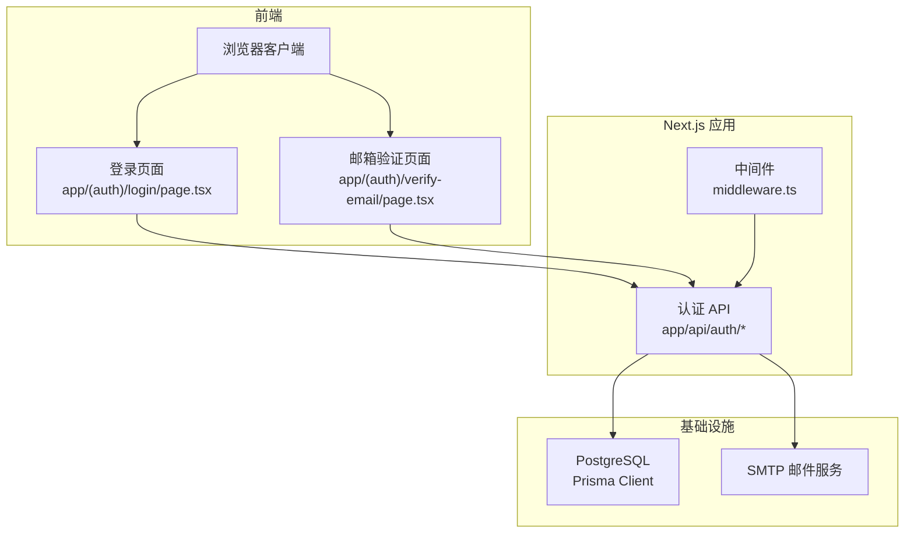
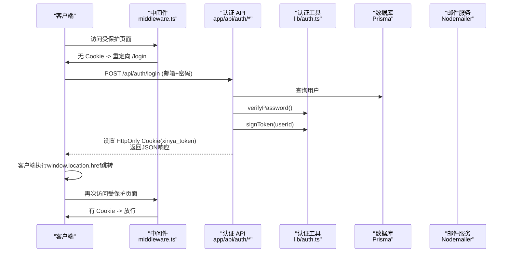
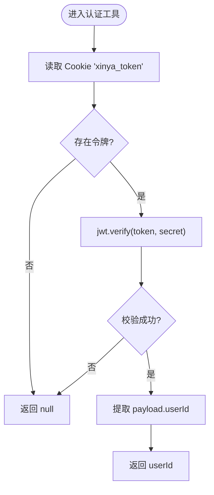
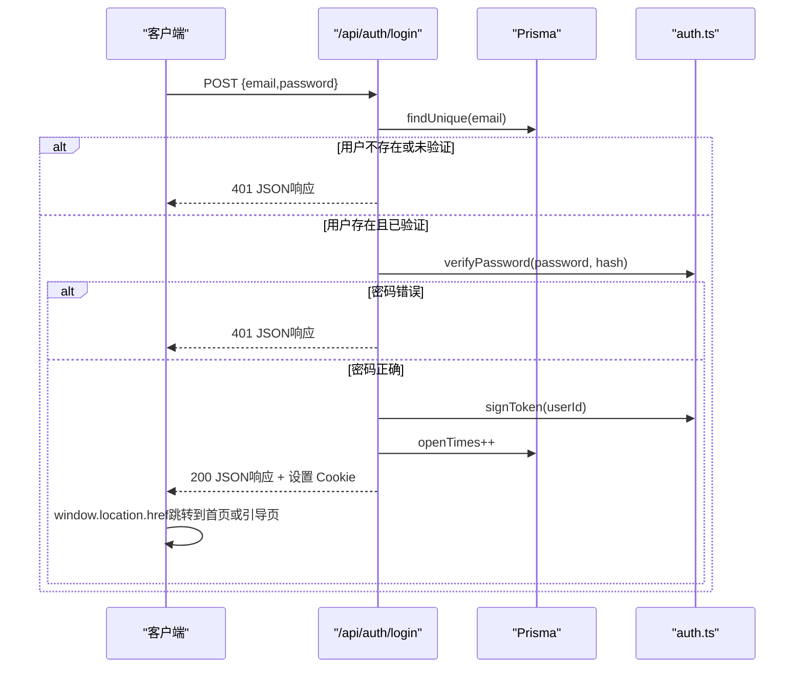
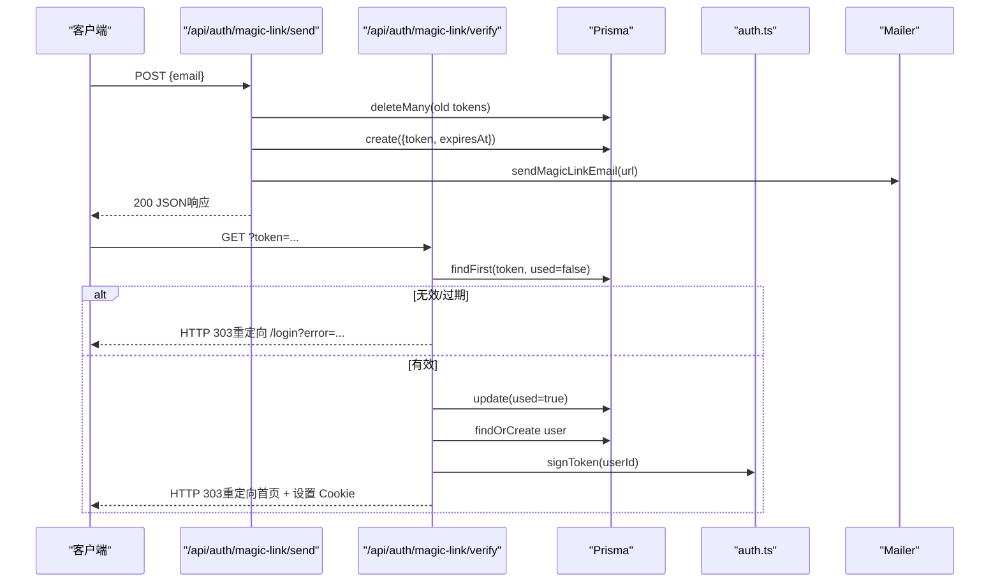
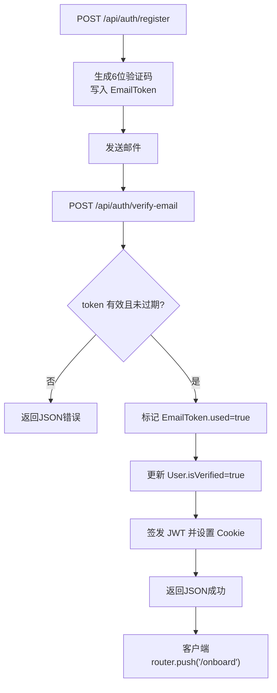
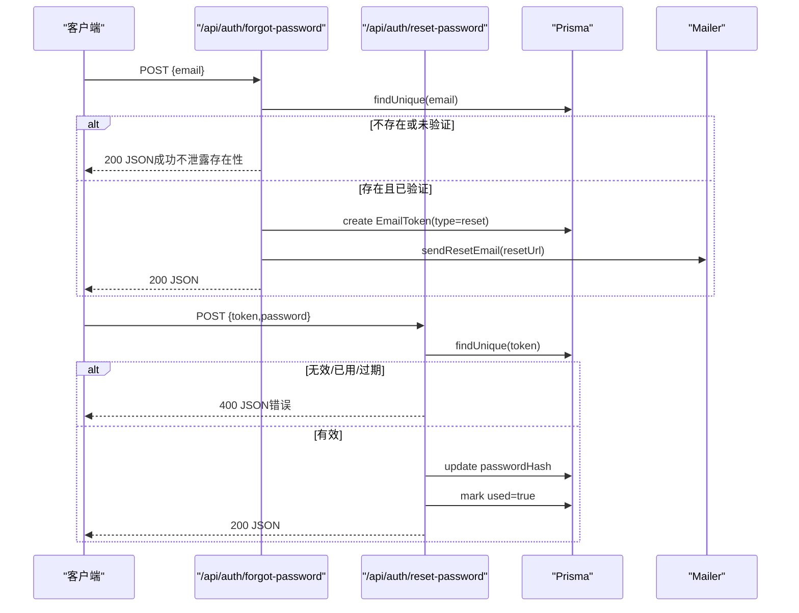
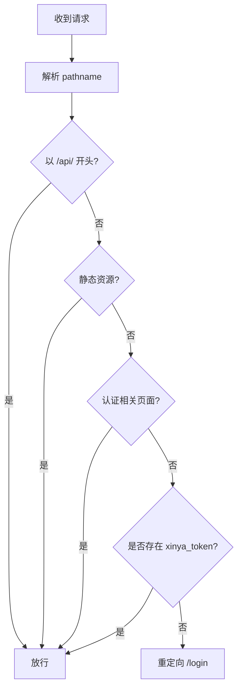
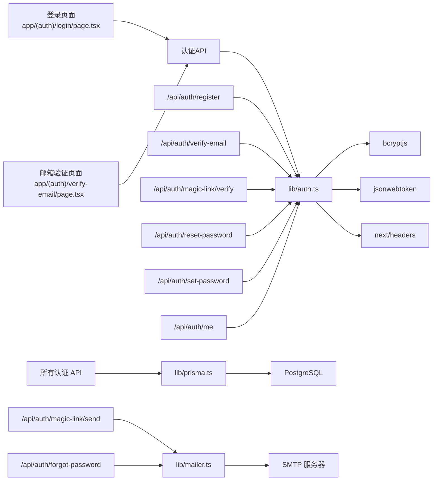
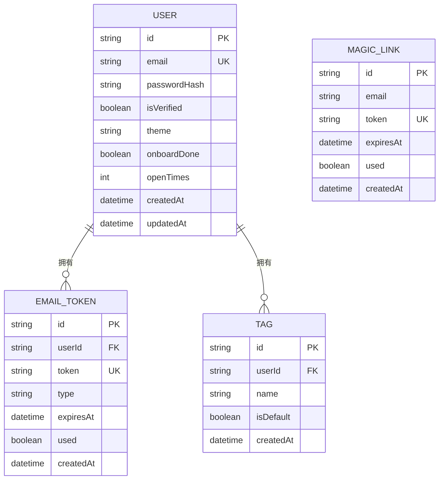

# 用户认证系统

<cite>
**本文引用的文件**
- [lib/auth.ts](file://lib/auth.ts)
- [middleware.ts](file://middleware.ts)
- [app/api/auth/login/route.ts](file://app/api/auth/login/route.ts)
- [app/api/auth/register/route.ts](file://app/api/auth/register/route.ts)
- [app/api/auth/verify-email/route.ts](file://app/api/auth/verify-email/route.ts)
- [app/api/auth/magic-link/send/route.ts](file://app/api/auth/magic-link/send/route.ts)
- [app/api/auth/magic-link/verify/route.ts](file://app/api/auth/magic-link/verify/route.ts)
- [app/api/auth/forgot-password/route.ts](file://app/api/auth/forgot-password/route.ts)
- [app/api/auth/reset-password/route.ts](file://app/api/auth/reset-password/route.ts)
- [app/api/auth/set-password/route.ts](file://app/api/auth/set-password/route.ts)
- [app/api/auth/me/route.ts](file://app/api/auth/me/route.ts)
- [app/(auth)/login/page.tsx](file://app/(auth)/login/page.tsx)
- [app/(auth)/verify-email/page.tsx](file://app/(auth)/verify-email/page.tsx)
- [lib/prisma.ts](file://lib/prisma.ts)
- [lib/mailer.ts](file://lib/mailer.ts)
- [lib/utils.ts](file://lib/utils.ts)
- [prisma/schema.prisma](file://prisma/schema.prisma)
</cite>

## 更新摘要
**所做更改**
- 更新了认证流程架构，从服务器端HTTP 303重定向回滚到客户端重定向模型
- 移除了服务器端增强的错误处理和调试日志功能
- 简化了登录后的页面跳转逻辑，前端负责导航控制
- 更新了Magic Link验证和邮箱验证的响应模式
- 调整了API返回格式以支持客户端导航

## 目录
1. [简介](#简介)
2. [项目结构](#项目结构)
3. [核心组件](#核心组件)
4. [架构总览](#架构总览)
5. [详细组件分析](#详细组件分析)
6. [依赖关系分析](#依赖关系分析)
7. [性能与可扩展性](#性能与可扩展性)
8. [故障排查指南](#故障排查指南)
9. [结论](#结论)
10. [附录：API 规范与错误处理](#附录api-规范与错误处理)

## 简介
本技术文档面向心芽的用户认证子系统，系统性阐述基于 JWT 的令牌认证机制、多种登录方式（邮箱密码与 Magic Link）、会话管理策略与安全最佳实践。文档覆盖密码加密存储、邮箱验证流程、认证中间件与权限控制、安全考虑（CSRF/XSS/会话劫持防护）以及认证相关 API 接口规范与错误处理策略。

**重要更新**：认证系统已回滚到客户端重定向模型，移除了服务器端HTTP 303重定向、增强错误处理和调试日志功能。当前实现采用更简单的客户端导航模式，前端负责登录后的页面跳转。

## 项目结构
认证相关代码主要分布在以下位置：
- 认证工具与通用逻辑：lib/auth.ts
- Next.js 路由中间件：middleware.ts
- 认证 API 路由：app/api/auth/*
- 认证前端页面：app/(auth)/*
- 数据库模型与连接：prisma/schema.prisma、lib/prisma.ts
- 邮件发送：lib/mailer.ts
- 通用工具：lib/utils.ts

图表来源
- [middleware.ts:1-29](file://middleware.ts#L1-L29)
- [app/(auth)/login/page.tsx:1-209](file://app/(auth)/login/page.tsx#L1-L209)
- [app/(auth)/verify-email/page.tsx:1-107](file://app/(auth)/verify-email/page.tsx#L1-L107)
- [lib/prisma.ts:1-14](file://lib/prisma.ts#L1-L14)
- [lib/mailer.ts:1-86](file://lib/mailer.ts#L1-L86)

章节来源
- [middleware.ts:1-29](file://middleware.ts#L1-L29)
- [app/(auth)/login/page.tsx:1-209](file://app/(auth)/login/page.tsx#L1-L209)
- [app/(auth)/verify-email/page.tsx:1-107](file://app/(auth)/verify-email/page.tsx#L1-L107)
- [lib/prisma.ts:1-14](file://lib/prisma.ts#L1-L14)
- [lib/mailer.ts:1-86](file://lib/mailer.ts#L1-L86)

## 核心组件
- 认证工具库（lib/auth.ts）
  - 密码哈希与校验：bcryptjs
  - JWT 签发与校验：jsonwebtoken
  - Cookie 配置：名称、httpOnly、sameSite、maxAge、path
  - 从请求中解析当前用户 ID：读取 Cookie 并校验 JWT
- 认证中间件（middleware.ts）
  - 对非 API 和非静态资源路径进行鉴权拦截
  - 未登录访问受保护页面时重定向至 /login
- 认证 API 路由（app/api/auth/*）
  - 注册、邮箱验证码验证、邮箱密码登录、Magic Link 发送与验证、忘记密码、重置密码、设置密码、获取当前用户信息
- 认证前端页面（app/(auth)/*）
  - 登录页面：支持邮箱链接登录和密码登录两种模式
  - 邮箱验证页面：处理验证码输入和自动提交
- 数据层（prisma/schema.prisma + lib/prisma.ts）
  - User、EmailToken、MagicLink 等模型
  - Prisma Client 单例初始化
- 邮件服务（lib/mailer.ts）
  - 使用 Nodemailer 通过 SMTP 发送验证码、Magic Link、重置密码链接
- 工具函数（lib/utils.ts）
  - 生成验证码、随机 Token、文本与日期工具

**更新**：前端页面现在负责处理登录成功后的客户端导航，不再依赖服务器的HTTP重定向。

章节来源
- [lib/auth.ts:1-56](file://lib/auth.ts#L1-L56)
- [middleware.ts:1-29](file://middleware.ts#L1-L29)
- [app/(auth)/login/page.tsx:1-209](file://app/(auth)/login/page.tsx#L1-L209)
- [app/(auth)/verify-email/page.tsx:1-107](file://app/(auth)/verify-email/page.tsx#L1-L107)
- [app/api/auth/login/route.ts:1-39](file://app/api/auth/login/route.ts#L1-L39)
- [app/api/auth/register/route.ts:1-56](file://app/api/auth/register/route.ts#L1-L56)
- [app/api/auth/verify-email/route.ts:1-38](file://app/api/auth/verify-email/route.ts#L1-L38)
- [app/api/auth/magic-link/send/route.ts:1-47](file://app/api/auth/magic-link/send/route.ts#L1-L47)
- [app/api/auth/magic-link/verify/route.ts:1-70](file://app/api/auth/magic-link/verify/route.ts#L1-L70)
- [app/api/auth/forgot-password/route.ts:1-34](file://app/api/auth/forgot-password/route.ts#L1-L34)
- [app/api/auth/reset-password/route.ts:1-31](file://app/api/auth/reset-password/route.ts#L1-L31)
- [app/api/auth/set-password/route.ts:1-27](file://app/api/auth/set-password/route.ts#L1-L27)
- [app/api/auth/me/route.ts:1-18](file://app/api/auth/me/route.ts#L1-L18)
- [lib/prisma.ts:1-14](file://lib/prisma.ts#L1-L14)
- [lib/mailer.ts:1-86](file://lib/mailer.ts#L1-L86)
- [lib/utils.ts:1-59](file://lib/utils.ts#L1-L59)
- [prisma/schema.prisma:1-209](file://prisma/schema.prisma#L1-L209)

## 架构总览
整体采用"服务端签发 JWT 到 HttpOnly Cookie"的模式，配合 Next.js 中间件在页面渲染前完成鉴权；API 路由内部通过工具函数从 Cookie 解析当前用户身份。**更新**：登录成功后由前端客户端负责页面跳转，而非服务器端HTTP重定向。

**更新**：序列图反映了新的客户端重定向模式，API返回JSON响应而非HTTP 303重定向。

图表来源
- [middleware.ts:1-29](file://middleware.ts#L1-L29)
- [app/api/auth/login/route.ts:1-39](file://app/api/auth/login/route.ts#L1-L39)
- [app/(auth)/login/page.tsx:37-67](file://app/(auth)/login/page.tsx#L37-L67)
- [lib/auth.ts:1-56](file://lib/auth.ts#L1-L56)
- [lib/prisma.ts:1-14](file://lib/prisma.ts#L1-L14)
- [lib/mailer.ts:1-86](file://lib/mailer.ts#L1-L86)

## 详细组件分析

### JWT 令牌机制（生成、验证、刷新）
- 令牌生成
  - 使用固定密钥签发，载荷仅包含 userId，有效期 30 天
  - 通过响应头设置名为 xinya_token 的 HttpOnly Cookie
- 令牌验证
  - 工具函数提供统一校验入口，失败返回空
  - 中间件与 API 均通过该工具从 Cookie 提取当前用户 ID
- 令牌刷新
  - 当前实现为长时效 Cookie，未提供显式刷新接口
  - 建议后续引入短效 Access Token + 长效 Refresh Token 方案，并提供刷新端点

图表来源
- [lib/auth.ts:1-56](file://lib/auth.ts#L1-L56)

章节来源
- [lib/auth.ts:1-56](file://lib/auth.ts#L1-L56)

### 传统邮箱密码登录
- 输入校验：邮箱与密码必填
- 用户查找：按邮箱唯一键查询
- 状态检查：未验证邮箱拒绝登录
- 密码校验：bcrypt.compare
- 签发令牌：signToken(userId)，写入 Cookie
- 行为记录：openTimes 自增
- **更新**：API返回JSON响应，前端客户端负责页面跳转

**更新**：序列图显示了新的客户端重定向流程，API返回JSON而非HTTP重定向。

图表来源
- [app/api/auth/login/route.ts:1-39](file://app/api/auth/login/route.ts#L1-L39)
- [app/(auth)/login/page.tsx:37-67](file://app/(auth)/login/page.tsx#L37-L67)
- [lib/auth.ts:1-56](file://lib/auth.ts#L1-L56)
- [lib/prisma.ts:1-14](file://lib/prisma.ts#L1-L14)

章节来源
- [app/api/auth/login/route.ts:1-39](file://app/api/auth/login/route.ts#L1-L39)
- [app/(auth)/login/page.tsx:37-67](file://app/(auth)/login/page.tsx#L37-L67)
- [lib/auth.ts:1-56](file://lib/auth.ts#L1-L56)
- [lib/prisma.ts:1-14](file://lib/prisma.ts#L1-L14)

### Magic Link 无密码登录
- 发送流程
  - 校验邮箱格式
  - 生成一次性 token（32 字节随机），有效期 15 分钟
  - 清理旧 token，创建新记录
  - 判断是否新用户，构建跳转 URL 并发送邮件
- 验证流程
  - 根据 token 查找未使用且未过期的记录
  - 标记已使用
  - 若为新用户则自动创建账号并设置默认标签；老用户若未验证则自动验证
  - 签发 JWT 并设置 Cookie
  - **更新**：返回HTTP重定向响应，前端接收后自动跳转

**更新**：Magic Link验证仍然使用服务器端HTTP重定向，这与传统的登录流程不同。

图表来源
- [app/api/auth/magic-link/send/route.ts:1-47](file://app/api/auth/magic-link/send/route.ts#L1-L47)
- [app/api/auth/magic-link/verify/route.ts:1-70](file://app/api/auth/magic-link/verify/route.ts#L1-L70)
- [lib/mailer.ts:1-86](file://lib/mailer.ts#L1-L86)
- [lib/auth.ts:1-56](file://lib/auth.ts#L1-L56)
- [lib/prisma.ts:1-14](file://lib/prisma.ts#L1-L14)

章节来源
- [app/api/auth/magic-link/send/route.ts:1-47](file://app/api/auth/magic-link/send/route.ts#L1-L47)
- [app/api/auth/magic-link/verify/route.ts:1-70](file://app/api/auth/magic-link/verify/route.ts#L1-L70)
- [lib/mailer.ts:1-86](file://lib/mailer.ts#L1-L86)
- [lib/auth.ts:1-56](file://lib/auth.ts#L1-L56)
- [lib/prisma.ts:1-14](file://lib/prisma.ts#L1-L14)

### 邮箱验证流程
- 注册后自动生成 6 位验证码，有效期 10 分钟，存入 EmailToken
- 验证接口校验 token 有效性，成功后标记用户已验证并自动登录（设置 Cookie）
- **更新**：API返回JSON响应，前端客户端负责跳转到引导页面

**更新**：流程图显示了新的客户端导航模式，验证成功后前端负责页面跳转。

图表来源
- [app/api/auth/register/route.ts:1-56](file://app/api/auth/register/route.ts#L1-L56)
- [app/api/auth/verify-email/route.ts:1-38](file://app/api/auth/verify-email/route.ts#L1-L38)
- [app/(auth)/verify-email/page.tsx:36-53](file://app/(auth)/verify-email/page.tsx#L36-L53)
- [lib/utils.ts:1-59](file://lib/utils.ts#L1-L59)
- [lib/mailer.ts:1-86](file://lib/mailer.ts#L1-L86)
- [lib/auth.ts:1-56](file://lib/auth.ts#L1-L56)

章节来源
- [app/api/auth/register/route.ts:1-56](file://app/api/auth/register/route.ts#L1-L56)
- [app/api/auth/verify-email/route.ts:1-38](file://app/api/auth/verify-email/route.ts#L1-L38)
- [app/(auth)/verify-email/page.tsx:36-53](file://app/(auth)/verify-email/page.tsx#L36-L53)
- [lib/utils.ts:1-59](file://lib/utils.ts#L1-L59)
- [lib/mailer.ts:1-86](file://lib/mailer.ts#L1-L86)
- [lib/auth.ts:1-56](file://lib/auth.ts#L1-L56)

### 忘记密码与重置密码
- 忘记密码
  - 校验邮箱存在且已验证
  - 生成一次性 reset token（30 分钟），写入 EmailToken
  - 发送重置链接邮件
- 重置密码
  - 校验 token 类型、未使用、未过期
  - 哈希新密码并更新用户
  - 标记 token 已使用

图表来源
- [app/api/auth/forgot-password/route.ts:1-34](file://app/api/auth/forgot-password/route.ts#L1-L34)
- [app/api/auth/reset-password/route.ts:1-31](file://app/api/auth/reset-password/route.ts#L1-L31)
- [lib/mailer.ts:1-86](file://lib/mailer.ts#L1-L86)
- [lib/utils.ts:1-59](file://lib/utils.ts#L1-L59)
- [lib/prisma.ts:1-14](file://lib/prisma.ts#L1-L14)

章节来源
- [app/api/auth/forgot-password/route.ts:1-34](file://app/api/auth/forgot-password/route.ts#L1-L34)
- [app/api/auth/reset-password/route.ts:1-31](file://app/api/auth/reset-password/route.ts#L1-L31)
- [lib/mailer.ts:1-86](file://lib/mailer.ts#L1-L86)
- [lib/utils.ts:1-59](file://lib/utils.ts#L1-L59)
- [lib/prisma.ts:1-14](file://lib/prisma.ts#L1-L14)

### 设置密码（登录后）
- 要求已登录（从 Cookie 解析 userId）
- 校验密码长度
- 哈希后更新用户密码

章节来源
- [app/api/auth/set-password/route.ts:1-27](file://app/api/auth/set-password/route.ts#L1-L27)
- [lib/auth.ts:1-56](file://lib/auth.ts#L1-L56)

### 获取当前用户信息
- 从 Cookie 解析 userId
- 查询用户基础信息并返回

章节来源
- [app/api/auth/me/route.ts:1-18](file://app/api/auth/me/route.ts#L1-L18)
- [lib/auth.ts:1-56](file://lib/auth.ts#L1-L56)
- [lib/prisma.ts:1-14](file://lib/prisma.ts#L1-L14)

### 认证中间件与权限控制
- 中间件作用域
  - 跳过 /api/* 与静态资源
  - 对认证相关页面放行
  - 其他页面若无 Cookie 则重定向至 /login
- 权限粒度
  - 当前为全局登录态校验，未实现细粒度 RBAC
  - 可在 API 路由内按业务需求增加角色/权限判断

图表来源
- [middleware.ts:1-29](file://middleware.ts#L1-L29)

章节来源
- [middleware.ts:1-29](file://middleware.ts#L1-L29)

## 依赖关系分析
- 模块耦合
  - API 路由依赖 prisma 与 auth 工具
  - 认证工具依赖 bcryptjs、jsonwebtoken、next/headers
  - 邮件功能独立于认证流程，通过回调触发
  - **更新**：前端页面依赖认证API并负责客户端导航
- 外部依赖
  - PostgreSQL（通过 Prisma）
  - SMTP（QQ 邮箱）
  - 第三方库：bcryptjs、jsonwebtoken、nodemailer

**更新**：依赖图增加了前端认证页面的依赖关系。

图表来源
- [lib/auth.ts:1-56](file://lib/auth.ts#L1-L56)
- [app/(auth)/login/page.tsx:1-209](file://app/(auth)/login/page.tsx#L1-L209)
- [app/(auth)/verify-email/page.tsx:1-107](file://app/(auth)/verify-email/page.tsx#L1-L107)
- [lib/prisma.ts:1-14](file://lib/prisma.ts#L1-L14)
- [lib/mailer.ts:1-86](file://lib/mailer.ts#L1-L86)
- [app/api/auth/login/route.ts:1-39](file://app/api/auth/login/route.ts#L1-L39)
- [app/api/auth/register/route.ts:1-56](file://app/api/auth/register/route.ts#L1-L56)
- [app/api/auth/verify-email/route.ts:1-38](file://app/api/auth/verify-email/route.ts#L1-L38)
- [app/api/auth/magic-link/send/route.ts:1-47](file://app/api/auth/magic-link/send/route.ts#L1-L47)
- [app/api/auth/magic-link/verify/route.ts:1-70](file://app/api/auth/magic-link/verify/route.ts#L1-L70)
- [app/api/auth/forgot-password/route.ts:1-34](file://app/api/auth/forgot-password/route.ts#L1-L34)
- [app/api/auth/reset-password/route.ts:1-31](file://app/api/auth/reset-password/route.ts#L1-L31)
- [app/api/auth/set-password/route.ts:1-27](file://app/api/auth/set-password/route.ts#L1-L27)
- [app/api/auth/me/route.ts:1-18](file://app/api/auth/me/route.ts#L1-L18)

章节来源
- [lib/auth.ts:1-56](file://lib/auth.ts#L1-L56)
- [app/(auth)/login/page.tsx:1-209](file://app/(auth)/login/page.tsx#L1-L209)
- [app/(auth)/verify-email/page.tsx:1-107](file://app/(auth)/verify-email/page.tsx#L1-L107)
- [lib/prisma.ts:1-14](file://lib/prisma.ts#L1-L14)
- [lib/mailer.ts:1-86](file://lib/mailer.ts#L1-L86)

## 性能与可扩展性
- 密码哈希
  - bcrypt 成本因子 12，兼顾安全与性能；在高并发场景可评估适当调整
- JWT 校验
  - 每次请求仅一次轻量签名校验，开销低
- 数据库
  - 常用字段建立索引（如 email、token、userId 组合）
- 扩展建议
  - 引入短效 Access Token + 长效 Refresh Token，支持静默刷新
  - 增加登录频率限制与异常检测（IP/设备指纹）
  - 将 Cookie secure 设置为 true（生产 HTTPS）
  - **更新**：客户端重定向减少了服务器负载，提高了响应速度

[本节为通用指导，无需源码引用]

## 故障排查指南
- 登录失败
  - 检查邮箱是否已验证、密码是否正确、Cookie 是否被浏览器策略阻止
  - **更新**：检查前端是否正确处理API返回的JSON响应
- Magic Link 无效/过期
  - 确认链接未被重复点击、是否在有效期内、是否已被标记使用
  - **更新**：检查服务器端HTTP重定向是否正确处理
- 邮箱验证码失败
  - 核对验证码是否过期、是否已被使用
  - **更新**：检查前端是否正确处理验证结果并执行客户端导航
- 重置密码失败
  - 检查重置链接是否过期、是否已被使用
- 日志定位
  - 各路由均有 try/catch 与 console.error 输出，结合后端日志快速定位

**更新**：故障排查指南增加了客户端重定向相关的检查项。

章节来源
- [app/api/auth/login/route.ts:1-39](file://app/api/auth/login/route.ts#L1-L39)
- [app/(auth)/login/page.tsx:37-67](file://app/(auth)/login/page.tsx#L37-L67)
- [app/api/auth/magic-link/verify/route.ts:1-70](file://app/api/auth/magic-link/verify/route.ts#L1-L70)
- [app/api/auth/verify-email/route.ts:1-38](file://app/api/auth/verify-email/route.ts#L1-L38)
- [app/(auth)/verify-email/page.tsx:36-53](file://app/(auth)/verify-email/page.tsx#L36-L53)
- [app/api/auth/reset-password/route.ts:1-31](file://app/api/auth/reset-password/route.ts#L1-L31)

## 结论
本认证系统采用成熟的 JWT + HttpOnly Cookie 方案，结合中间件实现统一的登录态校验，支持邮箱密码与 Magic Link 两种登录方式，并配套完善的邮箱验证与密码找回流程。**重要更新**：系统已回滚到客户端重定向模型，移除了服务器端HTTP 303重定向、增强错误处理和调试日志功能，采用更简单的客户端导航模式，前端负责登录后的页面跳转。建议在后续迭代中引入更严格的 Cookie 安全策略、短效令牌与刷新机制，以及更细粒度的权限控制与风控策略，以提升安全性与可扩展性。

[本节为总结，无需源码引用]

## 附录：API 规范与错误处理

- 通用约定
  - 成功响应：{ ok: true, data?: any }
  - 失败响应：{ ok: false, error: string } 或 { error: string }
  - 状态码：400 参数错误、401 未授权/未验证、500 服务器错误
  - **更新**：大多数API返回JSON响应，由前端客户端负责导航

- 认证相关 API
  - POST /api/auth/register
    - 请求体：{ email, password }
    - 成功：{ ok: true, data: { userId } }
    - 失败：400 参数/格式/已注册；500 服务器错误
  - POST /api/auth/verify-email
    - 请求体：{ userId, code }
    - 成功：{ ok: true }（同时设置 Cookie，前端客户端跳转）
    - 失败：400 验证码错误或过期；500 服务器错误
  - POST /api/auth/login
    - 请求体：{ email, password }
    - 成功：{ ok: true, data: { onboardDone, theme } }（设置 Cookie，前端客户端跳转）
    - 失败：400 参数缺失；401 邮箱未验证/密码错误；500 服务器错误
  - POST /api/auth/magic-link/send
    - 请求体：{ email }
    - 成功：{ ok: true, data: { email } }
    - 失败：400 参数/格式；500 服务器错误
  - GET /api/auth/magic-link/verify
    - 查询参数：token
    - 成功：HTTP 303重定向至首页或引导页（设置 Cookie）
    - 失败：HTTP 303重定向至 /login?error=...
  - POST /api/auth/forgot-password
    - 请求体：{ email }
    - 成功：{ ok: true }（不泄露用户是否存在）
    - 失败：400 参数缺失；500 服务器错误
  - POST /api/auth/reset-password
    - 请求体：{ token, password }
    - 成功：{ ok: true }
    - 失败：400 参数/无效或已用/过期；500 服务器错误
  - POST /api/auth/set-password
    - 请求体：{ password }
    - 成功：{ ok: true }
    - 失败：401 未登录；400 参数/长度不足；500 服务器错误
  - GET /api/auth/me
    - 成功：{ ok: true, data: { id, email, theme, onboardDone, openTimes } }
    - 失败：401 未登录

**更新**：API规范反映了新的响应模式，大多数API返回JSON而非HTTP重定向。

章节来源
- [app/api/auth/register/route.ts:1-56](file://app/api/auth/register/route.ts#L1-L56)
- [app/api/auth/verify-email/route.ts:1-38](file://app/api/auth/verify-email/route.ts#L1-L38)
- [app/api/auth/login/route.ts:1-39](file://app/api/auth/login/route.ts#L1-L39)
- [app/api/auth/magic-link/send/route.ts:1-47](file://app/api/auth/magic-link/send/route.ts#L1-L47)
- [app/api/auth/magic-link/verify/route.ts:1-70](file://app/api/auth/magic-link/verify/route.ts#L1-L70)
- [app/api/auth/forgot-password/route.ts:1-34](file://app/api/auth/forgot-password/route.ts#L1-L34)
- [app/api/auth/reset-password/route.ts:1-31](file://app/api/auth/reset-password/route.ts#L1-L31)
- [app/api/auth/set-password/route.ts:1-27](file://app/api/auth/set-password/route.ts#L1-L27)
- [app/api/auth/me/route.ts:1-18](file://app/api/auth/me/route.ts#L1-L18)

## 安全考虑与最佳实践

- CSRF 防护
  - 当前为同源 SPA 模式，使用 SameSite=Lax 的 Cookie 可降低跨站风险
  - 建议在生产环境启用 SameSite=None 并配合 HTTPS，同时在敏感操作增加自定义请求头校验或 CSRF Token
- XSS 防护
  - 避免在邮件模板中直接渲染不可信内容；对用户输入进行转义与白名单过滤
  - 前端渲染遵循框架默认的安全策略，谨慎使用 dangerouslySetInnerHTML
- 会话劫持防护
  - Cookie 已设置 httpOnly，降低脚本窃取风险
  - 建议开启 secure（HTTPS）与严格的路径限制
  - 引入设备/IP 指纹与异常登录检测
- 密码安全
  - 使用 bcrypt 高成本因子哈希存储
  - 强制最小长度与复杂度（建议后续增强）
- 令牌安全
  - 当前为长时效 Cookie，建议引入短效 Access Token + 长效 Refresh Token 机制
  - 提供登出接口清除 Cookie 与服务端黑名单
- 速率限制与防刷
  - 对注册、验证码、Magic Link、重置密码等接口实施限流
  - 记录审计日志，便于追踪异常行为
- **更新**：客户端重定向安全考虑
  - 确保前端正确处理API响应，避免重定向到恶意URL
  - 验证重定向目标URL的安全性
  - 防止开放重定向攻击

[本节为通用指导，无需源码引用]

## 数据模型概览（与认证相关）

图表来源
- [prisma/schema.prisma:10-31](file://prisma/schema.prisma#L10-L31)
- [prisma/schema.prisma:124-148](file://prisma/schema.prisma#L124-L148)
- [prisma/schema.prisma:57-69](file://prisma/schema.prisma#L57-L69)