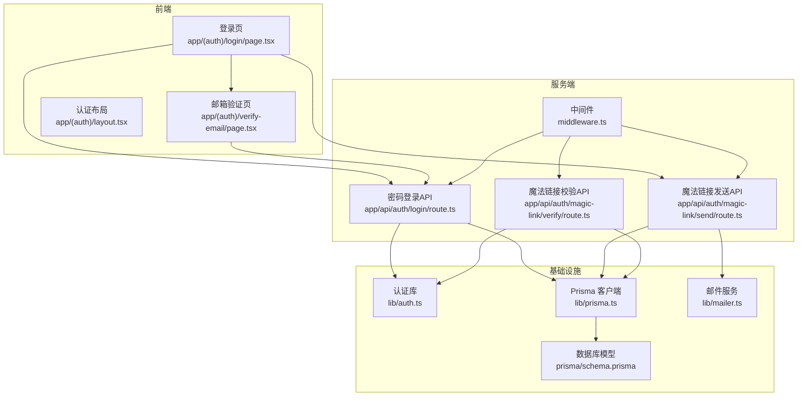
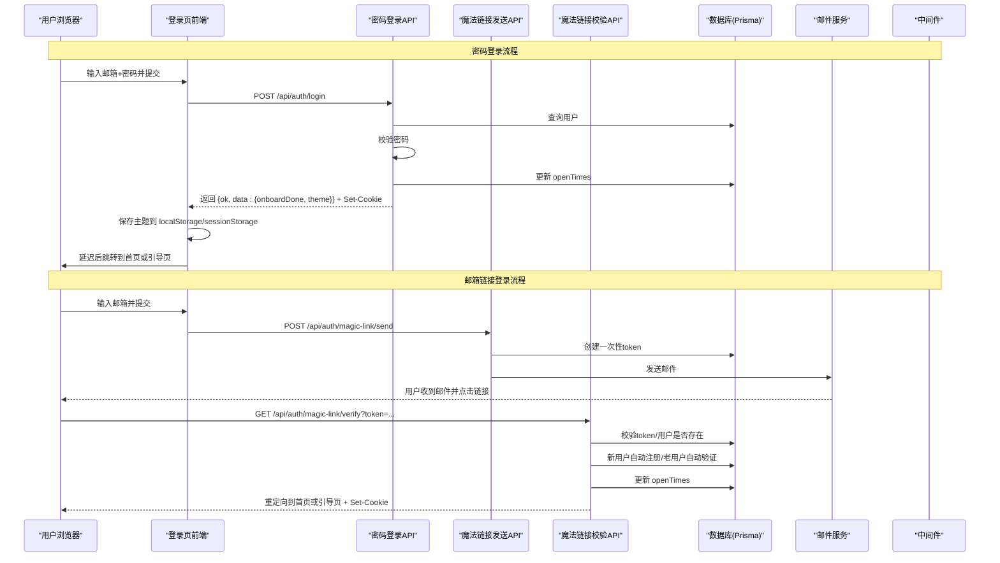
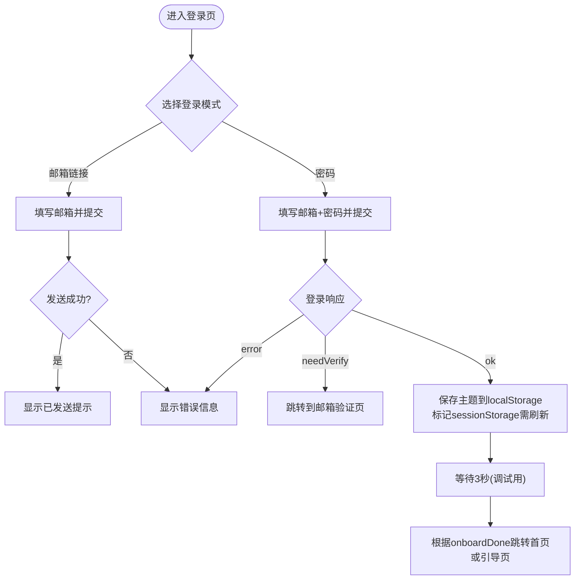
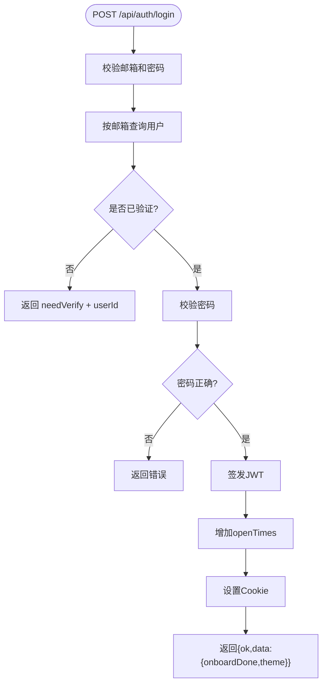
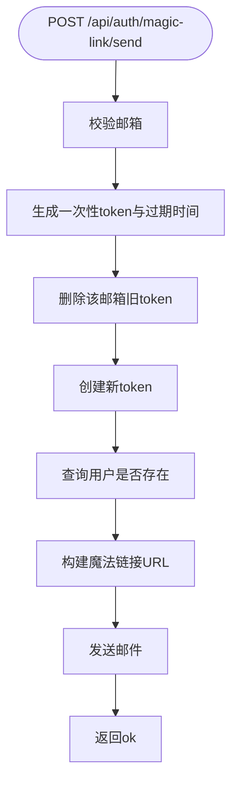
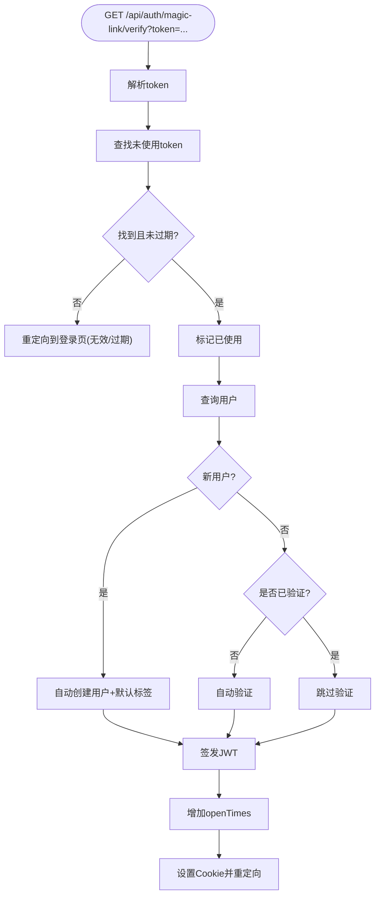
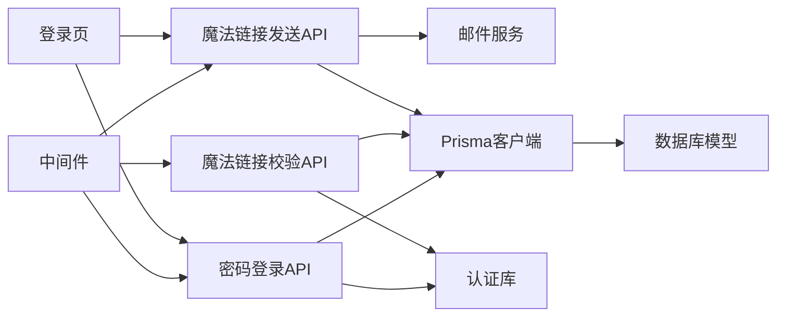
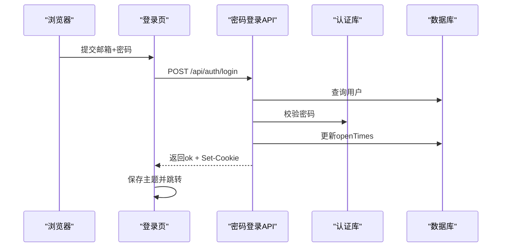
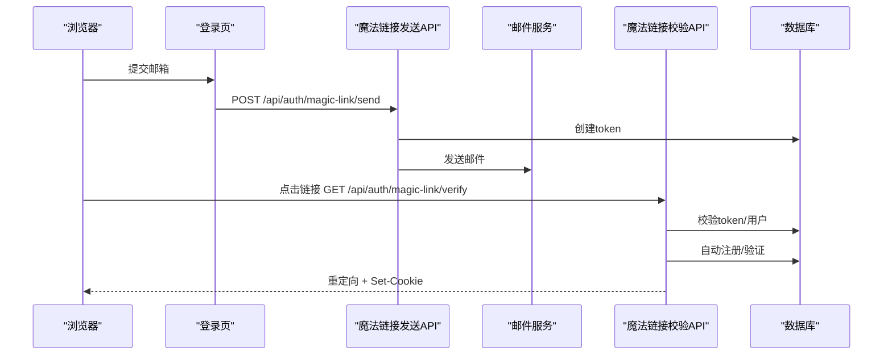

# 登录页面调试功能

<cite>
**本文引用的文件列表**
- [app/(auth)/login/page.tsx](file://app/(auth)/login/page.tsx)
- [app/api/auth/login/route.ts](file://app/api/auth/login/route.ts)
- [lib/auth.ts](file://lib/auth.ts)
- [middleware.ts](file://middleware.ts)
- [app/api/auth/magic-link/send/route.ts](file://app/api/auth/magic-link/send/route.ts)
- [app/api/auth/magic-link/verify/route.ts](file://app/api/auth/magic-link/verify/route.ts)
- [lib/prisma.ts](file://lib/prisma.ts)
- [prisma/schema.prisma](file://prisma/schema.prisma)
- [lib/mailer.ts](file://lib/mailer.ts)
- [app/(auth)/verify-email/page.tsx](file://app/(auth)/verify-email/page.tsx)
- [app/(auth)/layout.tsx](file://app/(auth)/layout.tsx)
</cite>

## 目录
1. [简介](#简介)
2. [项目结构](#项目结构)
3. [核心组件](#核心组件)
4. [架构总览](#架构总览)
5. [详细组件分析](#详细组件分析)
6. [依赖关系分析](#依赖关系分析)
7. [性能与可观测性](#性能与可观测性)
8. [故障排查指南](#故障排查指南)
9. [结论](#结论)
10. [附录：关键流程时序图](#附录关键流程时序图)

## 简介
本文件聚焦“登录页面调试功能”，围绕密码登录、邮箱链接（Magic Link）登录、邮箱验证、中间件鉴权、Cookie 与主题同步等关键环节，梳理前端页面、API 路由、认证库、数据库模型与邮件发送的协作方式。文档同时提供可视化流程图与时序图，帮助快速定位问题并优化体验。

## 项目结构
登录相关的前端页面位于 app/(auth) 下，服务端 API 位于 app/api/auth，认证逻辑集中在 lib/auth.ts，数据访问通过 Prisma 客户端 lib/prisma.ts 完成，邮件能力在 lib/mailer.ts 中实现。

图表来源
- [app/(auth)/login/page.tsx:1-213](file://app/(auth)/login/page.tsx#L1-L213)
- [app/api/auth/login/route.ts:1-43](file://app/api/auth/login/route.ts#L1-L43)
- [app/api/auth/magic-link/send/route.ts:1-47](file://app/api/auth/magic-link/send/route.ts#L1-L47)
- [app/api/auth/magic-link/verify/route.ts:1-70](file://app/api/auth/magic-link/verify/route.ts#L1-L70)
- [lib/auth.ts:1-56](file://lib/auth.ts#L1-L56)
- [lib/prisma.ts:1-14](file://lib/prisma.ts#L1-L14)
- [prisma/schema.prisma:10-148](file://prisma/schema.prisma#L10-L148)
- [lib/mailer.ts:1-86](file://lib/mailer.ts#L1-L86)
- [middleware.ts:1-37](file://middleware.ts#L1-L37)

章节来源
- [app/(auth)/login/page.tsx:1-213](file://app/(auth)/login/page.tsx#L1-L213)
- [app/api/auth/login/route.ts:1-43](file://app/api/auth/login/route.ts#L1-L43)
- [lib/auth.ts:1-56](file://lib/auth.ts#L1-L56)
- [middleware.ts:1-37](file://middleware.ts#L1-L37)
- [app/api/auth/magic-link/send/route.ts:1-47](file://app/api/auth/magic-link/send/route.ts#L1-L47)
- [app/api/auth/magic-link/verify/route.ts:1-70](file://app/api/auth/magic-link/verify/route.ts#L1-L70)
- [lib/prisma.ts:1-14](file://lib/prisma.ts#L1-L14)
- [prisma/schema.prisma:10-148](file://prisma/schema.prisma#L10-L148)
- [lib/mailer.ts:1-86](file://lib/mailer.ts#L1-L86)
- [app/(auth)/verify-email/page.tsx:1-107](file://app/(auth)/verify-email/page.tsx#L1-L107)
- [app/(auth)/layout.tsx:1-18](file://app/(auth)/layout.tsx#L1-L18)

## 核心组件
- 登录页面（前端）
  - 支持“邮箱链接登录”和“密码登录”两种模式切换
  - 处理错误提示、加载状态、跳转逻辑与主题持久化
- 密码登录 API
  - 校验输入、查询用户、校验密码、签发 JWT、设置 Cookie、返回用户主题与引导状态
- 魔法链接发送 API
  - 生成一次性 token、写入数据库、发送邮件
- 魔法链接校验 API
  - 校验 token、自动注册新用户或老用户验证、签发 JWT、重定向到首页或引导页
- 认证库
  - 密码哈希/校验、JWT 签发/校验、从请求获取当前用户 ID、Cookie 配置
- 中间件
  - 鉴权拦截、已登录用户访问认证页重定向、未登录访问受保护资源重定向
- 邮件服务
  - 验证码、魔法链接、重置密码邮件模板与发送
- 数据库模型
  - User、MagicLink、Tag 等核心实体定义

章节来源
- [app/(auth)/login/page.tsx:1-213](file://app/(auth)/login/page.tsx#L1-L213)
- [app/api/auth/login/route.ts:1-43](file://app/api/auth/login/route.ts#L1-L43)
- [app/api/auth/magic-link/send/route.ts:1-47](file://app/api/auth/magic-link/send/route.ts#L1-L47)
- [app/api/auth/magic-link/verify/route.ts:1-70](file://app/api/auth/magic-link/verify/route.ts#L1-L70)
- [lib/auth.ts:1-56](file://lib/auth.ts#L1-L56)
- [middleware.ts:1-37](file://middleware.ts#L1-L37)
- [lib/mailer.ts:1-86](file://lib/mailer.ts#L1-L86)
- [prisma/schema.prisma:10-148](file://prisma/schema.prisma#L10-L148)

## 架构总览
登录链路包含两条主线：
- 密码登录：前端表单提交 -> 密码登录 API -> 认证库校验 -> 设置 Cookie -> 前端保存主题并跳转
- 邮箱链接登录：前端提交邮箱 -> 魔法链接发送 API -> 邮件服务 -> 用户点击链接 -> 魔法链接校验 API -> 自动注册/验证 -> 设置 Cookie -> 重定向

图表来源
- [app/(auth)/login/page.tsx:1-213](file://app/(auth)/login/page.tsx#L1-L213)
- [app/api/auth/login/route.ts:1-43](file://app/api/auth/login/route.ts#L1-L43)
- [app/api/auth/magic-link/send/route.ts:1-47](file://app/api/auth/magic-link/send/route.ts#L1-L47)
- [app/api/auth/magic-link/verify/route.ts:1-70](file://app/api/auth/magic-link/verify/route.ts#L1-L70)
- [lib/auth.ts:1-56](file://lib/auth.ts#L1-L56)
- [lib/prisma.ts:1-14](file://lib/prisma.ts#L1-L14)
- [lib/mailer.ts:1-86](file://lib/mailer.ts#L1-L86)

## 详细组件分析

### 登录页面（前端）
- 功能要点
  - 双模式切换：邮箱链接登录 vs 密码登录
  - 错误信息展示与网络异常兜底
  - 密码登录成功后将服务端主题写入本地存储，并标记需要刷新主题
  - 为便于调试，登录后有短暂延时再跳转
- 交互细节
  - 邮箱链接发送成功进入“已发送”状态，支持重新发送
  - 密码登录失败时可能返回 needVerify 标志，前端会跳转到邮箱验证页

图表来源
- [app/(auth)/login/page.tsx:1-213](file://app/(auth)/login/page.tsx#L1-L213)

章节来源
- [app/(auth)/login/page.tsx:1-213](file://app/(auth)/login/page.tsx#L1-L213)

### 密码登录 API
- 处理步骤
  - 参数校验：邮箱与密码非空
  - 用户查询：按邮箱查找用户
  - 邮箱验证检查：未验证则返回 needVerify 与 userId
  - 密码校验：使用认证库比对
  - 签发 JWT：使用认证库签名
  - 记录打开次数：更新用户 openTimes
  - 设置 Cookie：使用统一 Cookie 配置
  - 返回数据：包含 onboardDone 与 theme
- 调试日志
  - 输出 token 生成、Cookie 配置、响应头等信息，便于定位 Cookie 设置问题

图表来源
- [app/api/auth/login/route.ts:1-43](file://app/api/auth/login/route.ts#L1-L43)
- [lib/auth.ts:1-56](file://lib/auth.ts#L1-L56)

章节来源
- [app/api/auth/login/route.ts:1-43](file://app/api/auth/login/route.ts#L1-L43)
- [lib/auth.ts:1-56](file://lib/auth.ts#L1-L56)

### 魔法链接发送 API
- 处理步骤
  - 校验邮箱格式
  - 生成一次性 token 与过期时间
  - 清理该邮箱旧 token，创建新 token
  - 判断是否新用户
  - 构建魔法链接 URL
  - 发送邮件
- 结果
  - 返回 ok 表示发送成功

图表来源
- [app/api/auth/magic-link/send/route.ts:1-47](file://app/api/auth/magic-link/send/route.ts#L1-L47)
- [lib/mailer.ts:1-86](file://lib/mailer.ts#L1-L86)

章节来源
- [app/api/auth/magic-link/send/route.ts:1-47](file://app/api/auth/magic-link/send/route.ts#L1-L47)
- [lib/mailer.ts:1-86](file://lib/mailer.ts#L1-L86)

### 魔法链接校验 API
- 处理步骤
  - 解析 token 并查找有效且未使用的记录
  - 校验过期时间，过期则标记已使用并返回错误
  - 标记 token 已使用
  - 若用户不存在则自动创建账号并设置默认标签；若存在但未验证则自动验证
  - 签发 JWT 并设置 Cookie
  - 根据 onboardDone 与 theme 重定向到首页或引导页
- 结果
  - 成功：重定向并携带 Cookie
  - 失败：重定向到登录页并附带错误信息

图表来源
- [app/api/auth/magic-link/verify/route.ts:1-70](file://app/api/auth/magic-link/verify/route.ts#L1-L70)
- [lib/auth.ts:1-56](file://lib/auth.ts#L1-L56)

章节来源
- [app/api/auth/magic-link/verify/route.ts:1-70](file://app/api/auth/magic-link/verify/route.ts#L1-L70)
- [lib/auth.ts:1-56](file://lib/auth.ts#L1-L56)

### 认证库与 Cookie 配置
- 功能点
  - 密码哈希与校验
  - JWT 签发与校验
  - 从请求中读取当前用户 ID
  - Cookie 配置：名称、httpOnly、sameSite、maxAge、path
- 注意
  - secure 设置为 false，适用于开发环境；生产环境建议启用 HTTPS 并开启 secure

章节来源
- [lib/auth.ts:1-56](file://lib/auth.ts#L1-L56)

### 中间件鉴权
- 行为
  - 对静态资源与 _next 路径放行
  - 认证页白名单：已登录用户访问这些页面会被重定向到首页
  - 其他页面：无 token 则重定向到登录页
- 调试
  - 输出 pathname、是否认证页、是否有 token、token 预览片段，便于定位鉴权问题

章节来源
- [middleware.ts:1-37](file://middleware.ts#L1-L37)

### 邮箱验证页
- 功能点
  - 接收 userId 与 email 参数
  - 6 位验证码输入框联动与自动提交
  - 调用验证接口，失败清空并聚焦首框
  - 倒计时重发机制（通过注册接口触发重发）
  - 成功后跳转到引导页

章节来源
- [app/(auth)/verify-email/page.tsx:1-107](file://app/(auth)/verify-email/page.tsx#L1-L107)

### 认证布局
- 作用
  - 统一的居中布局与品牌视觉元素
  - 绿色渐变背景与 Logo 区域

章节来源
- [app/(auth)/layout.tsx:1-18](file://app/(auth)/layout.tsx#L1-L18)

## 依赖关系分析
- 前端登录页依赖两个 API：密码登录与魔法链接发送
- 魔法链接发送依赖邮件服务与数据库
- 魔法链接校验依赖数据库与认证库
- 中间件依赖 Cookie 与路由匹配规则
- 所有数据访问均通过 Prisma 客户端，底层由 schema 定义

图表来源
- [app/(auth)/login/page.tsx:1-213](file://app/(auth)/login/page.tsx#L1-L213)
- [app/api/auth/login/route.ts:1-43](file://app/api/auth/login/route.ts#L1-L43)
- [app/api/auth/magic-link/send/route.ts:1-47](file://app/api/auth/magic-link/send/route.ts#L1-L47)
- [app/api/auth/magic-link/verify/route.ts:1-70](file://app/api/auth/magic-link/verify/route.ts#L1-L70)
- [lib/auth.ts:1-56](file://lib/auth.ts#L1-L56)
- [lib/prisma.ts:1-14](file://lib/prisma.ts#L1-L14)
- [prisma/schema.prisma:10-148](file://prisma/schema.prisma#L10-L148)
- [lib/mailer.ts:1-86](file://lib/mailer.ts#L1-L86)
- [middleware.ts:1-37](file://middleware.ts#L1-L37)

章节来源
- [app/(auth)/login/page.tsx:1-213](file://app/(auth)/login/page.tsx#L1-L213)
- [app/api/auth/login/route.ts:1-43](file://app/api/auth/login/route.ts#L1-L43)
- [app/api/auth/magic-link/send/route.ts:1-47](file://app/api/auth/magic-link/send/route.ts#L1-L47)
- [app/api/auth/magic-link/verify/route.ts:1-70](file://app/api/auth/magic-link/verify/route.ts#L1-L70)
- [lib/auth.ts:1-56](file://lib/auth.ts#L1-L56)
- [lib/prisma.ts:1-14](file://lib/prisma.ts#L1-L14)
- [prisma/schema.prisma:10-148](file://prisma/schema.prisma#L10-L148)
- [lib/mailer.ts:1-86](file://lib/mailer.ts#L1-L86)
- [middleware.ts:1-37](file://middleware.ts#L1-L37)

## 性能与可观测性
- 可观测性
  - 登录 API 输出 token 生成、Cookie 配置与响应头，便于定位 Cookie 设置问题
  - 中间件输出 pathname、是否认证页、是否有 token 与 token 预览，便于鉴权问题排查
- 性能考虑
  - 密码校验使用 bcrypt，成本较高但安全；确保并发场景下连接池合理配置
  - 魔法链接 token 有效期短（15分钟），减少安全风险
  - 登录成功后有 3 秒延时用于调试，生产环境应移除

[本节为通用指导，不直接分析具体文件]

## 故障排查指南
- 无法登录（密码错误）
  - 检查邮箱是否正确、密码是否匹配
  - 查看登录 API 返回的错误信息与日志
- 需要邮箱验证
  - 登录返回 needVerify 时，跳转到邮箱验证页，输入验证码后进入引导页
- 邮箱链接无效或过期
  - 魔法链接校验失败会重定向到登录页并附带错误信息
  - 确认链接是否在有效期内（15分钟）
- Cookie 未设置或无效
  - 检查中间件是否检测到 xinya_token
  - 检查登录 API 的响应头是否包含 Set-Cookie
  - 确认 Cookie 配置中的 sameSite、secure、path 是否符合部署环境
- 主题不同步
  - 登录成功后前端会将主题写入 localStorage 并标记 sessionStorage 需要刷新
  - 若主题未生效，检查本地存储与刷新标记

章节来源
- [app/api/auth/login/route.ts:1-43](file://app/api/auth/login/route.ts#L1-L43)
- [middleware.ts:1-37](file://middleware.ts#L1-L37)
- [app/(auth)/login/page.tsx:1-213](file://app/(auth)/login/page.tsx#L1-L213)
- [app/api/auth/magic-link/verify/route.ts:1-70](file://app/api/auth/magic-link/verify/route.ts#L1-L70)

## 结论
登录系统采用前后端分离的 Next.js 架构，结合 JWT Cookie 与中间件鉴权，提供密码登录与邮箱链接登录两种方式。通过完善的调试日志与清晰的错误处理，能够快速定位常见问题。建议在上线前移除调试延时、评估 Cookie 安全策略，并根据业务需求完善主题同步与用户体验。

[本节为总结性内容，不直接分析具体文件]

## 附录：关键流程时序图

### 密码登录时序

图表来源
- [app/(auth)/login/page.tsx:1-213](file://app/(auth)/login/page.tsx#L1-L213)
- [app/api/auth/login/route.ts:1-43](file://app/api/auth/login/route.ts#L1-L43)
- [lib/auth.ts:1-56](file://lib/auth.ts#L1-L56)

### 邮箱链接登录时序

图表来源
- [app/(auth)/login/page.tsx:1-213](file://app/(auth)/login/page.tsx#L1-L213)
- [app/api/auth/magic-link/send/route.ts:1-47](file://app/api/auth/magic-link/send/route.ts#L1-L47)
- [app/api/auth/magic-link/verify/route.ts:1-70](file://app/api/auth/magic-link/verify/route.ts#L1-L70)
- [lib/mailer.ts:1-86](file://lib/mailer.ts#L1-L86)