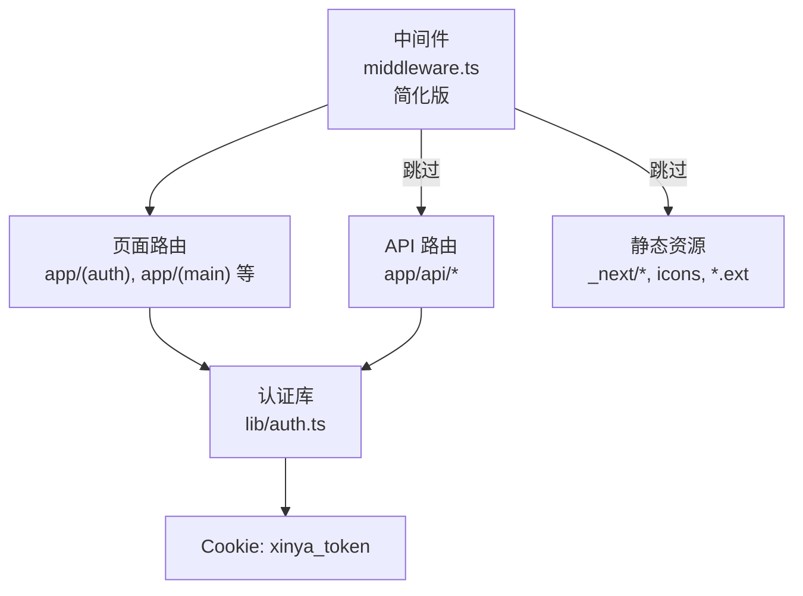
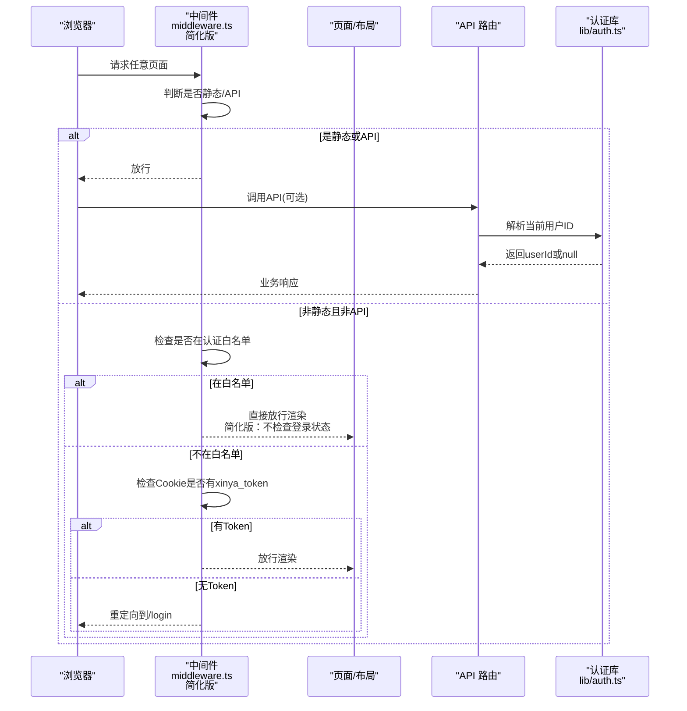
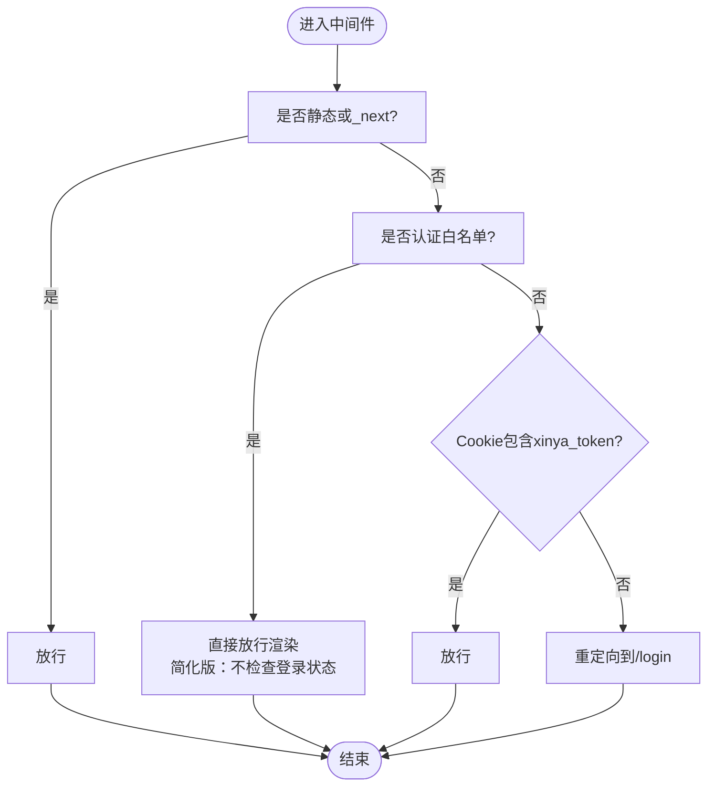
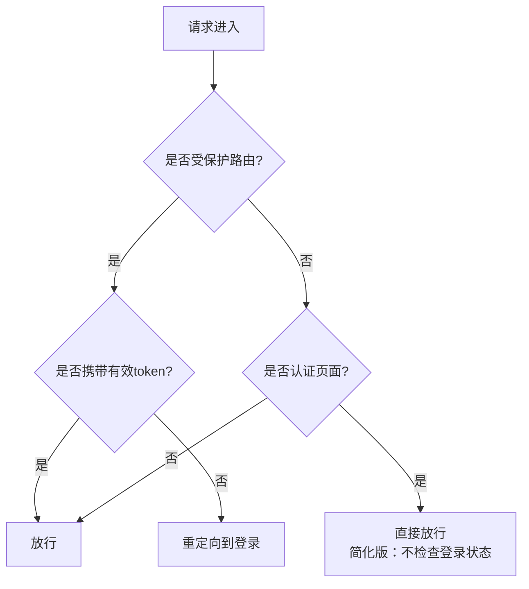
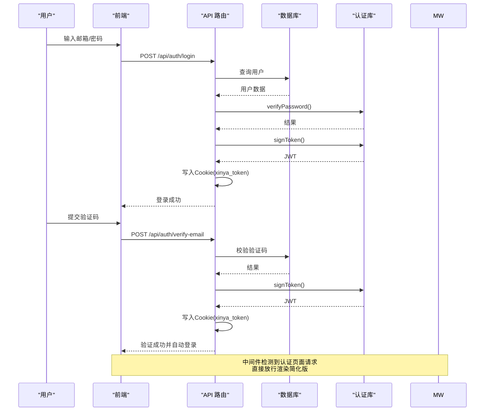
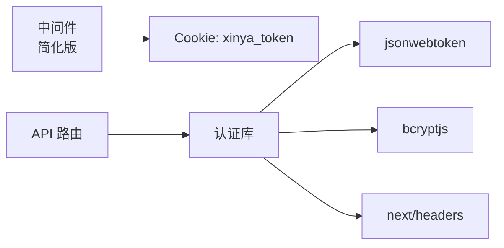

# 认证中间件

<cite>
**本文引用的文件**   
- [middleware.ts](file://middleware.ts)
- [lib/auth.ts](file://lib/auth.ts)
- [app/api/auth/login/route.ts](file://app/api/auth/login/route.ts)
- [app/api/auth/register/route.ts](file://app/api/auth/register/route.ts)
- [app/api/auth/verify-email/route.ts](file://app/api/auth/verify-email/route.ts)
- [app/page.tsx](file://app/page.tsx)
- [app/(auth)/login/page.tsx](file://app/(auth)/login/page.tsx)
- [app/(auth)/register/page.tsx](file://app/(auth)/register/page.tsx)
</cite>

## 更新摘要
**变更内容**   
- **移除了调试日志功能**：中间件不再输出详细的路径名、认证状态和令牌预览等调试信息，简化为仅关注令牌验证和重定向的核心逻辑
- **精简中间件实现**：移除了console.log调试语句，减少生产环境性能开销
- **保持核心功能**：仍然保留认证页面白名单访问、未登录用户重定向到登录页的核心鉴权逻辑

## 目录
1. [简介](#简介)
2. [项目结构](#项目结构)
3. [核心组件](#核心组件)
4. [架构总览](#架构总览)
5. [详细组件分析](#详细组件分析)
6. [依赖关系分析](#依赖关系分析)
7. [性能考虑](#性能考虑)
8. [故障排查指南](#故障排查指南)
9. [结论](#结论)
10. [附录](#附录)

## 简介
本文件为心芽应用的认证中间件系统提供完整技术文档，重点覆盖：
- Next.js 中间件的实现原理与请求拦截机制
- 路由级权限控制（公开、受保护）的配置与扩展方案
- 会话状态维护与跨请求用户上下文传递
- 未认证用户的重定向逻辑与访问控制策略
- **简化版访问控制**：所有用户均可自由访问认证页面，无需检查登录状态
- **移除调试日志**：中间件已移除详细的调试输出，专注于核心鉴权逻辑
- 中间件性能优化建议与调试方法
- 安全头设置与 CORS 配置建议

## 项目结构
本项目采用 Next.js App Router。认证相关的关键位置如下：
- 根级中间件：用于页面路由的鉴权拦截与重定向，已移除调试日志功能
- 认证工具库：JWT 签发/校验、Cookie 配置、当前用户解析
- API 路由：登录、注册、邮箱验证、密码重置等流程
- 首页入口：未登录时重定向到登录页
- 认证页面：登录、注册、邮箱验证等前端页面



**图表来源**
- [middleware.ts:1-29](file://middleware.ts#L1-L29)
- [lib/auth.ts:1-56](file://lib/auth.ts#L1-L56)

**章节来源**
- [middleware.ts:1-29](file://middleware.ts#L1-L29)
- [lib/auth.ts:1-56](file://lib/auth.ts#L1-L56)

## 核心组件
- 中间件（middleware.ts）
  - 作用：在请求到达页面之前进行鉴权判断；对静态资源和 API 直接放行；对未登录用户重定向至登录页
  - **简化版行为**：认证页面（/login、/register 等）对所有用户开放，不再检查登录状态
  - **移除调试功能**：已删除所有console.log调试语句，不再输出路径名、认证状态、令牌存在性和令牌预览信息
  - 关键行为：
    - 匹配规则：排除静态资源与图标等路径
    - 白名单：认证相关页面允许无 Token 访问
    - **简化鉴权**：认证页面直接放行，不检查用户是否已登录
    - 鉴权：检查 Cookie 中是否存在 xinya_token
    - 重定向：未登录则跳转到 /login
- 认证库（lib/auth.ts）
  - JWT 签发与校验：使用环境变量或默认密钥，有效期 30 天
  - Cookie 配置：名称、httpOnly、sameSite、maxAge、path
  - 当前用户解析：从 Cookie 读取 token 并解析出 userId
- 认证 API 路由
  - 登录：校验凭据、签发 JWT、写入 Cookie
  - 注册：校验参数、创建用户、发送验证码
  - 邮箱验证：校验验证码、标记已验证、自动登录
  - 忘记密码/重置密码：生成一次性令牌、发送邮件、更新密码
  - 设置密码：需登录态，更新密码

**章节来源**
- [middleware.ts:1-29](file://middleware.ts#L1-L29)
- [lib/auth.ts:1-56](file://lib/auth.ts#L1-L56)
- [app/api/auth/login/route.ts:1-38](file://app/api/auth/login/route.ts#L1-L38)
- [app/api/auth/register/route.ts:1-56](file://app/api/auth/register/route.ts#L1-L56)
- [app/api/auth/verify-email/route.ts:1-38](file://app/api/auth/verify-email/route.ts#L1-L38)

## 架构总览
下图展示了浏览器、Next.js 中间件、API 路由与认证库之间的交互关系，包含简化的访问控制逻辑。



**图表来源**
- [middleware.ts:1-29](file://middleware.ts#L1-L29)
- [lib/auth.ts:1-56](file://lib/auth.ts#L1-L56)
- [app/api/auth/login/route.ts:1-38](file://app/api/auth/login/route.ts#L1-L38)

## 详细组件分析

### 中间件与请求拦截机制
- 匹配范围
  - 通过 matcher 排除静态资源与图标，避免不必要的处理开销
- **简化版鉴权流程**
  - 若路径以 /api/ 或 /_next/ 开头，直接放行
  - 若路径属于认证白名单（如 /login、/register、/verify-email、/forgot-password、/reset-password、/onboard、/showcase），直接放行渲染，不再检查用户是否已登录
  - 否则检查 Cookie 中的 xinya_token，不存在则重定向到 /login
- **移除调试日志功能**
  - 已删除所有console.log调试语句
  - 不再记录路径名、认证状态、令牌存在性和令牌预览信息
  - 减少了生产环境的性能开销
- 注意事项
  - 当前仅基于"是否存在 token"做简单鉴权，未校验 token 有效性
  - 未区分管理员与普通用户，需要扩展



**图表来源**
- [middleware.ts:1-29](file://middleware.ts#L1-L29)

**章节来源**
- [middleware.ts:1-29](file://middleware.ts#L1-L29)

### 会话状态与用户上下文传递
- 会话载体
  - Cookie 名称：xinya_token
  - 属性：httpOnly、sameSite=lax、maxAge=30天、path=/
- 用户上下文获取
  - getCurrentUserId() 从 Cookie 读取 token，调用 verifyToken 解析 payload，返回 userId 或 null
- 登录与自动登录
  - 登录成功后通过 response.cookies.set 写入 Cookie
  - 邮箱验证通过后同样写入 Cookie，实现自动登录
- 登出
  - 删除 Cookie 即可退出登录

```mermaid
classDiagram
class AuthLib {
+hashPassword(password) Promise~string~
+verifyPassword(password, hash) Promise~boolean~
+signToken(userId) string
+verifyToken(token) {userId}|null
+getCurrentUserId() Promise~string|null~
+COOKIE_CONFIG
}
class Middleware {
+middleware(request) NextResponse
+config.matcher
+简化版访问控制
}
class LoginRoute {
+POST(req) NextResponse
}
class VerifyEmailRoute {
+POST(req) NextResponse
}
Middleware --> AuthLib : "读取Cookie/鉴权"
LoginRoute --> AuthLib : "签发JWT/写Cookie"
VerifyEmailRoute --> AuthLib : "签发JWT/写Cookie"
```

**图表来源**
- [lib/auth.ts:1-56](file://lib/auth.ts#L1-L56)
- [middleware.ts:1-29](file://middleware.ts#L1-L29)
- [app/api/auth/login/route.ts:1-38](file://app/api/auth/login/route.ts#L1-L38)
- [app/api/auth/verify-email/route.ts:1-38](file://app/api/auth/verify-email/route.ts#L1-L38)

**章节来源**
- [lib/auth.ts:1-56](file://lib/auth.ts#L1-L56)
- [app/api/auth/login/route.ts:1-38](file://app/api/auth/login/route.ts#L1-L38)
- [app/api/auth/verify-email/route.ts:1-38](file://app/api/auth/verify-email/route.ts#L1-L38)

### 路由级权限控制（公开、受保护）
- 当前实现
  - 公开路由：认证白名单内的页面可直接访问
  - **简化版**：所有用户（无论是否登录）均可自由访问认证页面
  - 受保护路由：除白名单外的页面需要携带有效 token
- 访问策略说明
  - 认证页面（/login、/register 等）：对所有用户开放，包括已登录用户
  - 受保护页面：需要有效的 xinya_token
  - 这种设计允许已登录用户重新登录、修改密码等操作
- 扩展建议
  - 在中间件中增加角色判断逻辑，例如根据 cookie 或后端接口返回的角色信息
  - 将管理员路由集中管理，并在中间件中进行额外校验
  - 对于 API 路由，建议在各自 route.ts 中结合 getCurrentUserId 进行二次校验



**章节来源**
- [middleware.ts:1-29](file://middleware.ts#L1-L29)

### 未认证用户重定向与访问控制策略
- **简化版重定向逻辑**
  - 当访问受保护页面且 Cookie 不含 xinya_token 时，中间件会重定向到 /login
  - **简化**：认证页面不再检查用户登录状态，所有用户均可访问
- 首页入口
  - 根页面默认重定向到 /login，确保首次访问也进入登录流程
- 访问控制策略
  - 当前策略为"存在 token 即放行"，未校验 token 签名与过期时间
  - 建议改为严格校验 token 有效性，并结合服务端角色信息进行细粒度控制

**章节来源**
- [middleware.ts:1-29](file://middleware.ts#L1-L29)
- [app/page.tsx:1-5](file://app/page.tsx#L1-L5)

### 认证流程时序（登录、注册、邮箱验证、密码重置）


**图表来源**
- [app/api/auth/login/route.ts:1-38](file://app/api/auth/login/route.ts#L1-L38)
- [app/api/auth/verify-email/route.ts:1-38](file://app/api/auth/verify-email/route.ts#L1-L38)
- [lib/auth.ts:1-56](file://lib/auth.ts#L1-L56)
- [middleware.ts:1-29](file://middleware.ts#L1-L29)

**章节来源**
- [app/api/auth/login/route.ts:1-38](file://app/api/auth/login/route.ts#L1-L38)
- [app/api/auth/register/route.ts:1-56](file://app/api/auth/register/route.ts#L1-L56)
- [app/api/auth/verify-email/route.ts:1-38](file://app/api/auth/verify-email/route.ts#L1-L38)
- [lib/auth.ts:1-56](file://lib/auth.ts#L1-L56)

## 依赖关系分析
- 模块耦合
  - 中间件依赖 request.cookies 与 NextResponse
  - 认证库依赖 bcryptjs、jsonwebtoken、next/headers
  - API 路由依赖认证库与数据库客户端
- 外部依赖
  - jsonwebtoken：用于 JWT 签发与校验
  - bcryptjs：用于密码哈希与比对
  - next/headers：用于读写 Cookie
- 潜在风险
  - 中间件未校验 token 有效性，存在绕过风险
  - COOKIE_CONFIG.secure=false，生产环境应启用 HTTPS 并设置为 true



**图表来源**
- [middleware.ts:1-29](file://middleware.ts#L1-L29)
- [lib/auth.ts:1-56](file://lib/auth.ts#L1-L56)

**章节来源**
- [middleware.ts:1-29](file://middleware.ts#L1-L29)
- [lib/auth.ts:1-56](file://lib/auth.ts#L1-L56)

## 性能考虑
- 减少中间件处理范围
  - 利用 matcher 排除静态资源与图标，避免不必要计算
- 最小化鉴权开销
  - 当前仅检查 Cookie 是否存在，未进行网络 I/O，性能较好
  - 建议仅在必要时进行 token 校验，避免频繁解析
- **移除调试日志的性能优势**
  - 已移除所有console.log调试语句，消除了生产环境的额外开销
  - 减少了字符串拼接和对象序列化的性能消耗
- 缓存与复用
  - 可在中间件层缓存常见白名单与路由策略，降低重复判断成本
- 监控与统计
  - 建议使用专业的日志系统进行访问统计，而非简单的console.log

## 故障排查指南
- **移除调试日志后的排查方法**
  - 由于已移除详细的调试输出，需要通过其他方式进行问题排查
  - 建议在API路由中添加必要的错误日志
  - 使用浏览器开发者工具检查Cookie是否正确设置
- 常见问题
  - 登录后仍被重定向到登录页：检查 Cookie 是否正确写入且未被浏览器策略阻止
  - 认证页面访问异常：确认简化版访问控制逻辑是否符合预期
  - 跨域问题：确认 SameSite 与 Secure 配置与部署环境一致
  - 验证码无效或过期：检查 emailToken 记录与过期时间
- **调试步骤**
  - 打开浏览器开发者工具，查看请求与响应头，确认 Cookie 是否携带
  - 在 API 路由中添加必要日志，打印解析到的 userId 与错误堆栈
  - 使用 curl 或 Postman 模拟请求，快速验证 API 行为
  - 检查服务器错误日志，定位具体的错误信息
- 参考实现
  - 登录、注册、邮箱验证、密码重置等 API 均包含错误处理

**章节来源**
- [middleware.ts:1-29](file://middleware.ts#L1-L29)
- [app/api/auth/login/route.ts:1-38](file://app/api/auth/login/route.ts#L1-L38)
- [app/api/auth/register/route.ts:1-56](file://app/api/auth/register/route.ts#L1-L56)
- [app/api/auth/verify-email/route.ts:1-38](file://app/api/auth/verify-email/route.ts#L1-L38)

## 结论
- 当前认证体系以 Cookie+JWT 为核心，中间件负责页面级鉴权与重定向
- **简化版访问控制**：移除了已登录用户访问认证页面的自动重定向逻辑，允许所有用户自由访问认证页面
- **移除调试功能**：中间件已完全移除调试日志功能，专注于核心鉴权逻辑，提升了生产环境性能
- 登录、注册、邮箱验证、密码重置等流程完善，具备基本的安全措施
- 建议在生产环境强化 token 校验、启用 HTTPS、细化角色权限，并补充安全头与 CORS 策略
- 建议建立完善的错误监控系统，替代原有的调试日志功能

## 附录

### 安全头设置与 CORS 配置建议
- 安全头
  - Content-Security-Policy：限制脚本与资源加载来源
  - X-Content-Type-Options: nosniff
  - X-Frame-Options: DENY 或 SAMEORIGIN
  - Referrer-Policy: strict-origin-when-cross-origin
  - Permissions-Policy：禁用不必要功能
- CORS
  - 明确允许的源、方法与头部
  - 针对敏感接口启用 credentials 与精确域名白名单
- 部署与环境
  - 生产环境务必启用 HTTPS，并将 Cookie secure=true
  - 使用环境变量管理 JWT_SECRET，避免硬编码
  - 建议集成专业的日志监控系统，替代console.log调试功能