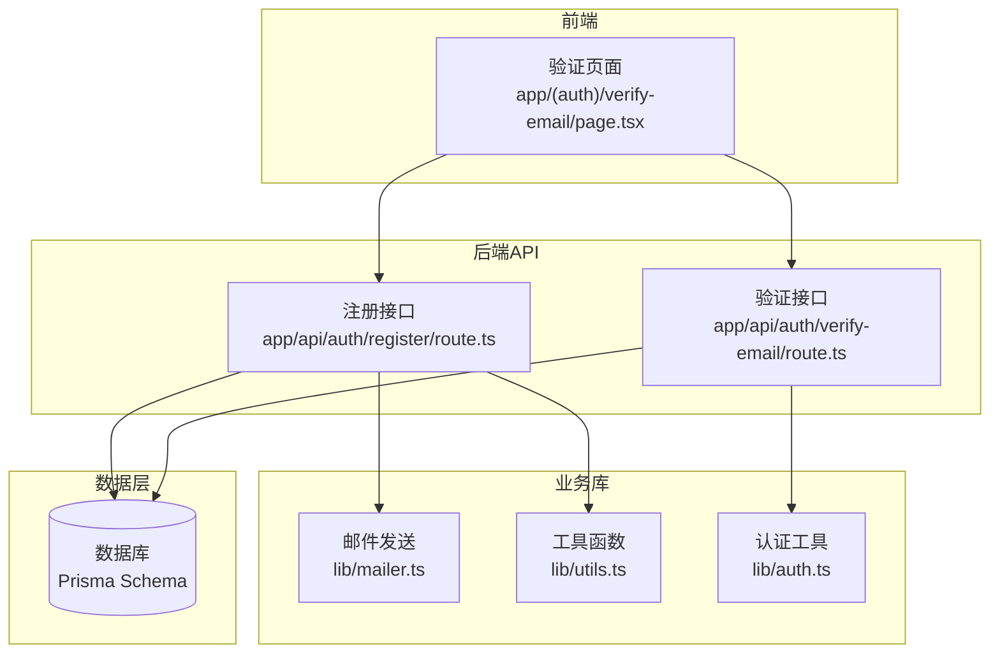
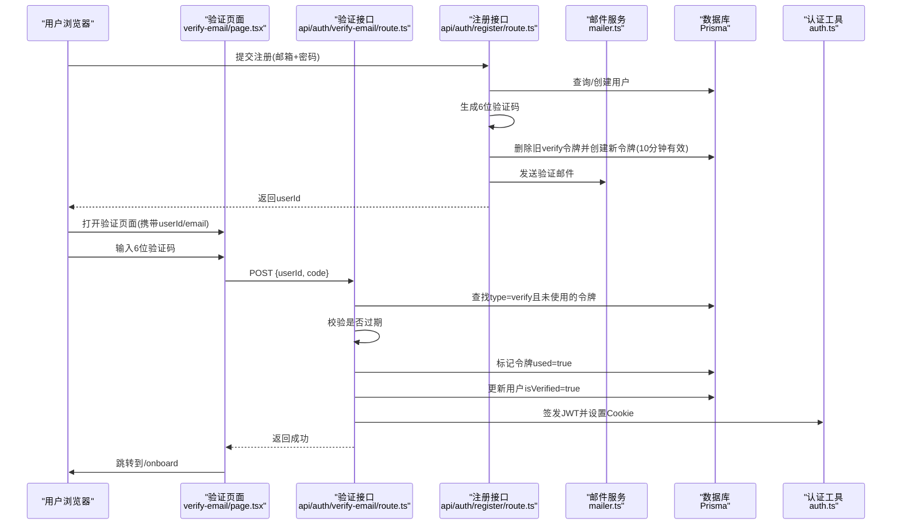
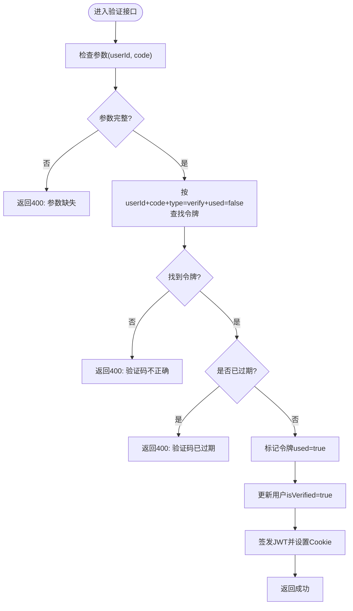
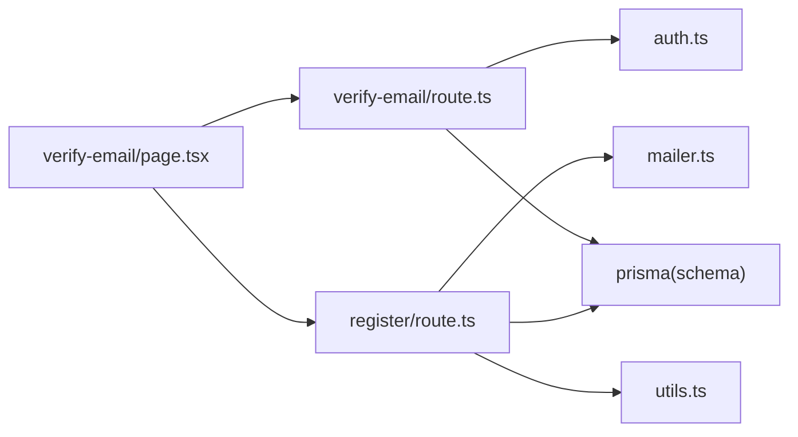
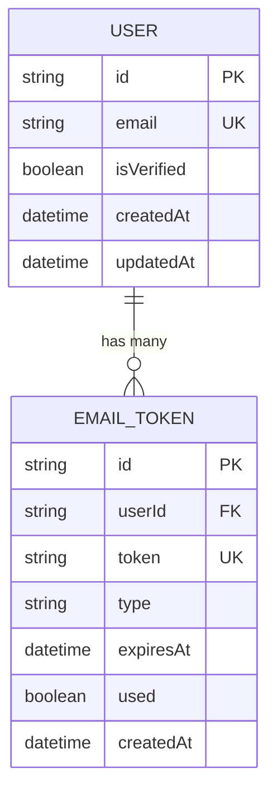

# 邮箱验证

<cite>
**本文引用的文件**
- [app/api/auth/register/route.ts](file://app/api/auth/register/route.ts)
- [app/api/auth/verify-email/route.ts](file://app/api/auth/verify-email/route.ts)
- [app/(auth)/verify-email/page.tsx](file://app/(auth)/verify-email/page.tsx)
- [lib/mailer.ts](file://lib/mailer.ts)
- [lib/utils.ts](file://lib/utils.ts)
- [lib/auth.ts](file://lib/auth.ts)
- [prisma/schema.prisma](file://prisma/schema.prisma)
- [middleware.ts](file://middleware.ts)
</cite>

## 目录
1. [简介](#简介)
2. [项目结构](#项目结构)
3. [核心组件](#核心组件)
4. [架构总览](#架构总览)
5. [详细组件分析](#详细组件分析)
6. [依赖关系分析](#依赖关系分析)
7. [性能与安全考虑](#性能与安全考虑)
8. [故障排查指南](#故障排查指南)
9. [结论](#结论)
10. [附录](#附录)

## 简介
本技术文档围绕“心芽”的邮箱验证系统，系统性阐述以下方面：
- 邮箱验证令牌的生成与存储机制（含安全性与有效期管理）
- 验证邮件发送流程（含模板设计与个性化内容）
- 验证页面处理逻辑（令牌校验、用户状态更新与跳转）
- 验证失败的处理策略与用户反馈机制
- 邮箱服务配置项与错误重试建议

## 项目结构
邮箱验证相关代码分布在以下位置：
- API 路由：注册时生成验证码并发送邮件；验证页调用接口完成校验与登录
- 前端页面：提供输入验证码的交互界面与重发逻辑
- 工具库：验证码生成、JWT 签发与 Cookie 配置
- 数据模型：用户与邮箱令牌持久化
- 中间件：控制未登录访问的跳转

图表来源
- [app/(auth)/verify-email/page.tsx:1-107](file://app/(auth)/verify-email/page.tsx#L1-L107)
- [app/api/auth/register/route.ts:1-56](file://app/api/auth/register/route.ts#L1-L56)
- [app/api/auth/verify-email/route.ts:1-38](file://app/api/auth/verify-email/route.ts#L1-L38)
- [lib/mailer.ts:1-86](file://lib/mailer.ts#L1-L86)
- [lib/utils.ts:1-59](file://lib/utils.ts#L1-L59)
- [lib/auth.ts:1-56](file://lib/auth.ts#L1-L56)
- [prisma/schema.prisma:124-136](file://prisma/schema.prisma#L124-L136)

章节来源
- [app/(auth)/verify-email/page.tsx:1-107](file://app/(auth)/verify-email/page.tsx#L1-L107)
- [app/api/auth/register/route.ts:1-56](file://app/api/auth/register/route.ts#L1-L56)
- [app/api/auth/verify-email/route.ts:1-38](file://app/api/auth/verify-email/route.ts#L1-L38)
- [lib/mailer.ts:1-86](file://lib/mailer.ts#L1-L86)
- [lib/utils.ts:1-59](file://lib/utils.ts#L1-L59)
- [lib/auth.ts:1-56](file://lib/auth.ts#L1-L56)
- [prisma/schema.prisma:124-136](file://prisma/schema.prisma#L124-L136)

## 核心组件
- 注册接口：负责创建或复用未验证用户、生成验证码、写入邮箱令牌、发送邮件
- 验证接口：校验令牌有效性、标记已使用、更新用户为已验证、签发 JWT 并设置 Cookie
- 验证页面：收集 6 位验证码、自动提交、错误提示、倒计时重发
- 邮件服务：基于 SMTP 发送 HTML 模板邮件
- 工具库：生成 6 位数字验证码、JWT 签发与 Cookie 配置
- 数据模型：User 与 EmailToken 实体及字段约束

章节来源
- [app/api/auth/register/route.ts:1-56](file://app/api/auth/register/route.ts#L1-L56)
- [app/api/auth/verify-email/route.ts:1-38](file://app/api/auth/verify-email/route.ts#L1-L38)
- [app/(auth)/verify-email/page.tsx:1-107](file://app/(auth)/verify-email/page.tsx#L1-L107)
- [lib/mailer.ts:1-86](file://lib/mailer.ts#L1-L86)
- [lib/utils.ts:1-59](file://lib/utils.ts#L1-L59)
- [lib/auth.ts:1-56](file://lib/auth.ts#L1-L56)
- [prisma/schema.prisma:10-31](file://prisma/schema.prisma#L10-L31)
- [prisma/schema.prisma:124-136](file://prisma/schema.prisma#L124-L136)

## 架构总览
下图展示了从注册到验证的端到端流程，包括令牌生成、存储、邮件发送、前端交互与后端校验。

图表来源
- [app/api/auth/register/route.ts:1-56](file://app/api/auth/register/route.ts#L1-L56)
- [app/api/auth/verify-email/route.ts:1-38](file://app/api/auth/verify-email/route.ts#L1-L38)
- [app/(auth)/verify-email/page.tsx:1-107](file://app/(auth)/verify-email/page.tsx#L1-L107)
- [lib/mailer.ts:1-86](file://lib/mailer.ts#L1-L86)
- [lib/auth.ts:1-56](file://lib/auth.ts#L1-L56)
- [prisma/schema.prisma:124-136](file://prisma/schema.prisma#L124-L136)

## 详细组件分析

### 令牌生成与存储机制
- 生成方式
  - 采用 6 位纯数字验证码，范围 100000~999999，由工具函数生成
- 存储结构
  - 通过 Prisma 的 EmailToken 模型持久化，包含 userId、token、type、expiresAt、used、createdAt 等字段
  - token 字段唯一索引，确保同一时间一个用户仅有一个有效的 verify 类型令牌
- 有效期管理
  - 注册时计算 expiresAt = 当前时间 + 10 分钟
  - 每次重新注册会先删除该用户旧的 verify 类型令牌，再创建新的，避免多令牌并发使用
- 安全性要点
  - 令牌仅用于一次性验证，使用后标记 used=true，不可重复使用
  - 令牌不直接暴露用户敏感信息，仅关联 userId
  - 建议生产环境将随机数生成替换为加密安全随机源（见“性能与安全考虑”）

章节来源
- [lib/utils.ts:1-4](file://lib/utils.ts#L1-L4)
- [app/api/auth/register/route.ts:39-48](file://app/api/auth/register/route.ts#L39-L48)
- [prisma/schema.prisma:124-136](file://prisma/schema.prisma#L124-L136)

### 验证邮件发送流程与模板设计
- 发送入口
  - 注册接口在创建/更新用户后，生成验证码并调用邮件服务发送
- 模板设计
  - 使用 HTML 内联样式，主题色绿色，突出显示验证码
  - 明确提示有效期（10 分钟），并提供品牌文案
- 个性化内容
  - 收件人地址动态传入
  - 验证码作为变量插入模板
- 配置项
  - SMTP 主机、端口、安全连接、用户名与授权码通过环境变量注入
  - 发件人名称固定为“心芽”，邮箱地址来自环境变量

章节来源
- [app/api/auth/register/route.ts:48-48](file://app/api/auth/register/route.ts#L48-L48)
- [lib/mailer.ts:14-33](file://lib/mailer.ts#L14-L33)

### 验证页面处理逻辑
- 参数获取
  - 从 URL 查询参数中读取 userId 和 email，用于后续提交与展示
- 输入交互
  - 6 个独立输入框，支持数字输入、自动聚焦下一个、退格回退
  - 当 6 位全部填写后自动触发提交
- 提交与响应
  - 调用验证接口，成功后跳转到 /onboard
  - 失败时清空输入并聚焦第一个框，同时显示错误消息
- 重发机制
  - 点击“重新发送”会再次调用注册接口（以特殊占位密码触发重发），并启动 60 秒倒计时
  - 注意：此实现通过注册接口重发，需确保注册接口对未验证用户允许覆盖密码与重发验证码

章节来源
- [app/(auth)/verify-email/page.tsx:6-102](file://app/(auth)/verify-email/page.tsx#L6-L102)
- [app/api/auth/register/route.ts:20-30](file://app/api/auth/register/route.ts#L20-L30)

### 验证接口处理逻辑
- 参数校验
  - 必须包含 userId 与 code，否则返回 400
- 令牌校验
  - 根据 userId、code、type=verify、used=false 查找令牌
  - 若不存在则返回“验证码不正确”
  - 若已过期则返回“验证码已过期，请重新注册获取”
- 状态更新
  - 将对应令牌标记 used=true
  - 将用户 isVerified 设置为 true
- 自动登录
  - 签发 JWT，并通过 Cookie 配置设置 xinya_token，有效期 30 天
- 跳转处理
  - 前端收到成功响应后跳转到 /onboard

图表来源
- [app/api/auth/verify-email/route.ts:6-36](file://app/api/auth/verify-email/route.ts#L6-L36)
- [lib/auth.ts:18-55](file://lib/auth.ts#L18-L55)

章节来源
- [app/api/auth/verify-email/route.ts:1-38](file://app/api/auth/verify-email/route.ts#L1-L38)
- [lib/auth.ts:18-55](file://lib/auth.ts#L18-L55)

### 验证失败处理策略与用户反馈
- 参数缺失：返回 400，前端提示“参数缺失”
- 验证码不正确：返回 400，前端清空输入并提示错误
- 验证码已过期：返回 400，前端提示“验证码已过期，请重新注册获取”
- 网络异常：捕获异常并提示“网络出了点问题 🌧️”
- 服务端异常：统一返回 500，提示“验证失败，请稍后再试”

章节来源
- [app/api/auth/verify-email/route.ts:6-36](file://app/api/auth/verify-email/route.ts#L6-L36)
- [app/(auth)/verify-email/page.tsx:36-53](file://app/(auth)/verify-email/page.tsx#L36-L53)

### 邮箱服务配置选项与错误重试机制
- 配置项
  - SMTP_USER：SMTP 用户名（QQ 邮箱）
  - SMTP_PASS：SMTP 授权码（非登录密码）
  - 其他：host、port、secure 已在代码中固定
- 错误重试建议
  - 当前实现未内置重试逻辑
  - 建议在调用 sendVerifyEmail 处增加指数退避重试（如最多 3 次，间隔 1s/2s/4s）
  - 记录失败日志与指标，便于监控与告警
  - 可引入队列（如 BullMQ）异步发送，提升吞吐与容错

章节来源
- [lib/mailer.ts:1-12](file://lib/mailer.ts#L1-L12)

## 依赖关系分析
- 模块耦合
  - 注册接口依赖：Prisma、bcryptjs、邮件服务、工具函数
  - 验证接口依赖：Prisma、JWT 签发、Cookie 操作
  - 前端页面依赖：Next.js 路由与查询参数、fetch 调用
- 外部依赖
  - Nodemailer 用于 SMTP 邮件发送
  - jsonwebtoken 用于 JWT 签发与校验
  - bcryptjs 用于密码哈希
- 潜在循环依赖
  - 当前未见循环导入，各模块职责清晰

图表来源
- [app/api/auth/register/route.ts:1-56](file://app/api/auth/register/route.ts#L1-L56)
- [app/api/auth/verify-email/route.ts:1-38](file://app/api/auth/verify-email/route.ts#L1-L38)
- [app/(auth)/verify-email/page.tsx:1-107](file://app/(auth)/verify-email/page.tsx#L1-L107)
- [lib/mailer.ts:1-86](file://lib/mailer.ts#L1-L86)
- [lib/utils.ts:1-59](file://lib/utils.ts#L1-L59)
- [lib/auth.ts:1-56](file://lib/auth.ts#L1-L56)
- [prisma/schema.prisma:124-136](file://prisma/schema.prisma#L124-L136)

章节来源
- [app/api/auth/register/route.ts:1-56](file://app/api/auth/register/route.ts#L1-L56)
- [app/api/auth/verify-email/route.ts:1-38](file://app/api/auth/verify-email/route.ts#L1-L38)
- [app/(auth)/verify-email/page.tsx:1-107](file://app/(auth)/verify-email/page.tsx#L1-L107)
- [lib/mailer.ts:1-86](file://lib/mailer.ts#L1-L86)
- [lib/utils.ts:1-59](file://lib/utils.ts#L1-L59)
- [lib/auth.ts:1-56](file://lib/auth.ts#L1-L56)
- [prisma/schema.prisma:124-136](file://prisma/schema.prisma#L124-L136)

## 性能与安全考虑
- 性能
  - 验证码生成使用 Math.random，开销极低
  - 数据库查询与更新均为单条记录，复杂度 O(1)
  - 建议在生产环境开启连接池与缓存（如 Redis）以减少 SMTP 延迟影响
- 安全
  - 建议使用加密安全的随机源生成验证码（如 crypto.randomInt），防止预测
  - 令牌应绑定 IP 或设备指纹（可选增强）
  - Cookie 建议启用 secure=true（HTTPS）、sameSite=strict/lax、httpOnly=true
  - 限制验证码尝试次数，防止暴力破解（例如 5 次失败锁定 15 分钟）
  - 日志脱敏：避免记录完整验证码与密码

[本节为通用指导，无需具体文件引用]

## 故障排查指南
- 常见问题
  - 收不到邮件：检查 SMTP_USER 与 SMTP_PASS 是否正确，确认 QQ 邮箱授权码有效
  - 验证码无效：确认未过期且未被使用；检查是否多次重发导致旧令牌被清理
  - 登录后仍跳转登录页：检查 Cookie 是否设置成功，确认中间件匹配规则与路径
- 定位方法
  - 查看服务端控制台日志（注册与验证接口均有错误输出）
  - 检查数据库 EmailToken 表中的 used 与 expiresAt 字段
  - 浏览器开发者工具查看请求响应与 Cookie

章节来源
- [app/api/auth/register/route.ts:51-54](file://app/api/auth/register/route.ts#L51-L54)
- [app/api/auth/verify-email/route.ts:33-36](file://app/api/auth/verify-email/route.ts#L33-L36)
- [middleware.ts:1-29](file://middleware.ts#L1-L29)

## 结论
本系统实现了完整的邮箱验证闭环：注册时生成 6 位验证码并发送邮件，验证页面收集验证码并调用后端进行校验与状态更新，最终自动登录并引导至引导页。整体流程简洁清晰，具备基本的错误处理与用户反馈。生产环境建议进一步增强安全性（加密随机、尝试次数限制、Cookie 加固）与可靠性（重试、队列、监控）。

[本节为总结性内容，无需具体文件引用]

## 附录

### 数据模型概览（与邮箱验证相关）
- User
  - id、email、passwordHash、isVerified、createdAt、updatedAt 等
- EmailToken
  - id、userId、token(unique)、type、expiresAt、used、createdAt

图表来源
- [prisma/schema.prisma:10-31](file://prisma/schema.prisma#L10-L31)
- [prisma/schema.prisma:124-136](file://prisma/schema.prisma#L124-L136)