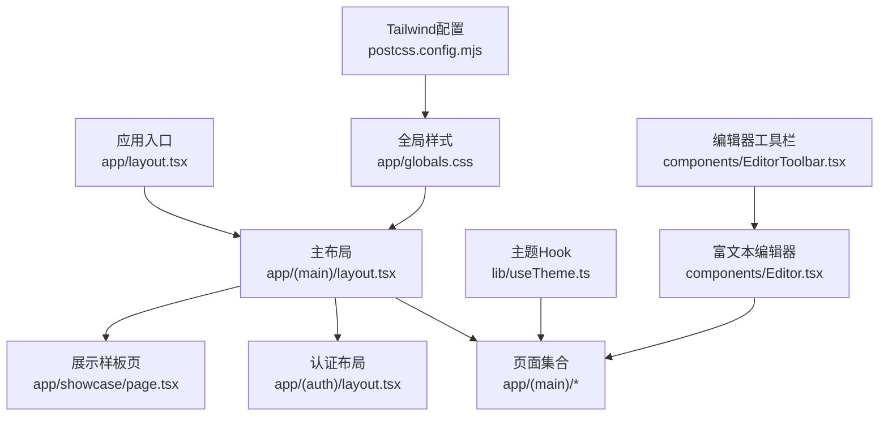
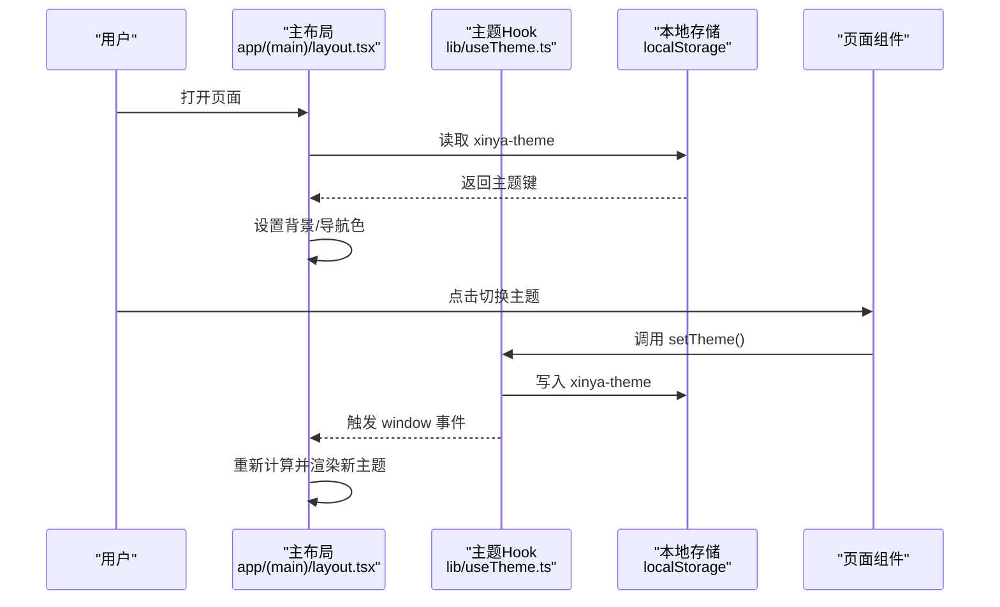
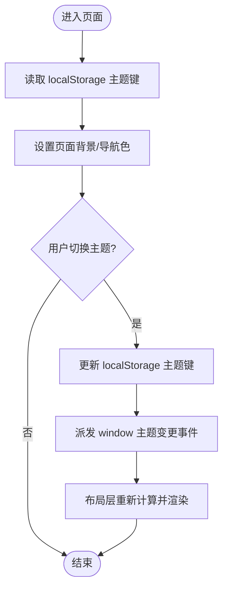
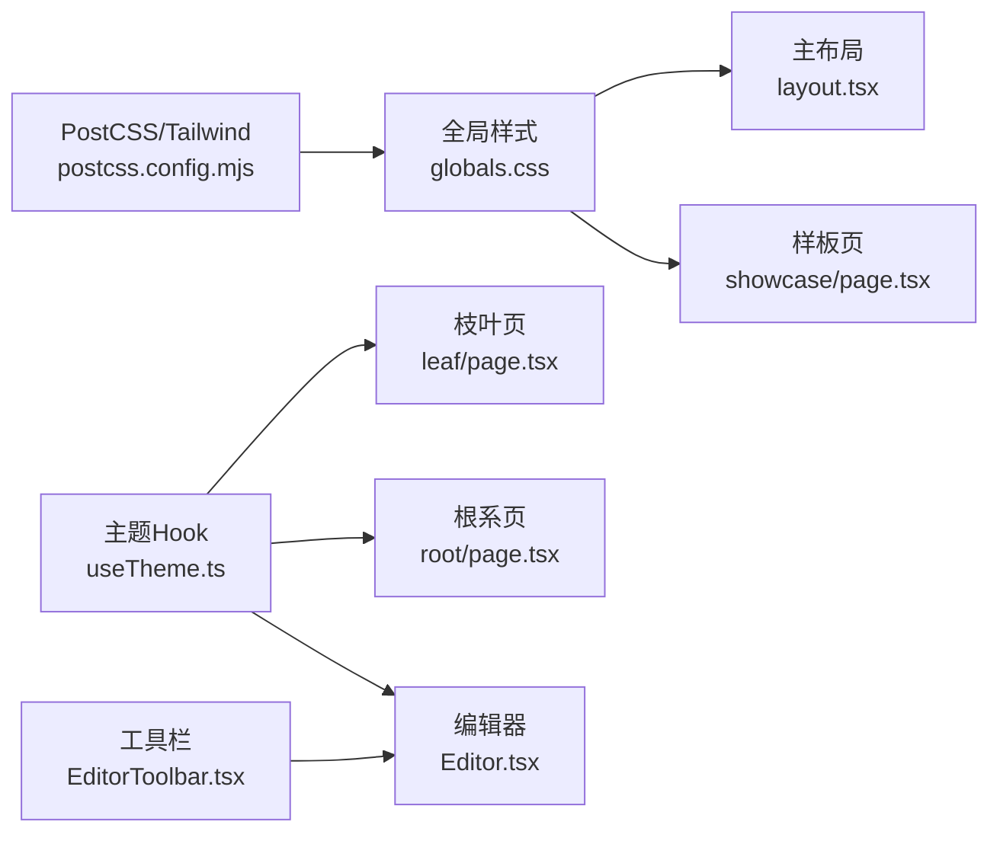

# UI设计规范

<cite>
**本文引用的文件列表**
- [globals.css](file://app/globals.css)
- [useTheme.ts](file://lib/useTheme.ts)
- [layout.tsx（主布局）](file://app/(main)/layout.tsx)
- [showcase/page.tsx（视觉样板页）](file://app/showcase/page.tsx)
- [leaf/page.tsx（枝叶页）](file://app/(main)/leaf/page.tsx)
- [root/page.tsx（根系页）](file://app/(main)/root/page.tsx)
- [page.tsx（萌芽页）](file://app/(main)/page.tsx)
- [ring/page.tsx（年轮页）](file://app/(main)/ring/page.tsx)
- [Editor.tsx（富文本编辑器）](file://components/Editor.tsx)
- [EditorToolbar.tsx（编辑器工具栏）](file://components/EditorToolbar.tsx)
- [postcss.config.mjs](file://postcss.config.mjs)
- [心芽小程序设计框架v2.0.md](file://doc/心芽小程序设计框架v2.0.md)
- [暗色系修改经验总结.md](file://doc/暗色系修改经验总结.md)
- [心芽各页面标题行高对齐规范.md](file://doc/心芽各页面标题行高对齐规范.md)
- [心芽富文本文字编辑规范.md](file://doc/心芽富文本文字编辑规范.md)
</cite>

## 更新摘要
**变更内容**
- 新增页面标题对齐规范章节，详细说明多页面标题统一对齐的实现方案
- 新增富文本编辑器设计标准章节，包含工具栏、颜色选择器、编辑器容器等组件规范
- 更新组件样式约定，补充富文本编辑器相关的设计细节
- 完善响应式设计适配策略，增加编辑器移动端适配说明

## 目录
1. [引言](#引言)
2. [项目结构](#项目结构)
3. [核心组件与样式约定](#核心组件与样式约定)
4. [架构总览](#架构总览)
5. [详细规范说明](#详细规范说明)
6. [依赖关系分析](#依赖关系分析)
7. [性能与可访问性建议](#性能与可访问性建议)
8. [故障排查指南](#故障排查指南)
9. [结论](#结论)
10. [附录：主题色板与使用清单](#附录主题色板与使用清单)

## 引言
本规范面向"心芽"项目的UI设计与前端实现，统一色彩、字体、间距、布局网格、组件样式、主题系统与图标规范，确保多端一致体验。文档同时给出代码级映射与可视化图示，便于研发与设计协同落地。

## 项目结构
本项目采用 Next.js App Router 组织页面与布局，样式基于 Tailwind CSS + 全局CSS变量；主题系统通过客户端 Hook 与布局层状态管理，配合本地存储持久化。



图表来源
- [layout.tsx（主布局）](file://app/(main)/layout.tsx#L1-L81)
- [globals.css:1-79](file://app/globals.css#L1-L79)
- [useTheme.ts:1-30](file://lib/useTheme.ts#L1-L30)
- [postcss.config.mjs:1-7](file://postcss.config.mjs#L1-L7)
- [Editor.tsx:1-211](file://components/Editor.tsx#L1-L211)
- [EditorToolbar.tsx:1-78](file://components/EditorToolbar.tsx#L1-L78)

章节来源
- [layout.tsx（主布局）](file://app/(main)/layout.tsx#L1-L81)
- [globals.css:1-79](file://app/globals.css#L1-L79)
- [useTheme.ts:1-30](file://lib/useTheme.ts#L1-L30)
- [postcss.config.mjs:1-7](file://postcss.config.mjs#L1-L7)

## 核心组件与样式约定
- 按钮
  - 主操作：渐变填充（嫩绿到浅绿），手绘圆角，阴影，白字。
  - 次要操作：描边为主，悬停填充强调色。
  - 危险操作：红色系填充或描边，用于删除等破坏性操作。
- 卡片
  - 白色背景+手绘风格边框，轻阴影，hover增强阴影。
  - 标题、摘要、标签、时间、心情图标组合。
- 标签气泡
  - 小/中/大三级尺寸，圆角胶囊，绿色系背景与边框，数量标注。
- 搜索栏与筛选
  - 输入框带手绘圆角，聚焦时高亮主色；筛选为胶囊按钮组。
- 弹窗
  - 遮罩+手绘圆角对话框，确认/取消双按钮。
- 底部导航
  - 四Tab（萌芽/枝叶/年轮/根系），中央悬浮新增按钮，安全区域适配。
- 富文本编辑器
  - 工具栏：固定顶部，毛玻璃背景，支持加粗/斜体/列表/颜色等功能。
  - 编辑器容器：contentEditable实现，支持实时字数统计和专注模式。
  - 颜色选择器：弹出式色板，6种预设颜色，点击自动收起。

章节来源
- [showcase/page.tsx（视觉样板页）:330-346](file://app/showcase/page.tsx#L330-L346)
- [showcase/page.tsx（视觉样板页）:392-419](file://app/showcase/page.tsx#L392-L419)
- [showcase/page.tsx（视觉样板页）:201-223](file://app/showcase/page.tsx#L201-L223)
- [showcase/page.tsx（视觉样板页）:229-264](file://app/showcase/page.tsx#L229-L264)
- [globals.css:70-78](file://app/globals.css#L70-L78)
- [Editor.tsx:156-206](file://components/Editor.tsx#L156-L206)
- [EditorToolbar.tsx:41-76](file://components/EditorToolbar.tsx#L41-L76)

## 架构总览
主题系统由"布局层状态 + 客户端Hook + 本地存储 + 全局CSS变量"共同构成。布局负责首屏背景与导航样式，Hook提供卡片、输入等衍生色值，全局CSS定义品牌色与基础排版。



图表来源
- [layout.tsx（主布局）](file://app/(main)/layout.tsx#L30-L81)
- [useTheme.ts:4-29](file://lib/useTheme.ts#L4-L29)

章节来源
- [layout.tsx（主布局）](file://app/(main)/layout.tsx#L1-L81)
- [useTheme.ts:1-30](file://lib/useTheme.ts#L1-L30)

## 详细规范说明

### 一、色彩体系
- 主色调
  - 嫩绿色系：#8BC34A（主绿）、#AED581（浅绿）。用于主按钮、活跃态、强调信息。
- 底色
  - 暖白底色：#FAFAF5。默认页面背景。
- 辅助色
  - 大地棕：#795548。用于标签、强调文案。
  - 天空蓝：#42A5F5。用于图表数据、链接等中性强调。
- 文本与分割线
  - 正文黑：#333333；辅助灰：#666666；淡色字：#999999；分割线：#E8E8E3。
- 使用建议
  - 主色用于关键交互与品牌识别；辅助色用于次级信息与数据可视化；文本层级遵循深→浅的对比度梯度。

章节来源
- [globals.css:3-13](file://app/globals.css#L3-L13)
- [showcase/page.tsx（视觉样板页）:299-314](file://app/showcase/page.tsx#L299-L314)
- [心芽小程序设计框架v2.0.md:193-201](file://doc/心芽小程序设计框架v2.0.md#L193-L201)

### 二、字体规范
- 默认字体
  - 微软雅黑（Microsoft YaHei），作为全站点默认字体族，保证中文清晰可读。
- 字号与行高
  - 标题：text-xl / text-base（加粗/半粗）
  - 正文：text-sm
  - 辅助信息：text-xs
  - 行高以自然阅读舒适为准，避免过密。
- 字体家族优先级
  - 在浏览器回退链中包含 PingFang SC 与 sans-serif，提升跨平台一致性。

章节来源
- [globals.css:17-22](file://app/globals.css#L17-L22)
- [showcase/page.tsx（视觉样板页）:317-327](file://app/showcase/page.tsx#L317-L327)
- [心芽小程序设计框架v2.0.md:50-62](file://doc/心芽小程序设计框架v2.0.md#L50-L62)

### 三、间距标准与布局网格
- 间距单位
  - 以 Tailwind 的 spacing 为基础，结合 px-4、py-4、gap-2 等常用类名形成统一节奏。
- 网格与容器
  - 移动端优先，内容区最大宽度限制，居中显示；列表采用单列流式布局。
- 安全区域
  - 底部固定导航需考虑系统 Safe Area，使用 env(safe-area-inset-bottom)。

章节来源
- [globals.css:76-78](file://app/globals.css#L76-L78)
- [showcase/page.tsx（视觉样板页）:297-315](file://app/showcase/page.tsx#L297-L315)

### 四、组件样式约定
- 手绘风格边框
  - 按钮、输入、卡片、对话框分别定义不规则圆角，营造有机手绘感。
- 动效
  - 嫩芽生长、轻柔弹跳、收藏弹跳、淡入上移、卷轴展开、叶片展开等微动画，用于加载、反馈与过渡。
- 卡片与标签
  - 卡片：白底+手绘边框+轻阴影；标签：绿色系胶囊，分级尺寸与计数。
- 搜索与筛选
  - 输入框手绘圆角，聚焦主色高亮；筛选为胶囊按钮组，选中态使用主色。

章节来源
- [globals.css:24-74](file://app/globals.css#L24-L74)
- [showcase/page.tsx（视觉样板页）:330-346](file://app/showcase/page.tsx#L330-L346)
- [showcase/page.tsx（视觉样板页）:392-419](file://app/showcase/page.tsx#L392-L419)

### 五、页面标题对齐规范

**新增** 为确保多页面切换时的视觉一致性，所有主页面必须遵循统一的标题对齐规范。

#### 5.1 统一标题结构
所有主页面使用相同的标题 HTML 结构：

```tsx
{/* 页面标题 */}
<div className="flex items-center justify-between mb-1">
  <h1 className="text-xl font-bold" style={{ color: titleColor }}>
    <span style={{ color: "#8BC34A", display: "inline-block", width: "1.4em", textAlign: "center" }}>
      🌱  {/* emoji 图标 */}
    </span>
    页面名称
  </h1>
  {/* 右侧可选元素，如筛选按钮、统计数字等 */}
</div>

{/* slogan 副标题 */}
<p className="text-xs mb-5" style={{ color: dimColor }}>
  诗意化的页面描述文案
</p>
```

#### 5.2 关键参数规范
| 参数 | 值 | 说明 |
|------|-----|------|
| 标题字号 | `text-xl`（20px） | 统一字号 |
| 标题字重 | `font-bold` | 统一粗体 |
| 标题下间距 | `mb-1`（4px） | 标题与 slogan 的间距 |
| slogan 字号 | `text-xs`（12px） | 统一小字 |
| slogan 下间距 | `mb-5`（20px） | slogan 与下方内容的间距 |
| 容器上内边距 | `px-4`（16px） | 左右内边距统一 |

#### 5.3 emoji 图标对齐技巧
标题中的 emoji 图标使用固定宽度容器，确保不同 emoji 宽度不一致时标题文字仍然对齐：

```tsx
<span style={{
  color: "#8BC34A",
  display: "inline-block",
  width: "1.4em",        // ← 关键：固定宽度
  textAlign: "center"    // ← emoji 居中
}}>
  🌱  {/* 不同页面的 emoji 不同，但占用空间相同 */}
</span>
```

#### 5.4 右侧元素占位
当某些页面标题右侧有按钮（如筛选、统计），而其他页面没有时，需要用占位元素保持标题居中/左对齐：

**方案 A：flex justify-between + 空占位**
```tsx
<div className="flex items-center justify-between mb-1">
  <h1>...</h1>
  <div style={{ width: "40px" }} />  {/* 占位，宽度与对面按钮一致 */}
</div>
```

**方案 B：右侧固定区域**
```tsx
<div className="flex items-center justify-between mb-1">
  <h1>...</h1>
  <div className="flex items-center gap-2">
    {hasRightElement ? <RightButton /> : <div style={{ width: "32px" }} />}
  </div>
</div>
```

#### 5.5 各页面标题对照表
| 页面 | emoji | 标题 | slogan | 右侧元素 |
|------|-------|------|--------|---------|
| 萌芽页 | 🌱 | 萌芽 | 心之所向，芽之所生 | 收藏筛选 + 搜索 |
| 枝叶页 | 🍃 | 枝叶 | 思绪的脉络，在此生枝蔓叶 | 无 |
| 年轮页 | 🌀 | 年轮 | 感受心得生长的节律 | 月份导航（标题下方） |
| 根系页 | 🌿 | 根系 | 此处是你的根，安静而深厚 | 无 |

章节来源
- [心芽各页面标题行高对齐规范.md:1-191](file://doc/心芽各页面标题行高对齐规范.md#L1-L191)
- [leaf/page.tsx:189-195](file://app/(main)/leaf/page.tsx#L189-L195)
- [page.tsx:200-205](file://app/(main)/page.tsx#L200-L205)
- [ring/page.tsx:132-138](file://app/(main)/ring/page.tsx#L132-L138)
- [root/page.tsx:294-300](file://app/(main)/root/page.tsx#L294-L300)

### 六、富文本编辑器设计标准

**新增** 富文本编辑器是心芽的核心功能之一，需要遵循严格的设计规范以确保一致的编辑体验。

#### 6.1 工具栏设计规范
- 布局结构
  - 固定顶部定位，毛玻璃背景效果（backdropFilter: blur(12px)）
  - 横向排列，超出时支持横向滚动（overflow-x-auto）
  - 分隔线将功能分组：格式工具 | 标签/专注模式 | 字数统计

- 按钮规格
  | 属性 | 值 | 说明 |
  |------|-----|------|
  | 按钮尺寸 | 32×32px（p-2 + icon 18px） | 触摸友好，不占过多空间 |
  | 图标颜色 | `#666`（默认） | 中性灰，不抢视觉焦点 |
  | 按钮圆角 | `rounded-lg`（8px） | 柔和圆角 |
  | hover 效果 | `hover:bg-gray-100` | 浅灰背景反馈 |
  | 分隔线 | 1px 宽，`#e0e0e0`，高 20px | 视觉分组 |

#### 6.2 颜色选择器规范
- 预设色板（6 色）
  | 颜色 | Hex | 用途建议 |
  |------|-----|---------|
  | 深灰 | `#333333` | 默认正文色，恢复默认 |
  | 嫩绿 | `#8BC34A` | 强调、关键词 |
  | 天蓝 | `#42A5F5` | 补充说明 |
  | 橙色 | `#FF8C42` | 警示、重要 |
  | 棕色 | `#795548` | 引用、备注 |
  | 红色 | `#e57373` | 错误、否定 |

- 交互行为
  - 点击调色板按钮展开色板
  - 色板为横向排列的圆形色块（28×28px）
  - 选中颜色后自动收起色板
  - 色板使用绝对定位，z-index 确保在最上层

#### 6.3 编辑器容器规范
- 技术实现
  - 使用 `contentEditable` + `document.execCommand` 方案
  - 支持实时字数统计（纯文字，不含HTML标签和空格）
  - 专注模式：隐藏工具栏，全屏编辑体验

- 样式规范
  ```tsx
  <div
    contentEditable
    className="w-full outline-none text-sm leading-relaxed"
    style={{
      padding: "16px",
      minHeight: "30vh",
      color: "#333"
    }}
  />
  ```

- 列表样式补充
  ```css
  .view-content ul { list-style: disc; padding-left: 1.5em; margin: 0.5em 0; }
  .view-content ol { list-style: decimal; padding-left: 1.5em; margin: 0.5em 0; }
  .view-content li { margin: 0.2em 0; }
  ```

#### 6.4 标题输入框规范
- 独立于编辑器的 `<input>` 元素
- 不支持富文本格式，仅支持纯文本
- 样式：`text-xl font-bold`，透明背景融入页面

章节来源
- [心芽富文本文字编辑规范.md:1-228](file://doc/心芽富文本文字编辑规范.md#L1-L228)
- [EditorToolbar.tsx:41-76](file://components/EditorToolbar.tsx#L41-L76)
- [Editor.tsx:156-206](file://components/Editor.tsx#L156-L206)

### 七、背景主题系统（5套）
- 主题定义
  - 春日萌芽（默认）：浅绿暖白
  - 夏日繁茂：深绿色系
  - 秋日暖阳：橙黄暖色调
  - 冬日静谧：灰白极简
  - 夜间模式：深色护眼
- 实现要点
  - 布局层维护当前主题键与背景色，支持从URL参数初始化并持久化至 localStorage。
  - 客户端Hook根据 isDark 派生卡片、输入等衍生色值，供各页面复用。
  - 展示样板页内置4套主题预览（含夜间模式的语义说明），便于快速验证整体效果。
- 注意事项
  - 避免SSR hydration不匹配导致的主题闪烁；所有主题逻辑应在客户端 useEffect 中执行。



图表来源
- [layout.tsx（主布局）](file://app/(main)/layout.tsx#L30-L81)
- [useTheme.ts:4-29](file://lib/useTheme.ts#L4-L29)
- [showcase/page.tsx（视觉样板页）:279-287](file://app/showcase/page.tsx#L279-L287)

章节来源
- [layout.tsx（主布局）](file://app/(main)/layout.tsx#L1-L81)
- [useTheme.ts:1-30](file://lib/useTheme.ts#L1-L30)
- [showcase/page.tsx（视觉样板页）:279-287](file://app/showcase/page.tsx#L279-L287)
- [心芽小程序设计框架v2.0.md:203-211](file://doc/心芽小程序设计框架v2.0.md#L203-L211)

### 八、响应式设计断点与适配策略
- 断点定义
  - 手机：<768px，单列流式布局
  - 桌面：>1024px，三栏布局（参考产品规范）
- 适配策略
  - 移动端优先，使用 Tailwind 响应式前缀控制不同断点的布局与字号。
  - 底部导航增加安全区域适配，避免被系统手势遮挡。
  - 列表与卡片在小屏下保持紧凑间距与大触控热区。
  - 富文本编辑器工具栏支持横向滚动，确保移动端可用。

章节来源
- [心芽小程序设计框架v2.0.md:236-237](file://doc/心芽小程序设计框架v2.0.md#L236-L237)
- [globals.css:76-78](file://app/globals.css#L76-L78)
- [EditorToolbar.tsx:51](file://components/EditorToolbar.tsx#L51)

### 九、图标规范与视觉元素统一标准
- 图标库
  - 统一使用 Lucide Icons，线条风格、线宽一致，确保视觉统一。
- 图标使用
  - 导航Tab、心情标记、功能按钮等均采用同一系列图标；激活态使用主色，非激活态使用中性灰。
- 插画与动效
  - 手绘风嫩芽/叶子/年轮/根须等自然形态，配合轻量动效，传达温暖有机的品牌气质。

章节来源
- [showcase/page.tsx（视觉样板页）:4-9](file://app/showcase/page.tsx#L4-L9)
- [showcase/page.tsx（视觉样板页）:229-264](file://app/showcase/page.tsx#L229-L264)
- [心芽小程序设计框架v2.0.md:213-218](file://doc/心芽小程序设计框架v2.0.md#L213-L218)

## 依赖关系分析
- 样式与主题
  - globals.css 定义品牌色与基础动画、手绘边框；Tailwind 提供原子类与响应式能力。
  - 主布局与 useTheme 协作完成主题切换与持久化。
- 页面与组件
  - 枝叶页、根系页等直接使用 useTheme 提供的色值，保证卡片、输入等在不同主题下的可读性与一致性。
  - 富文本编辑器组件依赖主题系统，支持明暗模式自适应。



图表来源
- [globals.css:1-79](file://app/globals.css#L1-L79)
- [layout.tsx（主布局）](file://app/(main)/layout.tsx#L1-L81)
- [useTheme.ts:1-30](file://lib/useTheme.ts#L1-L30)
- [leaf/page.tsx（枝叶页）](file://app/(main)/leaf/page.tsx#L212-L237)
- [root/page.tsx（根系页）](file://app/(main)/root/page.tsx#L462-L516)
- [postcss.config.mjs:1-7](file://postcss.config.mjs#L1-L7)
- [Editor.tsx:1-211](file://components/Editor.tsx#L1-L211)
- [EditorToolbar.tsx:1-78](file://components/EditorToolbar.tsx#L1-L78)

章节来源
- [leaf/page.tsx（枝叶页）](file://app/(main)/leaf/page.tsx#L212-L237)
- [root/page.tsx（根系页）](file://app/(main)/root/page.tsx#L462-L516)

## 性能与可访问性建议
- 主题切换
  - 使用 transition 平滑过渡背景与边框颜色，减少视觉跳跃。
  - 将主题初始化逻辑置于客户端 useEffect，避免 SSR hydration 不一致。
- 动效
  - 控制动画时长与频率，避免过度动画影响性能与可访问性。
- 可访问性
  - 确保文本与背景的对比度满足 WCAG 要求；为交互元素提供足够的触控热区。
  - 富文本编辑器支持键盘快捷键（Ctrl+B/Ctrl+I），提升可访问性。
  - 颜色选择器提供足够的对比度和点击热区。

[本节为通用建议，无需具体文件引用]

## 故障排查指南
- 主题刷新失效（SSR hydration 问题）
  - 现象：切换暗色后刷新，背景恢复亮色但子组件仍暗色。
  - 根因：SSR 阶段初始值与客户端 localStorage 不一致导致 hydration mismatch。
  - 解决：在布局层使用纯客户端 useEffect 读取 localStorage 并设置主题；必要时在 head 内联脚本提前设置背景色消除闪烁。
- 主题未同步
  - 检查是否派发 window 主题变更事件，并确保布局层监听该事件。
- 颜色不一致
  - 核对全局CSS变量与 useTheme 返回值在各页面的使用位置，避免硬编码覆盖。
- 富文本编辑器问题
  - execCommand 执行成功但看不到效果：检查CSS样式是否正确应用到ul/ol/li元素。
  - 点击工具栏按钮后光标丢失：确保在execCmd函数中调用focus()恢复焦点。
  - 粘贴外部内容格式混乱：监听paste事件，使用insertText命令插入纯文本。

章节来源
- [暗色系修改经验总结.md:1-178](file://doc/暗色系修改经验总结.md#L1-L178)
- [layout.tsx（主布局）](file://app/(main)/layout.tsx#L30-L81)
- [useTheme.ts:4-29](file://lib/useTheme.ts#L4-L29)
- [Editor.tsx:69-72](file://components/Editor.tsx#L69-L72)
- [Editor.tsx:177-206](file://components/Editor.tsx#L177-L206)

## 结论
本规围绕"心芽"的品牌气质与产品定位，明确了色彩、字体、间距、组件、主题与图标的统一标准，并通过代码级映射与图示帮助团队高效落地。新增的页面标题对齐规范和富文本编辑器设计标准进一步完善了用户体验的一致性保障。建议在后续迭代中持续完善主题扩展与组件库沉淀，确保多端一致的视觉体验。

[本节为总结性内容，无需具体文件引用]

## 附录：主题色板与使用清单
- 春日萌芽（默认）
  - 背景：暖白 #FAFAF5；强调：嫩绿 #8BC34A/#AED581；文本：#333/#666/#999；分割线：#E8E8E3
- 夏日繁茂
  - 背景：深绿；强调：更深的绿色；文本：浅色以保证对比度
- 秋日暖阳
  - 背景：暖米白；强调：橙色；文本：深棕/深灰
- 冬日静谧
  - 背景：冷白；强调：蓝灰；文本：冷灰
- 夜间模式
  - 背景：深色；卡片/输入/边框按 isDark 派生；文本：浅灰/白

章节来源
- [globals.css:3-13](file://app/globals.css#L3-L13)
- [useTheme.ts:19-28](file://lib/useTheme.ts#L19-L28)
- [showcase/page.tsx（视觉样板页）:279-287](file://app/showcase/page.tsx#L279-L287)
- [心芽小程序设计框架v2.0.md:203-211](file://doc/心芽小程序设计框架v2.0.md#L203-L211)