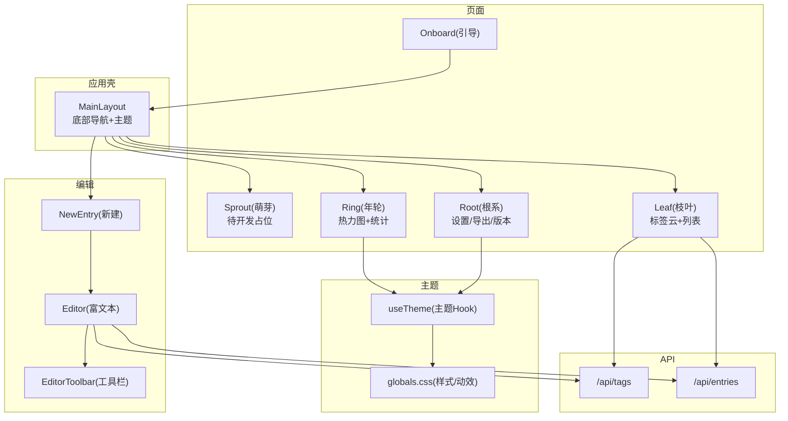
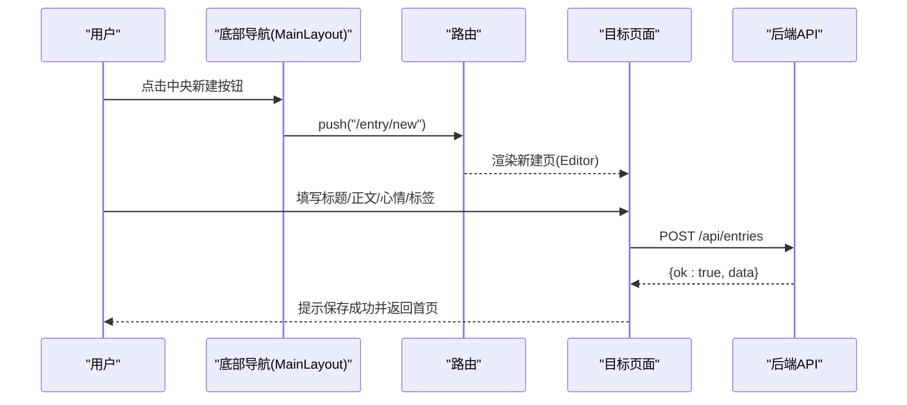
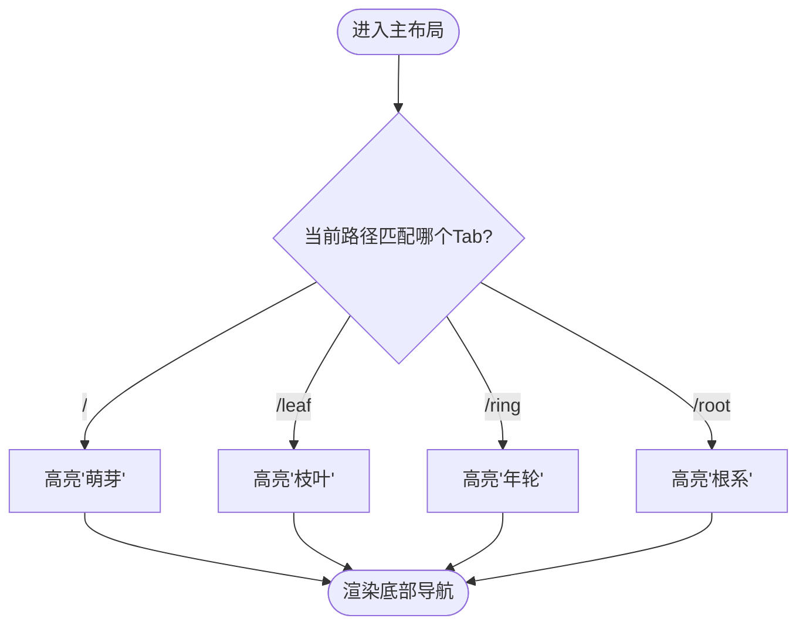
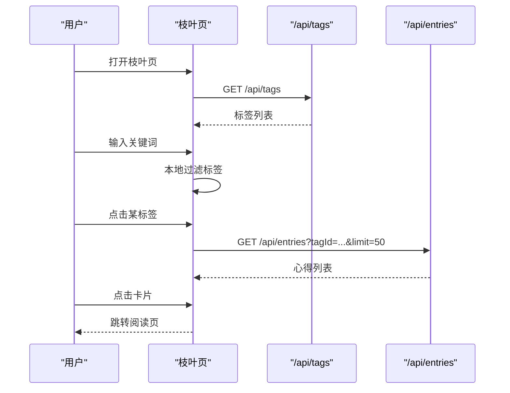
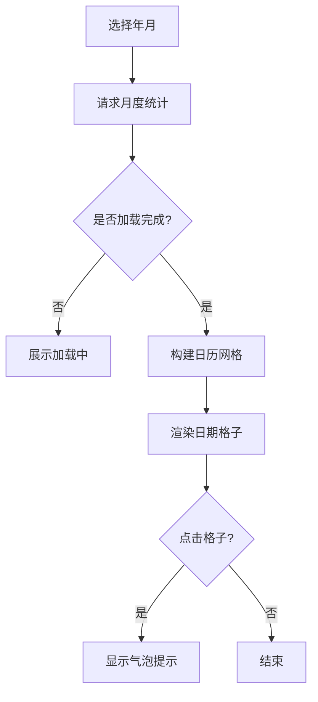
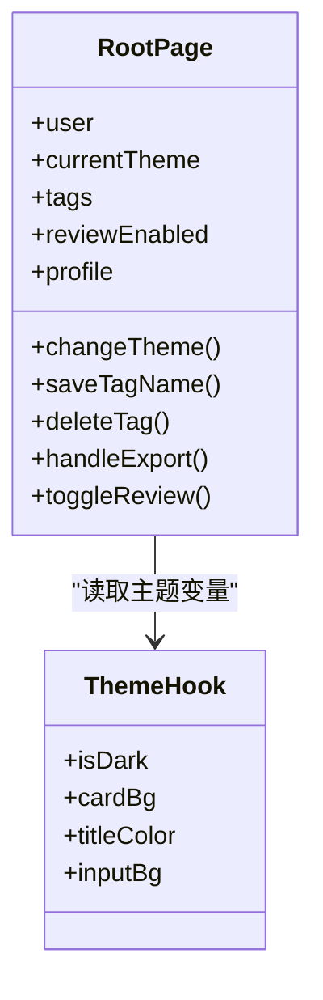
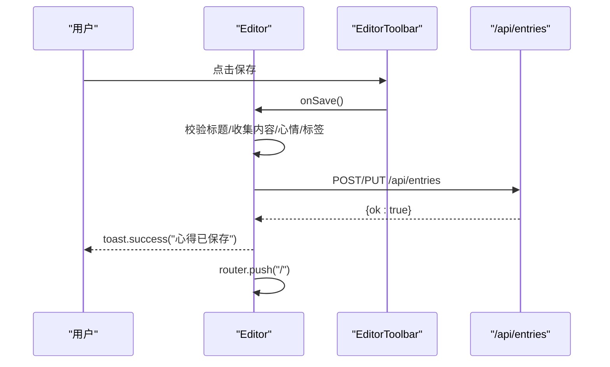
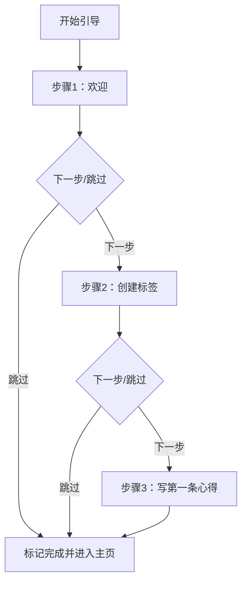
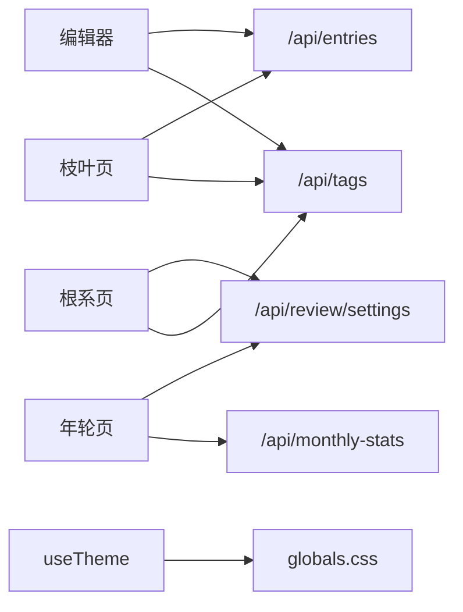

# 交互设计原则

<cite>
**本文引用的文件**   
- [app/(main)/layout.tsx](file://app/(main)/layout.tsx)
- [app/(main)/(sprout)/page.tsx](file://app/(main)/(sprout)/page.tsx)
- [app/(main)/leaf/page.tsx](file://app/(main)/leaf/page.tsx)
- [app/(main)/ring/page.tsx](file://app/(main)/ring/page.tsx)
- [app/(main)/root/page.tsx](file://app/(main)/root/page.tsx)
- [app/entry/new/page.tsx](file://app/entry/new/page.tsx)
- [components/Editor.tsx](file://components/Editor.tsx)
- [components/EditorToolbar.tsx](file://components/EditorToolbar.tsx)
- [app/onboard/page.tsx](file://app/onboard/page.tsx)
- [lib/useTheme.ts](file://lib/useTheme.ts)
- [app/globals.css](file://app/globals.css)
- [doc/心芽小程序设计框架v2.0.md](file://doc/心芽小程序设计框架v2.0.md)
- [app/api/tags/route.ts](file://app/api/tags/route.ts)
- [app/api/entries/route.ts](file://app/api/entries/route.ts)
</cite>

## 目录
1. [引言](#引言)
2. [项目结构](#项目结构)
3. [核心组件](#核心组件)
4. [架构总览](#架构总览)
5. [详细组件分析](#详细组件分析)
6. [依赖关系分析](#依赖关系分析)
7. [性能与动效规范](#性能与动效规范)
8. [用户操作流程设计](#用户操作流程设计)
9. [反馈机制设计](#反馈机制设计)
10. [无障碍访问支持](#无障碍访问支持)
11. [手势操作规范](#手势操作规范)
12. [结论](#结论)

## 引言
本文件为“心芽”项目的全面交互设计原则文档，聚焦全局交互规则、页面过渡动画标准、关键用户路径（新用户引导、心得创建、标签管理）、反馈机制、无障碍访问与移动端手势约定。内容基于仓库现有实现与设计规范文档进行提炼与扩展，确保可落地、可执行、可验证。

## 项目结构
- 四页主导航：萌芽、枝叶、年轮、根系，底部常驻中央新建按钮。
- 编辑入口：中央按钮进入新建心得；已有心得通过详情页进入编辑。
- 主题系统：春日/夜间双主题，全局一致。
- 富文本编辑器：统一工具栏、专注模式、字数统计、心情标记、标签选择。
- 数据接口：标签、心得、月度统计、设置等API。

图表来源
- [app/(main)/layout.tsx:1-173](file://app/(main)/layout.tsx#L1-L173)
- [app/(main)/(sprout)/page.tsx:1-8](file://app/(main)/(sprout)/page.tsx#L1-L8)
- [app/(main)/leaf/page.tsx:1-253](file://app/(main)/leaf/page.tsx#L1-L253)
- [app/(main)/ring/page.tsx:1-338](file://app/(main)/ring/page.tsx#L1-L338)
- [app/(main)/root/page.tsx:1-718](file://app/(main)/root/page.tsx#L1-L718)
- [app/entry/new/page.tsx:1-5](file://app/entry/new/page.tsx#L1-L5)
- [components/Editor.tsx:1-192](file://components/Editor.tsx#L1-L192)
- [components/EditorToolbar.tsx:1-78](file://components/EditorToolbar.tsx#L1-L78)
- [app/onboard/page.tsx:1-97](file://app/onboard/page.tsx#L1-L97)
- [lib/useTheme.ts:1-30](file://lib/useTheme.ts#L1-L30)
- [app/globals.css:1-79](file://app/globals.css#L1-L79)
- [app/api/tags/route.ts:1-46](file://app/api/tags/route.ts#L1-L46)
- [app/api/entries/route.ts:1-163](file://app/api/entries/route.ts#L1-L163)

章节来源
- [app/(main)/layout.tsx:1-173](file://app/(main)/layout.tsx#L1-L173)
- [doc/心芽小程序设计框架v2.0.md:1-276](file://doc/心芽小程序设计框架v2.0.md#L1-L276)

## 核心组件
- 底部导航与中央新建按钮：固定底部，四Tab+中央大按钮，点击跳转对应路由；中央按钮直接打开新建心得。
- 主题系统：提供isDark、卡片背景、边框、标题色、输入背景等变量，全局一致。
- 富文本编辑器：标题、正文、心情、标签、字数统计、专注模式、保存/返回。
- 枝叶页：标签搜索、标签云、按标签筛选心得列表。
- 年轮页：月份切换、日历热力图、统计卡片、累计篇数。
- 根系页：账号、主题切换、标签管理、拾遗开关、学习画像、数据导出、版本更新、退出登录。
- 新用户引导：三步流程，支持跳过，完成后进入主页。

章节来源
- [app/(main)/layout.tsx:73-169](file://app/(main)/layout.tsx#L73-L169)
- [lib/useTheme.ts:1-30](file://lib/useTheme.ts#L1-L30)
- [components/Editor.tsx:1-192](file://components/Editor.tsx#L1-L192)
- [components/EditorToolbar.tsx:1-78](file://components/EditorToolbar.tsx#L1-L78)
- [app/(main)/leaf/page.tsx:64-253](file://app/(main)/leaf/page.tsx#L64-L253)
- [app/(main)/ring/page.tsx:38-338](file://app/(main)/ring/page.tsx#L38-L338)
- [app/(main)/root/page.tsx:62-718](file://app/(main)/root/page.tsx#L62-L718)
- [app/onboard/page.tsx:1-97](file://app/onboard/page.tsx#L1-L97)

## 架构总览
整体采用Next.js App Router布局+客户端组件组合，底部导航作为全局壳，各页面按需加载，编辑器复用同一组件处理新建与编辑。

图表来源
- [app/(main)/layout.tsx:117-128](file://app/(main)/layout.tsx#L117-L128)
- [app/entry/new/page.tsx:1-5](file://app/entry/new/page.tsx#L1-L5)
- [components/Editor.tsx:115-124](file://components/Editor.tsx#L115-L124)
- [app/api/entries/route.ts:65-106](file://app/api/entries/route.ts#L65-L106)

## 详细组件分析

### 全局导航与中央新建按钮
- 四Tab：萌芽(/)、枝叶(/leaf)、年轮(/ring)、根系(/root)。
- 中央按钮：圆形渐变背景，点击跳转到新建心得。
- 安全区域适配：底部使用pb-safe适配刘海屏。
- 活跃态颜色与不活跃态颜色随主题变化。

图表来源
- [app/(main)/layout.tsx:61-169](file://app/(main)/layout.tsx#L61-L169)

章节来源
- [app/(main)/layout.tsx:73-169](file://app/(main)/layout.tsx#L73-L169)

### 枝叶页（标签云与列表）
- 顶部标题与副标题。
- 搜索框：过滤标签名称。
- 标签云：根据使用量动态字号与配色，选中态高亮。
- 列表：点击卡片进入阅读页，携带from与tagId参数。
- 加载状态：空态与加载中均有文案与图标。

图表来源
- [app/(main)/leaf/page.tsx:82-125](file://app/(main)/leaf/page.tsx#L82-L125)
- [app/(main)/leaf/page.tsx:196-248](file://app/(main)/leaf/page.tsx#L196-L248)

章节来源
- [app/(main)/leaf/page.tsx:64-253](file://app/(main)/leaf/page.tsx#L64-L253)

### 年轮页（热力图与统计）
- 月份导航：左右切换，当前月显示“今”。
- 日历网格：当月补位、非当月置灰、有记录着色、今日加圈。
- 点击单元格：弹出气泡提示当日记录数。
- 统计卡片：本月篇数、记录天数、日均篇数。
- 累计篇数：从设置接口获取。

图表来源
- [app/(main)/ring/page.tsx:59-79](file://app/(main)/ring/page.tsx#L59-L79)
- [app/(main)/ring/page.tsx:94-128](file://app/(main)/ring/page.tsx#L94-L128)
- [app/(main)/ring/page.tsx:230-240](file://app/(main)/ring/page.tsx#L230-L240)

章节来源
- [app/(main)/ring/page.tsx:38-338](file://app/(main)/ring/page.tsx#L38-L338)

### 根系页（设置与管理）
- 账号信息、密码设置。
- 主题风格切换：春日/夜间，即时生效并持久化。
- 标签管理：展开/收起、编辑、删除（默认不可删）。
- 拾遗开关：达到门槛后启用AI回顾。
- 学习画像：概览、近5日答题、薄弱/良好领域。
- 数据导出：Markdown下载。
- 版本更新：时间轴式变更记录。
- 退出登录。

图表来源
- [app/(main)/root/page.tsx:154-171](file://app/(main)/root/page.tsx#L154-L171)
- [lib/useTheme.ts:19-28](file://lib/useTheme.ts#L19-L28)

章节来源
- [app/(main)/root/page.tsx:62-718](file://app/(main)/root/page.tsx#L62-L718)

### 编辑器与工具栏
- 新建/编辑复用同一组件，根据isNew区分。
- 工具栏：加粗/斜体/下划线、有序/无序列表、字体颜色、标签面板、专注模式、字数统计。
- 保存逻辑：校验标题、提交JSON、成功后提示并返回。
- 粘贴净化：仅保留纯文本。
- 心情标记：五选一。
- 标签选择：支持新建标签并立即加入选择。

图表来源
- [components/EditorToolbar.tsx:42-63](file://components/EditorToolbar.tsx#L42-L63)
- [components/Editor.tsx:115-124](file://components/Editor.tsx#L115-L124)
- [components/Editor.tsx:64-67](file://components/Editor.tsx#L64-L67)

章节来源
- [components/Editor.tsx:1-192](file://components/Editor.tsx#L1-L192)
- [components/EditorToolbar.tsx:1-78](file://components/EditorToolbar.tsx#L1-L78)

### 新用户引导
- 三步流程：欢迎、创建标签、写下第一条心得。
- 每步可跳过，完成后调用接口标记完成并跳转首页。

图表来源
- [app/onboard/page.tsx:5-44](file://app/onboard/page.tsx#L5-L44)
- [app/onboard/page.tsx:31-40](file://app/onboard/page.tsx#L31-L40)

章节来源
- [app/onboard/page.tsx:1-97](file://app/onboard/page.tsx#L1-L97)

## 依赖关系分析
- 页面到API：枝叶页依赖标签与心得接口；年轮页依赖月度统计与设置；根系页依赖标签、设置、导出等接口。
- 编辑器依赖标签接口用于选择与新建标签；保存时调用心得接口。
- 主题Hook被多页面共享，保证视觉一致性。

图表来源
- [app/(main)/leaf/page.tsx:82-125](file://app/(main)/leaf/page.tsx#L82-L125)
- [app/(main)/ring/page.tsx:59-79](file://app/(main)/ring/page.tsx#L59-L79)
- [app/(main)/root/page.tsx:105-143](file://app/(main)/root/page.tsx#L105-L143)
- [components/Editor.tsx:37-52](file://components/Editor.tsx#L37-L52)
- [lib/useTheme.ts:1-30](file://lib/useTheme.ts#L1-L30)
- [app/globals.css:1-79](file://app/globals.css#L1-L79)

章节来源
- [app/api/tags/route.ts:1-46](file://app/api/tags/route.ts#L1-L46)
- [app/api/entries/route.ts:1-163](file://app/api/entries/route.ts#L1-L163)

## 性能与动效规范
- 轻量过渡动画：页面切换建议200-300ms，避免阻塞主线程。
- 动效库：全局CSS定义多种缓动与入场动画，如淡入上移、弹跳、卷轴展开等。
- 主题切换：背景与边框过渡0.4s ease，保持平滑。
- 列表与卡片：active缩放与hover过渡，提升触控反馈。
- 加载状态：使用自定义文案与图标替代传统转圈loading。

章节来源
- [app/(main)/layout.tsx:68-81](file://app/(main)/layout.tsx#L68-L81)
- [app/globals.css:24-78](file://app/globals.css#L24-L78)
- [doc/心芽小程序设计框架v2.0.md:87-88](file://doc/心芽小程序设计框架v2.0.md#L87-L88)

## 用户操作流程设计

### 新用户引导流程
- 触发时机：首次注册成功后自动进入。
- 流程：欢迎→创建第一个标签→写下第一条心得。
- 每步均可跳过，完成后标记并进入主页。

章节来源
- [app/onboard/page.tsx:5-44](file://app/onboard/page.tsx#L5-L44)
- [app/onboard/page.tsx:31-40](file://app/onboard/page.tsx#L31-L40)
- [doc/心芽小程序设计框架v2.0.md:178-188](file://doc/心芽小程序设计框架v2.0.md#L178-L188)

### 心得创建流程
- 入口：底部中央新建按钮或从其他页面跳转。
- 步骤：填写标题→编辑正文→选择心情→选择/新建标签→保存。
- 校验：标题必填；保存成功后提示并返回首页。
- 草稿：支持isDraft字段（接口层），前端可按需扩展。

章节来源
- [app/(main)/layout.tsx:117-128](file://app/(main)/layout.tsx#L117-L128)
- [components/Editor.tsx:115-124](file://components/Editor.tsx#L115-L124)
- [app/api/entries/route.ts:65-106](file://app/api/entries/route.ts#L65-L106)

### 标签管理流程
- 浏览：在枝叶页查看标签云，在根系页管理标签。
- 新建：编辑器内可直接新建标签并立即选择。
- 编辑/删除：根系的标签管理支持改名与删除（默认标签不可删）。
- 关联：删除标签不影响心得内容，仅移除该标签；若无其他标签则归入默认标签。

章节来源
- [app/(main)/leaf/page.tsx:110-125](file://app/(main)/leaf/page.tsx#L110-L125)
- [components/Editor.tsx:128-135](file://components/Editor.tsx#L128-L135)
- [app/(main)/root/page.tsx:173-207](file://app/(main)/root/page.tsx#L173-L207)
- [app/api/tags/route.ts:27-46](file://app/api/tags/route.ts#L27-L46)

## 反馈机制设计
- 成功提示：保存成功、标签创建成功、导出开始等使用toast或短提示。
- 错误处理：网络异常、接口失败时给出友好提示；表单校验失败即时反馈。
- 加载状态：列表与热力图加载时使用文案与图标；按钮禁用态表示进行中。
- 确认操作：删除等危险操作需要二次确认（设计规范中明确文案与按钮）。

章节来源
- [components/Editor.tsx:115-124](file://components/Editor.tsx#L115-L124)
- [app/(main)/leaf/page.tsx:203-212](file://app/(main)/leaf/page.tsx#L203-L212)
- [app/(main)/ring/page.tsx:130-145](file://app/(main)/ring/page.tsx#L130-L145)
- [doc/心芽小程序设计框架v2.0.md:221-227](file://doc/心芽小程序设计框架v2.0.md#L221-L227)

## 无障碍访问支持
- 键盘导航：
  - 所有可交互元素应支持Tab键顺序导航与Enter/Space激活。
  - 编辑器工具栏按钮需支持键盘操作（当前实现以鼠标为主，建议补充onKeyDown）。
- 屏幕阅读器兼容：
  - 为SVG图标添加aria-hidden="true"以避免朗读干扰（已在多处实现）。
  - 为输入框与按钮提供清晰的label或aria-label。
- 焦点管理：
  - 弹窗/面板打开时聚焦首个可交互元素，关闭时恢复焦点。
- 对比度与可读性：
  - 遵循主题色对比度要求，确保文字与背景对比足够。
- 语义化HTML：
  - 使用button、nav、h1/h2等语义标签，提升可访问性。

章节来源
- [app/(main)/layout.tsx:90-167](file://app/(main)/layout.tsx#L90-L167)
- [components/EditorToolbar.tsx:42-63](file://components/EditorToolbar.tsx#L42-L63)

## 手势操作规范
- 长按操作：
  - 列表项长按触发菜单（编辑、删除、置顶），符合设计规范。
- 滑动操作：
  - 列表项左滑/右滑快捷操作（收藏、归档等），增强效率。
- 点击反馈：
  - active缩放与轻微位移，提供即时触觉反馈。
- 滚动惯性：
  - 长列表使用虚拟滚动或分页加载，减少卡顿。
- 安全区域：
  - 底部导航与输入区域考虑Safe Area，避免遮挡。

章节来源
- [doc/心芽小程序设计框架v2.0.md:108-113](file://doc/心芽小程序设计框架v2.0.md#L108-L113)
- [app/(main)/layout.tsx:75-81](file://app/(main)/layout.tsx#L75-L81)

## 结论
本交互设计原则围绕“轻快、自然、可预期”的核心体验展开，结合现有代码实现与产品规范，明确了全局导航、中央新建、搜索范围、过渡动画、用户路径、反馈机制、无障碍与手势约定。后续迭代应严格遵循这些原则，确保跨端一致性与用户体验的连贯性。