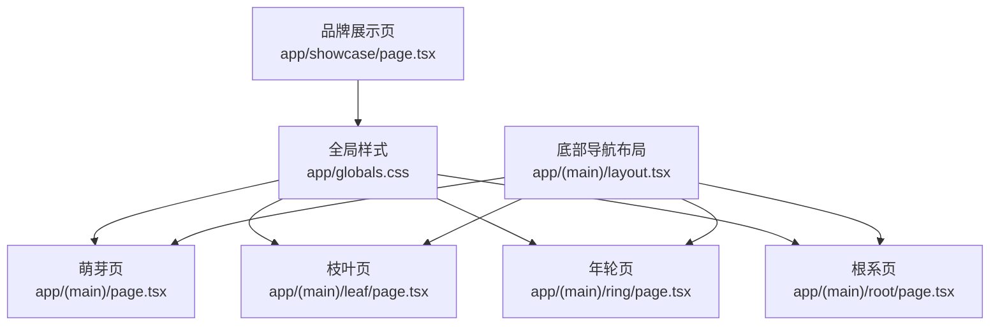
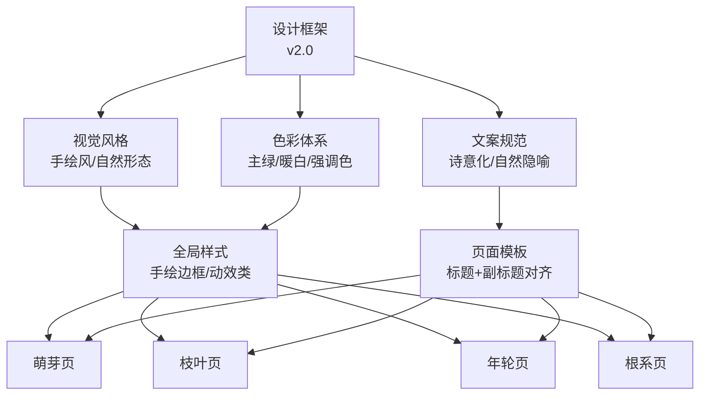
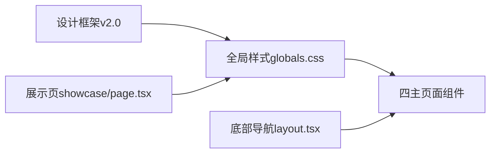

# 品牌视觉体系

<cite>
**本文引用的文件**
- [app/globals.css](file://app/globals.css)
- [doc/心芽小程序设计框架v2.0.md](file://doc/心芽小程序设计框架v2.0.md)
- [doc/心芽各页面标题行高对齐规范.md](file://doc/心芽各页面标题行高对齐规范.md)
- [doc/心芽富文本文字编辑规范.md](file://doc/心芽富文本文字编辑规范.md)
- [app/(main)/page.tsx](file://app/(main)/page.tsx)
- [app/(main)/leaf/page.tsx](file://app/(main)/leaf/page.tsx)
- [app/(main)/ring/page.tsx](file://app/(main)/ring/page.tsx)
- [app/(main)/root/page.tsx](file://app/(main)/root/page.tsx)
- [app/(main)/layout.tsx](file://app/(main)/layout.tsx)
- [app/showcase/page.tsx](file://app/showcase/page.tsx)
</cite>

## 目录
1. [引言](#引言)
2. [项目结构](#项目结构)
3. [核心组件](#核心组件)
4. [架构总览](#架构总览)
5. [详细组件分析](#详细组件分析)
6. [依赖分析](#依赖分析)
7. [性能考量](#性能考量)
8. [故障排查指南](#故障排查指南)
9. [结论](#结论)
10. [附录](#附录)

## 引言
本文件为“心芽”项目的完整品牌视觉体系文档，围绕产品定位与价值主张、品牌视觉风格、插图与动画规范、空状态插画与微动效、核心文案规范、Logo使用规范、品牌色彩应用指南与品牌资产使用标准展开。所有规范均基于仓库内已确认的设计文档与前端实现进行提炼与系统化整理，确保设计与开发的一致性。

## 项目结构
从品牌视角看，本项目的前端结构与样式组织如下：
- 全局样式与品牌变量定义位于全局CSS中，包含主题色、背景、字体、手绘风边框与关键动效类名。
- 四主页面（萌芽、枝叶、年轮、根系）遵循统一的标题区域结构与slogan副标题排版规范，保证切换时的视觉对齐。
- 底部导航采用四Tab布局，中央常驻新建入口，配合手绘风按钮与图标，形成一致的交互语言。
- 展示页用于集中呈现品牌色彩等视觉资产，便于查阅与复用。

图示来源
- [app/globals.css:1-79](file://app/globals.css#L1-L79)
- [app/(main)/page.tsx:198-230](file://app/(main)/page.tsx#L198-L230)
- [app/(main)/leaf/page.tsx:133-161](file://app/(main)/leaf/page.tsx#L133-L161)
- [app/(main)/ring/page.tsx:150-182](file://app/(main)/ring/page.tsx#L150-L182)
- [app/(main)/root/page.tsx:292-301](file://app/(main)/root/page.tsx#L292-L301)
- [app/(main)/layout.tsx:79-106](file://app/(main)/layout.tsx#L79-L106)
- [app/showcase/page.tsx:297-315](file://app/showcase/page.tsx#L297-L315)

章节来源
- [app/globals.css:1-79](file://app/globals.css#L1-L79)
- [doc/心芽小程序设计框架v2.0.md:191-229](file://doc/心芽小程序设计框架v2.0.md#L191-L229)
- [doc/心芽各页面标题行高对齐规范.md:1-191](file://doc/心芽各页面标题行高对齐规范.md#L1-L191)

## 核心组件
- 品牌色彩系统
  - 主色调：嫩绿色系（#8BC34A / #AED581）
  - 背景：暖白底色（#FAFAF5）
  - 强调色：大地棕（#795548）、天空蓝（#42A5F5）
  - 文本层级：正文黑（#333333）、辅助灰（#666666）、淡色字（#999999）
  - 边框：浅灰（#E8E8E3）
  - 以上变量在全局CSS中以CSS变量形式提供，并在页面中通过useTheme或内联样式引用。

- 手绘风格与圆角
  - 手绘风边框类：btn-sketch、input-sketch、card-sketch、dialog-sketch，统一不规则圆角，营造铅笔手绘质感。
  - 输入框与卡片在页面中广泛使用，保持界面有机感。

- 动效体系
  - 嫩芽生长动画（sproutGrow）、轻柔弹跳（bounceGentle）、收藏弹跳（bookmarkPop）、淡入上移（fadeIn）、卷轴展开（scrollUnfurl）、叶片展开（leafSpread）。
  - 加载状态以“嫩芽生长”替代传统转圈loading，强化品牌隐喻。

- 字体与可读性
  - 默认字体：微软雅黑/PingFang SC，兼顾多端一致性；富文本编辑器默认字号与行距遵循编辑规范。

章节来源
- [app/globals.css:3-13](file://app/globals.css#L3-L13)
- [app/globals.css:70-75](file://app/globals.css#L70-L75)
- [app/globals.css:24-68](file://app/globals.css#L24-L68)
- [doc/心芽富文本文字编辑规范.md:1-228](file://doc/心芽富文本文字编辑规范.md#L1-L228)

## 架构总览
品牌视觉体系贯穿“设计原则—样式实现—页面落地—交互反馈”的闭环。下图展示了从设计规范到前端实现的映射关系。

图示来源
- [doc/心芽小程序设计框架v2.0.md:191-229](file://doc/心芽小程序设计框架v2.0.md#L191-L229)
- [app/globals.css:1-79](file://app/globals.css#L1-L79)
- [doc/心芽各页面标题行高对齐规范.md:1-191](file://doc/心芽各页面标题行高对齐规范.md#L1-L191)

## 详细组件分析

### 产品定位与价值主张
- 名称：心芽
- Slogan：记录内心的每一次萌发
- 核心价值：私有记录 + 可控分享
- 双端策略：网页端专注写作编辑，手机端便捷回顾学习；两端富文本编辑功能一致

章节来源
- [doc/心芽小程序设计框架v2.0.md:10-18](file://doc/心芽小程序设计框架v2.0.md#L10-L18)

### 品牌视觉风格
- 线条手绘风：叶子、枝丫、年轮纹、根须等自然形态，铅笔手绘质感，温暖有机。
- 手绘风边框：通过不规则圆角类名统一按钮、输入框、卡片、对话框的视觉语言。
- 动效风格：轻量、有机、自然，如嫩芽生长、叶片展开、卷轴展开等。

章节来源
- [doc/心芽小程序设计框架v2.0.md:213-217](file://doc/心芽小程序设计框架v2.0.md#L213-L217)
- [app/globals.css:70-75](file://app/globals.css#L70-L75)
- [app/globals.css:24-68](file://app/globals.css#L24-L68)

### 插图与动画风格规范
- 插图风格：线条手绘风，自然形态为主，四个页面空状态各一张插画，带微动画，风格统一。
- 加载状态：以“嫩芽生长动画”代替传统转圈loading。
- 微动画：收藏弹跳、淡入上移、叶片展开等，强调轻快与自然。

章节来源
- [doc/心芽小程序设计框架v2.0.md:213-217](file://doc/心芽小程序设计框架v2.0.md#L213-L217)
- [app/globals.css:24-68](file://app/globals.css#L24-L68)

### 四个页面空状态插画与微动画要求
- 萌芽页空状态：提示“这里还是一片空旷的土壤”，引导点击底部“+”播下第一颗种子；加载态使用“正在生长…”与嫩芽emoji微动效。
- 枝叶页空状态：选择标签后无心得时显示“还没有这个标签的心得”，并配以落叶emoji与柔和提示。
- 年轮页空状态：热力图未生成时显示“加载中…”，后续将呈现日历热力图与统计卡片。
- 根系页空状态：设置项为空时给出友好提示，避免冷启动空白。

章节来源
- [app/(main)/page.tsx:345-360](file://app/(main)/page.tsx#L345-L360)
- [app/(main)/leaf/page.tsx:203-213](file://app/(main)/leaf/page.tsx#L203-L213)
- [app/(main)/ring/page.tsx:130-145](file://app/(main)/ring/page.tsx#L130-L145)
- [app/(main)/root/page.tsx:406-420](file://app/(main)/root/page.tsx#L406-L420)

### 核心文案规范
- 操作反馈文案
  - 发布成功：「一颗新芽破土而出 🌱」
  - 删除确认：「确定要让这片叶子飘落吗？一旦飘落，便无法追回。」
  - 按钮：【让它飘落】【再想想】
  - 分享成功：「一粒种子已随风飘向远方」
  - 离线保存：「种子还未落地，信号不在身边 🌿 你的心得已保存为草稿，待信号回来再发布吧。」
- 页面标题与Slogan
  - 萌芽：心之所向，芽之所生
  - 枝叶：思绪的脉络，在此生枝蔓叶
  - 年轮：感受心得生长的节律
  - 根系：此处是你的根，安静而深厚
- 语言风格：诗意化、自然隐喻、温暖克制，避免技术术语与冷硬表达。

章节来源
- [doc/心芽小程序设计框架v2.0.md:219-227](file://doc/心芽小程序设计框架v2.0.md#L219-L227)
- [doc/心芽各页面标题行高对齐规范.md:99-107](file://doc/心芽各页面标题行高对齐规范.md#L99-L107)

### Logo使用规范
- 当前仓库未提供Logo矢量源文件与具体使用规范说明。建议在后续版本补充Logo的清晰版、反白版、最小安全边距、尺寸比例与禁用示例，以确保跨场景应用一致性。

[本节为概念性内容，不直接分析具体文件]

### 品牌色彩应用指南
- 主色：嫩绿色系（#8BC34A / #AED581），用于强调、激活态、品牌标识元素。
- 背景：暖白底色（#FAFAF5），提升阅读舒适度。
- 强调色：大地棕（#795548）用于标签与强调；天空蓝（#42A5F5）用于图表数据。
- 文本层级：正文黑（#333333）、辅助灰（#666666）、淡色字（#999999），保证对比度与可读性。
- 边框：浅灰（#E8E8E3），用于分隔与边界弱化。
- 暗色模式：在根系页支持主题切换，颜色随主题动态调整。

章节来源
- [app/globals.css:3-13](file://app/globals.css#L3-L13)
- [app/showcase/page.tsx:297-315](file://app/showcase/page.tsx#L297-L315)
- [app/(main)/root/page.tsx:285-291](file://app/(main)/root/page.tsx#L285-L291)

### 品牌资产使用标准
- 样式变量：优先使用全局CSS变量与Tailwind类名，避免硬编码颜色值。
- 手绘风组件：统一使用手绘风边框类名，保持界面有机感。
- 动效类名：使用预置动效类名（如animate-sprout、animate-bounce-gentle等），控制时长与缓动函数，避免过度动效影响体验。
- 标题对齐：严格遵循标题与slogan的行高与间距规范，确保页面切换无跳动。

章节来源
- [app/globals.css:63-75](file://app/globals.css#L63-L75)
- [doc/心芽各页面标题行高对齐规范.md:44-74](file://doc/心芽各页面标题行高对齐规范.md#L44-L74)

## 依赖分析
品牌视觉体系的依赖关系如下：
- 设计框架文档作为唯一设计规范源，指导样式与文案。
- 全局CSS提供基础变量、手绘风边框与动效类名。
- 各页面组件按统一模板渲染标题与slogan，确保对齐与一致性。
- 底部导航布局统一四Tab入口，配合手绘风图标与文案。

图示来源
- [doc/心芽小程序设计框架v2.0.md:1-7](file://doc/心芽小程序设计框架v2.0.md#L1-L7)
- [app/globals.css:1-79](file://app/globals.css#L1-L79)
- [app/(main)/layout.tsx:79-106](file://app/(main)/layout.tsx#L79-L106)
- [app/showcase/page.tsx:297-315](file://app/showcase/page.tsx#L297-L315)

章节来源
- [doc/心芽小程序设计框架v2.0.md:1-7](file://doc/心芽小程序设计框架v2.0.md#L1-L7)
- [app/globals.css:1-79](file://app/globals.css#L1-L79)
- [app/(main)/layout.tsx:79-106](file://app/(main)/layout.tsx#L79-L106)
- [app/showcase/page.tsx:297-315](file://app/showcase/page.tsx#L297-L315)

## 性能考量
- 动效时长控制在轻量范围（0.35s-1.6s），避免阻塞用户操作。
- 手绘风边框与圆角对渲染开销较小，但应避免在大量列表项上叠加复杂阴影与渐变。
- 主题切换通过事件广播与本地存储实现，注意减少不必要的重绘。

[本节为通用建议，不直接分析具体文件]

## 故障排查指南
- 标题跳动问题
  - 检查各页面标题容器上内边距、标题字号与字重、标题与slogan间距、slogan字号与下间距是否完全一致。
  - 验证右侧占位元素宽度是否与对面按钮一致，避免flex布局错位。
- 手绘风边框异常
  - 确认是否使用了正确的类名（btn-sketch、input-sketch、card-sketch、dialog-sketch）。
- 动效未生效
  - 检查是否引用了预置动效类名，并确保CSS未被覆盖。
- 主题切换无效
  - 确认localStorage键名与事件广播是否正确触发，页面是否监听主题变化事件。

章节来源
- [doc/心芽各页面标题行高对齐规范.md:144-191](file://doc/心芽各页面标题行高对齐规范.md#L144-L191)
- [app/globals.css:70-75](file://app/globals.css#L70-L75)
- [app/globals.css:63-68](file://app/globals.css#L63-L68)
- [app/(main)/root/page.tsx:57-60](file://app/(main)/root/page.tsx#L57-L60)

## 结论
本品牌视觉体系以“记录内心的每一次萌发”为核心Slogan，围绕“私有记录 + 可控分享”的价值理念，构建了手绘自然风格的视觉语言与动效体系。通过统一的全局样式、严格的标题对齐规范与诗意的文案风格，确保用户在多端体验中获得一致、温暖、有机的品牌感知。后续可补充Logo使用规范与更多品牌资产，进一步完善品牌治理。

[本节为总结性内容，不直接分析具体文件]

## 附录

### 四页面架构与Slogan对照
- 萌芽：每一颗灵感的种子，都在此刻破土而出，迎接第一缕晨光，请在此播下你的思绪
- 枝叶：繁茂的枝叶向四面八方舒展，轻触标签的脉络，便能寻回那片承载记忆的叶子
- 年轮：时光在树干上刻下深浅不一的纹路，待岁月沉淀，此处将映照出你成长的轨迹
- 根系：根系在泥土深处悄然延伸，在此安顿偏好，静待功能丰盈时托起整片森林

章节来源
- [doc/心芽小程序设计框架v2.0.md:22-29](file://doc/心芽小程序设计框架v2.0.md#L22-L29)

### 富文本编辑器品牌适配要点
- 工具栏按钮规格：触摸友好尺寸、中性灰图标、柔和圆角与hover反馈。
- 文字颜色预设：深灰、嫩绿、天蓝、橙色、棕色、红色，保持品牌色板一致性。
- 编辑器容器：去除聚焦边框、舒适行高、最小高度与占位符提示。

章节来源
- [doc/心芽富文本文字编辑规范.md:47-102](file://doc/心芽富文本文字编辑规范.md#L47-L102)
- [doc/心芽富文本文字编辑规范.md:103-140](file://doc/心芽富文本文字编辑规范.md#L103-L140)