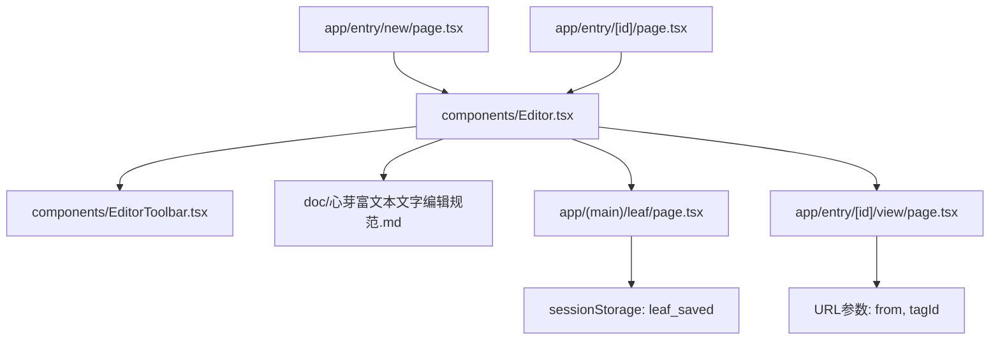
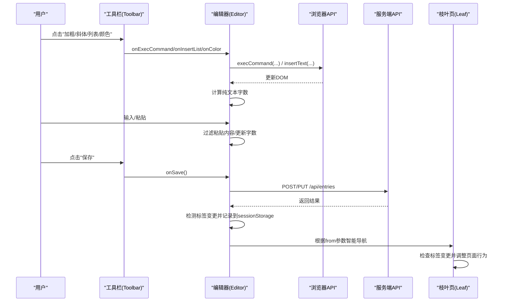
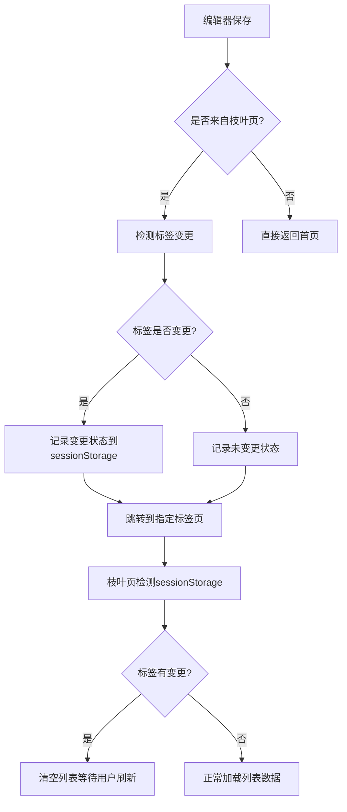
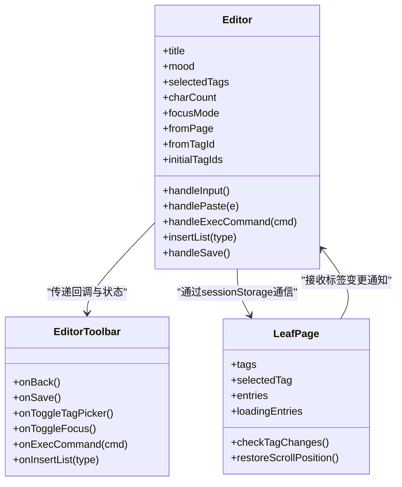

# 富文本编辑器设计规范

<cite>
**本文引用的文件**
- [Editor.tsx](file://components/Editor.tsx)
- [EditorToolbar.tsx](file://components/EditorToolbar.tsx)
- [编辑规范.md](file://doc/心芽富文本文字编辑规范.md)
- [entry/[id]/page.tsx](file://app/entry/[id]/page.tsx)
- [entry/new/page.tsx](file://app/entry/new/page.tsx)
- [leaf/page.tsx](file://app/(main)/leaf/page.tsx)
- [entry/[id]/view/page.tsx](file://app/entry/[id]/view/page.tsx)
</cite>

## 更新摘要
**变更内容**
- 新增导航上下文管理功能，支持从不同页面来源进入编辑器的智能返回机制
- 实现标签变化检测系统，在保存时自动检测标签变更并通知相关页面
- 增强会话状态管理，使用 sessionStorage 进行跨页面数据传递
- 优化用户体验，根据标签变更情况动态调整页面行为

## 目录
1. [引言](#引言)
2. [项目结构](#项目结构)
3. [核心组件](#核心组件)
4. [架构总览](#架构总览)
5. [详细组件分析](#详细组件分析)
6. [依赖关系分析](#依赖关系分析)
7. [性能与可用性考量](#性能与可用性考量)
8. [故障排查指南](#故障排查指南)
9. [结论](#结论)
10. [附录：功能清单与实现对照](#附录功能清单与实现对照)

## 引言
本规范面向"心芽"项目的富文本编辑器，统一通用编辑规则、排版标准、交互体验与网页端专属增强能力。目标是在保持轻量实现的同时，提供稳定一致的写作体验，并明确功能边界（如不实现图片上传、无标题层级等），为后续迭代与新程序接入提供参考。

**更新** 新增了导航上下文管理和标签变化检测功能，实现了更智能的页面间数据传递和用户体验优化。

## 项目结构
编辑器由页面路由挂载到两个入口：新建与编辑已有条目。核心逻辑集中在 Editor 组件，工具栏由独立组件提供，样式与行为遵循统一的文字编辑规范文档。

图表来源
- [entry/new/page.tsx:1-5](file://app/entry/new/page.tsx#L1-L5)
- [entry/[id]/page.tsx:1-9](file://app/entry/[id]/page.tsx#L1-L9)
- [Editor.tsx:1-211](file://components/Editor.tsx#L1-L211)
- [EditorToolbar.tsx:1-78](file://components/EditorToolbar.tsx#L1-L78)
- [leaf/page.tsx:1-310](file://app/(main)/leaf/page.tsx#L1-L310)
- [entry/[id]/view/page.tsx:1-245](file://app/entry/[id]/view/page.tsx#L1-L245)

章节来源
- [entry/new/page.tsx:1-5](file://app/entry/new/page.tsx#L1-L5)
- [entry/[id]/page.tsx:1-9](file://app/entry/[id]/page.tsx#L1-L9)
- [Editor.tsx:1-211](file://components/Editor.tsx#L1-L211)
- [EditorToolbar.tsx:1-78](file://components/EditorToolbar.tsx#L1-L78)
- [编辑规范.md:1-228](file://doc/心芽富文本文字编辑规范.md#L1-L228)

## 核心组件
- 编辑器容器与业务逻辑：负责内容渲染、粘贴净化、列表插入、字数统计、保存流程、专注模式切换、导航上下文管理等。
- 工具栏：提供加粗、斜体、下划线、有序/无序列表、颜色选择器、标签面板开关、专注模式入口与保存按钮。

**更新** 编辑器现在包含完整的导航上下文管理，能够识别来源页面并执行相应的返回逻辑。

章节来源
- [Editor.tsx:1-211](file://components/Editor.tsx#L1-L211)
- [EditorToolbar.tsx:1-78](file://components/EditorToolbar.tsx#L1-L78)

## 架构总览
编辑器采用"轻量原生方案"：contentEditable + document.execCommand，配合 React 状态管理 UI 与数据流。工具栏通过回调将操作下发至编辑器容器执行，编辑器在输入时更新纯文本字数，并在保存时将 HTML 内容与元数据提交至后端。

**更新** 新增了基于 sessionStorage 的标签变化检测机制和智能导航系统。

图表来源
- [EditorToolbar.tsx:41-76](file://components/EditorToolbar.tsx#L41-L76)
- [Editor.tsx:120-143](file://components/Editor.tsx#L120-L143)
- [leaf/page.tsx:82-125](file://app/(main)/leaf/page.tsx#L82-L125)

## 详细组件分析

### 通用编辑规则与基础设置
- 默认字体与字号
  - 正文使用系统默认字体族，避免跨平台不一致；字号采用 Tailwind 的 text-sm（约 14px）。
  - 行高采用 leading-relaxed，提升阅读舒适度。
- 字体颜色限制
  - 预设色板包含深灰、嫩绿、天蓝、橙色、棕色、红色共 6 色，用于强调、补充说明、警示、引用、错误等语义化表达。
  - 颜色选择器以绝对定位弹出，点击后自动应用 foreColor 并收起。
- 标题层级
  - 不实现 H1/H2/H3 等标题层级，标题由独立输入框承载，正文中不使用标题标签。
- 字体大小与字体族选择
  - 不暴露字体大小与字体族选择，保持全文统一风格。
- 对齐方式
  - 仅支持左对齐，不实现居中/右对齐。
- 下划线
  - 工具栏提供下划线按钮，但规范建议谨慎使用以避免与链接样式冲突。
- 删除线、有序列表、引用块、代码块、超链接
  - 规范明确不实现或按需取舍；当前实现保留有序列表按钮，实际可通过工具栏触发。

章节来源
- [Editor.tsx:156-206](file://components/Editor.tsx#L156-L206)
- [EditorToolbar.tsx:51-73](file://components/EditorToolbar.tsx#L51-L73)
- [编辑规范.md:11-44](file://doc/心芽富文本文字编辑规范.md#L11-L44)
- [编辑规范.md:74-100](file://doc/心芽富文本文字编辑规范.md#L74-L100)
- [编辑规范.md:148-165](file://doc/心芽富文本文字编辑规范.md#L148-L165)

### 编辑器功能规范
- 加粗/斜体/下划线
  - 通过 execCommand("bold"/"italic"/"underline") 切换选中区域格式。
- 有序/无序列表
  - 通过 execCommand("insertUnorderedList"/"insertOrderedList") 创建/取消列表；同时补充 CSS 使列表可见。
- 撤销/重做
  - 依赖浏览器原生 Ctrl+Z/Ctrl+Y，不单独提供按钮。
- 粘贴净化
  - 拦截 paste 事件，读取 clipboardData 的纯文本，再使用 insertText 插入，避免带入外部样式。
- 字数统计
  - 实时统计纯文本字数（去除 HTML 标签与空白字符），显示于工具栏右侧。

章节来源
- [EditorToolbar.tsx:51-61](file://components/EditorToolbar.tsx#L51-L61)
- [Editor.tsx:65-118](file://components/Editor.tsx#L65-L118)
- [Editor.tsx:69-72](file://components/Editor.tsx#L69-L72)
- [编辑规范.md:11-19](file://doc/心芽富文本文字编辑规范.md#L11-L19)
- [编辑规范.md:166-176](file://doc/心芽富文本文字编辑规范.md#L166-L176)

### 导航上下文管理与标签变化检测

**新增功能** 编辑器现在实现了完整的导航上下文管理系统，支持智能返回和标签变更检测。

#### 导航上下文管理
- **来源页面识别**：通过 URL 参数 `from` 和 `tagId` 识别编辑器的来源页面
- **智能返回逻辑**：根据来源页面类型执行不同的返回策略
- **会话状态持久化**：使用 sessionStorage 存储导航状态和标签变更信息

#### 标签变化检测机制
- **初始标签记录**：在加载现有条目时记录初始标签 ID 数组
- **变更检测算法**：比较初始标签与当前标签的差异
- **状态传递**：将标签变更状态保存到 sessionStorage 供目标页面使用
- **条件导航**：根据标签变更情况决定是否刷新列表数据

图表来源
- [Editor.tsx:129-140](file://components/Editor.tsx#L129-L140)
- [leaf/page.tsx:82-125](file://app/(main)/leaf/page.tsx#L82-L125)

#### 实现细节
- **标签变更检测**：比较标签数量和内容差异
- **会话数据存储**：使用 JSON 格式存储 `{tagChanged, tagId}` 信息
- **页面行为控制**：根据标签变更状态决定列表加载策略
- **用户体验优化**：避免不必要的网络请求和数据刷新

章节来源
- [Editor.tsx:22-27](file://components/Editor.tsx#L22-L27)
- [Editor.tsx:39-57](file://components/Editor.tsx#L39-L57)
- [Editor.tsx:129-140](file://components/Editor.tsx#L129-L140)
- [leaf/page.tsx:82-125](file://app/(main)/leaf/page.tsx#L82-L125)

### 排版标准
- 无标题层级设计
  - 标题由独立 input 承载，正文不使用标题标签，避免文档式层级。
- 粘贴净化规则
  - 强制粘贴纯文本，防止外部样式污染。
- 不支持图片粘贴或上传
  - 编辑器未实现图片相关能力，保持简洁与一致性。

章节来源
- [Editor.tsx:177](file://components/Editor.tsx#L177)
- [Editor.tsx:69-72](file://components/Editor.tsx#L69-L72)
- [编辑规范.md:21-44](file://doc/心芽富文本文字编辑规范.md#L21-L44)

### 用户体验要求
- 自动保存机制（每 30 秒）
  - 当前实现未内置定时自动保存；建议在 Editor 组件内增加定时器，每 30 秒将当前 title/content/mood/tags 等元数据持久化，并在网络异常时给出提示。
- 字数统计显示
  - 已在工具栏右下角显示纯文本字数，随输入实时更新。
- 专注模式
  - 进入专注模式后隐藏顶部工具栏与标签区，背景加深，底部出现"保存"浮层；右上角提供退出按钮。
- ESC 退出机制（网页端专属增强）
  - 当前实现未监听 ESC；建议在专注模式下监听键盘事件，按 ESC 退出专注模式，提升可发现性与易用性。

**更新** 新增了智能导航体验，用户可以从不同页面进入编辑器并获得合适的返回体验。

章节来源
- [Editor.tsx:156-206](file://components/Editor.tsx#L156-L206)
- [EditorToolbar.tsx:59-61](file://components/EditorToolbar.tsx#L59-L61)

### 网页端专属增强功能
- 全屏编辑模式（专注模式）
  - 隐藏非必要元素，增大正文可视区域，降低干扰。
- ESC 退出机制
  - 建议在专注模式下监听 ESC 键，快速退出专注模式。

**更新** 增强了页面间的导航体验，支持从枝叶页直接进入编辑并智能返回。

章节来源
- [Editor.tsx:176-200](file://components/Editor.tsx#L176-L200)

### 离线状态处理与提示信息规范
- 现状
  - 当前保存逻辑未显式处理网络异常分支之外的离线场景；捕获异常后提示"网络异常"。
- 建议
  - 检测 navigator.onLine，离线时禁用保存按钮并提示"当前处于离线状态，内容已暂存本地，联网后将自动同步"。
  - 使用 localStorage 缓存草稿，恢复页面时优先加载本地草稿，并提供"恢复/清空"选项。
  - 在网络恢复后尝试重试保存，并通过 toast 反馈结果。

**更新** 新增了标签变更状态的离线存储考虑，确保在离线状态下也能正确记录标签变更。

章节来源
- [Editor.tsx:141-142](file://components/Editor.tsx#L141-L142)

## 依赖关系分析
- 组件耦合
  - Editor 作为容器，持有状态与副作用；EditorToolbar 为无状态展示型组件，通过回调与父组件通信。
- 外部依赖
  - 使用 lucide-react 图标库；使用 react-hot-toast 进行消息提示；Next.js 路由与 fetch API 进行数据请求。
- 潜在循环依赖
  - 当前无循环依赖风险。

**更新** 新增了与枝叶页的会话状态依赖关系。

图表来源
- [Editor.tsx:22-143](file://components/Editor.tsx#L22-L143)
- [EditorToolbar.tsx:22-76](file://components/EditorToolbar.tsx#L22-L76)
- [leaf/page.tsx:72-180](file://app/(main)/leaf/page.tsx#L72-L180)

章节来源
- [Editor.tsx:1-211](file://components/Editor.tsx#L1-L211)
- [EditorToolbar.tsx:1-78](file://components/EditorToolbar.tsx#L1-L78)

## 性能与可用性考量
- 渲染性能
  - 使用 contentEditable 直接操作 DOM，避免重型富文本库开销；字数统计基于 textContent 正则清洗，注意在长文本下避免频繁重排。
- 交互体验
  - 工具栏按钮使用 onMouseDown 阻止默认行为，避免焦点丢失导致选区失效；必要时在 execCommand 后主动 focus 恢复光标。
- 可访问性
  - 为关键按钮添加 aria-label；颜色选择器需保证对比度与键盘可达性。
- 会话状态管理
  - 合理使用 sessionStorage 存储临时状态，避免内存泄漏；及时清理不再需要的会话数据。

**更新** 新增了会话状态管理的性能考虑，确保标签变更检测不会造成性能问题。

## 故障排查指南
- 执行命令后看不到效果
  - 检查是否遗漏列表样式定义；确保 ul/ol/li 有合适的 list-style 与缩进。
- 点击工具栏后光标位置丢失
  - 在执行命令后调用 editorRef.current?.focus() 恢复焦点。
- 粘贴外部内容格式混乱
  - 确认已拦截 paste 事件并使用纯文本插入。
- execCommand 废弃警告
  - 该方案仍被主流浏览器支持，若未来迁移，可考虑 Selection/Range API 或专业编辑器框架。
- 标签变更检测失效
  - 检查 sessionStorage 是否正确读写；确认 initialTagIds 初始化逻辑是否正常。
- 导航返回异常
  - 验证 URL 参数 from 和 tagId 是否正确传递；检查路由跳转逻辑。

**更新** 新增了导航和标签检测相关的故障排查指导。

章节来源
- [编辑规范.md:194-214](file://doc/心芽富文本文字编辑规范.md#L194-L214)
- [Editor.tsx:69-72](file://components/Editor.tsx#L69-L72)
- [Editor.tsx:177](file://components/Editor.tsx#L177)

## 结论
本规范明确了心芽富文本编辑器的功能边界、排版标准与交互体验，结合现有实现形成一套轻量、稳定、易维护的方案。**更新后的版本新增了智能导航上下文管理和标签变化检测功能，显著提升了用户体验的连贯性和智能化水平。** 后续可在不改变整体架构的前提下，逐步完善自动保存、离线处理与 ESC 快捷键等体验增强点。

## 附录：功能清单与实现对照
- 必须实现
  - 加粗/斜体/下划线：已实现
  - 有序/无序列表：已实现（含样式补充）
  - 文字颜色：已实现（预设色板）
  - 字数统计：已实现（纯文本计数）
  - 导航上下文管理：已实现（智能返回机制）
  - 标签变化检测：已实现（sessionStorage状态传递）
- 明确不实现
  - 标题层级/字体大小/字体族/对齐/删除线/有序列表（视产品取舍）/引用块/代码块/超链接/图片上传：遵循规范与当前实现
- 网页端增强
  - 专注模式：已实现
  - ESC 退出：待实现
  - 自动保存（每 30 秒）：待实现
  - 离线处理与提示：待实现
  - 智能导航：已实现
  - 标签变更检测：已实现

**更新** 新增了导航上下文管理和标签变化检测功能的实现状态。

章节来源
- [编辑规范.md:11-44](file://doc/心芽富文本文字编辑规范.md#L11-L44)
- [Editor.tsx:156-206](file://components/Editor.tsx#L156-L206)
- [EditorToolbar.tsx:51-73](file://components/EditorToolbar.tsx#L51-L73)
- [Editor.tsx:129-140](file://components/Editor.tsx#L129-L140)
- [leaf/page.tsx:82-125](file://app/(main)/leaf/page.tsx#L82-L125)