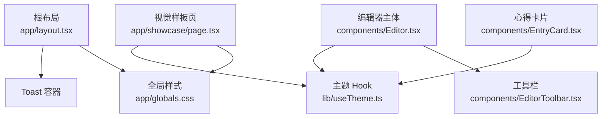
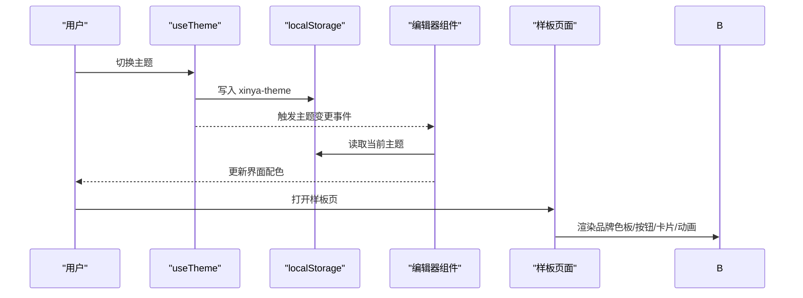
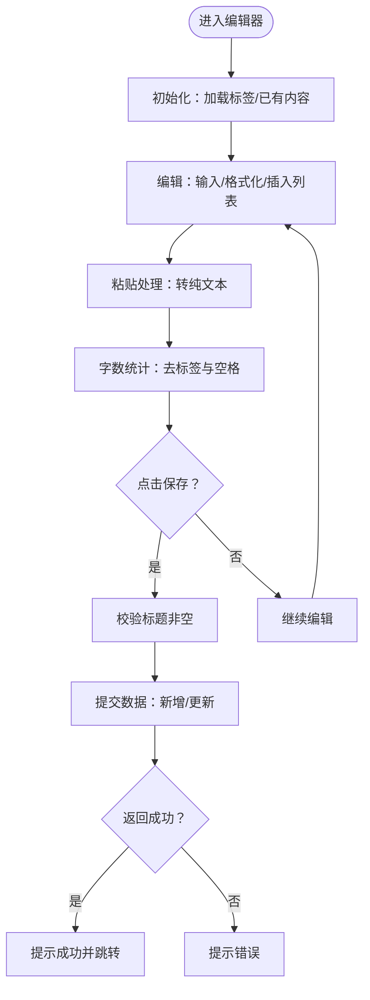
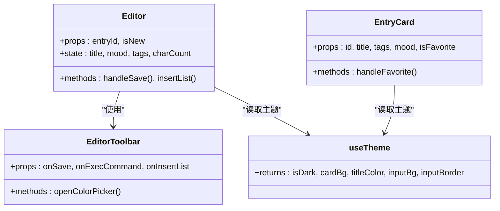

# 设计文档

<cite>
**本文引用的文件**   
- [README.md](file://README.md)
- [app/layout.tsx](file://app/layout.tsx)
- [app/globals.css](file://app/globals.css)
- [components/Editor.tsx](file://components/Editor.tsx)
- [components/EditorToolbar.tsx](file://components/EditorToolbar.tsx)
- [lib/useTheme.ts](file://lib/useTheme.ts)
- [components/EntryCard.tsx](file://components/EntryCard.tsx)
- [app/showcase/page.tsx](file://app/showcase/page.tsx)
- [doc/心芽富文本文字编辑规范.md](file://doc/心芽富文本文字编辑规范.md)
- [doc/心芽小程序设计框架v2.0.md](file://doc/心芽小程序设计框架v2.0.md)
- [doc/暗色系修改经验总结.md](file://doc/暗色系修改经验总结.md)
</cite>

## 目录
1. [引言](#引言)
2. [项目结构](#项目结构)
3. [核心组件](#核心组件)
4. [架构总览](#架构总览)
5. [详细组件分析](#详细组件分析)
6. [依赖关系分析](#依赖关系分析)
7. [性能与体验考量](#性能与体验考量)
8. [故障排查指南](#故障排查指南)
9. [结论](#结论)
10. [附录：设计规范清单](#附录设计规范清单)

## 引言
本设计文档面向“心芽”项目的视觉与交互规范，覆盖色彩体系、字体与间距、组件样式约定、交互原则（含无障碍）、品牌视觉实现、富文本编辑器规范、响应式适配策略、动画与过渡规范，以及设计资源获取与使用方式。文档同时结合代码实现与既有设计说明，确保设计与工程一致可落地。

## 项目结构
- 前端采用 Next.js App Router，全局样式与主题变量集中在根布局与全局 CSS 中；UI 组件位于 components 目录；展示样板页面用于统一视觉验收。
- 根布局负责站点元信息、图标与 Toast 提示容器；全局 CSS 定义品牌色、字体、动画与手绘风格边框等基础样式。
- 富文本编辑器由 Editor 与 EditorToolbar 组成，配合 useTheme 提供明暗主题能力；EntryCard 为列表卡片组件，showcase 页面集中展示品牌色板、按钮、卡片、标签、心情、空状态与动画等视觉样例。

图示来源
- [app/layout.tsx:1-43](file://app/layout.tsx#L1-L43)
- [app/globals.css:1-79](file://app/globals.css#L1-L79)
- [components/Editor.tsx:1-192](file://components/Editor.tsx#L1-L192)
- [components/EditorToolbar.tsx:1-78](file://components/EditorToolbar.tsx#L1-L78)
- [lib/useTheme.ts:1-30](file://lib/useTheme.ts#L1-L30)
- [components/EntryCard.tsx:1-138](file://components/EntryCard.tsx#L1-L138)
- [app/showcase/page.tsx:1-538](file://app/showcase/page.tsx#L1-L538)

章节来源
- [README.md:1-37](file://README.md#L1-L37)
- [app/layout.tsx:1-43](file://app/layout.tsx#L1-L43)
- [app/globals.css:1-79](file://app/globals.css#L1-L79)

## 核心组件
- 根布局与全局样式
  - 站点标题、描述、PWA manifest、图标与视口配置；Toast 提示容器默认位置与成功态主色。
  - 全局 CSS 定义品牌色变量、正文字体、基础背景与一系列动效类名、手绘风格圆角、移动端安全区适配。
- 主题系统
  - useTheme 提供 isDark、cardBg、titleColor、inputBg/inputBorder 等主题值，基于 localStorage 持久化并监听跨组件事件同步。
- 富文本编辑器
  - Editor 负责内容输入、字数统计、保存流程、标签选择与心情标记；EditorToolbar 提供加粗、斜体、列表、颜色选择器、标签与专注模式入口。
- 卡片与交互
  - EntryCard 展示标题、预览、标签、心情与时间，支持收藏、置顶、删除等交互，并应用手绘风格边框与收藏弹跳动画。
- 视觉样板
  - showcase 页面集中呈现品牌色板、字体排版、按钮、搜索筛选、今日速览、卡片、标签气泡、心情、加载动画、AI洞察卡片、删除弹窗与多主题示例。

章节来源
- [app/layout.tsx:1-43](file://app/layout.tsx#L1-L43)
- [app/globals.css:1-79](file://app/globals.css#L1-L79)
- [lib/useTheme.ts:1-30](file://lib/useTheme.ts#L1-L30)
- [components/Editor.tsx:1-192](file://components/Editor.tsx#L1-L192)
- [components/EditorToolbar.tsx:1-78](file://components/EditorToolbar.tsx#L1-L78)
- [components/EntryCard.tsx:1-138](file://components/EntryCard.tsx#L1-L138)
- [app/showcase/page.tsx:1-538](file://app/showcase/page.tsx#L1-L538)

## 架构总览
从设计到实现的映射关系如下：
- 品牌色彩与字体通过全局 CSS 的 CSS 变量与 body 字体声明生效，供各组件直接使用。
- 主题切换通过 useTheme 在客户端读取 localStorage 并广播事件，子组件订阅后更新 UI。
- 富文本编辑器遵循“最小可用”原则，仅保留必要格式能力，并通过样式补充保证列表等可视化表现。
- 样板页面作为“单一事实源”，用于确认整体风格与交互细节。

图示来源
- [lib/useTheme.ts:1-30](file://lib/useTheme.ts#L1-L30)
- [components/Editor.tsx:1-192](file://components/Editor.tsx#L1-L192)
- [app/showcase/page.tsx:1-538](file://app/showcase/page.tsx#L1-L538)

## 详细组件分析

### 色彩体系与字体规范
- 色彩体系
  - 主绿 #8BC34A、浅绿 #AED581、暖白底 #FAFAF5、大地棕 #795548、天空蓝 #42A5F5、正文黑 #333333、辅助灰 #666666、淡色字 #999999、边框 #E8E8E3。
  - 这些变量在根 CSS 中以 CSS 变量形式暴露，并在多处组件内直接引用或派生使用。
- 字体规范
  - 全局字体优先使用微软雅黑，回退 PingFang SC 与 sans-serif；正文行高宽松以提升可读性。
- 字号层级
  - 标题常用 text-xl/text-base，正文 text-sm，辅助信息 text-xs；样板页面展示了完整层级。
- 间距与圆角
  - 手绘风格圆角类名 btn-sketch/input-sketch/card-sketch/dialog-sketch 提供有机边框感；移动端底部安全区通过 env(safe-area-inset-bottom) 适配。

章节来源
- [app/globals.css:1-79](file://app/globals.css#L1-L79)
- [app/showcase/page.tsx:297-327](file://app/showcase/page.tsx#L297-L327)

### 组件样式约定
- 按钮
  - 主操作使用渐变绿色与手绘圆角；次要操作使用描边样式；危险操作使用红色系。
- 卡片
  - 白色背景 + 手绘圆角 + 阴影，置顶时以主绿边框强调；收藏图标点击带弹跳反馈。
- 输入框
  - 透明背景融入页面，聚焦时去除默认轮廓；输入区域在编辑器中使用宽松行高与最小高度。
- 标签与心情
  - 标签胶囊使用浅色背景与绿色文字；心情图标按语义着色，选中态有边框与背景高亮。

章节来源
- [components/EntryCard.tsx:1-138](file://components/EntryCard.tsx#L1-L138)
- [components/Editor.tsx:137-188](file://components/Editor.tsx#L137-L188)
- [app/showcase/page.tsx:330-435](file://app/showcase/page.tsx#L330-L435)

### 交互设计原则
- 操作流程
  - 新建/编辑：顶部返回与保存按钮固定，工具栏横向滚动适配小屏；专注模式下隐藏多余元素，底部浮出保存按钮。
  - 收藏/置顶/删除：卡片右上角收藏图标点击即时反馈；更多菜单提供置顶与删除；删除前弹出确认文案。
- 反馈机制
  - 成功/错误通过 Toast 提示；收藏动作附带弹跳动画；保存过程显示“保存中…”禁用状态。
- 无障碍访问
  - 使用语义化标签与原生控件（如 input、button）；避免纯装饰性交互阻断键盘操作；颜色对比度遵循常规可读性要求。
- 文案风格
  - 操作反馈与空状态文案保持自然、温暖、拟物化的“种子/叶子”隐喻，增强情感连接。

章节来源
- [components/EditorToolbar.tsx:1-78](file://components/EditorToolbar.tsx#L1-L78)
- [components/Editor.tsx:115-135](file://components/Editor.tsx#L115-L135)
- [components/EntryCard.tsx:48-106](file://components/EntryCard.tsx#L48-L106)
- [app/showcase/page.tsx:201-223](file://app/showcase/page.tsx#L201-L223)

### 品牌视觉体系实现
- Logo 与标识
  - 认证页使用 Emoji 🌱 与品牌主绿标题，辅以副标题；根布局设置 PWA 图标与 Apple 启动图。
- 图标规范
  - 统一使用 Lucide Icons，线宽一致，风格简洁；导航 Tab 图标分别对应萌芽/枝叶/年轮/根系。
- 视觉元素统一
  - 手绘风边框、柔和圆角、自然形态插画与微动效贯穿全站；样板页面集中展示并作为验收基准。

章节来源
- [app/(auth)/layout.tsx:1-17](file://app/(auth)/layout.tsx#L1-L17)
- [app/layout.tsx:1-43](file://app/layout.tsx#L1-L43)
- [app/showcase/page.tsx:229-264](file://app/showcase/page.tsx#L229-L264)
- [app/showcase/page.tsx:61-105](file://app/showcase/page.tsx#L61-L105)

### 富文本编辑器设计规范
- 功能边界
  - 必须：加粗、斜体、无序列表、文字颜色、字数统计。
  - 不实现：标题层级、字体大小/族、对齐、下划线、删除线、有序列表、引用块、代码块、超链接、撤销重做按钮。
- 工具栏布局
  - 左起：加粗/斜体/列表/颜色；分隔线；标签/专注模式；右侧显示字数。
- 颜色选择器
  - 预设 6 色，圆形色块，点击即应用并自动收起。
- 编辑器容器
  - contentEditable + execCommand 方案；补充 ul/ol/li 样式；粘贴净化为纯文本；光标恢复与占位符提示。
- 用户体验
  - 标题独立于正文；专注模式全屏沉浸；实时字数统计；保存失败/网络异常均有明确提示。

图示来源
- [components/Editor.tsx:37-124](file://components/Editor.tsx#L37-L124)
- [components/EditorToolbar.tsx:35-73](file://components/EditorToolbar.tsx#L35-L73)
- [doc/心芽富文本文字编辑规范.md:1-228](file://doc/心芽富文本文字编辑规范.md#L1-L228)

章节来源
- [doc/心芽富文本文字编辑规范.md:1-228](file://doc/心芽富文本文字编辑规范.md#L1-L228)
- [components/Editor.tsx:1-192](file://components/Editor.tsx#L1-L192)
- [components/EditorToolbar.tsx:1-78](file://components/EditorToolbar.tsx#L1-L78)

### 响应式设计与断点
- 断点策略
  - 手机 <768px 单栏；桌面 >1024px 三栏；平板暂不考虑。
- 适配要点
  - 移动端底部安全区适配；工具栏横向滚动；卡片与标签在小屏下的紧凑排列；字号与行高在移动端保持可读性。
- 视口与 PWA
  - 视口设置为 device-width，initialScale=1，viewportFit=cover；manifest 与图标配置完善。

章节来源
- [doc/心芽小程序设计框架v2.0.md:230-238](file://doc/心芽小程序设计框架v2.0.md#L230-L238)
- [app/layout.tsx:21-25](file://app/layout.tsx#L21-L25)
- [app/globals.css:76-78](file://app/globals.css#L76-L78)

### 动画与过渡效果
- 动效清单
  - 嫩芽生长、轻柔弹跳、收藏弹跳、淡入上移、卷轴展开、叶片展开。
- 使用建议
  - 控制时长与缓动，避免干扰阅读；仅在关键反馈处使用（如收藏、加载、展开）。
- 实现方式
  - 通过全局 CSS 的 @keyframes 与 .animate-* 类名复用；SVG 插画结合 transform-origin 与 animation 组合。

章节来源
- [app/globals.css:24-74](file://app/globals.css#L24-L74)
- [app/showcase/page.tsx:78-105](file://app/showcase/page.tsx#L78-L105)
- [components/EntryCard.tsx:78-83](file://components/EntryCard.tsx#L78-L83)

### 设计资源获取与使用
- 图标
  - 统一使用 Lucide Icons，在组件中按需引入，保持线宽与风格一致。
- 字体
  - 全局字体已配置，无需额外引入；如需扩展，遵循新程序 UI 设计要求。
- 颜色与样式
  - 参考 showcase 页面的色板与组件样例；所有颜色与圆角类名已在 globals.css 中集中管理。
- 插画与动效
  - 样板页包含 SVG 插画与动效演示，可直接复用或调整尺寸与配色。

章节来源
- [app/showcase/page.tsx:297-327](file://app/showcase/page.tsx#L297-L327)
- [app/globals.css:70-74](file://app/globals.css#L70-L74)
- [components/EditorToolbar.tsx:1-78](file://components/EditorToolbar.tsx#L1-L78)

## 依赖关系分析
- 组件耦合
  - Editor 依赖 EditorToolbar 与 useTheme；EntryCard 依赖 useTheme 与 lucide-react；showcase 聚合展示多个组件与样式。
- 外部依赖
  - lucide-react 提供图标；react-hot-toast 提供提示；Next.js 提供路由与元信息。
- 潜在风险
  - 主题刷新时的 SSR hydration 不一致可能导致背景闪烁或失效，需遵循客户端初始化策略。

图示来源
- [components/Editor.tsx:1-192](file://components/Editor.tsx#L1-L192)
- [components/EditorToolbar.tsx:1-78](file://components/EditorToolbar.tsx#L1-L78)
- [components/EntryCard.tsx:1-138](file://components/EntryCard.tsx#L1-L138)
- [lib/useTheme.ts:1-30](file://lib/useTheme.ts#L1-L30)

章节来源
- [lib/useTheme.ts:1-30](file://lib/useTheme.ts#L1-L30)
- [components/Editor.tsx:1-192](file://components/Editor.tsx#L1-L192)
- [components/EditorToolbar.tsx:1-78](file://components/EditorToolbar.tsx#L1-L78)
- [components/EntryCard.tsx:1-138](file://components/EntryCard.tsx#L1-L138)

## 性能与体验考量
- 首屏与主题
  - 主题逻辑应在客户端 useEffect 中执行，避免 SSR hydration mismatch；必要时可在 head 中内联脚本提前设置背景色以减少闪烁。
- 编辑器性能
  - 字数统计与 DOM 操作尽量节流；避免频繁 re-render；列表插入时注意选区与焦点恢复。
- 动画性能
  - 优先使用 transform 与 opacity 的 GPU 加速属性；避免在高频交互中触发复杂布局计算。
- 可访问性
  - 确保键盘可达、焦点可见；颜色对比度满足 WCAG 基本要求；为图片与图标提供替代文本。

章节来源
- [doc/暗色系修改经验总结.md:1-238](file://doc/暗色系修改经验总结.md#L1-L238)
- [components/Editor.tsx:60-113](file://components/Editor.tsx#L60-L113)
- [app/globals.css:24-74](file://app/globals.css#L24-L74)

## 故障排查指南
- 主题刷新失效
  - 现象：切换暗色后刷新，背景恢复亮色但子组件仍暗色。
  - 原因：SSR hydration 阶段初始值与客户端不一致导致状态被覆盖。
  - 解决：将主题初始化与读取放入 useEffect；useState 初始值使用默认亮色；必要时在 head 中内联脚本提前设置背景。
- 富文本常见问题
  - 列表无样式：补充 ul/ol/li 的 CSS。
  - 点击工具栏丢失光标：execCommand 后调用 focus 恢复。
  - 粘贴格式混乱：拦截 paste 事件，插入纯文本。
- 调试方法
  - 四层验证法：数据层 → 逻辑层 → DOM 层 → 事件层；每步打印预期与实际值定位差异。

章节来源
- [doc/暗色系修改经验总结.md:1-238](file://doc/暗色系修改经验总结.md#L1-L238)
- [doc/心芽富文本文字编辑规范.md:192-228](file://doc/心芽富文本文字编辑规范.md#L192-L228)

## 结论
本设计文档将品牌视觉、交互原则与富文本规范统一到代码实现与样板页面中，形成“所见即所得”的设计资产。通过明确的色彩、字体、组件与动效约定，以及响应式与无障碍策略，确保产品在不同设备与主题下保持一致的体验。后续迭代应持续以 showcase 页面为基准进行视觉验收，并以 useTheme 与全局 CSS 为唯一事实源维护一致性。

## 附录：设计规范清单
- 色彩体系
  - 主绿 #8BC34A、浅绿 #AED581、暖白底 #FAFAF5、大地棕 #795548、天空蓝 #42A5F5、正文黑 #333333、辅助灰 #666666、淡色字 #999999、边框 #E8E8E3。
- 字体与排版
  - 微软雅黑优先，PingFang SC 回退；正文行高宽松；标题层级清晰。
- 组件样式
  - 手绘圆角、柔和阴影、收藏弹跳、淡入上移；输入框透明背景；标签胶囊与心情图标语义化配色。
- 富文本编辑器
  - 功能边界明确；工具栏布局规范；颜色选择器 6 色；列表样式补充；粘贴净化与光标恢复。
- 响应式与无障碍
  - 断点策略与移动端安全区；键盘可达与焦点可见；颜色对比度达标。
- 动画与过渡
  - 限定时长与缓动；关键反馈处使用；GPU 友好属性优先。
- 设计资源
  - 图标来自 Lucide；字体全局配置；颜色与圆角类名集中于全局 CSS；样板页面作为验收基准。

章节来源
- [app/globals.css:1-79](file://app/globals.css#L1-L79)
- [app/showcase/page.tsx:297-538](file://app/showcase/page.tsx#L297-L538)
- [doc/心芽富文本文字编辑规范.md:1-228](file://doc/心芽富文本文字编辑规范.md#L1-L228)
- [doc/心芽小程序设计框架v2.0.md:191-238](file://doc/心芽小程序设计框架v2.0.md#L191-L238)