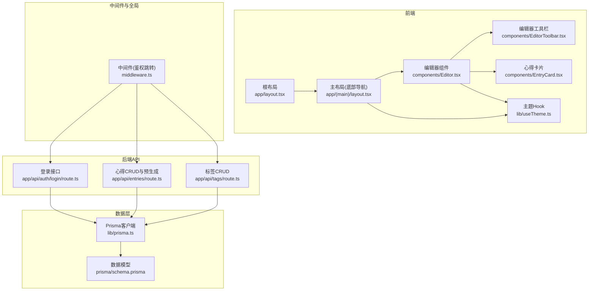
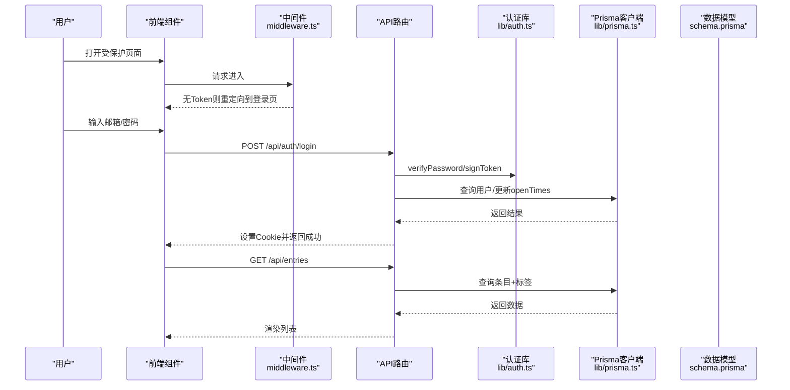
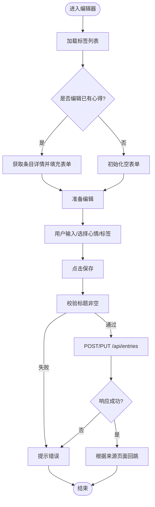
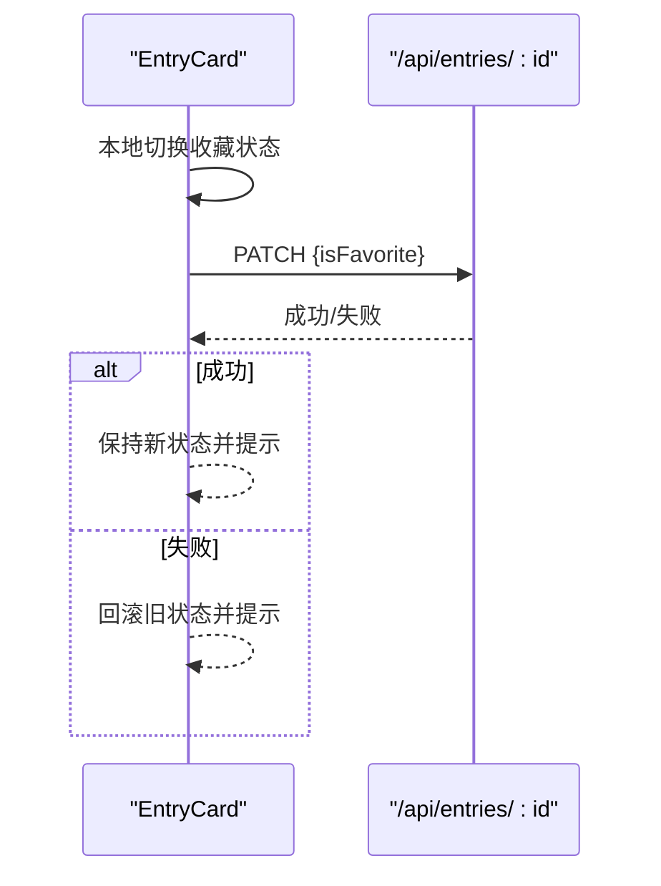
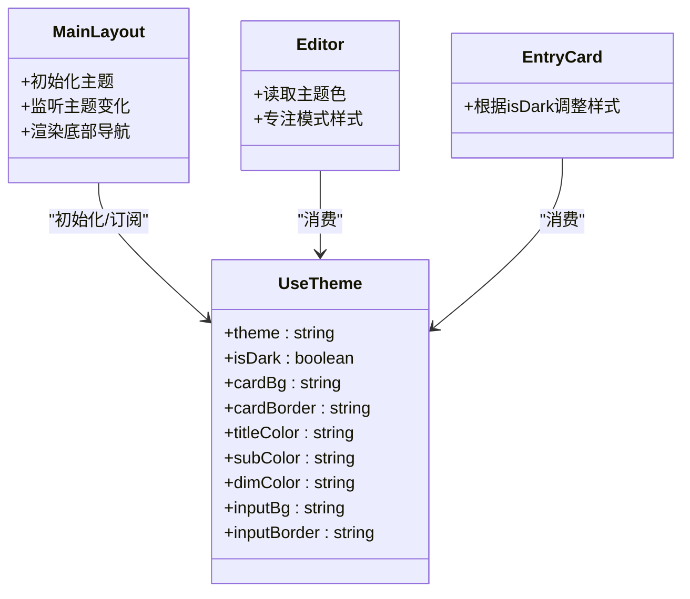
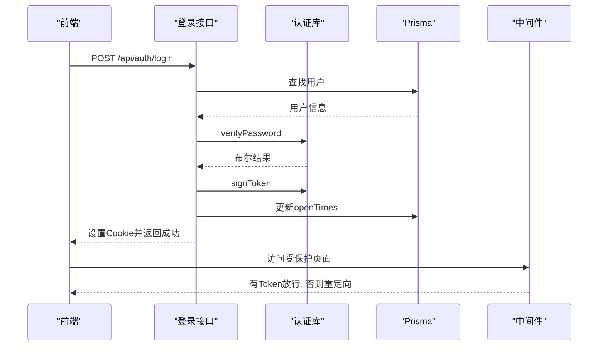
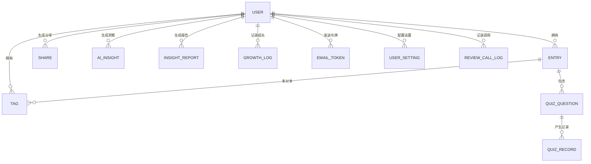
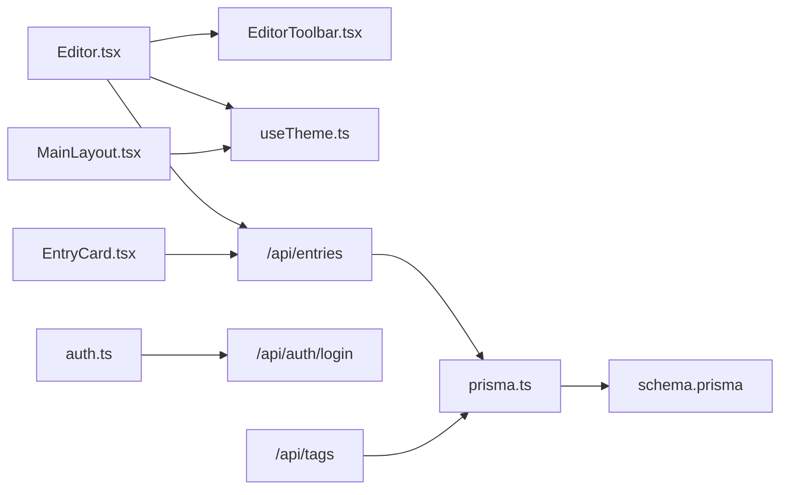

# 设计系统文档

<cite>
**本文引用的文件**   
- [README.md](file://README.md)
- [package.json](file://package.json)
- [prisma/schema.prisma](file://prisma/schema.prisma)
- [middleware.ts](file://middleware.ts)
- [app/layout.tsx](file://app/layout.tsx)
- [components/Editor.tsx](file://components/Editor.tsx)
- [components/EntryCard.tsx](file://components/EntryCard.tsx)
- [components/EditorToolbar.tsx](file://components/EditorToolbar.tsx)
- [lib/auth.ts](file://lib/auth.ts)
- [lib/prisma.ts](file://lib/prisma.ts)
- [lib/useTheme.ts](file://lib/useTheme.ts)
- [app/(main)/layout.tsx](file://app/(main)/layout.tsx)
- [app/api/auth/login/route.ts](file://app/api/auth/login/route.ts)
- [app/api/entries/route.ts](file://app/api/entries/route.ts)
- [app/api/tags/route.ts](file://app/api/tags/route.ts)
</cite>

## 目录
1. [引言](#引言)
2. [项目结构](#项目结构)
3. [核心组件](#核心组件)
4. [架构总览](#架构总览)
5. [详细组件分析](#详细组件分析)
6. [依赖关系分析](#依赖关系分析)
7. [性能考量](#性能考量)
8. [故障排查指南](#故障排查指南)
9. [结论](#结论)
10. [附录](#附录)

## 引言
本设计系统文档面向“心芽”应用，围绕其前端交互、主题体系、内容编辑与卡片展示、标签与心得管理、认证与鉴权、数据模型与API等维度进行系统化梳理。目标是帮助开发者快速理解代码组织方式、关键流程与扩展点，同时为非技术读者提供清晰的概览与使用指引。

## 项目结构
本项目基于 Next.js App Router 构建，采用前后端同构的模块化组织：
- app 目录：页面路由与 API 路由（服务端）
- components 目录：可复用的 UI 组件
- lib 目录：工具与共享逻辑（认证、数据库客户端、主题 Hook 等）
- prisma 目录：数据库模型与迁移
- public 目录：静态资源
- scripts 目录：脚本工具

图表来源
- [app/layout.tsx:1-43](file://app/layout.tsx#L1-L43)
- [app/(main)/layout.tsx:1-173](file://app/(main)/layout.tsx#L1-L173)
- [components/Editor.tsx:1-211](file://components/Editor.tsx#L1-L211)
- [components/EditorToolbar.tsx:1-78](file://components/EditorToolbar.tsx#L1-L78)
- [components/EntryCard.tsx:1-138](file://components/EntryCard.tsx#L1-L138)
- [lib/useTheme.ts:1-30](file://lib/useTheme.ts#L1-L30)
- [middleware.ts:1-29](file://middleware.ts#L1-L29)
- [app/api/auth/login/route.ts:1-39](file://app/api/auth/login/route.ts#L1-L39)
- [app/api/entries/route.ts:1-163](file://app/api/entries/route.ts#L1-L163)
- [app/api/tags/route.ts:1-46](file://app/api/tags/route.ts#L1-L46)
- [lib/prisma.ts:1-14](file://lib/prisma.ts#L1-L14)
- [prisma/schema.prisma:1-209](file://prisma/schema.prisma#L1-L209)

章节来源
- [README.md:1-37](file://README.md#L1-L37)
- [package.json:1-40](file://package.json#L1-L40)

## 核心组件
- 编辑器 Editor：富文本输入、心情选择、标签选择与新建、字数统计、专注模式、保存与回跳逻辑。
- 编辑器工具栏 EditorToolbar：加粗/斜体/下划线、列表插入、颜色选择器、标签面板开关、专注模式切换、保存按钮。
- 心得卡片 EntryCard：预览展示、收藏/置顶/删除操作、心情图标与时间显示。
- 主题 useTheme：统一主题色值与明暗模式计算，供各组件消费。
- 主布局 MainLayout：底部导航（萌芽/枝叶/年轮/根系）、主题初始化与切换、页面背景过渡。

章节来源
- [components/Editor.tsx:1-211](file://components/Editor.tsx#L1-L211)
- [components/EditorToolbar.tsx:1-78](file://components/EditorToolbar.tsx#L1-L78)
- [components/EntryCard.tsx:1-138](file://components/EntryCard.tsx#L1-L138)
- [lib/useTheme.ts:1-30](file://lib/useTheme.ts#L1-L30)
- [app/(main)/layout.tsx:1-173](file://app/(main)/layout.tsx#L1-L173)

## 架构总览
整体采用“前端组件 + Next.js API 路由 + Prisma 数据模型”的分层架构。中间件负责未登录访问保护；认证模块提供密码哈希、JWT 签发与校验、Cookie 配置；API 路由实现业务逻辑并调用 Prisma 客户端读写数据库。

图表来源
- [middleware.ts:1-29](file://middleware.ts#L1-L29)
- [app/api/auth/login/route.ts:1-39](file://app/api/auth/login/route.ts#L1-L39)
- [lib/auth.ts:1-56](file://lib/auth.ts#L1-L56)
- [lib/prisma.ts:1-14](file://lib/prisma.ts#L1-L14)
- [prisma/schema.prisma:1-209](file://prisma/schema.prisma#L1-L209)

## 详细组件分析

### 编辑器与工具栏
- 功能要点
  - 标题与富文本内容采集，支持粘贴纯文本、有序/无序列表插入、字体颜色选择。
  - 心情状态选择，标签多选与即时创建，字数统计与专注模式。
  - 保存时根据 isNew 决定 POST/PUT，成功后根据来源页面进行回跳。
  - 工具栏提供常用格式命令入口与标签面板开关。
- 交互流程
  - 新建或编辑时加载已有数据与标签列表。
  - 保存前校验标题非空，提交后提示成功并导航。
  - 从“枝叶”页进入编辑时，记录标签变更以便刷新列表。

图表来源
- [components/Editor.tsx:1-211](file://components/Editor.tsx#L1-L211)
- [components/EditorToolbar.tsx:1-78](file://components/EditorToolbar.tsx#L1-L78)
- [app/api/entries/route.ts:1-163](file://app/api/entries/route.ts#L1-L163)

章节来源
- [components/Editor.tsx:1-211](file://components/Editor.tsx#L1-L211)
- [components/EditorToolbar.tsx:1-78](file://components/EditorToolbar.tsx#L1-L78)

### 心得卡片
- 功能要点
  - 展示标题、内容摘要、标签、心情、时间。
  - 收藏/置顶/删除操作，收藏操作具备乐观更新与失败回滚。
  - 点击卡片进入详情页。
- 交互细节
  - 收藏按钮点击后立即本地切换状态，再发起网络请求；失败则回滚并提示错误。
  - 更多菜单提供置顶与删除选项。

图表来源
- [components/EntryCard.tsx:1-138](file://components/EntryCard.tsx#L1-L138)

章节来源
- [components/EntryCard.tsx:1-138](file://components/EntryCard.tsx#L1-L138)

### 主题系统
- 设计要点
  - 使用 useTheme Hook 集中输出明暗模式下的色彩变量，供组件直接消费。
  - 主布局在客户端初始化主题，支持 URL 参数 theme 写入 localStorage 并同步到全局。
  - 通过自定义事件 xinya-theme-change 实现跨组件主题同步。
- 主题范围
  - 背景色、导航背景与边框、激活/非激活颜色、卡片背景与边框、标题与正文色、输入框背景与边框等。

图表来源
- [lib/useTheme.ts:1-30](file://lib/useTheme.ts#L1-L30)
- [app/(main)/layout.tsx:1-173](file://app/(main)/layout.tsx#L1-L173)
- [components/Editor.tsx:1-211](file://components/Editor.tsx#L1-L211)
- [components/EntryCard.tsx:1-138](file://components/EntryCard.tsx#L1-L138)

章节来源
- [lib/useTheme.ts:1-30](file://lib/useTheme.ts#L1-L30)
- [app/(main)/layout.tsx:1-173](file://app/(main)/layout.tsx#L1-L173)

### 认证与鉴权
- 认证流程
  - 登录接口校验邮箱与密码，验证通过后签发 JWT 并写入 Cookie。
  - 中间件对非公开路径检查 Cookie，未登录则重定向至登录页。
- 安全要点
  - 密码使用 bcrypt 加密存储与比对。
  - JWT 使用环境变量密钥签名，Cookie 配置包含 httpOnly、sameSite 等属性。

图表来源
- [app/api/auth/login/route.ts:1-39](file://app/api/auth/login/route.ts#L1-L39)
- [lib/auth.ts:1-56](file://lib/auth.ts#L1-L56)
- [middleware.ts:1-29](file://middleware.ts#L1-L29)

章节来源
- [app/api/auth/login/route.ts:1-39](file://app/api/auth/login/route.ts#L1-L39)
- [lib/auth.ts:1-56](file://lib/auth.ts#L1-L56)
- [middleware.ts:1-29](file://middleware.ts#L1-L29)

### 数据模型与API
- 数据模型
  - 用户、心得、标签、分享、AI洞察、成长日志、邮件令牌、魔法链接、测验题目与记录、用户设置、复习调用日志等实体，覆盖记录、标签、分享、复习与洞察等能力。
- 核心API
  - 心得列表/创建：支持搜索、收藏筛选、标签过滤、日期范围、分页；创建时异步预生成题目与要点。
  - 标签列表/创建：按默认与名称排序，创建时去重与长度校验。

图表来源
- [prisma/schema.prisma:1-209](file://prisma/schema.prisma#L1-L209)

章节来源
- [app/api/entries/route.ts:1-163](file://app/api/entries/route.ts#L1-L163)
- [app/api/tags/route.ts:1-46](file://app/api/tags/route.ts#L1-L46)
- [prisma/schema.prisma:1-209](file://prisma/schema.prisma#L1-L209)

## 依赖关系分析
- 组件耦合
  - Editor 依赖 EditorToolbar 与 useTheme，并通过 API 路由完成数据持久化。
  - EntryCard 独立展示与交互，仅依赖 API 路由进行状态变更。
  - MainLayout 负责主题初始化与导航，不直接依赖业务数据。
- 外部依赖
  - Prisma 客户端用于数据库访问。
  - bcryptjs 与 jsonwebtoken 用于密码与令牌处理。
  - lucide-react 提供图标资源。
  - react-hot-toast 提供全局提示。

图表来源
- [components/Editor.tsx:1-211](file://components/Editor.tsx#L1-L211)
- [components/EditorToolbar.tsx:1-78](file://components/EditorToolbar.tsx#L1-L78)
- [components/EntryCard.tsx:1-138](file://components/EntryCard.tsx#L1-L138)
- [lib/useTheme.ts:1-30](file://lib/useTheme.ts#L1-L30)
- [app/(main)/layout.tsx:1-173](file://app/(main)/layout.tsx#L1-L173)
- [lib/auth.ts:1-56](file://lib/auth.ts#L1-L56)
- [app/api/auth/login/route.ts:1-39](file://app/api/auth/login/route.ts#L1-L39)
- [app/api/entries/route.ts:1-163](file://app/api/entries/route.ts#L1-L163)
- [app/api/tags/route.ts:1-46](file://app/api/tags/route.ts#L1-L46)
- [lib/prisma.ts:1-14](file://lib/prisma.ts#L1-L14)
- [prisma/schema.prisma:1-209](file://prisma/schema.prisma#L1-L209)

章节来源
- [package.json:1-40](file://package.json#L1-L40)

## 性能考量
- 列表查询优化
  - 使用索引字段 userId、recordTime、isTop、isFavorite、isDraft 提升筛选与排序效率。
  - 限制 limit 上限避免一次性拉取过多数据。
- 异步预生成
  - 心得创建后异步触发题目与要点生成，不阻塞响应，降低首屏延迟。
- 前端渲染
  - 列表项仅展示内容摘要，减少传输体积。
  - 收藏操作采用乐观更新，提升交互流畅度。
- 主题切换
  - 通过 CSS 变量与局部样式切换，避免整页重绘。

[本节为通用指导，无需源码引用]

## 故障排查指南
- 登录失败
  - 检查邮箱与密码是否正确，确认用户已验证邮箱。
  - 查看登录接口返回的错误码与提示信息。
- 未授权访问
  - 确认 Cookie 中是否存在 xinya_token，中间件会在未登录时重定向到登录页。
- 保存失败
  - 检查标题是否为空，网络异常时会有相应提示。
  - 若从“枝叶”页进入编辑，注意标签变更会写入 sessionStorage，确保后续刷新逻辑正确。
- 主题不生效
  - 检查 localStorage 中的 xinya-theme 键值，确认 URL 参数 theme 是否被正确写入。
  - 监听 xinya-theme-change 事件是否触发。

章节来源
- [middleware.ts:1-29](file://middleware.ts#L1-L29)
- [app/api/auth/login/route.ts:1-39](file://app/api/auth/login/route.ts#L1-L39)
- [components/Editor.tsx:1-211](file://components/Editor.tsx#L1-L211)
- [app/(main)/layout.tsx:1-173](file://app/(main)/layout.tsx#L1-L173)

## 结论
本设计系统以清晰的前后端分层与可复用组件为核心，结合主题系统与完善的认证鉴权机制，提供了稳定的记录、标签管理与复习能力。通过索引优化与异步预生成策略，系统在体验与性能之间取得平衡。建议后续持续完善错误边界、埋点与监控，进一步提升稳定性与可观测性。

[本节为总结性内容，无需源码引用]

## 附录
- 开发环境启动与部署说明参见项目 README。
- 包管理与脚本定义参见 package.json。

章节来源
- [README.md:1-37](file://README.md#L1-L37)
- [package.json:1-40](file://package.json#L1-L40)