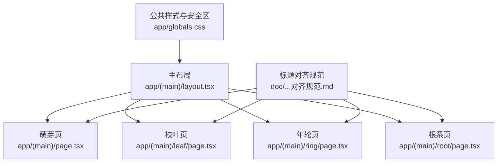
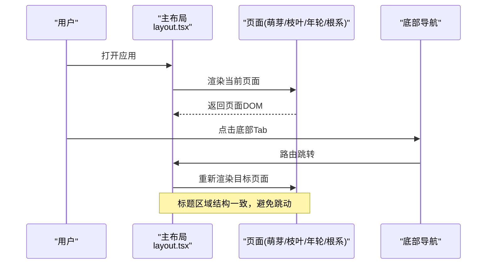
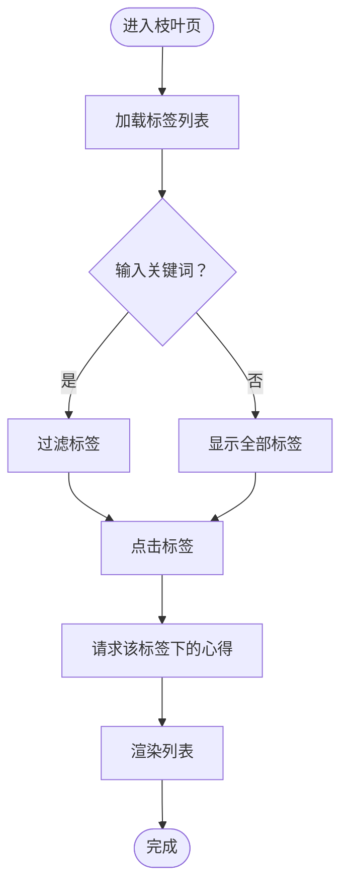
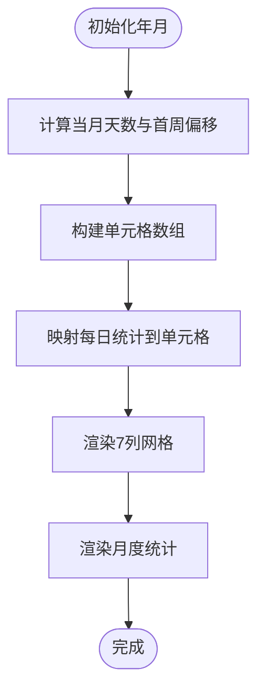
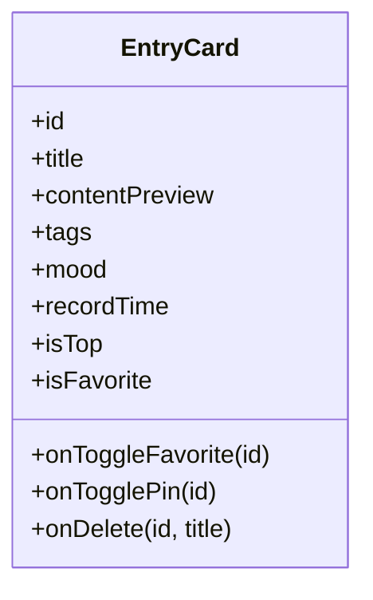
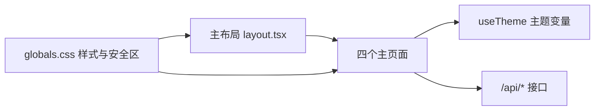

# 页面布局标准

<cite>
**本文引用的文件**   
- [app/(main)/layout.tsx](file://app/(main)/layout.tsx)
- [app/(main)/page.tsx](file://app/(main)/page.tsx)
- [app/(main)/(sprout)/page.tsx](file://app/(main)/(sprout)/page.tsx)
- [app/(main)/leaf/page.tsx](file://app/(main)/leaf/page.tsx)
- [app/(main)/ring/page.tsx](file://app/(main)/ring/page.tsx)
- [app/(main)/root/page.tsx](file://app/(main)/root/page.tsx)
- [components/EntryCard.tsx](file://components/EntryCard.tsx)
- [app/globals.css](file://app/globals.css)
- [doc/心芽各页面标题行高对齐规范.md](file://doc/心芽各页面标题行高对齐规范.md)
</cite>

## 目录
1. [引言](#引言)
2. [项目结构](#项目结构)
3. [核心组件](#核心组件)
4. [架构总览](#架构总览)
5. [详细组件分析](#详细组件分析)
6. [依赖关系分析](#依赖关系分析)
7. [性能与体验考量](#性能与体验考量)
8. [故障排查指南](#故障排查指南)
9. [结论](#结论)
10. [附录：响应式与卡片布局规范](#附录响应式与卡片布局规范)

## 引言
本规范为“心芽”应用制定统一的页面布局标准，覆盖四页面架构（萌芽页、枝叶页、年轮页、根系页）的整体布局结构、标题行高对齐、安全边距适配、响应式策略、卡片布局模式切换以及间距与视觉层次规范。目标是确保多端一致、切换无跳动、底部导航不被遮挡、内容层级清晰。

## 项目结构
- 主布局位于 app/(main)/layout.tsx，负责全局背景、滚动区域与底部固定导航。
- 四个主页面分别位于：
  - 萌芽页：app/(main)/page.tsx（当前默认首页）与 app/(main)/(sprout)/page.tsx（占位）
  - 枝叶页：app/(main)/leaf/page.tsx
  - 年轮页：app/(main)/ring/page.tsx
  - 根系页：app/(main)/root/page.tsx
- 通用样式与安全区类名定义在 app/globals.css。
- 标题对齐规范详见 doc/心芽各页面标题行高对齐规范.md。

图表来源
- [app/(main)/layout.tsx:68-82](file://app/(main)/layout.tsx#L68-L82)
- [app/(main)/page.tsx:198-230](file://app/(main)/page.tsx#L198-L230)
- [app/(main)/leaf/page.tsx:133-141](file://app/(main)/leaf/page.tsx#L133-L141)
- [app/(main)/ring/page.tsx:150-156](file://app/(main)/ring/page.tsx#L150-L156)
- [app/(main)/root/page.tsx:292-300](file://app/(main)/root/page.tsx#L292-L300)
- [app/globals.css:76-78](file://app/globals.css#L76-L78)
- [doc/心芽各页面标题行高对齐规范.md:20-74](file://doc/心芽各页面标题行高对齐规范.md#L20-L74)

章节来源
- [app/(main)/layout.tsx:68-82](file://app/(main)/layout.tsx#L68-L82)
- [app/globals.css:76-78](file://app/globals.css#L76-L78)
- [doc/心芽各页面标题行高对齐规范.md:20-74](file://doc/心芽各页面标题行高对齐规范.md#L20-L74)

## 核心组件
- 主布局容器
  - 提供最小高度全屏容器、可滚动主内容区与固定底部导航。
  - 使用主题色映射控制背景与导航外观。
- 底部导航
  - 固定在底部，带毛玻璃背景与主题边框；包含“萌芽、枝叶、新建、年轮、根系”五个入口。
  - 通过 pb-safe 适配 iOS 等设备的底部安全区。
- 页面容器
  - 统一 p-4 左右内边距、max-w-lg 居中、pb-24 预留底部导航空间，避免内容被遮挡。
- 标题区域
  - 统一结构：标题 + slogan，emoji 图标固定宽度占位，保证切换时不跳动。
- 卡片组件 EntryCard
  - 用于列表展示，支持置顶、收藏、更多操作菜单，适配暗色主题。

章节来源
- [app/(main)/layout.tsx:68-169](file://app/(main)/layout.tsx#L68-L169)
- [app/(main)/page.tsx:198-230](file://app/(main)/page.tsx#L198-L230)
- [app/(main)/leaf/page.tsx:133-141](file://app/(main)/leaf/page.tsx#L133-L141)
- [app/(main)/ring/page.tsx:150-156](file://app/(main)/ring/page.tsx#L150-L156)
- [app/(main)/root/page.tsx:292-300](file://app/(main)/root/page.tsx#L292-L300)
- [components/EntryCard.tsx:64-136](file://components/EntryCard.tsx#L64-L136)

## 架构总览
整体采用“单列主内容 + 固定底部导航”的移动端优先布局。所有主页面遵循统一的标题结构与间距，确保在 Tab 切换时无上下跳动。

图表来源
- [app/(main)/layout.tsx:68-82](file://app/(main)/layout.tsx#L68-L82)
- [app/(main)/page.tsx:198-230](file://app/(main)/page.tsx#L198-L230)
- [app/(main)/leaf/page.tsx:133-141](file://app/(main)/leaf/page.tsx#L133-L141)
- [app/(main)/ring/page.tsx:150-156](file://app/(main)/ring/page.tsx#L150-L156)
- [app/(main)/root/page.tsx:292-300](file://app/(main)/root/page.tsx#L292-L300)

## 详细组件分析

### 萌芽页（默认首页）
- 功能定位：首页信息流，聚合今日速览、筛选搜索、心得卡片列表与拾遗卡片。
- 页面结构：
  - 标题行：统一 emoji 占位 + 标题 + slogan。
  - 工具栏：收藏筛选、搜索、时间筛选。
  - 今日速览：可折叠面板，展示当日/本周/连续天数等指标。
  - 列表：EntryCard 卡片流，支持置顶、收藏、删除。
- 关键实现要点：
  - 容器使用 p-4 max-w-lg mx-auto pb-24，确保内容与底部导航不重叠。
  - 标题行严格遵循对齐规范，右侧按钮与左侧标题保持水平基线一致。

章节来源
- [app/(main)/page.tsx:198-230](file://app/(main)/page.tsx#L198-L230)
- [app/(main)/page.tsx:280-342](file://app/(main)/page.tsx#L280-L342)
- [components/EntryCard.tsx:64-136](file://components/EntryCard.tsx#L64-L136)

### 枝叶页（标签与按标签浏览）
- 功能定位：以标签云组织内容，点击标签后展示对应心得列表。
- 页面结构：
  - 标题行：统一结构。
  - 搜索框：过滤标签。
  - 标签云：根据使用量动态字号与颜色。
  - 列表：按标签筛选后的条目卡片。
- 交互逻辑：
  - 选择标签 → 请求数据 → 渲染列表；再次点击同一标签取消筛选。

图表来源
- [app/(main)/leaf/page.tsx:72-125](file://app/(main)/leaf/page.tsx#L72-L125)
- [app/(main)/leaf/page.tsx:133-141](file://app/(main)/leaf/page.tsx#L133-L141)

章节来源
- [app/(main)/leaf/page.tsx:133-141](file://app/(main)/leaf/page.tsx#L133-L141)
- [app/(main)/leaf/page.tsx:72-125](file://app/(main)/leaf/page.tsx#L72-L125)

### 年轮页（月度热力图）
- 功能定位：以日历热力图呈现月度记录密度，并展示月度统计与累计篇数。
- 页面结构：
  - 标题行：统一结构。
  - 月份导航：左右箭头切换年月。
  - 日历网格：7 列网格，单元格按记录数量着色。
  - 统计卡片：本月篇数、记录天数、日均篇数。
  - 累计篇数卡片。
- 算法流程（构建日历网格）：
  - 计算当月天数与首周偏移。
  - 填充上月补位、当月日期、下月补位至整周。
  - 根据后端统计映射到单元格等级。

图表来源
- [app/(main)/ring/page.tsx:94-128](file://app/(main)/ring/page.tsx#L94-L128)
- [app/(main)/ring/page.tsx:150-156](file://app/(main)/ring/page.tsx#L150-L156)
- [app/(main)/ring/page.tsx:306-334](file://app/(main)/ring/page.tsx#L306-L334)

章节来源
- [app/(main)/ring/page.tsx:150-156](file://app/(main)/ring/page.tsx#L150-L156)
- [app/(main)/ring/page.tsx:94-128](file://app/(main)/ring/page.tsx#L94-L128)
- [app/(main)/ring/page.tsx:306-334](file://app/(main)/ring/page.tsx#L306-L334)

### 根系页（设置与管理）
- 功能定位：账号管理、主题切换、标签管理、拾遗开关、学习画像、数据导出、版本信息与退出登录。
- 页面结构：
  - 标题行：统一结构。
  - 账号卡片：邮箱显示与密码设置表单。
  - 主题风格：春日/暗夜两种主题。
  - 标签管理：展开/收起、编辑、删除。
  - 拾遗设置：基于累计篇数的开关。
  - 学习画像：概览统计、近5日答题、薄弱/良好领域。
  - 数据导出：导出 Markdown。
  - 版本更新：变更记录与累计打开次数。
  - 退出登录。
- 交互要点：
  - 主题切换持久化到 localStorage 并广播事件，主布局监听更新。
  - 标签增删改查与确认提示。
  - 导出调用 API 生成 Markdown 并下载。

章节来源
- [app/(main)/root/page.tsx:292-300](file://app/(main)/root/page.tsx#L292-L300)
- [app/(main)/root/page.tsx:358-391](file://app/(main)/root/page.tsx#L358-L391)
- [app/(main)/root/page.tsx:393-521](file://app/(main)/root/page.tsx#L393-L521)
- [app/(main)/root/page.tsx:523-626](file://app/(main)/root/page.tsx#L523-L626)
- [app/(main)/root/page.tsx:628-714](file://app/(main)/root/page.tsx#L628-L714)

### 卡片组件 EntryCard
- 职责：展示单条心得，支持置顶、收藏、更多操作（置顶/删除），点击跳转到详情页。
- 视觉层次：
  - 标题加粗，内容预览两行截断。
  - 底部标签、心情、时间横向排列。
  - 置顶标记与收藏按钮绝对定位，避免影响文本流。
- 交互：
  - 收藏状态本地乐观更新，失败回滚并提示。
  - 更多菜单下拉，置顶与删除操作。

图表来源
- [components/EntryCard.tsx:32-136](file://components/EntryCard.tsx#L32-L136)

章节来源
- [components/EntryCard.tsx:64-136](file://components/EntryCard.tsx#L64-L136)

## 依赖关系分析
- 主布局依赖：
  - Next.js 路由与路径钩子进行导航与高亮。
  - 主题键值映射控制背景与导航样式。
- 页面依赖：
  - 使用 useTheme 获取主题变量（背景、边框、文字色）。
  - 调用 /api/* 接口获取数据（标签、月度统计、设置等）。
- 样式依赖：
  - Tailwind 基础类与自定义动画、手绘风格边框、安全区类名。

图表来源
- [app/(main)/layout.tsx:68-82](file://app/(main)/layout.tsx#L68-L82)
- [app/(main)/page.tsx:40-41](file://app/(main)/page.tsx#L40-L41)
- [app/(main)/leaf/page.tsx:75](file://app/(main)/leaf/page.tsx#L75)
- [app/(main)/ring/page.tsx:39](file://app/(main)/ring/page.tsx#L39)
- [app/(main)/root/page.tsx:285-290](file://app/(main)/root/page.tsx#L285-L290)
- [app/globals.css:70-78](file://app/globals.css#L70-L78)

章节来源
- [app/(main)/layout.tsx:68-82](file://app/(main)/layout.tsx#L68-L82)
- [app/globals.css:70-78](file://app/globals.css#L70-L78)

## 性能与体验考量
- 标题切换无跳动：
  - 统一标题结构、固定 emoji 占位宽度、一致的 mb-1 与 mb-5 间距。
- 底部导航安全区：
  - 使用 pb-safe 与 bottom-safe 适配刘海屏与 Home Indicator。
- 列表加载体验：
  - 骨架/空态占位与过渡动画，提升感知性能。
- 主题切换平滑：
  - 背景与边框 transition 过渡，减少 FOUC 观感。

[本节为通用指导，无需具体文件引用]

## 故障排查指南
- 标题跳动问题：
  - 检查各页面是否使用了相同的标题容器上内边距、标题字号字重、mb-1、slogan 字号与 mb-5。
  - 确认 emoji 外层容器 width 与 textAlign 一致。
- 底部按钮被遮挡：
  - 确认页面容器使用 pb-24，且底部导航使用 pb-safe。
- 主题未生效或闪烁：
  - 检查 localStorage 中 xinya-theme 是否正确写入，主布局是否监听 xinya-theme-change 事件。
- 列表为空或加载失败：
  - 查看网络请求返回与错误处理分支，确认 API 可用性与参数。

章节来源
- [doc/心芽各页面标题行高对齐规范.md:183-191](file://doc/心芽各页面标题行高对齐规范.md#L183-L191)
- [app/globals.css:76-78](file://app/globals.css#L76-L78)
- [app/(main)/layout.tsx:37-59](file://app/(main)/layout.tsx#L37-L59)

## 结论
通过统一的标题结构、安全边距适配、响应式布局与卡片组件规范，四页面架构在视觉上保持一致性，交互流畅且跨设备兼容。建议后续新增页面严格遵循本规范，并在开发完成后进行“切换无跳动”验证。

[本节为总结，无需具体文件引用]

## 附录：响应式与卡片布局规范

### 响应式布局适配策略
- 手机（<768px）：
  - 单栏布局，内容宽度由 max-w-lg 限制，左右内边距 p-4。
  - 列表垂直堆叠，卡片全宽展示。
- 平板（768px–1024px）：
  - 仍保持单栏为主，可适当增大内边距与字号，提升可读性。
- 桌面（>1024px）：
  - 三栏布局建议：
    - 左栏：导航/筛选（如标签云、时间筛选）。
    - 中栏：主内容（列表或日历）。
    - 右栏：详情/统计（如月度统计、学习画像）。
  - 使用 grid-cols-3 与 gap-3 组合，配合 max-w-lg 居中主内容，两侧留白。
- 注意：
  - 当前代码主要面向移动端，桌面三栏为扩展建议，可按需引入媒体查询或 Tailwind 断点。

[本节为概念性说明，无需具体文件引用]

### 安全边距处理
- 底部导航安全区：
  - 使用 pb-safe 与 bottom-safe 类名，适配 iPhone 等设备的底部安全区。
- 页面内容避让：
  - 页面容器使用 pb-24，确保长列表滚动到底部时不被底部导航遮挡。

章节来源
- [app/globals.css:76-78](file://app/globals.css#L76-L78)
- [app/(main)/page.tsx:198](file://app/(main)/page.tsx#L198)
- [app/(main)/leaf/page.tsx:133](file://app/(main)/leaf/page.tsx#L133)
- [app/(main)/ring/page.tsx:150](file://app/(main)/ring/page.tsx#L150)
- [app/(main)/root/page.tsx:292](file://app/(main)/root/page.tsx#L292)

### 卡片布局规范
- 卡片流模式：
  - 垂直堆叠，space-y-3 控制卡片间距。
  - 每个卡片使用 EntryCard 组件，统一圆角、边框与阴影。
- 时间轴模式（建议）：
  - 使用左侧竖线 + 节点圆点 + 右侧内容块的结构。
  - 节点圆点大小与颜色区分状态（已读/未读/今日）。
  - 时间戳置于节点旁，内容块内包含标题、摘要与标签。
- 切换逻辑（建议）：
  - 提供视图切换按钮，维护 state 控制渲染模式。
  - 切换时保留滚动位置与筛选条件。

[本节为概念性说明，无需具体文件引用]

### 间距标准、对齐方式与视觉层次
- 间距标准：
  - 容器内边距：p-4（16px）。
  - 标题与 slogan 间距：mb-1（4px）。
  - slogan 与内容间距：mb-5（20px）。
  - 卡片间距：space-y-3（12px）。
- 对齐方式：
  - 标题行使用 flex items-center justify-between，确保左右元素基线一致。
  - emoji 图标固定宽度 1.4em，textAlign center。
- 视觉层次：
  - 标题 text-xl font-bold，slogan text-xs。
  - 卡片标题 text-base font-bold，正文 text-sm，辅助信息 text-xs。
  - 强调色 #8BC34A，次要色 #999/#bbb，边框 #E8E8E3/#444（暗色）。

章节来源
- [doc/心芽各页面标题行高对齐规范.md:44-74](file://doc/心芽各页面标题行高对齐规范.md#L44-L74)
- [app/(main)/page.tsx:198-230](file://app/(main)/page.tsx#L198-L230)
- [components/EntryCard.tsx:108-135](file://components/EntryCard.tsx#L108-L135)