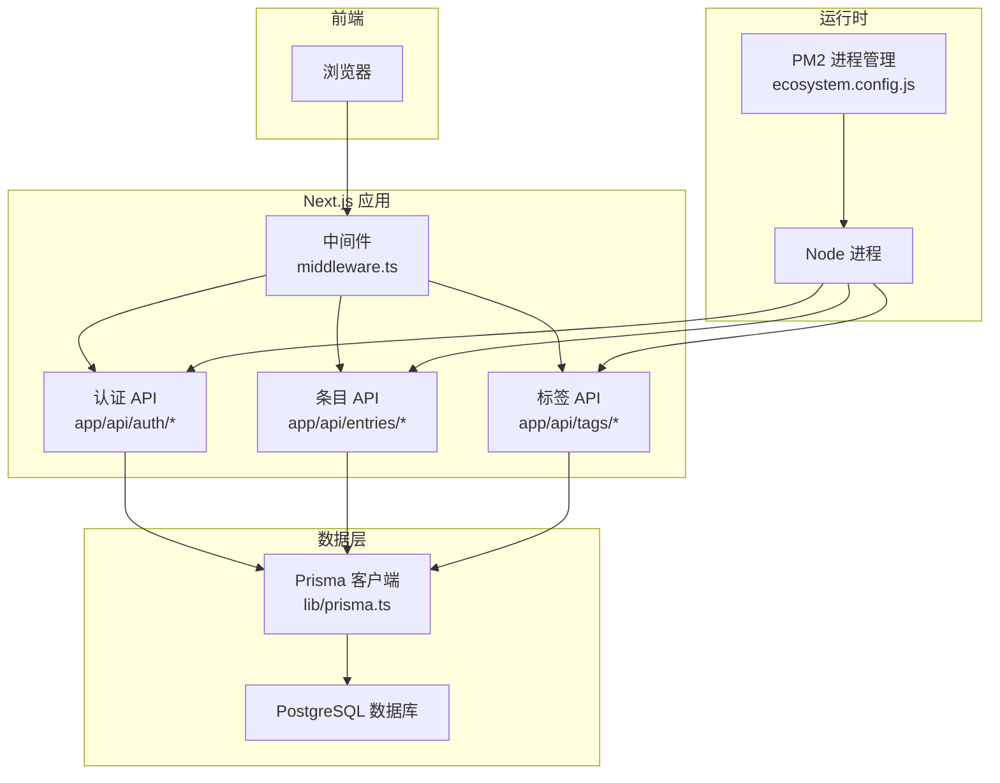
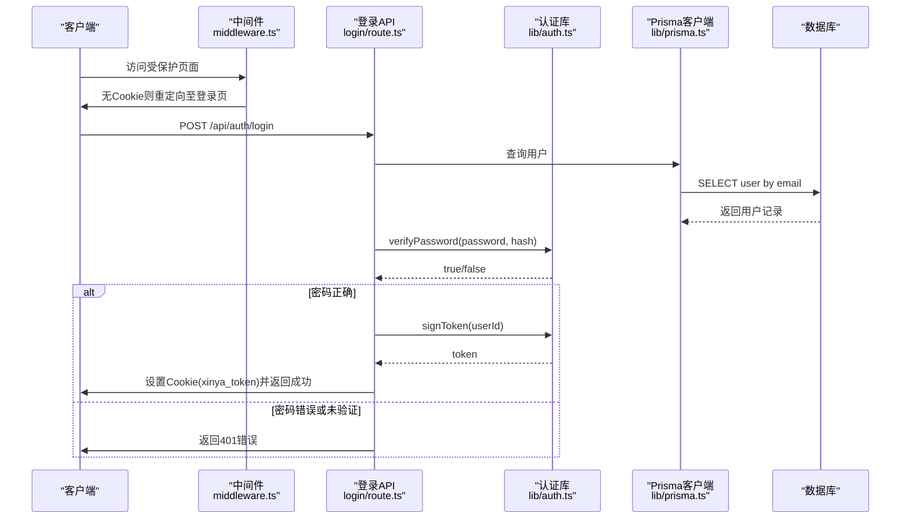
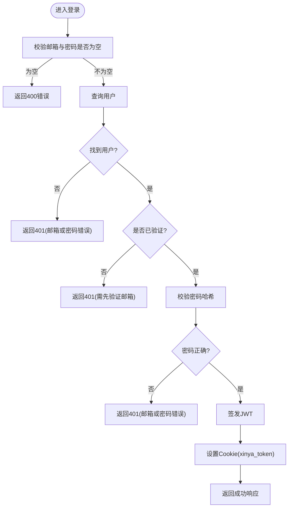
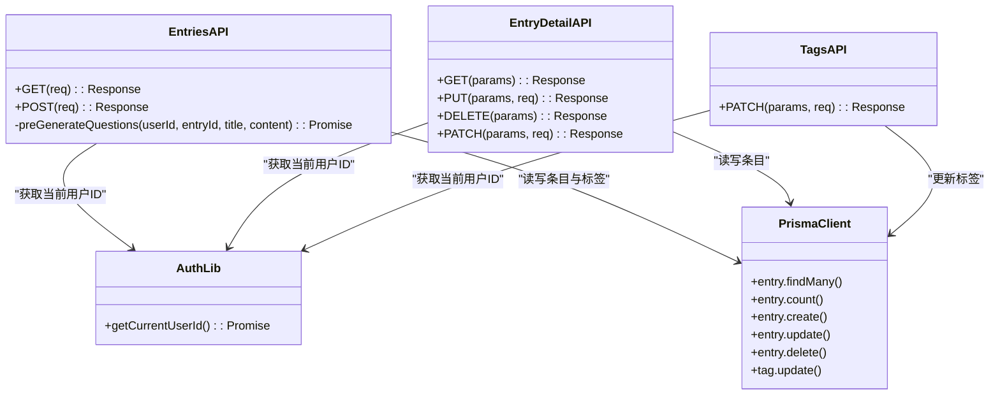
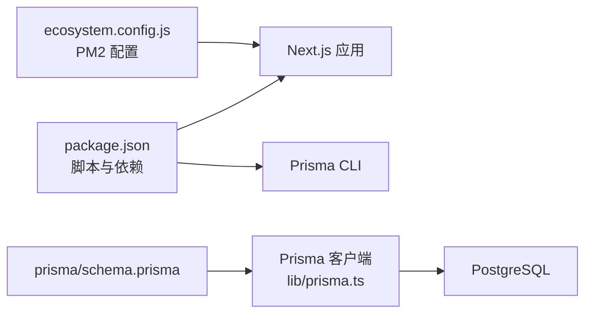

# 故障排查

<cite>
**本文引用的文件**   
- [README.md](file://README.md)
- [package.json](file://package.json)
- [ecosystem.config.js](file://ecosystem.config.js)
- [middleware.ts](file://middleware.ts)
- [lib/prisma.ts](file://lib/prisma.ts)
- [lib/auth.ts](file://lib/auth.ts)
- [app/api/auth/login/route.ts](file://app/api/auth/login/route.ts)
- [app/api/auth/register/route.ts](file://app/api/auth/register/route.ts)
- [app/api/entries/route.ts](file://app/api/entries/route.ts)
- [app/api/entries/[id]/route.ts](file://app/api/entries/[id]/route.ts)
- [app/api/tags/[id]/route.ts](file://app/api/tags/[id]/route.ts)
</cite>

## 目录
1. [简介](#简介)
2. [项目结构](#项目结构)
3. [核心组件](#核心组件)
4. [架构总览](#架构总览)
5. [详细组件分析](#详细组件分析)
6. [依赖分析](#依赖分析)
7. [性能考虑](#性能考虑)
8. [故障排查指南](#故障排查指南)
9. [结论](#结论)
10. [附录](#附录)

## 简介
本指南面向心芽项目的运维与开发人员，聚焦于生产环境中的常见问题定位与解决。内容覆盖数据库连接、API 接口错误、认证失败、文件权限、日志分析、性能瓶颈定位、网络问题以及系统资源监控与优化等关键主题。读者可据此快速完成从现象到根因的闭环排查。

## 项目结构
本项目为 Next.js 应用，采用 App Router 组织页面与 API 路由；数据访问通过 Prisma 客户端进行；认证基于 JWT + Cookie；进程管理使用 PM2。

图表来源
- [middleware.ts:1-29](file://middleware.ts#L1-L29)
- [lib/prisma.ts:1-14](file://lib/prisma.ts#L1-L14)
- [ecosystem.config.js:1-15](file://ecosystem.config.js#L1-L15)

章节来源
- [README.md:1-37](file://README.md#L1-L37)
- [package.json:1-40](file://package.json#L1-L40)
- [ecosystem.config.js:1-15](file://ecosystem.config.js#L1-L15)

## 核心组件
- 认证与鉴权
  - 中间件负责在请求到达页面时检查 Cookie 中的令牌并做重定向控制。
  - 登录/注册等 API 负责校验输入、生成或验证 JWT、设置 Cookie。
- 数据访问
  - Prisma 客户端统一暴露数据库操作，并在开发环境输出查询日志。
- 业务 API
  - 条目（entries）与标签（tags）相关 API 实现增删改查与部分更新逻辑。

章节来源
- [middleware.ts:1-29](file://middleware.ts#L1-L29)
- [lib/auth.ts:1-56](file://lib/auth.ts#L1-L56)
- [lib/prisma.ts:1-14](file://lib/prisma.ts#L1-L14)
- [app/api/auth/login/route.ts:1-39](file://app/api/auth/login/route.ts#L1-L39)
- [app/api/auth/register/route.ts:1-56](file://app/api/auth/register/route.ts#L1-L56)
- [app/api/entries/route.ts:1-163](file://app/api/entries/route.ts#L1-L163)
- [app/api/entries/[id]/route.ts:1-94](file://app/api/entries/[id]/route.ts#L1-L94)
- [app/api/tags/[id]/route.ts:27-61](file://app/api/tags/[id]/route.ts#L27-L61)

## 架构总览
下图展示了典型登录流程中各组件的交互顺序，便于理解认证失败与令牌问题的排查路径。

图表来源
- [middleware.ts:1-29](file://middleware.ts#L1-L29)
- [app/api/auth/login/route.ts:1-39](file://app/api/auth/login/route.ts#L1-L39)
- [lib/auth.ts:1-56](file://lib/auth.ts#L1-L56)
- [lib/prisma.ts:1-14](file://lib/prisma.ts#L1-L14)

## 详细组件分析

### 认证与鉴权
- 中间件行为
  - 对静态资源与 API 路径放行，其他页面若无 xinya_token Cookie 则重定向至登录页。
- 登录流程
  - 校验邮箱与密码非空，查询用户，检查是否已验证，比对密码哈希，签发 JWT，设置 Cookie，并更新打开次数。
- 注册流程
  - 校验邮箱格式与密码长度，处理重复注册与未验证账号重新发送验证码，创建默认标签，生成验证码并发送邮件。

图表来源
- [app/api/auth/login/route.ts:1-39](file://app/api/auth/login/route.ts#L1-L39)
- [lib/auth.ts:1-56](file://lib/auth.ts#L1-L56)

章节来源
- [middleware.ts:1-29](file://middleware.ts#L1-L29)
- [app/api/auth/login/route.ts:1-39](file://app/api/auth/login/route.ts#L1-L39)
- [app/api/auth/register/route.ts:1-56](file://app/api/auth/register/route.ts#L1-L56)
- [lib/auth.ts:1-56](file://lib/auth.ts#L1-L56)

### 条目与标签 API
- 条目列表与新建
  - 列表支持搜索、收藏、标签、时间范围过滤与分页；新建支持草稿与默认标签回退。
- 条目详情与编辑删除
  - 按 id 与 userId 限定访问；支持部分更新置顶/收藏。
- 标签重命名
  - 唯一性约束冲突时返回友好错误信息。

图表来源
- [app/api/entries/route.ts:1-163](file://app/api/entries/route.ts#L1-L163)
- [app/api/entries/[id]/route.ts:1-94](file://app/api/entries/[id]/route.ts#L1-L94)
- [app/api/tags/[id]/route.ts:27-61](file://app/api/tags/[id]/route.ts#L27-L61)
- [lib/auth.ts:1-56](file://lib/auth.ts#L1-L56)
- [lib/prisma.ts:1-14](file://lib/prisma.ts#L1-L14)

章节来源
- [app/api/entries/route.ts:1-163](file://app/api/entries/route.ts#L1-L163)
- [app/api/entries/[id]/route.ts:1-94](file://app/api/entries/[id]/route.ts#L1-L94)
- [app/api/tags/[id]/route.ts:27-61](file://app/api/tags/[id]/route.ts#L27-L61)

## 依赖分析
- 运行与构建脚本
  - 提供 dev/build/start/db:deploy/postinstall 等命令，postinstall 会执行 prisma generate。
- 进程管理
  - PM2 配置指定应用名、启动脚本、端口、工作目录、实例数、自动重启与内存上限。
- 数据库提供者
  - Prisma 迁移锁定为 PostgreSQL。

图表来源
- [package.json:1-40](file://package.json#L1-L40)
- [ecosystem.config.js:1-15](file://ecosystem.config.js#L1-L15)
- [lib/prisma.ts:1-14](file://lib/prisma.ts#L1-L14)

章节来源
- [package.json:1-40](file://package.json#L1-L40)
- [ecosystem.config.js:1-15](file://ecosystem.config.js#L1-L15)

## 性能考虑
- 慢查询定位
  - 在开发环境 Prisma 客户端会输出 query/error/warn 日志，结合 PM2 日志可定位耗时 SQL。
- 并发与异步任务
  - 条目创建后异步预生成题目，避免阻塞主响应；关注外部调用失败与重试策略。
- 内存与实例
  - PM2 配置了最大内存阈值以触发自动重启，防止内存泄漏导致服务不可用。
- 分页与索引
  - 列表接口使用 skip/take 分页，建议为常用过滤字段建立索引以提升 count 与排序性能。

[本节为通用指导，不直接分析具体文件]

## 故障排查指南

### 一、数据库连接问题
- 症状
  - 登录/注册/条目列表等接口返回 500 或长时间无响应；控制台出现数据库连接错误。
- 诊断步骤
  - 确认环境变量 DATABASE_URL 是否正确且可达。
  - 查看 Prisma 客户端日志：开发环境会输出 error 级别日志；生产环境仅输出 error。
  - 使用 PM2 查看应用标准输出与错误输出，定位连接失败堆栈。
  - 检查数据库服务状态、白名单与网络连通性。
- 常见原因
  - 连接字符串错误、证书缺失、端口不通、连接池耗尽。
- 解决方案
  - 修正连接参数，确保网络可达；必要时增大连接池或调整超时。
  - 在部署前执行数据库迁移以确保表结构一致。

章节来源
- [lib/prisma.ts:1-14](file://lib/prisma.ts#L1-L14)
- [ecosystem.config.js:1-15](file://ecosystem.config.js#L1-L15)

### 二、API 接口错误
- 症状
  - 特定接口返回 400/401/404/500；前端提示“操作失败”或“未找到”。
- 诊断步骤
  - 根据接口路径定位对应 route 文件，检查入参校验与业务分支。
  - 查看该接口的 console.error 输出，定位异常位置。
  - 对于条目与标签接口，核对 userId 权限与资源是否存在。
- 常见原因
  - 必填字段缺失、格式不正确、资源不存在、唯一性约束冲突。
- 解决方案
  - 修复前端传参与后端校验逻辑；对唯一性冲突返回明确错误码与消息。

章节来源
- [app/api/auth/login/route.ts:1-39](file://app/api/auth/login/route.ts#L1-L39)
- [app/api/auth/register/route.ts:1-56](file://app/api/auth/register/route.ts#L1-L56)
- [app/api/entries/route.ts:1-163](file://app/api/entries/route.ts#L1-L163)
- [app/api/entries/[id]/route.ts:1-94](file://app/api/entries/[id]/route.ts#L1-L94)
- [app/api/tags/[id]/route.ts:27-61](file://app/api/tags/[id]/route.ts#L27-L61)

### 三、认证失败
- 症状
  - 登录后仍被重定向到登录页；访问受保护页面提示未登录。
- 诊断步骤
  - 检查中间件是否放行 API 与静态资源路径。
  - 确认登录成功后是否设置了 xinya_token Cookie，且 Cookie 属性（path、sameSite、secure）符合部署环境。
  - 验证 JWT_SECRET 在生产环境是否配置且前后端一致。
- 常见原因
  - Cookie 未设置或过期；跨域场景下 sameSite/secure 配置不当；JWT 密钥不一致。
- 解决方案
  - 调整 Cookie 配置以适应 HTTPS 与跨域；确保生产环境设置强随机 JWT_SECRET。

章节来源
- [middleware.ts:1-29](file://middleware.ts#L1-L29)
- [lib/auth.ts:1-56](file://lib/auth.ts#L1-L56)
- [app/api/auth/login/route.ts:1-39](file://app/api/auth/login/route.ts#L1-L39)

### 四、文件权限问题
- 症状
  - 部署后应用无法读取配置文件或写入日志；PM2 启动失败。
- 诊断步骤
  - 检查应用工作目录与文件权限，确保 Node 进程有读权限。
  - 查看 PM2 错误日志，确认权限拒绝的具体路径。
- 解决方案
  - 修正目录与文件权限，或将工作目录切换至具备权限的路径。

章节来源
- [ecosystem.config.js:1-15](file://ecosystem.config.js#L1-L15)

### 五、日志分析方法
- PM2 日志
  - 使用 pm2 logs 查看应用标准输出与错误输出；结合时间戳筛选关键错误。
- 应用错误日志
  - 登录、注册、条目创建等接口包含 console.error 输出，用于快速定位异常。
- 数据库查询日志
  - 开发环境下 Prisma 客户端会输出 query/error/warn；生产环境仅输出 error，可通过 PM2 捕获。
- 建议
  - 为关键路径添加结构化日志（如包含 userId、entryId），便于聚合与分析。

章节来源
- [lib/prisma.ts:1-14](file://lib/prisma.ts#L1-L14)
- [app/api/auth/login/route.ts:1-39](file://app/api/auth/login/route.ts#L1-L39)
- [app/api/auth/register/route.ts:1-56](file://app/api/auth/register/route.ts#L1-L56)
- [app/api/entries/route.ts:1-163](file://app/api/entries/route.ts#L1-L163)

### 六、性能瓶颈定位
- 慢查询分析
  - 借助 Prisma 查询日志与 PM2 日志，识别高耗时 SQL；为高频过滤字段建立索引。
- 内存泄漏检测
  - 观察 PM2 的 max_memory_restart 触发情况；必要时开启堆快照分析。
- CPU 使用率优化
  - 减少同步阻塞操作；将外部调用（如 AI 生成）异步化，避免阻塞主线程。
- 分页与数据量
  - 合理限制 limit，避免一次性加载过多数据；对复杂查询拆分或缓存热点数据。

[本节为通用指导，不直接分析具体文件]

### 七、网络问题排查
- 端口冲突
  - 确认 PM2 配置的端口未被占用；若冲突，修改端口并重启。
- 防火墙与安全组
  - 确保服务器开放所需端口，并允许反向代理转发。
- SSL 证书问题
  - 若启用 HTTPS，检查证书链与域名匹配；注意 Cookie secure 标志与跨域 sameSite 设置。
- 反向代理
  - 检查 Nginx/Apache 配置是否正确转发 /api 与静态资源路径。

[本节为通用指导，不直接分析具体文件]

### 八、系统资源监控与优化
- 磁盘空间清理
  - 定期清理旧日志与临时文件；监控数据库体积增长。
- 进程管理
  - 使用 PM2 监控进程健康与内存使用；合理设置实例数与自动重启阈值。
- 安全加固
  - 生产环境务必设置强随机 JWT_SECRET；最小化 Cookie 作用域；限制敏感接口访问。

[本节为通用指导，不直接分析具体文件]

## 结论
通过系统化地检查中间件与认证流程、API 错误日志、数据库连接与查询日志、PM2 运行状态以及网络与安全配置，可以快速定位并解决心芽项目在开发与生产环境中的典型问题。配合合理的性能优化与资源监控策略，可进一步提升系统的稳定性与可维护性。

## 附录
- 常用命令参考
  - 本地开发：npm run dev
  - 构建与启动：npm run build && npm run start
  - 数据库迁移：npm run db:deploy
  - PM2 日志：pm2 logs
  - PM2 重启：pm2 restart xinya

章节来源
- [README.md:1-37](file://README.md#L1-L37)
- [package.json:1-40](file://package.json#L1-L40)
- [ecosystem.config.js:1-15](file://ecosystem.config.js#L1-L15)