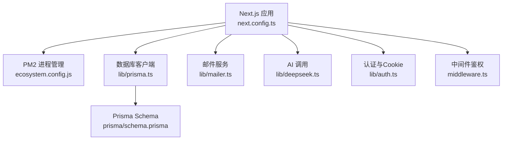
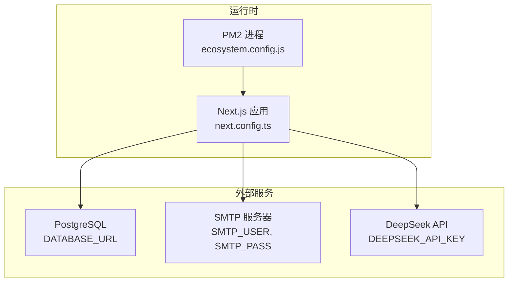
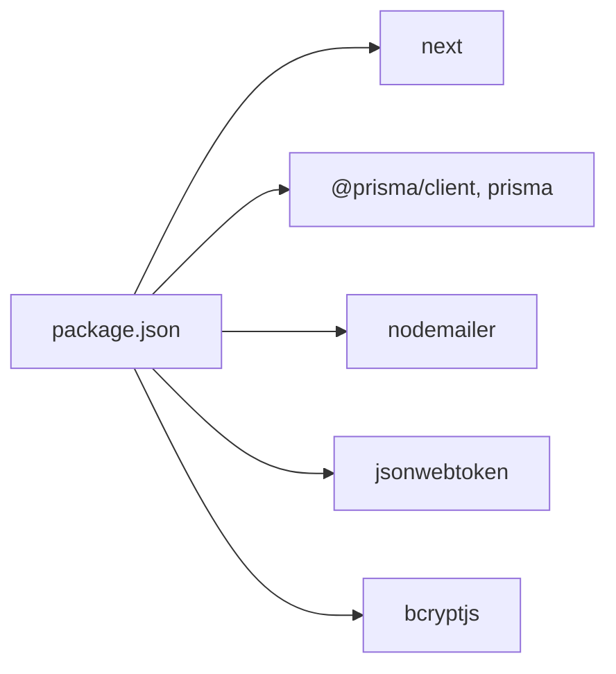

# 环境配置

<cite>
**本文引用的文件**   
- [package.json](file://package.json)
- [ecosystem.config.js](file://ecosystem.config.js)
- [next.config.ts](file://next.config.ts)
- [lib/prisma.ts](file://lib/prisma.ts)
- [prisma/schema.prisma](file://prisma/schema.prisma)
- [lib/mailer.ts](file://lib/mailer.ts)
- [lib/deepseek.ts](file://lib/deepseek.ts)
- [lib/auth.ts](file://lib/auth.ts)
- [middleware.ts](file://middleware.ts)
- [doc/新电脑程序转移主人提醒.md](file://doc/新电脑程序转移主人提醒.md)
</cite>

## 目录
1. [简介](#简介)
2. [项目结构](#项目结构)
3. [核心组件](#核心组件)
4. [架构总览](#架构总览)
5. [详细组件分析](#详细组件分析)
6. [依赖分析](#依赖分析)
7. [性能考虑](#性能考虑)
8. [故障排查指南](#故障排查指南)
9. [结论](#结论)
10. [附录](#附录)

## 简介
本文件面向“心芽”项目的生产环境部署与运维，聚焦以下目标：
- 明确服务器与运行时要求（Node.js、PostgreSQL、系统依赖）
- 详解环境变量配置（数据库连接、邮件服务、AI API密钥等敏感信息）
- 说明 PM2 进程管理器的配置文件参数（内存限制、日志轮转、集群模式等）
- 给出 Next.js 应用的生产优化建议（构建选项、静态资源处理、缓存策略）
- 提供 Docker 容器化部署的示例（Dockerfile 与 docker-compose.yml）

## 项目结构
本项目为基于 Next.js 的应用，使用 Prisma + PostgreSQL 作为数据层，Nodemailer 发送邮件，DeepSeek 提供 AI 能力。关键与环境相关的代码分布如下：
- 运行脚本与依赖版本定义：package.json
- PM2 进程管理配置：ecosystem.config.js
- Next.js 配置入口：next.config.ts
- 数据库客户端初始化与日志级别控制：lib/prisma.ts
- 数据库模型与连接来源：prisma/schema.prisma
- 邮件发送模块（SMTP）：lib/mailer.ts
- AI 调用模块（DeepSeek）：lib/deepseek.ts
- 认证与 Cookie 配置：lib/auth.ts
- 路由中间件（鉴权跳转）：middleware.ts

图示来源
- [next.config.ts:1-8](file://next.config.ts#L1-L8)
- [ecosystem.config.js:1-15](file://ecosystem.config.js#L1-L15)
- [lib/prisma.ts:1-14](file://lib/prisma.ts#L1-L14)
- [prisma/schema.prisma:1-209](file://prisma/schema.prisma#L1-L209)
- [lib/mailer.ts:1-86](file://lib/mailer.ts#L1-L86)
- [lib/deepseek.ts:1-115](file://lib/deepseek.ts#L1-L115)
- [lib/auth.ts:1-55](file://lib/auth.ts#L1-L55)
- [middleware.ts:1-28](file://middleware.ts#L1-L28)

章节来源
- [package.json:1-40](file://package.json#L1-L40)
- [ecosystem.config.js:1-15](file://ecosystem.config.js#L1-L15)
- [next.config.ts:1-8](file://next.config.ts#L1-L8)
- [lib/prisma.ts:1-14](file://lib/prisma.ts#L1-L14)
- [prisma/schema.prisma:1-209](file://prisma/schema.prisma#L1-L209)
- [lib/mailer.ts:1-86](file://lib/mailer.ts#L1-L86)
- [lib/deepseek.ts:1-115](file://lib/deepseek.ts#L1-L115)
- [lib/auth.ts:1-55](file://lib/auth.ts#L1-L55)
- [middleware.ts:1-28](file://middleware.ts#L1-L28)

## 核心组件
本节从生产环境视角梳理关键组件及其与环境的关系。

- 运行时与脚本
  - 通过 package.json 定义 dev/build/start 脚本，生产启动命令为 next start。
  - 安装后自动执行 prisma generate，确保 Prisma Client 可用。

- 数据库连接与日志
  - Prisma 在 lib/prisma.ts 中根据 NODE_ENV 调整日志级别：开发输出 query/error/warn，生产仅 error。
  - 数据库连接字符串由 DATABASE_URL 注入，Prisma schema 中 datasource.db.url 读取该环境变量。

- 邮件服务
  - lib/mailer.ts 使用 Nodemailer 连接 SMTP（默认 QQ 邮箱），凭据来自 SMTP_USER 与 SMTP_PASS。
  - 提供验证码、Magic Link、重置密码三类邮件模板。

- AI 能力
  - lib/deepseek.ts 调用 DeepSeek 聊天接口，API Key 来自 DEEPSEEK_API_KEY，包含超时与重试逻辑。

- 认证与安全
  - lib/auth.ts 使用 JWT_SECRET 签发与校验 Token，并设置 Cookie 属性（httpOnly、sameSite、maxAge）。
  - middleware.ts 对受保护页面进行鉴权拦截，未登录时重定向到 /login。

章节来源
- [package.json:1-40](file://package.json#L1-L40)
- [lib/prisma.ts:1-14](file://lib/prisma.ts#L1-L14)
- [prisma/schema.prisma:1-209](file://prisma/schema.prisma#L1-L209)
- [lib/mailer.ts:1-86](file://lib/mailer.ts#L1-L86)
- [lib/deepseek.ts:1-115](file://lib/deepseek.ts#L1-L115)
- [lib/auth.ts:1-55](file://lib/auth.ts#L1-L55)
- [middleware.ts:1-28](file://middleware.ts#L1-L28)

## 架构总览
下图展示生产环境下各组件交互关系及环境变量注入点。

图示来源
- [ecosystem.config.js:1-15](file://ecosystem.config.js#L1-L15)
- [next.config.ts:1-8](file://next.config.ts#L1-L8)
- [lib/prisma.ts:1-14](file://lib/prisma.ts#L1-L14)
- [prisma/schema.prisma:1-209](file://prisma/schema.prisma#L1-L209)
- [lib/mailer.ts:1-86](file://lib/mailer.ts#L1-L86)
- [lib/deepseek.ts:1-115](file://lib/deepseek.ts#L1-L115)

## 详细组件分析

### 服务器与运行时要求
- Node.js 版本
  - 当前依赖包jsonwebtoken要求 node>=12；Next.js 16.x 通常推荐较新的 LTS 版本（如 18/20）。建议使用 Node.js 18 或 20 LTS。
- 数据库
  - 使用 PostgreSQL，Prisma 驱动 provider=postgresql，连接串通过 DATABASE_URL 注入。
- 系统依赖
  - 无需额外系统级依赖（无原生编译依赖）。
- 端口与进程
  - PM2 以实例数 1 启动，监听 3000 端口。

章节来源
- [package.json:1-40](file://package.json#L1-L40)
- [ecosystem.config.js:1-15](file://ecosystem.config.js#L1-L15)
- [prisma/schema.prisma:1-209](file://prisma/schema.prisma#L1-L209)

### 环境变量清单与管理
以下为生产环境必需的环境变量及用途说明：
- DATABASE_URL
  - 作用：PostgreSQL 连接串，Prisma 使用 env("DATABASE_URL") 读取。
  - 格式：postgresql://用户:密码@主机:端口/库名
  - 安全建议：通过 PM2 或容器编排注入，避免写入仓库。
- JWT_SECRET
  - 作用：JWT 签名密钥，用于签发与验证 Token。
  - 安全建议：使用强随机字符串，长度≥32位，定期轮换。
- SMTP_USER / SMTP_PASS
  - 作用：邮件发送凭据（QQ 邮箱为例），用于验证码、Magic Link、重置密码邮件。
  - 安全建议：使用授权码而非登录密码，妥善保管。
- DEEPSEEK_API_KEY
  - 作用：AI 生成题目与要点总结的 API 密钥。
  - 安全建议：按服务商要求保管，必要时启用访问白名单。
- NEXT_PUBLIC_BASE_URL
  - 作用：前端公开基础地址（参考文档中的示例）。
  - 注意：以 NEXT_PUBLIC_ 前缀开头的变量会被打包进客户端，不要存放敏感信息。

环境变量注入方式
- PM2：在 ecosystem.config.js 的 env 中或通过 PM2 的 --env-file 指定 .env.production。
- Docker：在 Dockerfile 中通过 ENV 或在 docker-compose.yml 的 environment 注入。

章节来源
- [prisma/schema.prisma:1-209](file://prisma/schema.prisma#L1-L209)
- [lib/auth.ts:1-55](file://lib/auth.ts#L1-L55)
- [lib/mailer.ts:1-86](file://lib/mailer.ts#L1-L86)
- [lib/deepseek.ts:1-115](file://lib/deepseek.ts#L1-L115)
- [doc/新电脑程序转移主人提醒.md:86-102](file://doc/新电脑程序转移主人提醒.md#L86-L102)

### PM2 进程管理配置（ecosystem.config.js）
- name: 应用名称
- script: 指向 Next.js 可执行路径
- args: 启动参数（例如指定端口）
- cwd: 工作目录
- instances: 实例数（当前为 1）
- autorestart: 崩溃自动重启
- watch: 是否监听文件变更（生产应关闭）
- max_memory_restart: 内存上限触发重启阈值
- env: 注入环境变量（NODE_ENV=production）

生产建议
- 集群模式：instances > 1 可提升并发处理能力，但需确保状态无共享或采用外部会话存储。
- 日志轮转：建议启用 PM2 日志轮转（pm2 logs --raw 配合 pm2 flush 或使用 PM2 内置 logrotate）。
- 健康检查：结合反向代理（Nginx/Caddy）做健康检查与优雅重启。
- 安全加固：将敏感环境变量通过 PM2 的 --env-file 或平台密钥管理服务注入，避免硬编码。

章节来源
- [ecosystem.config.js:1-15](file://ecosystem.config.js#L1-L15)

### Next.js 生产优化配置（next.config.ts）
当前 next.config.ts 为空对象占位。生产环境建议按需开启以下优化项（概念性建议，非现有实现）：
- 构建与输出
  - output: 'standalone'（便于最小化产物，适合容器化部署）
  - experimental.serverActions: 视业务需要评估
- 静态资源与缓存
  - images: 合理配置 remotePatterns、formats、deviceSizes
  - headers: 为静态资源设置长期缓存头（Cache-Control）
- 压缩与传输
  - compress: true（默认已开启）
- 安全
  - crossOrigin: 'anonymous'
  - poweredByHeader: false
- 监控与诊断
  - 在生产保留必要日志，减少冗余输出（已在 Prisma 层按 NODE_ENV 控制）

章节来源
- [next.config.ts:1-8](file://next.config.ts#L1-L8)
- [lib/prisma.ts:1-14](file://lib/prisma.ts#L1-L14)

### 数据库与迁移
- 连接来源
  - prisma/schema.prisma 中 datasource.db.url 读取 DATABASE_URL。
- 客户端行为
  - lib/prisma.ts 根据 NODE_ENV 控制日志级别，生产仅记录 error。
- 迁移策略
  - 生产环境推荐使用 prisma migrate deploy 进行非破坏性迁移（见 package.json 脚本 db:deploy）。

章节来源
- [prisma/schema.prisma:1-209](file://prisma/schema.prisma#L1-L209)
- [lib/prisma.ts:1-14](file://lib/prisma.ts#L1-L14)
- [package.json:1-40](file://package.json#L1-L40)

### 邮件服务（SMTP）
- 依赖与服务端
  - 使用 Nodemailer，默认连接 QQ 邮箱 SMTP（端口 465，SSL）。
- 凭据来源
  - SMTP_USER、SMTP_PASS 从环境变量读取。
- 功能覆盖
  - 验证码、Magic Link、重置密码三种场景。

章节来源
- [lib/mailer.ts:1-86](file://lib/mailer.ts#L1-L86)

### AI 调用（DeepSeek）
- 依赖与接口
  - 调用 https://api.deepseek.com/v1/chat/completions，携带 Authorization: Bearer <DEEPSEEK_API_KEY>。
- 健壮性
  - 请求超时控制（30秒）、失败重试、JSON 提取与容错映射。
- 返回结构
  - keyPoints 与 questions 列表，字段长度与类型做了边界处理。

章节来源
- [lib/deepseek.ts:1-115](file://lib/deepseek.ts#L1-L115)

### 认证与中间件
- JWT 与 Cookie
  - JWT_SECRET 用于签名与校验；Cookie 配置 httpOnly、sameSite、maxAge。
- 中间件鉴权
  - 对非公开路径进行鉴权，未登录重定向至 /login。

章节来源
- [lib/auth.ts:1-55](file://lib/auth.ts#L1-L55)
- [middleware.ts:1-28](file://middleware.ts#L1-L28)

## 依赖分析
- 运行时依赖
  - next、react、react-dom：前端框架与渲染
  - @prisma/client、prisma：ORM 与迁移工具
  - nodemailer：邮件发送
  - jsonwebtoken、bcryptjs：认证与密码哈希
  - dotenv：环境变量加载（常见于本地开发）
- 开发依赖
  - typescript、eslint、tailwindcss 等

图示来源
- [package.json:1-40](file://package.json#L1-L40)

章节来源
- [package.json:1-40](file://package.json#L1-L40)

## 性能考虑
- 进程与并发
  - 生产建议根据 CPU 核数设置 PM2 instances，并结合负载均衡器分发流量。
- 数据库连接池
  - 根据并发量调整数据库连接池大小（可通过连接串参数或 ORM 配置）。
- 日志与监控
  - 生产保持精简日志（Prisma 已按 NODE_ENV 控制），结合外部日志收集系统。
- 静态资源
  - 启用 CDN 与浏览器缓存，减少回源压力。
- 外部 API
  - 对 AI 调用增加熔断与降级策略（如模板兜底），避免雪崩。

[本节为通用指导，不直接分析具体文件]

## 故障排查指南
- 无法连接数据库
  - 检查 DATABASE_URL 是否正确、网络可达性与防火墙规则。
  - 确认 Prisma 迁移已执行（db:deploy）。
- 邮件发送失败
  - 核对 SMTP_USER/SMTP_PASS 是否为授权码且未过期。
  - 检查出站端口 465 是否被放行。
- AI 调用异常
  - 确认 DEEPSEEK_API_KEY 有效且配额充足。
  - 关注超时与重试日志，必要时调整超时时间或降级策略。
- 鉴权问题
  - 检查 Cookie 是否被浏览器策略阻止（secure/sameSite 设置）。
  - 确认 JWT_SECRET 一致，避免多实例间不一致导致验签失败。

章节来源
- [lib/prisma.ts:1-14](file://lib/prisma.ts#L1-L14)
- [lib/mailer.ts:1-86](file://lib/mailer.ts#L1-L86)
- [lib/deepseek.ts:1-115](file://lib/deepseek.ts#L1-L115)
- [lib/auth.ts:1-55](file://lib/auth.ts#L1-L55)
- [middleware.ts:1-28](file://middleware.ts#L1-L28)

## 结论
通过合理的运行时选择、严格的环境变量管理与 PM2 进程治理，结合 Next.js 生产优化与外部服务（数据库、邮件、AI）的健壮性设计，可以保障“心芽”在生产环境的稳定与高效运行。建议在上线前完成压测与演练，完善监控告警与回滚预案。

[本节为总结性内容，不直接分析具体文件]

## 附录

### 环境变量清单（生产）
- DATABASE_URL：PostgreSQL 连接串
- JWT_SECRET：JWT 签名密钥
- SMTP_USER / SMTP_PASS：邮件服务凭据
- DEEPSEEK_API_KEY：AI 服务密钥
- NEXT_PUBLIC_BASE_URL：前端公开基础地址（参考文档示例）

章节来源
- [prisma/schema.prisma:1-209](file://prisma/schema.prisma#L1-L209)
- [lib/auth.ts:1-55](file://lib/auth.ts#L1-L55)
- [lib/mailer.ts:1-86](file://lib/mailer.ts#L1-L86)
- [lib/deepseek.ts:1-115](file://lib/deepseek.ts#L1-L115)
- [doc/新电脑程序转移主人提醒.md:86-102](file://doc/新电脑程序转移主人提醒.md#L86-L102)

### PM2 配置要点（ecosystem.config.js）
- 实例数与内存限制：instances、max_memory_restart
- 自动重启与热重载：autorestart、watch（生产关闭）
- 环境变量注入：env（NODE_ENV=production）
- 日志轮转：建议启用 PM2 日志轮转（概念性建议）

章节来源
- [ecosystem.config.js:1-15](file://ecosystem.config.js#L1-L15)

### Next.js 生产优化建议（next.config.ts）
- 构建输出：output standalone（概念性建议）
- 静态资源：images 与 headers 缓存策略（概念性建议）
- 安全与压缩：poweredByHeader=false、compress=true（概念性建议）

章节来源
- [next.config.ts:1-8](file://next.config.ts#L1-L8)

### Docker 容器化部署示例
以下为概念性示例，供参考落地（不包含具体代码内容）：
- Dockerfile（概念性步骤）
  - 选择合适的基础镜像（Node.js LTS）
  - 复制源码与依赖锁定文件
  - 安装依赖并生成 Prisma Client
  - 构建 Next.js 应用
  - 暴露端口并设置启动命令
- docker-compose.yml（概念性步骤）
  - 定义应用服务与 PostgreSQL 服务
  - 注入环境变量（DATABASE_URL、JWT_SECRET、SMTP_*、DEEPSEEK_API_KEY）
  - 持久化数据库卷
  - 设置健康检查与重启策略

[本节为概念性示例，不直接分析具体文件]