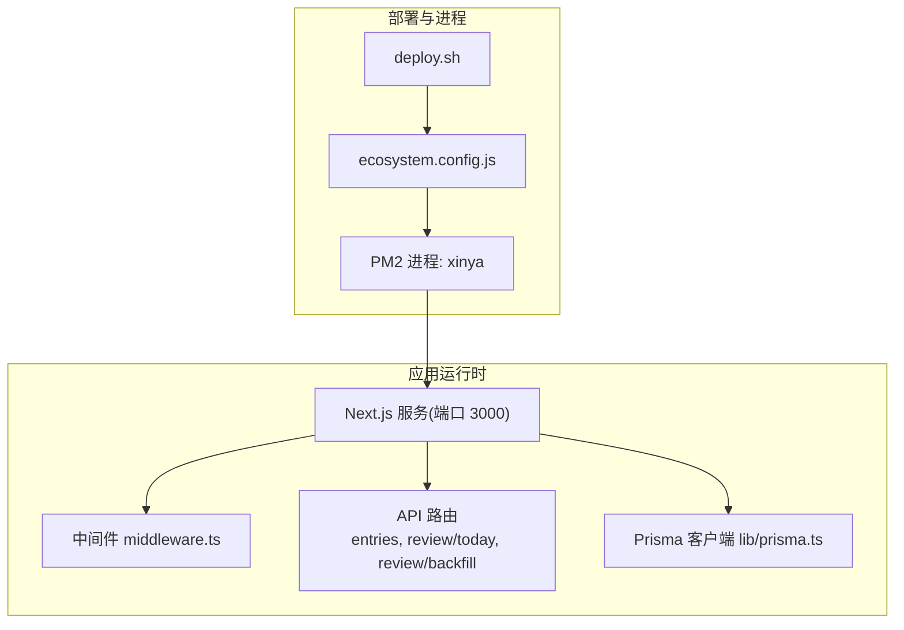
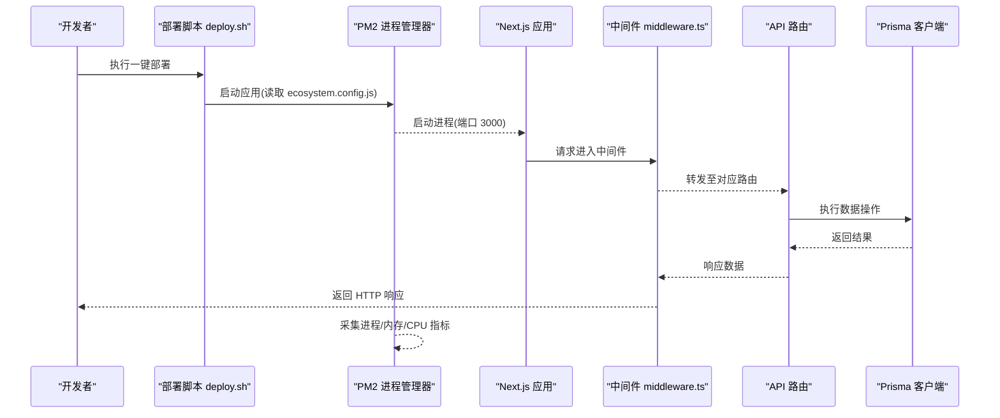
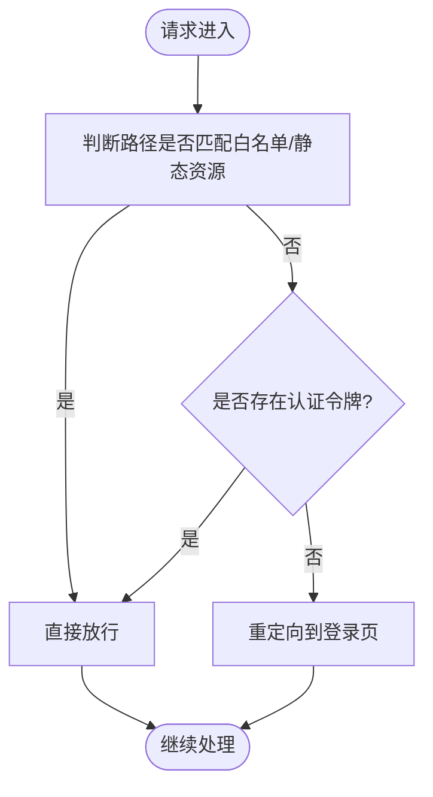
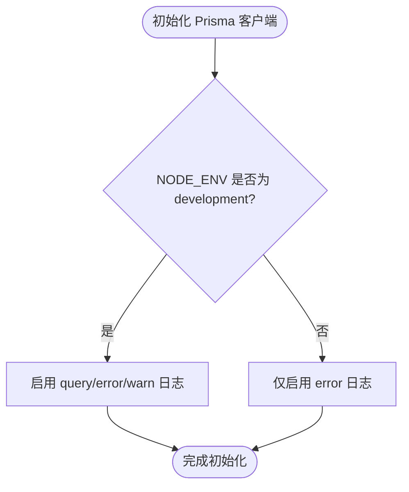
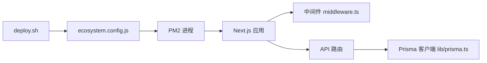

# 监控与日志

<cite>
**本文引用的文件列表**
- [ecosystem.config.js](file://ecosystem.config.js)
- [deploy.sh](file://deploy.sh)
- [package.json](file://package.json)
- [middleware.ts](file://middleware.ts)
- [lib/prisma.ts](file://lib/prisma.ts)
- [app/api/entries/route.ts](file://app/api/entries/route.ts)
- [app/api/review/today/route.ts](file://app/api/review/today/route.ts)
- [app/api/review/backfill/route.ts](file://app/api/review/backfill/route.ts)
- [lib/utils.ts](file://lib/utils.ts)
</cite>

## 目录
1. [简介](#简介)
2. [项目结构](#项目结构)
3. [核心组件](#核心组件)
4. [架构总览](#架构总览)
5. [详细组件分析](#详细组件分析)
6. [依赖关系分析](#依赖关系分析)
7. [性能考量](#性能考量)
8. [故障排查指南](#故障排查指南)
9. [结论](#结论)
10. [附录](#附录)

## 简介
本文件为心芽项目的“监控与日志”专项文档，聚焦以下目标：
- PM2 内置监控能力的应用级指标采集与展示（进程、内存、CPU、重启等）
- 日志收集策略（应用日志、访问日志、错误日志的分类管理与轮转）
- 告警系统配置思路（异常检测、性能阈值、业务指标）
- 日志分析与可视化集成方案（ELK Stack、Grafana）
- 分布式追踪与链路监控实现方法
- 常见性能问题诊断方法与优化建议

说明：当前仓库未包含第三方日志库或外部监控系统集成代码。PM2 作为进程管理器负责应用生命周期与基础运行指标；应用内使用 console.log 输出调试信息；数据库层通过 Prisma 的 log 选项控制 SQL 日志级别。

## 项目结构
与监控和日志相关的工程化要点集中在部署与进程管理脚本、Next.js 中间件、Prisma 客户端配置以及若干 API 路由中的 console.log 输出点。

图示来源
- [deploy.sh:1-36](file://deploy.sh#L1-L36)
- [ecosystem.config.js:1-15](file://ecosystem.config.js#L1-L15)
- [middleware.ts:1-29](file://middleware.ts#L1-L29)
- [lib/prisma.ts:1-13](file://lib/prisma.ts#L1-L13)

章节来源
- [deploy.sh:1-36](file://deploy.sh#L1-L36)
- [ecosystem.config.js:1-15](file://ecosystem.config.js#L1-L15)
- [middleware.ts:1-29](file://middleware.ts#L1-L29)
- [lib/prisma.ts:1-13](file://lib/prisma.ts#L1-L13)

## 核心组件
- PM2 进程管理
  - 应用名、启动脚本、工作目录、实例数、自动重启、最大内存阈值、环境变量等由配置文件定义。
  - 部署脚本在构建后调用 PM2 启动并设置开机自启。
- Next.js 中间件
  - 统一处理鉴权跳转与静态资源放行，可作为接入访问日志与请求计数的切入点。
- Prisma 客户端
  - 根据环境决定 SQL 日志级别（开发开启 query/error/warn，生产仅 error）。
- API 路由
  - 多处使用 console.log 输出关键流程信息，便于定位问题。

章节来源
- [ecosystem.config.js:1-15](file://ecosystem.config.js#L1-L15)
- [deploy.sh:1-36](file://deploy.sh#L1-L36)
- [middleware.ts:1-29](file://middleware.ts#L1-L29)
- [lib/prisma.ts:1-13](file://lib/prisma.ts#L1-L13)
- [app/api/entries/route.ts](file://app/api/entries/route.ts)
- [app/api/review/today/route.ts](file://app/api/review/today/route.ts)
- [app/api/review/backfill/route.ts](file://app/api/review/backfill/route.ts)

## 架构总览
下图展示了从部署到运行时监控的关键路径：部署脚本触发 PM2 启动 Next.js 应用，PM2 负责进程健康与基础指标；应用内部通过中间件与 API 路由产生日志；数据库层按环境输出 SQL 日志。

图示来源
- [deploy.sh:1-36](file://deploy.sh#L1-L36)
- [ecosystem.config.js:1-15](file://ecosystem.config.js#L1-L15)
- [middleware.ts:1-29](file://middleware.ts#L1-L29)
- [lib/prisma.ts:1-13](file://lib/prisma.ts#L1-L13)

## 详细组件分析

### PM2 内置监控与指标
- 进程与重启
  - 自动重启已启用，当进程崩溃时 PM2 会尝试恢复。
  - 最大内存阈值已配置，超过阈值将触发重启，避免内存泄漏导致服务不可用。
- 指标采集
  - PM2 默认采集 CPU、内存、进程状态、重启次数等指标，可通过 pm2 monit 查看实时面板，或通过 pm2 logs 查看标准输出日志。
- 日志输出
  - 应用通过 console.log 输出的内容会被 PM2 捕获并写入其日志目录，可用 pm2 logs xinya 查看。

章节来源
- [ecosystem.config.js:1-15](file://ecosystem.config.js#L1-L15)
- [deploy.sh:1-36](file://deploy.sh#L1-L36)

### 日志收集策略与分类
- 应用日志
  - 现状：各 API 路由中使用 console.log 输出关键步骤信息，便于快速定位问题。
  - 建议：引入结构化日志库（如 pino），统一日志格式（JSON），并按模块/级别分文件输出，配合 PM2 日志轮转。
- 访问日志
  - 现状：未在中间件或 Next.js 中记录访问日志。
  - 建议：在中间件中记录请求方法、路径、状态码、耗时、用户标识等字段，输出到独立访问日志文件，便于后续聚合与分析。
- 错误日志
  - 现状：Prisma 在生产环境仅输出 error 级别 SQL 日志；应用层未集中捕获全局异常。
  - 建议：在中间件或 Next.js 错误边界处统一捕获异常，记录堆栈、上下文与请求信息，输出到错误日志文件。
- 日志轮转
  - 建议：结合 PM2 日志轮转或系统级工具（如 logrotate）对应用日志、访问日志、错误日志进行大小/时间维度轮转与保留策略管理。

章节来源
- [middleware.ts:1-29](file://middleware.ts#L1-L29)
- [lib/prisma.ts:1-13](file://lib/prisma.ts#L1-L13)
- [app/api/entries/route.ts](file://app/api/entries/route.ts)
- [app/api/review/today/route.ts](file://app/api/review/today/route.ts)
- [app/api/review/backfill/route.ts](file://app/api/review/backfill/route.ts)

### 告警系统配置思路
- 异常检测
  - 基于 PM2 重启事件与错误日志关键字（如 Error、Exception）触发告警。
- 性能阈值
  - 基于 PM2 指标（CPU、内存、响应延迟）设定阈值，超限触发告警。
- 业务指标监控
  - 建议在中间件或 API 层埋点关键业务指标（如登录成功率、每日新增条目数、复习任务完成率），并通过统一指标接口暴露，供 Prometheus/Grafana 抓取。

说明：当前仓库未包含具体告警规则与外部告警平台集成代码，上述为通用实践建议。

### 日志分析与可视化集成方案
- ELK Stack
  - 将 PM2 与应用日志输出到本地文件或远程 Syslog，再由 Filebeat/Fluent Bit 采集并投递到 Elasticsearch，Kibana 提供查询与可视化。
- Grafana
  - 对接 Prometheus 采集 PM2 指标与自定义业务指标，创建仪表盘展示 CPU、内存、QPS、错误率、P95/P99 延迟等。
- 链路追踪
  - 可选 OpenTelemetry + Jaeger/Zipkin，在中间件注入 TraceId，跨服务传递，用于端到端链路分析。

说明：以上为集成方案建议，仓库中尚未包含相关实现。

### 分布式追踪与链路监控实现方法
- 在中间件生成/透传 TraceId，附加到请求头与日志上下文中。
- 在关键 API 路由埋点 Span，记录输入参数摘要、耗时、错误信息。
- 将 TraceId 与业务 ID（如 userId、entryId）关联，便于问题溯源。

说明：当前仓库未实现链路追踪，上述为通用实现思路。

### 关键代码流程与时序

#### 中间件鉴权与放行流程

图示来源
- [middleware.ts:1-29](file://middleware.ts#L1-L29)

章节来源
- [middleware.ts:1-29](file://middleware.ts#L1-L29)

#### 数据库日志级别控制

图示来源
- [lib/prisma.ts:1-13](file://lib/prisma.ts#L1-L13)

章节来源
- [lib/prisma.ts:1-13](file://lib/prisma.ts#L1-L13)

#### 典型 API 路由日志输出点
- 条目创建与预生成
  - 输出创建时的草稿标记与内容长度、预生成触发与返回题目数量等信息。
- 今日复习卡片生成
  - 输出开始处理、获取卡片结果、在线生成失败回退模板、缓存命中等关键节点。
- 批量补全题目
  - 输出待处理条目数量、逐条处理进度与成功统计。

章节来源
- [app/api/entries/route.ts](file://app/api/entries/route.ts)
- [app/api/review/today/route.ts](file://app/api/review/today/route.ts)
- [app/api/review/backfill/route.ts](file://app/api/review/backfill/route.ts)

## 依赖关系分析
- 进程与部署
  - deploy.sh 负责安装依赖、生成 Prisma Client、执行迁移、构建与 PM2 启动。
  - ecosystem.config.js 定义 PM2 应用配置，包括实例数、内存阈值与环境变量。
- 运行时依赖
  - Next.js 应用通过中间件统一处理鉴权逻辑。
  - Prisma 客户端根据环境控制 SQL 日志级别。
  - API 路由通过 console.log 输出关键流程信息。

图示来源
- [deploy.sh:1-36](file://deploy.sh#L1-L36)
- [ecosystem.config.js:1-15](file://ecosystem.config.js#L1-L15)
- [middleware.ts:1-29](file://middleware.ts#L1-L29)
- [lib/prisma.ts:1-13](file://lib/prisma.ts#L1-L13)

章节来源
- [deploy.sh:1-36](file://deploy.sh#L1-L36)
- [ecosystem.config.js:1-15](file://ecosystem.config.js#L1-L15)
- [middleware.ts:1-29](file://middleware.ts#L1-L29)
- [lib/prisma.ts:1-13](file://lib/prisma.ts#L1-L13)

## 性能考量
- 进程与内存
  - PM2 最大内存阈值可防止单进程内存持续增长导致 OOM，但需结合应用侧排查内存泄漏。
- 数据库查询
  - 生产环境关闭 verbose SQL 日志可减少 I/O 开销；必要时按需开启特定查询日志。
- 中间件与 API
  - 在中间件增加耗时统计与采样日志，避免全量记录造成额外开销。
- 前端交互
  - 页面渲染与网络请求耗时可通过浏览器开发者工具与后端日志关联分析。

[本节为通用指导，不直接分析具体文件]

## 故障排查指南
- 查看 PM2 日志
  - 使用 pm2 logs xinya 查看应用标准输出日志，定位 console.log 输出与异常堆栈。
- 检查进程状态
  - 使用 pm2 status/xinya 查看进程存活、重启次数与内存占用。
- 数据库问题
  - 若生产环境出现 SQL 错误，可在临时提升 Prisma 日志级别以捕获更多上下文。
- 常见问题定位
  - 登录失败：检查中间件鉴权逻辑与 Cookie 配置。
  - 数据异常：核对 API 路由中的数据处理与数据库写入流程。
  - 性能瓶颈：关注高延迟接口与热点查询，结合数据库慢查询与索引优化。

章节来源
- [deploy.sh:1-36](file://deploy.sh#L1-L36)
- [ecosystem.config.js:1-15](file://ecosystem.config.js#L1-L15)
- [middleware.ts:1-29](file://middleware.ts#L1-L29)
- [lib/prisma.ts:1-13](file://lib/prisma.ts#L1-L13)
- [app/api/entries/route.ts](file://app/api/entries/route.ts)
- [app/api/review/today/route.ts](file://app/api/review/today/route.ts)
- [app/api/review/backfill/route.ts](file://app/api/review/backfill/route.ts)

## 结论
当前项目在进程管理与基础运行指标方面依托 PM2，应用层通过 console.log 输出关键流程信息，数据库层按环境控制 SQL 日志级别。为实现更完善的监控与日志体系，建议引入结构化日志、访问日志、统一错误捕获、指标埋点与外部可视化平台集成，并结合 PM2 指标与业务指标建立告警机制。

[本节为总结性内容，不直接分析具体文件]

## 附录
- 常用命令参考
  - 查看日志：pm2 logs xinya
  - 查看状态：pm2 status
  - 重启应用：pm2 restart xinya
  - 查看监控面板：pm2 monit
- 环境变量
  - NODE_ENV=production 已在 PM2 配置中设置，影响 Prisma 日志级别与行为。

章节来源
- [ecosystem.config.js:1-15](file://ecosystem.config.js#L1-L15)
- [lib/prisma.ts:1-13](file://lib/prisma.ts#L1-L13)