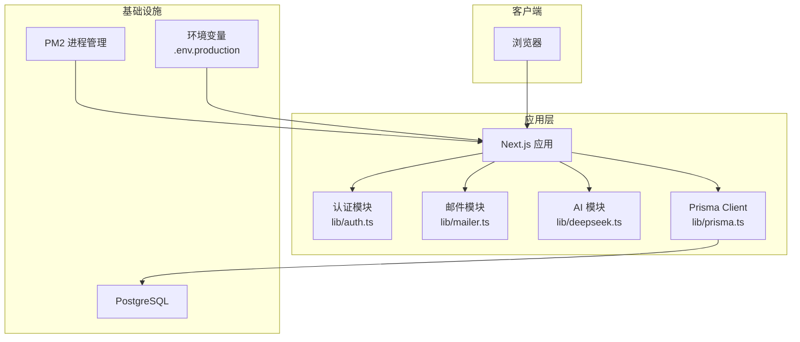
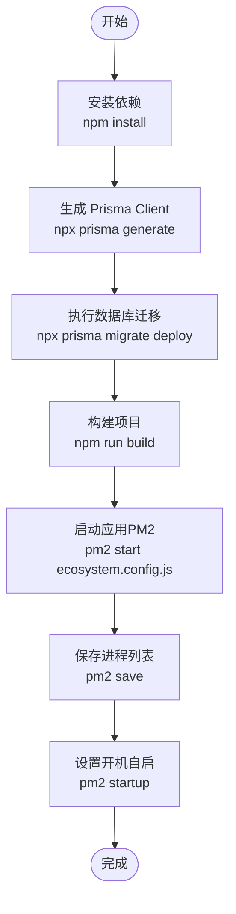
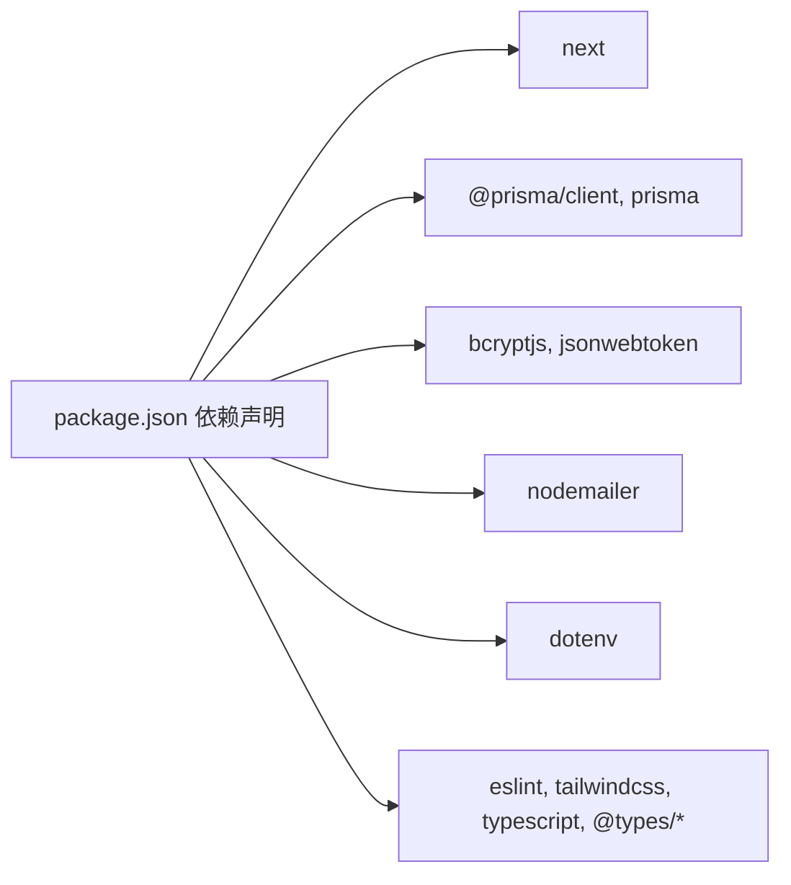

# 部署与运维

<cite>
**本文引用的文件**   
- [README.md](file://README.md)
- [package.json](file://package.json)
- [ecosystem.config.js](file://ecosystem.config.js)
- [deploy.sh](file://deploy.sh)
- [next.config.ts](file://next.config.ts)
- [prisma/schema.prisma](file://prisma/schema.prisma)
- [lib/prisma.ts](file://lib/prisma.ts)
- [lib/auth.ts](file://lib/auth.ts)
- [lib/mailer.ts](file://lib/mailer.ts)
- [lib/deepseek.ts](file://lib/deepseek.ts)
- [.gitignore](file://.gitignore)
- [doc/新电脑程序转移主人提醒.md](file://doc/新电脑程序转移主人提醒.md)
</cite>

## 目录
1. [简介](#简介)
2. [项目结构](#项目结构)
3. [核心组件](#核心组件)
4. [架构总览](#架构总览)
5. [详细组件分析](#详细组件分析)
6. [依赖分析](#依赖分析)
7. [性能考虑](#性能考虑)
8. [故障排查指南](#故障排查指南)
9. [结论](#结论)
10. [附录](#附录)

## 简介
本文件面向心芽项目的生产环境部署与运维，覆盖服务器环境准备、应用构建与发布、PM2 进程管理、CI/CD 流水线搭建、Docker 容器化方案、监控告警、日志收集与分析、故障排查方法论以及安全加固与性能优化建议。文档基于仓库现有脚本与配置进行系统化整理，并提供可操作的步骤与最佳实践。

## 项目结构
本项目为 Next.js 应用，使用 Prisma 作为数据访问层，PostgreSQL 作为数据库，邮件服务通过 Nodemailer 集成 QQ 邮箱 SMTP，AI 能力通过 DeepSeek API 调用。生产部署采用 PM2 进程管理器，提供一键部署脚本。

```mermaid
graph TB
A["Next.js 应用<br/>app/ 路由与页面"] --> B["API 路由<br/>app/api/*"]
B --> C["认证与鉴权<br/>lib/auth.ts"]
B --> D["邮件发送<br/>lib/mailer.ts"]
B --> E["AI 题目生成<br/>lib/deepseek.ts"]
B --> F["Prisma Client<br/>lib/prisma.ts"]
F --> G["PostgreSQL<br/>prisma/schema.prisma"]
H["PM2 进程管理<br/>ecosystem.config.js"] --> A
I["一键部署脚本<br/>deploy.sh"] --> H
```

图表来源
- [ecosystem.config.js:1-15](file://ecosystem.config.js#L1-L15)
- [deploy.sh:1-37](file://deploy.sh#L1-L37)
- [lib/prisma.ts:1-13](file://lib/prisma.ts#L1-L13)
- [prisma/schema.prisma:1-209](file://prisma/schema.prisma#L1-L209)
- [lib/auth.ts:1-56](file://lib/auth.ts#L1-L56)
- [lib/mailer.ts:1-86](file://lib/mailer.ts#L1-L86)
- [lib/deepseek.ts:1-115](file://lib/deepseek.ts#L1-L115)

章节来源
- [README.md:1-37](file://README.md#L1-L37)
- [package.json:1-40](file://package.json#L1-L40)

## 核心组件
- 应用运行与构建
  - 开发：npm run dev
  - 构建：npm run build
  - 启动：npm run start
  - 数据库迁移：npm run db:deploy（prisma migrate deploy）
  - 安装后钩子：postinstall 执行 prisma generate
- 进程管理
  - PM2 配置文件：ecosystem.config.js
  - 一键部署：deploy.sh（包含依赖安装、Prisma 生成与迁移、构建、PM2 启动与开机自启）
- 数据模型与连接
  - 数据源：PostgreSQL（由环境变量 DATABASE_URL 指定）
  - 客户端初始化：lib/prisma.ts（按 NODE_ENV 控制日志级别）
- 外部依赖
  - 邮件：Nodemailer + QQ 邮箱 SMTP（SMTP_USER、SMTP_PASS）
  - AI：DeepSeek API（DEEPSEEK_API_KEY）
  - 认证：JWT（JWT_SECRET），Cookie 名称 xinya_token

章节来源
- [package.json:5-12](file://package.json#L5-L12)
- [ecosystem.config.js:1-15](file://ecosystem.config.js#L1-L15)
- [deploy.sh:1-37](file://deploy.sh#L1-L37)
- [lib/prisma.ts:1-13](file://lib/prisma.ts#L1-L13)
- [prisma/schema.prisma:5-8](file://prisma/schema.prisma#L5-L8)
- [lib/mailer.ts:1-12](file://lib/mailer.ts#L1-L12)
- [lib/deepseek.ts:1-3](file://lib/deepseek.ts#L1-L3)
- [lib/auth.ts:1-10](file://lib/auth.ts#L1-L10)

## 架构总览
下图展示了生产环境的关键组件交互：前端浏览器访问 Next.js 应用，应用通过 API 路由处理业务逻辑，调用认证、邮件、AI 等模块，并通过 Prisma 访问 PostgreSQL 数据库。PM2 负责进程守护与重启。

图表来源
- [ecosystem.config.js:1-15](file://ecosystem.config.js#L1-L15)
- [lib/auth.ts:1-56](file://lib/auth.ts#L1-L56)
- [lib/mailer.ts:1-86](file://lib/mailer.ts#L1-L86)
- [lib/deepseek.ts:1-115](file://lib/deepseek.ts#L1-L115)
- [lib/prisma.ts:1-13](file://lib/prisma.ts#L1-L13)
- [prisma/schema.prisma:5-8](file://prisma/schema.prisma#L5-L8)

## 详细组件分析

### 服务器环境准备
- Node.js 与 npm/pnpm/yarn/bun 任一包管理器
- PostgreSQL 数据库实例与用户权限
- 系统级工具：pm2（可通过脚本自动安装）
- 域名与反向代理（可选）：Nginx/Caddy/宝塔面板
- 环境变量文件：.env.production（包含敏感信息，严禁提交到版本库）

关键环境变量清单（示例字段）
- DATABASE_URL：PostgreSQL 连接串
- JWT_SECRET：JWT 签名密钥（生产环境需强随机且保密）
- SMTP_USER / SMTP_PASS：QQ 邮箱 SMTP 账号与授权码
- NEXT_PUBLIC_BASE_URL / NEXT_PUBLIC_APP_URL：应用基础地址
- DEEPSEEK_API_KEY：AI 接口密钥

注意
- .env.* 已在 .gitignore 中排除，避免泄露
- 服务器路径与端口需与 PM2 配置一致（当前默认 3000）

章节来源
- [doc/新电脑程序转移主人提醒.md:86-104](file://doc/新电脑程序转移主人提醒.md#L86-L104)
- [.gitignore:6-9](file://.gitignore#L6-L9)
- [ecosystem.config.js:4-6](file://ecosystem.config.js#L4-L6)

### 应用构建与发布流程
- 依赖安装：npm install
- 生成 Prisma Client：npx prisma generate（或 postinstall 自动执行）
- 数据库迁移：npx prisma migrate deploy（或 npm run db:deploy）
- 构建产物：npm run build（生成 .next 静态资源与服务器端渲染产物）
- 启动应用：npm run start（或通过 PM2 启动）

一键部署脚本说明
- 切换工作目录至 /www/wwwroot/xinya
- 依次执行依赖安装、Prisma 生成、迁移、构建
- 全局安装 pm2（若未安装）、删除旧进程、启动新进程、保存状态并设置开机自启

图表来源
- [deploy.sh:1-37](file://deploy.sh#L1-L37)
- [package.json:5-12](file://package.json#L5-L12)

章节来源
- [deploy.sh:1-37](file://deploy.sh#L1-L37)
- [package.json:5-12](file://package.json#L5-L12)

### PM2 进程管理配置与使用
- 应用名：xinya
- 启动脚本：node_modules/.bin/next
- 启动参数：start -p 3000
- 工作目录：/www/wwwroot/xinya
- 实例数：1（可按需扩展）
- 自动重启：开启
- 监听模式：关闭（生产环境不建议 watch）
- 内存上限：512M（超过将触发重启）
- 环境变量：NODE_ENV=production

集群模式建议
- instances 设置为 CPU 核数可实现多实例并行，提升吞吐
- 需注意共享状态与无状态设计（如会话存储在 Cookie/JWT，避免本地缓存竞争）

日志管理建议
- 使用 PM2 内置日志轮转与查看命令
- 结合系统日志采集器（如 journald、rsyslog）统一收集
- 对错误日志进行集中化存储与分析（见“日志收集与分析策略”）

章节来源
- [ecosystem.config.js:1-15](file://ecosystem.config.js#L1-L15)

### CI/CD 流水线搭建与自动化部署
推荐方案（以 GitHub Actions 为例）
- 触发条件：push 到 main 分支或创建 Release
- 步骤
  - 检出代码
  - 设置 Node.js 环境
  - 安装依赖（npm ci）
  - 生成 Prisma Client（npx prisma generate）
  - 执行数据库迁移（npx prisma migrate deploy）
  - 构建项目（npm run build）
  - 部署到目标服务器（SSH 执行 deploy.sh 或使用 rsync/scp 推送构建产物）
- 安全
  - 使用 Secrets 管理敏感变量（DATABASE_URL、JWT_SECRET、SMTP_*、DEEPSEEK_API_KEY）
  - 仅在服务器侧写入 .env.production，不将密钥放入制品

替代方案
- GitLab CI、Jenkins、Gitee Pipelines 等均可实现类似流程
- 蓝绿/金丝雀发布：通过双站点目录与反向代理切换流量

[本节为概念性内容，无需源码引用]

### Docker 容器化部署方案与最佳实践
- 镜像选择：使用官方 node 镜像（例如 node:20-alpine）
- 多阶段构建
  - 构建阶段：安装依赖、生成 Prisma Client、执行迁移、构建 Next.js
  - 运行阶段：仅复制必要产物（.next、node_modules、二进制入口）
- 环境变量注入：通过 docker run -e 或编排平台 Secret 注入
- 健康检查：在容器内暴露 3000 端口，配合反向代理与健康探针
- 资源限制：设置 CPU/内存限制，避免 OOM
- 日志输出：容器 stdout/stderr 交由宿主机日志驱动收集

参考要点
- 确保 prisma generate 与 migrate deploy 在构建阶段执行
- 生产镜像最小化体积，移除不必要的开发依赖
- 使用只读文件系统与最小权限原则运行容器

[本节为概念性内容，无需源码引用]

### 监控告警系统配置
- 应用性能监控（APM）
  - 接入第三方 APM（如阿里云 ARMS、Sentry、New Relic）
  - 在 Next.js 应用中启用对应 SDK，捕获请求耗时、错误堆栈与数据库慢查询
- 错误追踪
  - 使用 Sentry 等工具记录未捕获异常与边界错误
  - 关联用户标识（JWT payload 中的 userId）以便定位问题
- 指标采集
  - 采集 PM2 指标（CPU、内存、事件循环延迟）
  - 采集系统指标（磁盘、网络、数据库连接池）
- 告警规则
  - 错误率阈值、响应时间 P95/P99、内存占用、进程崩溃次数
  - 通知渠道：企业微信、钉钉、邮件

[本节为概念性内容，无需源码引用]

### 日志收集与分析策略
- 应用日志
  - Prisma 日志：根据 NODE_ENV 控制级别（生产仅 error）
  - 自定义业务日志：结构化 JSON 格式，包含 traceId、userId、操作类型
- 系统日志
  - PM2 日志：按应用名分文件，启用轮转
  - 反向代理日志：Nginx/Caddy 访问与错误日志
- 集中化存储
  - 使用 ELK/EFK、Loki+Grafana、阿里云 SLS 等进行聚合与检索
- 分析维度
  - 错误分类（认证失败、数据库超时、AI 调用失败）
  - 热点接口与慢查询
  - 用户行为与转化漏斗

章节来源
- [lib/prisma.ts:9-11](file://lib/prisma.ts#L9-L11)

## 依赖分析
- 运行时依赖
  - next、react、react-dom：Web 框架与 UI 渲染
  - @prisma/client、prisma：ORM 与迁移工具
  - bcryptjs、jsonwebtoken：密码加密与令牌签发
  - nodemailer：邮件发送
  - dotenv：环境变量加载（开发常用）
- 开发依赖
  - eslint、tailwindcss、typescript、@types/*：代码质量与样式、类型支持

图表来源
- [package.json:13-38](file://package.json#L13-L38)

章节来源
- [package.json:13-38](file://package.json#L13-L38)

## 性能考虑
- 进程与实例
  - 根据 CPU 核数调整 PM2 instances，提升并发处理能力
  - 合理设置 max_memory_restart，避免频繁重启影响稳定性
- 构建与缓存
  - 利用 Next.js 增量编译与静态资源缓存
  - 在 CI 中缓存 node_modules 与 .next 构建产物
- 数据库
  - 连接池大小与超时配置（通过 Prisma 与数据库驱动）
  - 索引优化（schema.prisma 已定义部分索引，按需补充）
- 外部服务
  - DeepSeek API 调用增加重试与超时控制（已有实现）
  - 邮件发送异步化与退避重试
- 反向代理
  - 启用 gzip/br 压缩、HTTP/2、静态资源缓存头
  - 限流与防刷策略

[本节为通用指导，无需源码引用]

## 故障排查指南
- 常见问题定位
  - 环境变量缺失或错误：检查 .env.production 是否包含必需项
  - 数据库连接失败：验证 DATABASE_URL 与网络连通性
  - 邮件发送失败：确认 SMTP_USER/SMTP_PASS 与 QQ 邮箱授权码有效
  - AI 调用失败：检查 DEEPSEEK_API_KEY 与网络可达性
- 日志与诊断
  - PM2 日志：pm2 logs xinya
  - 应用错误：关注 Prisma 与业务模块的 console.error 输出
  - 系统资源：top、htop、free、df 查看 CPU/内存/磁盘
- 回滚与恢复
  - 保留上一版本构建产物，快速回滚
  - 数据库迁移幂等，必要时准备回滚脚本

章节来源
- [doc/新电脑程序转移主人提醒.md:145-157](file://doc/新电脑程序转移主人提醒.md#L145-L157)
- [lib/prisma.ts:9-11](file://lib/prisma.ts#L9-L11)

## 结论
心芽项目在生产环境可采用 PM2 进程管理与一键部署脚本快速上线；通过完善的环境变量管理、CI/CD 自动化、Docker 容器化与监控告警体系，可显著提升稳定性与可观测性。建议在后续迭代中引入更细粒度的日志规范、A/B 与灰度发布策略，以及更全面的性能基准测试与容量规划。

[本节为总结性内容，无需源码引用]

## 附录
- 环境变量模板与说明
  - 参考文档中的模板字段与注意事项
- 安全加固建议
  - 严格保管 .env.production 与各类密钥
  - 使用 HTTPS 与安全的 Cookie 配置（secure、sameSite）
  - 定期轮换 JWT_SECRET、SMTP 授权码与数据库密码
- 性能优化清单
  - 启用反向代理缓存与压缩
  - 数据库慢查询分析与索引优化
  - 外部 API 调用超时与重试策略调优

章节来源
- [doc/新电脑程序转移主人提醒.md:86-104](file://doc/新电脑程序转移主人提醒.md#L86-L104)
- [lib/auth.ts:46-55](file://lib/auth.ts#L46-L55)