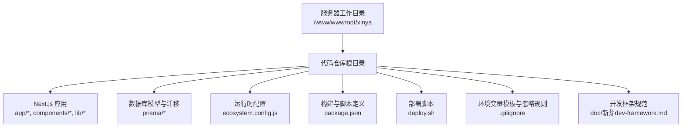
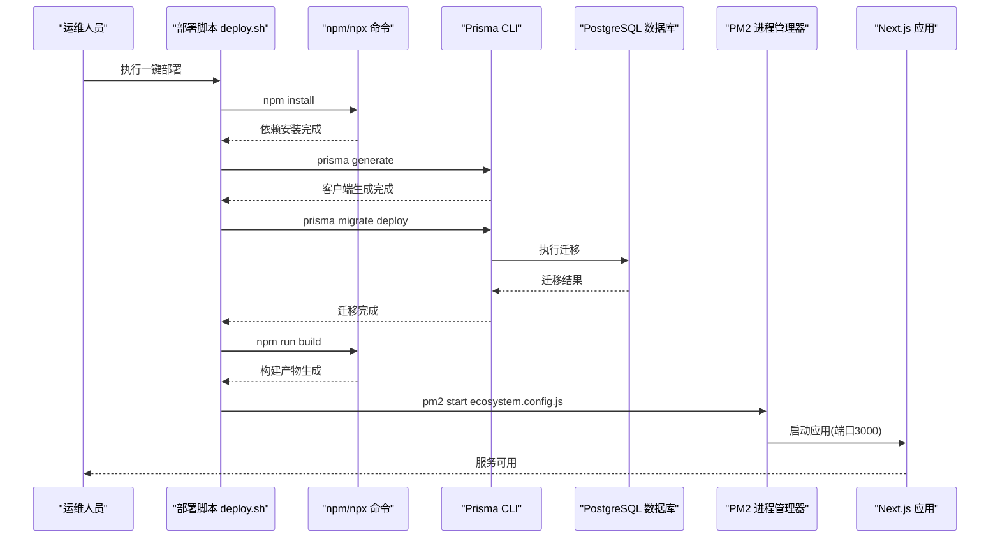
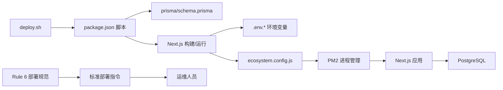

# 部署流程

<cite>
**本文引用的文件**
- [deploy.sh](file://deploy.sh)
- [package.json](file://package.json)
- [ecosystem.config.js](file://ecosystem.config.js)
- [prisma/schema.prisma](file://prisma/schema.prisma)
- [lib/prisma.ts](file://lib/prisma.ts)
- [app/api/auth/magic-link/send/route.ts](file://app/api/auth/magic-link/send/route.ts)
- [app/api/auth/forgot-password/route.ts](file://app/api/auth/forgot-password/route.ts)
- [next.config.ts](file://next.config.ts)
- [.gitignore](file://.gitignore)
- [README.md](file://README.md)
- [doc/新芽dev-framework.md](file://doc/新芽dev-framework.md)
</cite>

## 更新摘要
**变更内容**
- 新增Rule 6部署规范章节，详细说明每次代码变更后必须主动提供完整服务器部署指令的要求
- 完善标准部署指令格式和执行流程
- 增强PM2进程管理的详细操作指南
- 补充Git仓库同步和版本控制的最佳实践

## 目录
1. [简介](#简介)
2. [项目结构](#项目结构)
3. [核心组件](#核心组件)
4. [架构总览](#架构总览)
5. [详细组件分析](#详细组件分析)
6. [依赖关系分析](#依赖关系分析)
7. [性能考虑](#性能考虑)
8. [故障排查指南](#故障排查指南)
9. [结论](#结论)
10. [附录](#附录)

## 简介
本文件为"心芽"项目的完整部署流程文档，覆盖一键部署脚本执行步骤、应用构建过程（依赖安装、Prisma 客户端生成、数据库迁移、前端资源构建）、PM2 进程管理（启动、守护、自动重启、日志）、多环境差异化配置策略、回滚与故障恢复方案，以及 CI/CD 流水线搭建的最佳实践建议。**特别强调：根据开发框架Rule 6要求，每次代码变更完成后必须主动提供完整的服务器部署指令，确保部署过程的一致性和可重复性。**

## 项目结构
本项目基于 Next.js App Router，后端 API 通过 Route Handlers 暴露；数据层使用 Prisma + PostgreSQL；运行期由 PM2 托管；环境变量通过 .env 系列文件注入。



图表来源
- [deploy.sh:1-37](file://deploy.sh#L1-L37)
- [package.json:1-40](file://package.json#L1-L40)
- [ecosystem.config.js:1-15](file://ecosystem.config.js#L1-L15)
- [prisma/schema.prisma:1-209](file://prisma/schema.prisma#L1-L209)
- [.gitignore:1-20](file://.gitignore#L1-L20)
- [doc/新芽dev-framework.md:884-895](file://doc/新芽dev-framework.md#L884-L895)

章节来源
- [deploy.sh:1-37](file://deploy.sh#L1-L37)
- [package.json:1-40](file://package.json#L1-L40)
- [ecosystem.config.js:1-15](file://ecosystem.config.js#L1-L15)
- [prisma/schema.prisma:1-209](file://prisma/schema.prisma#L1-L209)
- [.gitignore:1-20](file://.gitignore#L1-L20)
- [doc/新芽dev-framework.md:884-895](file://doc/新芽dev-framework.md#L884-L895)

## 核心组件
- **一键部署脚本**：负责在服务器上按顺序完成依赖安装、Prisma Client 生成、数据库迁移、构建与 PM2 启动。
- **构建与脚本**：package.json 定义了 build、start、postinstall 等关键脚本，驱动 Next.js 构建与 Prisma 客户端生成。
- **进程管理**：ecosystem.config.js 定义 PM2 应用实例、端口、内存上限、自动重启与环境变量。
- **数据层**：Prisma Schema 定义数据模型与索引，migrate deploy 用于在生产库上执行迁移。
- **环境变量**：NEXT_PUBLIC_* 与 DATABASE_URL 等敏感信息通过 .env.* 注入，且被 .gitignore 排除。
- **部署规范**：根据Rule 6要求，每次代码变更后必须主动提供完整的服务器部署指令。

章节来源
- [deploy.sh:1-37](file://deploy.sh#L1-L37)
- [package.json:1-40](file://package.json#L1-L40)
- [ecosystem.config.js:1-15](file://ecosystem.config.js#L1-L15)
- [prisma/schema.prisma:1-209](file://prisma/schema.prisma#L1-L209)
- [.gitignore:1-20](file://.gitignore#L1-L20)
- [doc/新芽dev-framework.md:884-895](file://doc/新芽dev-framework.md#L884-L895)

## 架构总览
下图展示从部署到运行的端到端流程：脚本触发构建与迁移，PM2 启动 Next.js 服务，API 路由访问数据库并返回响应。



图表来源
- [deploy.sh:1-37](file://deploy.sh#L1-L37)
- [package.json:1-40](file://package.json#L1-L40)
- [ecosystem.config.js:1-15](file://ecosystem.config.js#L1-L15)
- [prisma/schema.prisma:1-209](file://prisma/schema.prisma#L1-L209)

## 详细组件分析

### Rule 6：标准部署指令规范

**重要更新** 根据开发框架Rule 6要求，每次代码变更完成、需要用户部署时，必须在回复中主动附上完整的服务器部署指令，不要等用户来问。

#### 标准部署指令格式
```bash
cd /path/to/xinya
git fetch gitee
git reset --hard gitee/main
npm run build
pm2 delete xinya && pm2 start ecosystem.config.js && pm2 save
```

#### 完整部署流程说明
1. **进入项目目录**：`cd /path/to/xinya`
2. **拉取最新代码**：`git fetch gitee` - 获取远程仓库最新提交
3. **重置到指定分支**：`git reset --hard gitee/main` - 强制重置到main分支最新版本
4. **构建项目**：`npm run build` - 执行Next.js生产构建
5. **重启PM2进程**：`pm2 delete xinya && pm2 start ecosystem.config.js && pm2 save` - 删除旧进程并启动新进程

#### 部署时机要求
- 每次代码合并到主分支后
- 功能开发完成并通过测试后
- 修复bug并发布新版本后
- 配置文件或依赖更新后

章节来源
- [doc/新芽dev-framework.md:884-895](file://doc/新芽dev-framework.md#L884-L895)

### 一键部署脚本 deploy.sh 执行流程
- 切换工作目录至 /www/wwwroot/xinya
- 安装依赖：npm install
- 生成 Prisma Client：npx prisma generate
- 执行数据库迁移：npx prisma migrate deploy
- 构建项目：npm run build
- 安装 PM2 全局包并启动应用：pm2 delete xinya; pm2 start ecosystem.config.js; pm2 save; pm2 startup

注意事项
- 生产环境需提前准备 .env.production 或等效的环境变量注入方式，确保 DATABASE_URL 与 NEXT_PUBLIC_* 正确设置。
- 首次部署时，pm2 startup 会输出系统级自启动命令，需在提示后手动执行以注册开机自启。

章节来源
- [deploy.sh:1-37](file://deploy.sh#L1-L37)

### 应用构建过程详解
- 依赖安装：npm install 会触发 postinstall 钩子，自动执行 prisma generate，减少重复操作。
- Prisma 客户端生成：根据 prisma/schema.prisma 生成类型安全的客户端，供 app/lib 层调用。
- 数据库迁移：prisma migrate deploy 仅在生产库执行已记录的迁移，不会创建新迁移文件。
- 前端资源构建：npm run build 调用 next build，产出可静态化与 SSR 的产物，供 next start 运行。

优化建议
- 将 prisma generate 放入 postinstall，避免遗漏。
- 在构建前校验环境变量是否齐全，尽早失败。
- 缓存 node_modules 与 .next 目录以提升 CI 速度。

章节来源
- [package.json:1-40](file://package.json#L1-L40)
- [prisma/schema.prisma:1-209](file://prisma/schema.prisma#L1-L209)

### PM2 进程管理流程
- 应用名称：xinya
- 启动脚本：node_modules/.bin/next start -p 3000
- 工作目录：/www/wwwroot/xinya
- 实例数：1
- 自动重启：开启
- 监控模式：关闭（生产环境）
- 内存上限：512M（超过则自动重启）
- 环境变量：NODE_ENV=production

生命周期要点
- 启动：pm2 start ecosystem.config.js
- 保存状态：pm2 save
- 开机自启：pm2 startup（按提示执行系统级命令）
- 查看日志：pm2 logs xinya
- 优雅重启：pm2 reload xinya
- 停止服务：pm2 stop xinya
- 删除进程：pm2 delete xinya

章节来源
- [ecosystem.config.js:1-15](file://ecosystem.config.js#L1-L15)

### 环境变量与多环境策略
- 必需环境变量
  - DATABASE_URL：指向生产 PostgreSQL 连接串
  - NEXT_PUBLIC_APP_URL：用于魔法链接等对外 URL 拼接
  - NEXT_PUBLIC_BASE_URL：部分 API 使用的基础地址
- 安全与隔离
  - .env、.env.local、.env.production 已被 .gitignore 排除，禁止提交
  - 不同环境通过独立 .env.* 文件或平台环境变量注入
- 运行时差异
  - NODE_ENV=production 控制日志级别与行为
  - Prisma 客户端在非 production 下启用更多日志

建议
- 开发：.env.local 包含本地数据库与基础 URL
- 测试：.env.staging 指向测试库与域名
- 生产：.env.production 包含真实密钥与线上域名

章节来源
- [lib/prisma.ts:1-14](file://lib/prisma.ts#L1-L14)
- [app/api/auth/magic-link/send/route.ts:1-47](file://app/api/auth/magic-link/send/route.ts#L1-L47)
- [app/api/auth/forgot-password/route.ts:1-34](file://app/api/auth/forgot-password/route.ts#L1-L34)
- [.gitignore:1-20](file://.gitignore#L1-L20)

### 回滚机制与故障恢复
- 代码回滚
  - 使用 Git 标签或分支快速切回上一个稳定版本
  - 重新执行部署脚本，确保构建与迁移一致
- 数据库回滚
  - 谨慎操作：优先采用新增迁移而非删除历史迁移
  - 若必须回滚，先在备份库验证，再在生产执行对应反向迁移
- 应用回滚
  - PM2 支持版本化发布：保留上一份构建产物，失败时切换回旧版本
  - 结合蓝绿/金丝雀策略降低风险
- 故障恢复
  - 检查 PM2 日志定位问题
  - 校验环境变量与数据库连通性
  - 必要时先停止服务，修复后再启动

章节来源
- [ecosystem.config.js:1-15](file://ecosystem.config.js#L1-L15)
- [deploy.sh:1-37](file://deploy.sh#L1-L37)

### CI/CD 流水线最佳实践（建议）
- 自动化测试
  - 单元测试与集成测试并行执行
  - 使用 Docker 镜像保证环境一致性
- 代码检查
  - ESLint/TSC 预检，失败即阻断
- 构建与制品
  - 构建 Next.js 产物并打包为镜像
  - 推送镜像到私有仓库并打标签（含 Git SHA）
- 部署策略
  - 蓝绿部署：双实例交替上线，流量切换
  - 金丝雀：小流量灰度验证，逐步放量
- 回滚策略
  - 一键回滚到上一个镜像版本
  - 数据库变更遵循向前兼容原则，避免破坏性更新

[本节为通用实践建议，不直接分析具体源码文件]

## 依赖关系分析
- 脚本与工具链
  - deploy.sh 依赖 npm、npx、pm2
  - package.json 提供 build/start/postinstall/db:deploy 等脚本
- 运行时依赖
  - Next.js 应用依赖 @prisma/client、bcryptjs、jsonwebtoken、nodemailer 等
  - 开发依赖包括 eslint、tailwindcss、typescript 等
- 数据层依赖
  - Prisma 客户端由 schema.prisma 生成，运行时通过 lib/prisma.ts 单例获取
- 环境变量依赖
  - 应用逻辑读取 NEXT_PUBLIC_* 与 DATABASE_URL



图表来源
- [deploy.sh:1-37](file://deploy.sh#L1-L37)
- [package.json:1-40](file://package.json#L1-L40)
- [prisma/schema.prisma:1-209](file://prisma/schema.prisma#L1-L209)
- [ecosystem.config.js:1-15](file://ecosystem.config.js#L1-L15)
- [doc/新芽dev-framework.md:884-895](file://doc/新芽dev-framework.md#L884-L895)

章节来源
- [package.json:1-40](file://package.json#L1-L40)
- [ecosystem.config.js:1-15](file://ecosystem.config.js#L1-L15)
- [prisma/schema.prisma:1-209](file://prisma/schema.prisma#L1-L209)
- [doc/新芽dev-framework.md:884-895](file://doc/新芽dev-framework.md#L884-L895)

## 性能考虑
- 构建优化
  - 利用缓存 node_modules 与 .next 目录
  - 按需引入第三方库，避免过大 bundle
- 运行期优化
  - 合理设置 PM2 实例数与内存上限
  - 开启 Next.js 静态导出或增量静态再生成（如适用）
- 数据库优化
  - 为高频查询字段建立索引（已在 schema 中定义多处索引）
  - 连接池与超时参数根据负载调优

[本节为通用指导，不直接分析具体源码文件]

## 故障排查指南
- 常见问题
  - 环境变量缺失：确认 .env.production 存在且包含 DATABASE_URL、NEXT_PUBLIC_APP_URL、NEXT_PUBLIC_BASE_URL
  - 数据库不可达：检查网络、账号权限与防火墙
  - 构建失败：查看 npm 日志与 Next.js 构建错误
  - PM2 启动失败：使用 pm2 logs xinya 查看崩溃堆栈
- 诊断步骤
  - 进入服务器目录，手动执行各阶段命令定位问题
  - 校验 Prisma 迁移状态：prisma migrate status
  - 验证端口占用：确认 3000 未被占用
- 恢复手段
  - 回退到上一个稳定版本并重建
  - 清理 .next 与 node_modules 后重试
  - 重置 PM2 状态：pm2 reset xinya

章节来源
- [deploy.sh:1-37](file://deploy.sh#L1-L37)
- [ecosystem.config.js:1-15](file://ecosystem.config.js#L1-L15)
- [lib/prisma.ts:1-14](file://lib/prisma.ts#L1-L14)

## 结论
通过一键部署脚本与 PM2 进程管理，心芽项目实现了标准化的生产部署流程。**特别重要的是，根据Rule 6规范要求，每次代码变更后必须主动提供完整的服务器部署指令，这确保了部署过程的一致性和可重复性。**配合多环境环境变量管理与完善的回滚策略，可在保障稳定性的同时提升交付效率。建议在 CI/CD 中引入自动化测试、代码检查与蓝绿/金丝雀部署，进一步降低发布风险。

## 附录
- 参考说明
  - README.md 提供了 Next.js 本地开发与 Vercel 部署的快速入门，可作为补充参考。
  - 开发框架文档中的Rule 6规范是部署流程的重要约束条件。

章节来源
- [README.md:1-37](file://README.md#L1-L37)
- [doc/新芽dev-framework.md:884-895](file://doc/新芽dev-framework.md#L884-L895)