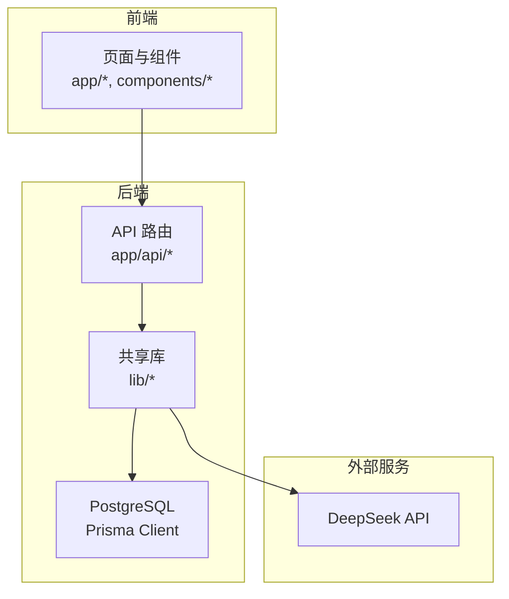
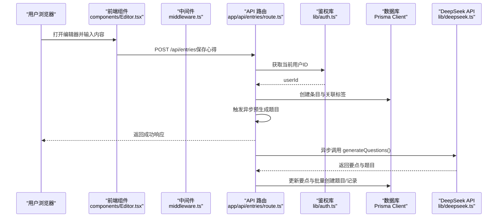
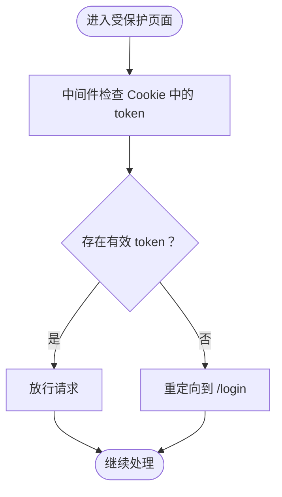
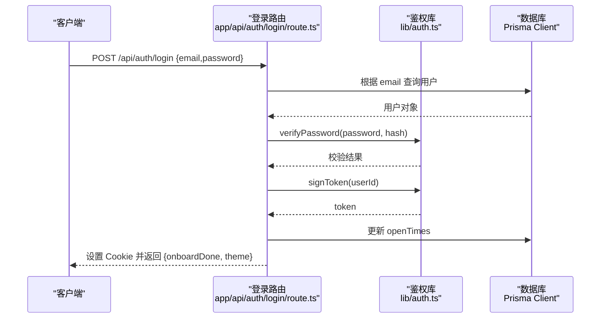
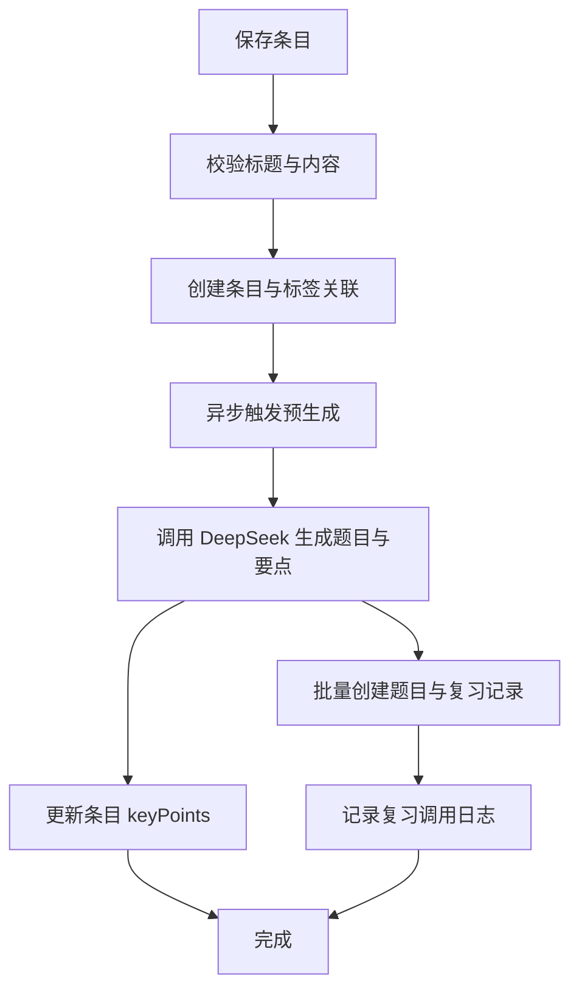
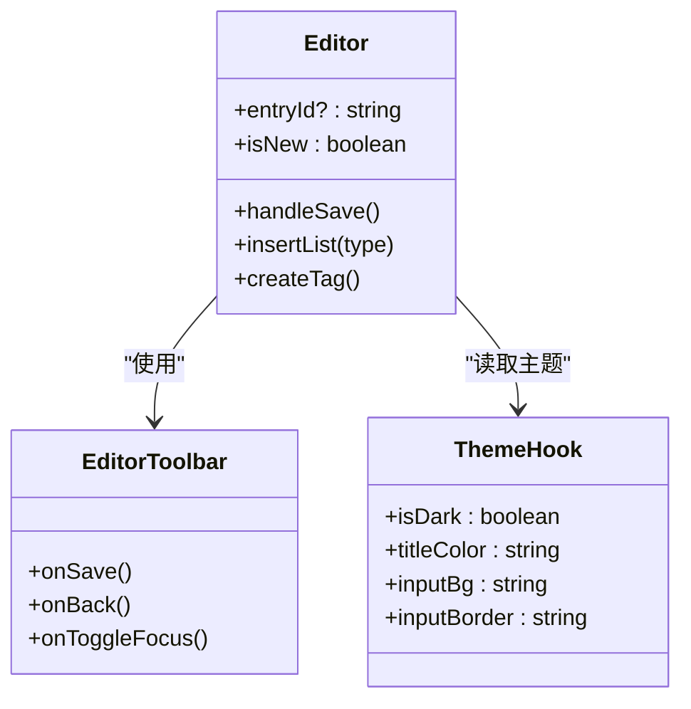
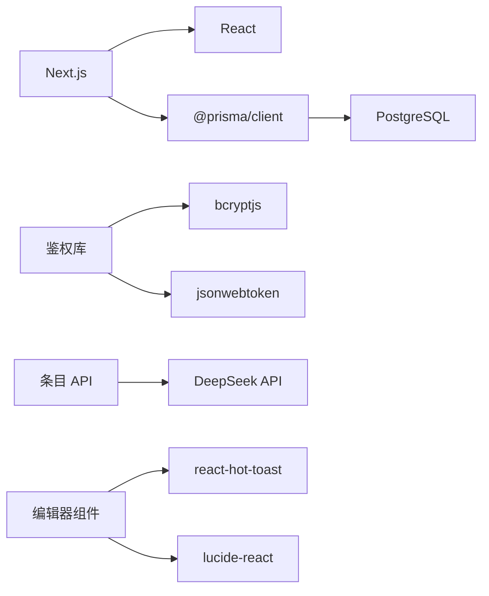

# 项目概述

<cite>
**本文引用的文件**
- [README.md](file://README.md)
- [package.json](file://package.json)
- [next.config.ts](file://next.config.ts)
- [prisma/schema.prisma](file://prisma/schema.prisma)
- [lib/prisma.ts](file://lib/prisma.ts)
- [lib/auth.ts](file://lib/auth.ts)
- [middleware.ts](file://middleware.ts)
- [app/layout.tsx](file://app/layout.tsx)
- [app/page.tsx](file://app/page.tsx)
- [app/api/auth/login/route.ts](file://app/api/auth/login/route.ts)
- [app/api/entries/route.ts](file://app/api/entries/route.ts)
- [lib/deepseek.ts](file://lib/deepseek.ts)
- [components/Editor.tsx](file://components/Editor.tsx)
- [lib/utils.ts](file://lib/utils.ts)
- [types/index.ts](file://types/index.ts)
</cite>

## 目录
1. [简介](#简介)
2. [项目结构](#项目结构)
3. [核心组件](#核心组件)
4. [架构总览](#架构总览)
5. [详细组件分析](#详细组件分析)
6. [依赖分析](#依赖分析)
7. [性能考虑](#性能考虑)
8. [故障排查指南](#故障排查指南)
9. [结论](#结论)
10. [附录](#附录)

## 简介
心芽（Xinya）是一个面向个人的记录与学习平台，围绕“私有记录 + 可控分享”的核心理念，帮助用户沉淀思考、形成知识闭环，并通过复习机制强化记忆。项目采用 Next.js 全栈框架，结合 Prisma ORM 与 PostgreSQL 数据库，提供稳定可靠的数据层；同时集成 DeepSeek AI，自动从心得内容中生成要点总结与复习题目，提升学习效率。

核心价值主张：
- 私密记录：个人数据完全由用户掌控，支持标签、心情、置顶与收藏等组织方式。
- 智能复习：基于 AI 自动生成题目与解析，配合间隔重复策略，帮助长期记忆。
- 轻量易用：前后端一体化开发体验，快速上手，便于扩展与部署。

目标用户群体：
- 个人学习者与写作者，希望系统化记录与复盘。
- 需要构建个人知识库并持续回顾的人群。
- 追求简洁、专注写作体验的用户。

主要功能特性：
- 用户认证与会话管理（邮箱密码登录、令牌校验、Cookie 安全配置）。
- 心得创建、编辑、列表查询、筛选与分页。
- 标签管理与默认标签。
- 基于 DeepSeek 的要点总结与题目预生成。
- 复习调度与调用日志记录。
- 主题切换与移动端适配。

技术架构选择与设计理念：
- Next.js App Router：统一路由与 API 路由，前后端同仓开发，减少上下文切换成本。
- Prisma ORM + PostgreSQL：类型安全的数据库访问与迁移管理，保证数据结构一致性与可演进性。
- API 优先策略：所有业务逻辑通过 RESTful API 暴露，前端以组件化方式消费接口。
- 组件化设计：UI 按功能拆分，复用性强，易于维护与测试。
- 异步与容错：AI 生成走异步预生成流程，避免阻塞主响应；具备重试与降级处理。

## 项目结构
整体采用 Next.js App Router 的分层组织方式：
- app：页面与 API 路由
  - (auth)：认证相关页面（登录、注册、重置密码等）
  - (main)：主应用页面（首页、入口页等）
  - api：API 路由（认证、条目、标签、复习、导出等）
  - entry：条目详情与新建页面
  - onboard、showcase：引导与展示页
- components：前端组件（编辑器、卡片、工具栏等）
- lib：服务端与客户端共享库（Prisma 客户端、鉴权、DeepSeek 调用、邮件、工具函数等）
- prisma：数据库模型与迁移
- types：TypeScript 类型定义
- public：静态资源（manifest 等）



图表来源
- [app/layout.tsx:1-43](file://app/layout.tsx#L1-L43)
- [app/page.tsx:1-5](file://app/page.tsx#L1-L5)
- [app/api/entries/route.ts:1-163](file://app/api/entries/route.ts#L1-L163)
- [lib/prisma.ts:1-14](file://lib/prisma.ts#L1-L14)
- [lib/deepseek.ts:1-115](file://lib/deepseek.ts#L1-L115)

章节来源
- [README.md:1-37](file://README.md#L1-L37)
- [package.json:1-40](file://package.json#L1-L40)
- [next.config.ts:1-8](file://next.config.ts#L1-L8)

## 核心组件
- 认证与会话
  - 使用 bcryptjs 进行密码哈希与验证，jsonwebtoken 签发与校验 JWT，Next.js cookies 读取当前用户 ID，并提供 Cookie 安全配置。
  - 中间件对非公开路径进行鉴权拦截，未登录重定向至登录页。
- 数据访问
  - Prisma Client 单例初始化，开发环境开启 query/error/warn 日志，生产仅 error。
  - 数据库模型覆盖用户、条目、标签、分享、AI 洞察、成长日志、邮件令牌、魔法链接、测验问题与记录、用户设置、复习调用日志等。
- 富文本编辑器
  - 自定义 contentEditable 编辑器，支持标题、正文、心情、标签、字数统计、焦点模式与保存流程。
- 工具函数
  - 验证码与随机 Token 生成、HTML 清理预览、日期格式化与连续天数计算等。

章节来源
- [lib/auth.ts:1-56](file://lib/auth.ts#L1-L56)
- [middleware.ts:1-29](file://middleware.ts#L1-L29)
- [lib/prisma.ts:1-14](file://lib/prisma.ts#L1-L14)
- [prisma/schema.prisma:1-209](file://prisma/schema.prisma#L1-L209)
- [components/Editor.tsx:1-192](file://components/Editor.tsx#L1-L192)
- [lib/utils.ts:1-59](file://lib/utils.ts#L1-L59)

## 架构总览
系统采用前后端分离的 API 优先策略，前端通过 React 组件发起 HTTP 请求，后端 Next.js API 路由负责鉴权、业务编排与数据持久化，必要时调用外部 AI 服务。



图表来源
- [components/Editor.tsx:115-124](file://components/Editor.tsx#L115-L124)
- [app/api/entries/route.ts:66-106](file://app/api/entries/route.ts#L66-L106)
- [app/api/entries/route.ts:108-161](file://app/api/entries/route.ts#L108-L161)
- [lib/deepseek.ts:17-114](file://lib/deepseek.ts#L17-L114)
- [lib/auth.ts:32-43](file://lib/auth.ts#L32-L43)
- [middleware.ts:4-24](file://middleware.ts#L4-L24)

## 详细组件分析

### 认证与会话模块
- 密码加密与校验：bcryptjs 实现，盐值强度合理，适合生产环境。
- JWT 签发与校验：固定过期时间，服务端校验失败返回空载荷。
- 会话提取：从 Cookie 中读取 token 并解析出 userId，供后续路由使用。
- 中间件鉴权：对非认证页面进行 token 检查，未登录重定向到登录页。



图表来源
- [middleware.ts:4-24](file://middleware.ts#L4-L24)
- [lib/auth.ts:32-43](file://lib/auth.ts#L32-L43)

章节来源
- [lib/auth.ts:1-56](file://lib/auth.ts#L1-L56)
- [middleware.ts:1-29](file://middleware.ts#L1-L29)

### 登录 API 流程
- 接收邮箱与密码，校验必填字段。
- 查询用户并检查邮箱是否已验证。
- 校验密码，签发 JWT，写入 Cookie，返回用户状态信息。



图表来源
- [app/api/auth/login/route.ts:5-38](file://app/api/auth/login/route.ts#L5-L38)
- [lib/auth.ts:18-30](file://lib/auth.ts#L18-L30)
- [lib/prisma.ts:7-11](file://lib/prisma.ts#L7-L11)

章节来源
- [app/api/auth/login/route.ts:1-39](file://app/api/auth/login/route.ts#L1-L39)

### 条目 CRUD 与 AI 预生成
- 列表查询：支持搜索、收藏过滤、标签过滤、时间范围与分页，返回纯文本预览。
- 新建条目：校验标题，自动关联默认标签，保存后异步触发题目预生成。
- 预生成流程：调用 DeepSeek 生成要点与题目，更新条目要点，批量创建题目与复习记录，并记录调用日志。



图表来源
- [app/api/entries/route.ts:66-106](file://app/api/entries/route.ts#L66-L106)
- [app/api/entries/route.ts:108-161](file://app/api/entries/route.ts#L108-L161)
- [lib/deepseek.ts:17-114](file://lib/deepseek.ts#L17-L114)

章节来源
- [app/api/entries/route.ts:1-163](file://app/api/entries/route.ts#L1-163)

### 富文本编辑器组件
- 功能点：标题输入、富文本编辑、心情选择、标签选择与新增、字数统计、焦点模式、粘贴纯文本、保存与导航。
- 交互：加载已有条目数据，提交时组装 JSON 发送至对应 API。
- 样式：跟随主题变量，支持暗色模式与移动端适配。



图表来源
- [components/Editor.tsx:1-192](file://components/Editor.tsx#L1-L192)

章节来源
- [components/Editor.tsx:1-192](file://components/Editor.tsx#L1-L192)

### 数据类型与工具函数
- 类型定义：心情、主题、条目卡片与详情、标签、今日速览、通用 API 响应。
- 工具函数：验证码与随机 Token 生成、HTML 清理、日期格式化、连续天数计算。

章节来源
- [types/index.ts:1-48](file://types/index.ts#L1-L48)
- [lib/utils.ts:1-59](file://lib/utils.ts#L1-L59)

## 依赖分析
- 运行时依赖
  - next、react、react-dom：前端与全栈框架基础。
  - @prisma/client、prisma：ORM 与代码生成。
  - bcryptjs、jsonwebtoken：密码与令牌安全。
  - nodemailer：邮件发送能力（用于验证与重置等场景）。
  - lucide-react、react-hot-toast：图标与提示。
- 开发依赖
  - tailwindcss、@tailwindcss/postcss：样式与构建。
  - eslint、eslint-config-next：代码规范。
  - typescript、@types/*：类型支持。



图表来源
- [package.json:13-38](file://package.json#L13-L38)
- [lib/deepseek.ts:1-115](file://lib/deepseek.ts#L1-L115)
- [components/Editor.tsx:1-192](file://components/Editor.tsx#L1-L192)

章节来源
- [package.json:1-40](file://package.json#L1-L40)

## 性能考虑
- 数据库索引：条目按用户与时间、置顶、收藏、草稿建立索引，提升查询效率。
- 并发查询：列表查询使用 Promise.all 并行获取条目与总数，降低延迟。
- 异步预生成：AI 生成不阻塞主响应，提高用户体验。
- 超时与重试：DeepSeek 调用设置超时与最大重试次数，增强稳定性。
- 日志级别：生产环境关闭冗余日志，减少 I/O 开销。

[本节为通用指导，无需具体文件引用]

## 故障排查指南
- 登录失败
  - 检查邮箱是否已验证，确认密码是否正确，查看服务器日志输出。
  - 参考：[app/api/auth/login/route.ts:18-25](file://app/api/auth/login/route.ts#L18-L25)
- 未授权访问
  - 确认 Cookie 中是否存在 xinya_token，检查中间件匹配规则。
  - 参考：[middleware.ts:13-24](file://middleware.ts#L13-L24)
- 条目保存异常
  - 检查标题是否为空，标签是否有效，关注异步预生成错误日志。
  - 参考：[app/api/entries/route.ts:73-106](file://app/api/entries/route.ts#L73-L106)
- AI 生成失败
  - 检查网络连通与 API Key，关注超时与 JSON 解析错误。
  - 参考：[lib/deepseek.ts:76-114](file://lib/deepseek.ts#L76-L114)

章节来源
- [app/api/auth/login/route.ts:1-39](file://app/api/auth/login/route.ts#L1-L39)
- [middleware.ts:1-29](file://middleware.ts#L1-L29)
- [app/api/entries/route.ts:1-163](file://app/api/entries/route.ts#L1-L163)
- [lib/deepseek.ts:1-115](file://lib/deepseek.ts#L1-L115)

## 结论
心芽平台以 Next.js 为核心，结合 Prisma 与 PostgreSQL 构建稳健的数据层，并通过 DeepSeek AI 实现智能化的复习辅助。API 优先与组件化设计使系统具备良好的可扩展性与可维护性。建议在生产环境完善环境变量配置、启用 HTTPS 与安全 Cookie 策略，并持续优化 AI 调用的容错与缓存策略。

[本节为总结性内容，无需具体文件引用]

## 附录

### 快速开始指南
- 环境要求
  - Node.js 与包管理器（npm/yarn/pnpm/bun）
  - PostgreSQL 数据库实例
  - DeepSeek API Key（可选，用于 AI 功能）
- 安装步骤
  - 克隆仓库并安装依赖
  - 配置环境变量（DATABASE_URL、JWT_SECRET、DEEPSEEK_API_KEY 等）
  - 执行数据库迁移与生成 Prisma Client
  - 启动开发服务器
- 基本使用示例
  - 访问首页将重定向至登录页
  - 登录后即可创建心得、选择心情与标签，系统会异步生成复习题目

章节来源
- [README.md:3-17](file://README.md#L3-L17)
- [package.json:5-12](file://package.json#L5-L12)
- [app/page.tsx:1-5](file://app/page.tsx#L1-L5)

### 版本信息与依赖管理
- 项目名称与版本：xinya v0.1.0
- 关键依赖版本：Next.js 16.2.9、React 19.2.4、Prisma 6.19.3、Tailwind CSS v4、TypeScript ^5
- 脚本命令：dev/build/start/lint/db:deploy/postinstall

章节来源
- [package.json:1-40](file://package.json#L1-L40)

### 数据库模型概览
```mermaid
erDiagram
USER {
string id PK
string email UK
boolean isVerified
string theme
boolean onboardDone
int openTimes
datetime createdAt
datetime updatedAt
}
ENTRY {
string id PK
string userId FK
string title
text content
string keyPoints
string mood
datetime recordTime
boolean isTop
boolean isFavorite
boolean isDraft
datetime createdAt
datetime updatedAt
}
TAG {
string id PK
string userId FK
string name
boolean isDefault
datetime createdAt
}
SHARE {
string id PK
string userId FK
string token UK
datetime expiresAt
string scope
string[] tagIds
boolean isActive
datetime createdAt
}
AI_INSIGHT {
string id PK
string userId FK
string content
int triggerCount
boolean isRead
datetime createdAt
}
INSIGHT_REPORT {
string id PK
string userId FK
string type
datetime periodStart
datetime periodEnd
json content
datetime createdAt
}
GROWTH_LOG {
string id PK
string userId FK
string version
string title
string content
datetime logDate
datetime createdAt
}
EMAIL_TOKEN {
string id PK
string userId FK
string token UK
string type
datetime expiresAt
boolean used
datetime createdAt
}
MAGIC_LINK {
string id PK
string email
string token UK
datetime expiresAt
boolean used
datetime createdAt
}
QUIZ_QUESTION {
string id PK
string entryId FK
string question
string type
json options
json answer
string explanation
int angle
datetime createdAt
}
QUIZ_RECORD {
string id PK
string userId FK
string questionId FK
string entryId FK
boolean correct
json userAnswer
int answerCount
datetime answeredAt
datetime nextReviewAt
int streak
}
USER_SETTING {
string id PK
string userId FK UK
boolean reviewEnabled
string lastCardDate
string lastQuestionId
}
REVIEW_CALL_LOG {
string id PK
string userId FK
string entryId FK
string step
boolean success
int questionCount
string errorMsg
datetime createdAt
}
USER ||--o{ ENTRY : "拥有"
USER ||--o{ TAG : "拥有"
USER ||--o{ SHARE : "拥有"
USER ||--o{ AI_INSIGHT : "拥有"
USER ||--o{ INSIGHT_REPORT : "拥有"
USER ||--o{ GROWTH_LOG : "拥有"
USER ||--o{ EMAIL_TOKEN : "拥有"
USER ||--o{ QUIZ_RECORD : "拥有"
USER ||--o{ REVIEW_CALL_LOG : "拥有"
USER ||--o| USER_SETTING : "配置"
ENTRY ||--o{ QUIZ_QUESTION : "包含"
ENTRY ||--o{ QUIZ_RECORD : "产生"
TAG ||--o{ ENTRY : "标记"
```

图表来源
- [prisma/schema.prisma:10-209](file://prisma/schema.prisma#L10-L209)